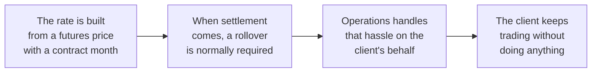
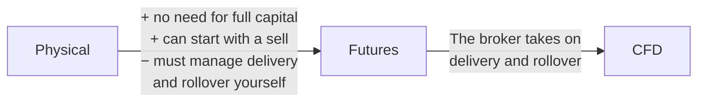
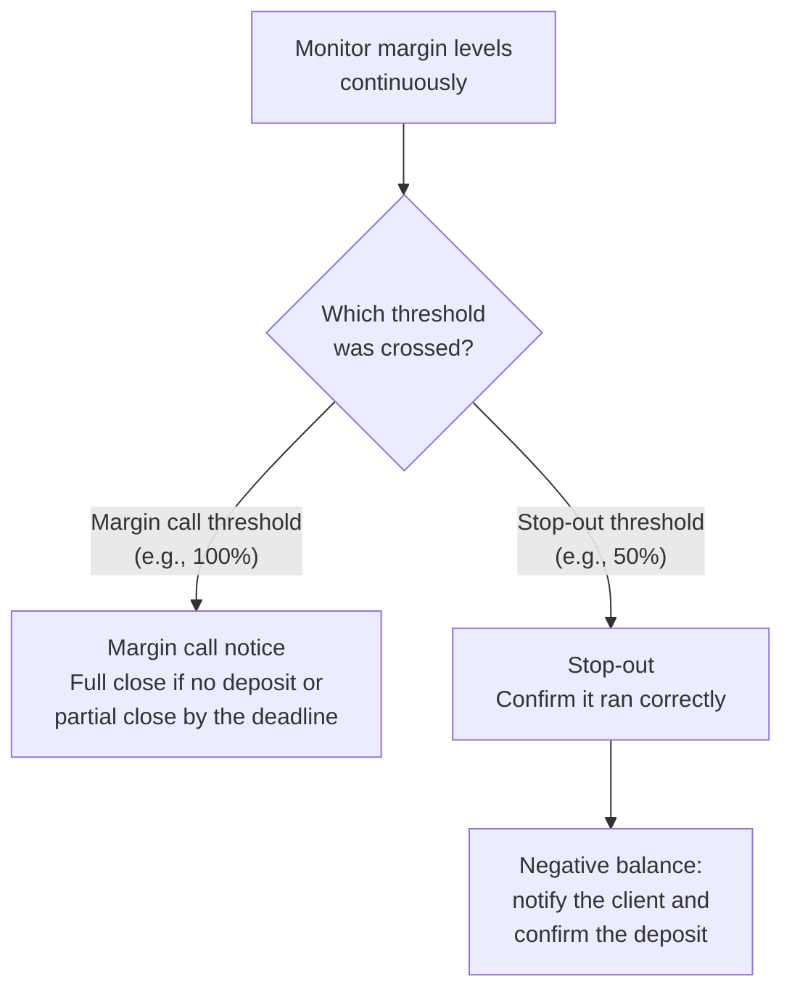
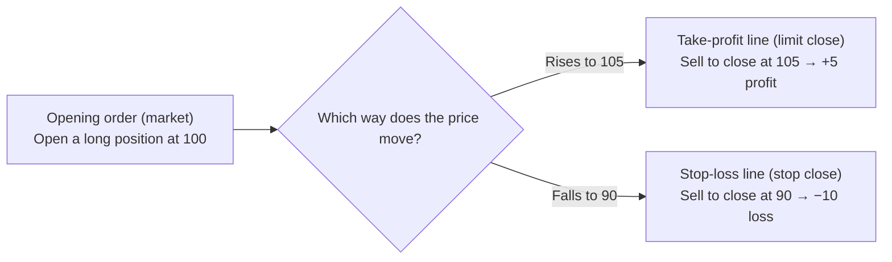
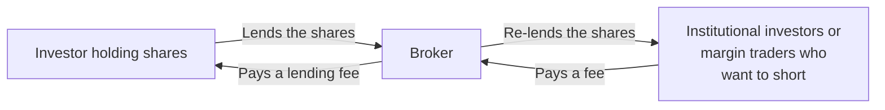

# CFD Notes: Basics

🇯🇵 [日本語版](./cfd-basics.md)

[← Back to the CFD notes index](./cfd.en.md)

This file covers the basic mechanics of CFDs: what a CFD is, why it
exists as a product, leverage and margin, cash settlement, and long and
short positions.

---

### What is a CFD?

A CFD is one type of financial derivative. A derivative is a contract
whose value is derived from (depends on) the price of an underlying
asset. The three basic types — often called the "big three" derivatives
— are:

| Type | What it is |
|---|---|
| Futures | A contract to buy or sell a specific asset at a price agreed today, for delivery/settlement on a set future date (e.g., Nikkei 225 futures) |
| Options | The right (not the obligation) to buy or sell a specific asset at a price agreed today, exercisable on a set future date |
| Swaps | An agreement between two parties to exchange different cash flows (e.g., interest rates, currencies) over a period |

A CFD (Contract for Difference) is a separate type of derivative from
these three. Its defining feature is that there's no physical delivery:
only the difference between the entry and exit prices is settled. That
said, settling only the difference isn't unique to CFDs. Nikkei 225
futures, for example, are ultimately settled not by delivering the
underlying but by paying the difference in cash (cash settlement against
the Special Quotation (SQ), the final settlement price).

**What the term CFD means**

- "CFD" stands for "Contract for Difference." In Japanese it's called
  差金決済取引 (sakin-kessai torihiki) — literally "trading settled by the
  difference."
- "Cash settlement" here means no physical delivery of the underlying (a
  stock, oil, a stock index, etc.) ever happens — only the price
  difference from entry to exit changes hands. For example, if you buy
  at 100 and sell at 120, you never actually receive 100 worth of the
  underlying or hand over 120 worth of it; only the 20 difference is
  settled.
- FX (foreign exchange margin trading), which you've probably heard
  of, is actually a type of CFD too — you can think of FX as "a CFD on
  a currency pair." CFD is the umbrella category, and equity indices,
  commodities, and FX all sit inside it. Because FX is handled
  separately in practice, it's covered in detail in the separate
  [FX notes](./fx.en.md).

**CFDs as an over-the-counter product**

A CFD is an over-the-counter (OTC) product: the broker (dealer) and the
client enter into a one-to-one contract without going through an
exchange. In Japanese this is also called 相対取引 (aitai torihiki), i.e.,
bilateral trading.

Note that exchange-traded CFDs also exist (for example, "Click Kabu 365"
on the Tokyo Financial Exchange). These notes assume OTC CFDs, where the
broker and the client contract with each other directly.

| | Exchange trading (e.g., exchange-traded equities) | OTC CFD |
|---|---|---|
| How the price is set | Many buyers' and sellers' orders sit together in an "order book," and price is set by that supply and demand | No order book is used — the client trades against a price (rate) that the broker itself quotes |

This difference gives rise to a few characteristics:

- Because there's no rigid exchange-style specification (lot sizes,
  expiry dates, and so on), the broker has room to set terms flexibly.
  This flexibility is also why "rollover" exists as a concept for CFDs —
  the broker can roll a position forward on its own even though the
  underlying futures contract it references has a fixed contract month
  (see ["Rollover"](./cfd-rollover-and-adjustments.en.md)).
- The broker quotes a bid (the price at which the client can sell) and
  an ask (the price at which the client can buy), and the difference
  between them — the spread — is effectively the cost of the trade.
- Because there's no exchange or clearing house guaranteeing settlement,
  there's a risk that the counterparty (the broker) could fail to honor
  the contract, e.g., through insolvency (counterparty risk).

How the spread gets decided, and how the broker deals with the risk it
picks up from trading with clients, are covered later under ["How are
rates generated?"](./cfd-pricing-and-cover.en.md) and ["The idea behind
cover deals."](./cfd-pricing-and-cover.en.md)

#### Why can you trade without holding the underlying?

A CFD is built by referencing the price of an underlying asset (a stock
or commodity itself, or its futures). Compared with trading the physical
asset or its futures directly, it differs in these ways:

| Point | Trading the physical asset or futures directly | Trading a CFD |
|---|---|---|
| Capital required | Buying the physical asset outright requires the full amount of capital | Since a CFD only settles the price difference, it lets you trade with less capital (this connects to the idea of leverage, covered under "Leverage and margin") |
| Delivery and rollover | If you trade WTI crude oil futures and keep holding the position past its contract month (the month in which the contract expires), delivery of the physical asset (crude oil itself) would normally be triggered. To avoid that, you'd have to roll over to the next contract month yourself before expiry | The broker handles all of that delivery and rollover work on the client's behalf, so the client can focus purely on the cash-settled trade without ever having to think about the physical asset |
| Trading hours | Trading on an exchange is only possible while that exchange is open | CFD trading hours are set by the broker and often follow the reference market's hours. Depending on the broker and the product, you may also be able to trade while domestic exchanges are closed |

#### A concrete example: what is a CFD actually referencing?

What a CFD's price actually tracks depends on the product type.

| Product | What its price tracks |
|---|---|
| Japan 225 | The price of Nikkei 225 futures as traded on an exchange. Which exchange is used as the reference varies by broker, but Osaka Exchange, SGX (Singapore Exchange), and CME (Chicago Mercantile Exchange) are common examples |
| WTI Crude Oil | The price of WTI crude oil futures traded on an exchange |
| ETF-type CFDs, such as a US semiconductor ETF CFD | The price of the ETF itself. A CFD on a US semiconductor ETF, for example, tracks the actual price movement of a real ETF like the iShares Semiconductor ETF |
| Products with no exchange involved, like FX or spot gold | The spot price, which is set through direct bilateral trading between financial institutions rather than on an exchange |

- The reason a CFD on the Nikkei Stock Average goes by a name like
  "Japan 225" is generally explained as follows: "Nikkei Stock Average"
  and "Nikkei 225" are trademarks of Nikkei Inc., and using those names
  in a product name requires Nikkei's permission (a license). As a
  result, the name varies by broker — "Japan 225," "Japan N225,"
  "JP225," and so on.
- Buying the ETF itself and trading a CFD that references it are two
  different things (see Note ① below).
- For spot trading, see Note ② below. Note that some precious-metal CFDs
  reference futures instead (see ["Examples by Product
  Type"](./cfd-product-types.en.md)).

So depending on the product, a CFD is built on top of one of three types
of reference price: futures, an ETF, or a spot rate. The cash settlement
mechanism described above is common to all of them, but what sits behind
that mechanism is not uniform — that's the key point.

**Note ①: What is an ETF?**

An ETF (Exchange Traded Fund) is a financial product designed to track a
stock index or commodity. The fund manager pools investor capital to buy
the underlying constituent stocks, so buying the ETF gives you the same
effect as being diversified across those constituents (and you can
receive distributions in place of dividends).

| | Buying the ETF itself | Trading a CFD that references the ETF |
|---|---|---|
| Capital required | The full purchase amount | Not the full amount, since only the price difference is settled |
| What you hold | You actually own (a share of) the underlying asset | You never own the physical asset, so no shareholder rights arise |
| Settlement | — | Only the difference between your entry price and your exit price is settled |

**Note ②: What is spot trading?**

Spot trading is a trade where physical delivery is completed within a
short period after the trade is agreed (normally within two business
days). It doesn't go through an exchange — the price is based on rates
exchanged directly between financial institutions.

#### Where do I (in operations) fit into a CFD?

Keeping a CFD product running touches many different areas of operations
work. Here's the overall picture; the details of each area are covered
in their own sections (rollover, leverage and margin, etc.).

| Role | Main tasks |
|---|---|
| Market and risk management | Monitoring market conditions (circuit breakers, stock-borrowing restrictions, etc.), assessing and adjusting client position risk, monitoring risk exposure, watching for stop-outs (forced liquidation), and checking quoted rates for anomalies |
| Product operations | Handling corporate actions (new listings, spin-offs, stock splits, mergers, etc.), tracking exchange schedules, determining and applying price adjustment amounts, rolling contract months over, and hedging |
| Administration and compliance | Reconciliation (matching the books against actual balances), verifying segregation of client assets, preparing reports for regulators and industry bodies (the Financial Services Agency (FSA), the Financial Futures Association of Japan (FFAJ), etc.), and handling KYC (know your customer) / AML (anti-money laundering) |
| System operations | Incident response, maintaining fallback procedures under the business continuity plan (BCP), and pre-release testing (UAT) for new products |

In short, keeping a single CFD product running requires several roles
working together: getting the price right, managing risk, staying
compliant, and keeping systems running reliably.

#### Where I would have stumbled three years ago

By this point, a lot of terms — CFD, FX, ETF, futures, spot trading —
have come up all at once. Rather than trying to understand everything
together, it helps to pick one product and go deep on that first.

With WTI crude oil, for example, you can follow one thread. Once you
understand that chain for one product, it carries over to the others.

The thing underneath it all is that a CFD is always a trade based on a
price difference, with no physical delivery.

A few other misconceptions beginners often run into:

- **Assuming "trading with less capital" means "borrowing money"**
  - A CFD isn't a loan — it lets you trade with less capital precisely
    because it only settles the price difference.
- **Assuming a CFD's price exactly matches the futures or ETF price it
  references**
  - A CFD's price includes things like the spread (the gap between the
    bid and ask), so it can differ slightly from the reference price
    (see Note ③ below).
- **Assuming that trading a stock or ETF via CFD means you "bought the
  stock"**
  - Since a CFD never involves owning the physical asset, none of the
    rights that come with being a shareholder (voting rights,
    shareholder perks, etc.) apply.

**Note ③: What is the spread (offer / bid)?**

A CFD's price is always quoted as two values side by side. With a CFD,
the party quoting both prices is the broker.

| | Meaning | From the client's side |
|---|---|---|
| Ask (offer) | The price at which the other side is willing to sell | If you're buying, this is the price you buy at |
| Bid | The price at which the other side is willing to buy | If you're selling, this is the price you sell at |

The ask (the seller's asking price) is normally higher than the bid (the
price the buyer is willing to pay). The gap between the two is the
"spread," and it's the CFD's real trading cost.

---

### Why does a CFD exist as a product? (How it differs from the physical asset)

Trading the physical asset means owning the asset itself — stocks,
bonds, currencies, interest-rate instruments, gold, oil, and so on — and
buying or selling it involves actual delivery of that asset.

A CFD treats that same underlying asset as its "reference" and only
settles the price difference. With a CFD, there's no delivery of the
underlying, and none of the rights that come with it (like shareholder
rights) ever arise.

#### Why trade a CFD instead of buying the physical asset?

Compared with trading the physical asset, a CFD offers several
advantages:

| Advantage | Details |
|---|---|
| No trading commission | CFDs are usually commission-free (the spread is the real cost instead) |
| No physical delivery | Since only the price difference changes hands, there's no storage, transport, or delivery hassle at all |
| Leverage | A small amount of margin gives you the same effect as trading a much larger position |
| Easier to short | You can't sell the physical asset without holding it first, but a CFD can be opened with a new short position, so you can aim to profit even when prices are falling |
| One account across products and markets | Products that would normally require separate accounts — Japanese stocks, US stocks, oil, FX — can all be traded from a single account |
| No need to open an overseas brokerage account | You can trade CFDs on US stocks or overseas commodities from Japan, for example, without the hassle of opening an account with a local broker |
| Smaller trade sizes | Physical stocks often have to be bought in round lots (e.g., 100-share units), whereas CFDs can often be traded in smaller units |
| Dividend-equivalent adjustments (for single-stock and ETF CFDs) | You're not a shareholder, but you still receive an adjustment amount equivalent to the dividend when one is paid (and pay the equivalent if you're short). For equity index CFDs that reference futures, the dividend is already priced into the futures and is settled through the price adjustment at rollover instead (see ["Examples by Product Type"](./cfd-product-types.en.md)) |
| Longer trading hours | Depending on the broker and the product, you aren't tied to domestic exchange hours and can trade overnight, including on overseas markets |

#### A concrete example: how do physical WTI crude oil, WTI futures, and a WTI CFD differ?

To see the difference concretely, compare three things: physical WTI
crude oil, WTI crude oil futures, and a WTI crude oil CFD. Futures are
included because what a WTI crude oil CFD references is the futures
price, not the physical price — and contract months and rollover are
properties of futures in the first place.

| Item | Physical WTI crude oil | WTI crude oil futures | WTI crude oil CFD |
|---|---|---|---|
| What's traded | The crude oil itself (actually owned) | A promise to deliver crude oil on a future date (a contract per contract month) | A contract that references the futures price and settles only the price difference |
| Delivery / rollover | You receive the crude oil when you buy it; there's no concept of a contract month | Holding to expiry triggers delivery of crude oil; avoiding it requires rolling over to the next contract month yourself | No delivery ever happens; the broker handles the rollover on your behalf |
| Capital required | The full trade amount | Margin only (leverage applies) | Margin only (leverage applies) |
| Short selling | You can't sell crude oil you don't hold | Can be opened directly as a new short position | Can be opened directly as a new short position |
| Trade size | Mostly large-lot trading; buying and selling small amounts isn't realistic for individuals | Large size per contract | Often tradable in smaller units than futures |
| Trading hours | No fixed exchange hours (mostly traded bilaterally) | Limited to the futures exchange's hours | Hours set by the broker (often following the referenced futures' hours) |
| Storage / incidental costs | Storage and transport costs apply | No storage costs, but trading fees and the cost of trading at rollover apply | No concept of storage; costs are folded into things like the spread and price adjustments at rollover |

So even though the underlying price movement is the same, the
differences arise in two steps.

1. Going from physical to futures adds flexibility — "no need for the
   full amount of capital," "you can start with a sell" — but because
   futures have contract months, you now have to manage delivery and
   rollover yourself.
2. A CFD references the futures price while having the broker take on
   that delivery and rollover work, so the client doesn't have to think
   about either "whether to hold the physical asset" or "how to manage
   contract months."

#### Where do I (in operations) notice the difference between physical and CFD trading?

Because a CFD never holds the physical asset, it creates operations work
that has no counterpart in physical trading. In practice, this
difference shows up especially in:

| Area | Details |
|---|---|
| Rollover (rolling the contract month) | In futures trading the investor rolls over themselves; with a CFD, the broker does it on the client's behalf, so the rollover itself becomes operations work |
| Managing the adjustment amount | Calculating and applying the adjustment that offsets the price discontinuity caused by rollover (for single stocks and spot products, this also includes registering and applying rights adjustments (adjustments for dividends and other shareholder rights) and interest adjustments) |
| Risk management | Because leverage is in play, position risk can grow larger than in physical trading, so it needs to be monitored and adjusted |
| Managing the reference exchange's trading hours | The broker sets a CFD's trading hours, but the futures or physical exchange it references has its own trading hours and holidays, so those hours and schedules need to be tracked |
| Generating rates from the reference contract month's price | A CFD's price isn't set independently — it's generated from the price of the contract month it references, so that link has to be maintained |
| Managing trade units | CFDs are sometimes traded in different units from the physical asset, which needs its own setup and management |
| Setting and maintaining margin rates / leverage ratios | Offering leverage means monitoring margin levels and handling cases where margin falls short |
| Setting and monitoring stop-out levels | Managing the forced-liquidation mechanism itself, which has no equivalent in physical trading |
| Setting spreads | Unlike physical trading, which charges a commission, managing the CFD-specific cost structure (the gap between bid and ask) |
| Maintaining the contract-month master data | Managing the master data for which contract month is referenced until when (the foundation that rollover depends on) |
| Managing the yen-conversion rate | Setting the FX conversion rate used when offering an overseas product priced in yen |

In short, the defining feature of a CFD — not holding the physical asset
— is exactly what adds these extra management items (price, risk,
timing, units) to the operations side.

#### Where I would have stumbled three years ago

"The price moves exactly like the physical asset, so why does a separate
product called a CFD even exist?" — that might be your first reaction.
"Why not just trade the physical asset directly?"

But for a commodity like crude oil, trading either the physical asset or
the futures directly is a heavy burden for an individual.

| Way of trading | Burden |
|---|---|
| Trading the physical asset directly | Requires the full amount of capital and the trouble of storage, which isn't realistic for individuals |
| Trading futures directly | You'd have to roll over the position yourself every time the contract month arrives — which is a hassle, and if you forgot, delivery of the physical asset (the crude oil itself) could actually be triggered |

A CFD exists precisely because the broker takes on that hassle and
delivery risk on your behalf.

That said, this doesn't mean "a CFD is simply the better deal."

- A CFD carries its own cost — the spread (the gap between bid and ask).
- Because leverage is in play, unrealized losses can grow faster than
  they would with the physical asset.

"No delivery, so it's convenient" and "lower risk" are two different
things, and using a CFD means understanding its specific costs and risks
too.

---

### Leverage and margin

#### What is leverage, in a nutshell?

Leverage is a mechanism that lets you trade an amount many times larger
than the margin (the money you deposit as collateral) you put up. For
retail CFDs in Japan, the maximum leverage is set by regulation for each
product type (as of writing; these caps can change if the rules change).

| Product type | Leverage cap | How the cap is set |
|---|---|---|
| Equity indices | 10x | Set at a margin level roughly meant to cover one day's price movement |
| Single stocks and ETFs | 5x | Same as above. Single stocks can move sharply on one company's earnings or news, so their cap is kept low |
| Commodities (oil, gold, etc.) | 20x | Regulated under a different law from equity index CFDs (the Commodity Derivatives Act), and the cap is set separately |
| (For reference) FX | 25x | — |

So you can't simply conclude that "commodities get 20x, so they must
move less than equity indices."

For example, if you deposit ¥100,000 as margin on an equity index CFD,
10x leverage lets you trade a position worth ¥1,000,000. In other words,
even though the capital you actually put up is ¥100,000, you receive the
full price movement on ¥1,000,000 as your P&L.

#### What is margin, and how does it relate to leverage?

Margin is the money you deposit with the broker as collateral in order
to trade.

Leverage is the mechanism of trading many times the amount of that
margin, so margin and leverage are two sides of the same coin.

| Term | Meaning |
|---|---|
| Margin rate | The ratio of the margin you actually deposit to the position size (notional value). Leverage is the inverse of the margin rate (e.g., a 10% margin rate = 10x leverage) |
| Initial margin | The margin needed to open a position |
| Effective margin | Your account's remaining equity. Margin also acts as a cushion that absorbs any unrealized loss |
| Margin level (maintenance margin ratio) | The ratio of effective margin to required margin. When this level falls below a certain threshold, the broker may ask for additional margin (a margin call) or forcibly close the position (a stop-out) |

#### A concrete example: with X margin and Y leverage, how large a trade can you make?

Take a Japan 225 CFD as an example. You deposit ¥100,000 as margin and
trade at 10x leverage, the cap for equity index CFDs.

| Item | Calculation |
|---|---|
| Maximum position size | ¥100,000 × 10 = ¥1,000,000 |
| Margin rate | 1 ÷ 10 = 10% |
| Required margin (the margin needed to trade ¥1,000,000 worth) | ¥1,000,000 × 10% = ¥100,000 |

So the relationships are:

> Required margin = position size × margin rate
>
> Maximum position size = margin × leverage (or margin ÷ margin rate)

#### Where do I (in operations) step in when margin runs short (a margin call)?

The margin level is calculated as:

> Margin level = account equity (effective margin) ÷ required margin ×
> 100%

What happens next depends on how far the level has dropped — but the
exact thresholds and response deadlines vary by broker. The following is
just one illustrative example.

| | Margin call | Stop-out |
|---|---|---|
| Trigger (example) | The margin level is below 100% and carries over into the next business day | The margin level falls below a certain threshold (e.g., 50%) |
| Time the client has to respond | Only a short deadline (e.g., by the end of the next business day). If the client tops up margin (a margin call payment) or closes part of the position to bring the level back up by then, forced liquidation of the entire position can be avoided. But once the level is below 100%, margin is already short — there's no real breathing room | None. The instant it crosses that line, the entire position is forcibly closed |
| If not resolved by the deadline | The broker closes the entire position | — |
| Purpose | — | Also serves as a safeguard to keep the client's losses from growing any further |

A stop-out is a mechanism that "triggers closing once that level is
reached"; it doesn't guarantee the position is closed at that level's
price. When the market moves sharply or gaps (opens far away from the
previous close), the position can be closed at a price much worse than
the stop-out level, creating a loss larger than the margin deposited (a
negative balance, or deficit). In that case, the client has to deposit
funds to cover the negative balance.

Operations continuously monitors margin levels account by account, sends
margin-call notices to accounts that cross the margin call threshold,
and confirms that the stop-out process has run correctly for accounts
that cross the stop-out threshold. For accounts left with a negative
balance after a stop-out, operations also notifies the client and
confirms the deposit.

#### Where I would have stumbled three years ago

- **Assuming leverage means "trading with borrowed money"**
  - Leverage isn't a loan — it's a mechanism for trading a multiple of
    your margin, which serves as collateral.
  - That said, "not a loan" doesn't mean "you can't lose more than your
    margin." When the margin level falls below a certain threshold, the
    position is forcibly closed by a stop-out — but if the market moves
    sharply, the close can't keep up, and a loss larger than the margin
    (a negative balance) can arise, which you're obliged to pay.
- **Assuming you should always use the maximum leverage available**
  - Being able to trade up to the cap (e.g., 10x for an equity index
    CFD) doesn't mean trading at the full cap is the normal way to
    trade. The higher the leverage, the faster the margin level can drop
    from even a small price move, so it's common practice to keep some
    buffer rather than using the full amount.
- **Treating a 100% margin level as a "safe line"**
  - In reality, once the level drops below 100% it's already subject to
    a margin call. To keep trading safely, you need to maintain a level
    comfortably above 100%.
- **Confusing a margin call with a stop-out**
  - A margin call can be resolved within a short deadline by depositing
    funds or closing part of the position, avoiding forced liquidation;
    a stop-out leaves no time to respond and closes everything
    instantly. The triggering margin level and the room to respond are
    both different between the two.
  - Even so, by the time a margin call arises, margin is already short
    and the deadline is tight. It's not a state where you can assume
    "there's still time" and leave it alone.

---

### What is cash settlement?

> The basic definition of cash settlement ("a trade with no physical
> delivery, where only the price difference between entry and exit is
> settled") was already covered under "What is a CFD?" This section
> builds on that and goes deeper into three angles: when P&L is actually
> locked in, how P&L is calculated across multiple trades, and what
> operations does with settlement itself.

#### When exactly is P&L on a cash-settled trade locked in?

With cash settlement, P&L is locked in at the moment the opposite trade
(a closing order) against your open position is executed. While a
position stays open, its unrealized P&L just fluctuates with every price
move — it isn't yet locked in as anything real.

There are three basic ways to place an order. Any of them can be used
both to open a position (an opening order) and to close one (a closing
order).

| Order | What it does | Opening order (opening a position) | Closing order (closing a position) |
|---|---|---|---|
| **Market** | Executes immediately at the current market price | Opens a new position immediately at the current price | Closes the position immediately at the current price |
| **Limit** | You specify a price more favorable than the current one, and the order executes once that price is reached (for a buy, a price below the current one; for a sell, a price above it) | Opens a new position once a specified price more favorable than the current one is reached | Closes the position once a specified price more favorable than the current one is reached |
| **Stop** | You specify a price less favorable than the current one, and the order executes once that price is reached (for a buy, a price above the current one; for a sell, a price below it) | Opens a new position once a specified price less favorable than the current one is reached | Closes the position once a specified price less favorable than the current one is reached |

A closing order can either lock in a profit ("take-profit") or lock in a
loss ("stop-loss").

| Closing order | Closing price | Order type used |
|---|---|---|
| Take-profit | More favorable than the current one | Limit |
| Stop-loss | Less favorable than the current one | Stop |

(Either can also be done with a market order if you want to close right
away.)

For example, say you open a long (buy) position with a market order at
100. Closing this position means selling.

- If you want to lock in a profit once the price reaches 105, you place
  a limit sell closing order (take-profit) at 105.
- Conversely, if you want to cap your loss in case the price falls to
  90, you place a stop sell closing order (stop-loss) at 90.
- If you mistakenly placed a "limit" sell order at 90, it would mean
  "sell at 90 or higher," and it would execute immediately at the
  current 100.

Setting the take-profit line with a limit order and the stop-loss line
with a stop order in advance like this lets you lock in P&L without
having to watch the price constantly.

#### A concrete example: how is P&L calculated across multiple trades? (The idea of average execution price)

When you trade the same product multiple times — adding to a position in
stages — it's easiest to think about the P&L of the whole position in
terms of its "average execution price." The examples below assume the
same quantity is traded each time (if the quantities differ, the average
is weighted by quantity).

**Adding to a long position across multiple trades**

| Trade | Execution price |
|---|---|
| 1st (opening) | 100 |
| 2nd (add) | 103 |
| 3rd (add) | 105 |
| 4th (add) | 104 |
| **Average execution price** | (100+103+105+104) ÷ 4 = **103** |

Since the average execution price is 103, closing above 103 produces a
profit, and closing below it produces a loss.

**Adding to a short position across multiple trades**

Say you open a short at 100, expecting the price to fall. Instead, it
rises, so you add to the short at 103. It keeps rising to 105 and you
add there too, then it starts to turn, so you add once more at 104.

| Trade | Execution price |
|---|---|
| 1st (opening) | 100 |
| 2nd (add) | 103 |
| 3rd (add) | 105 |
| 4th (add) | 104 |
| **Average execution price** | (100+103+105+104) ÷ 4 = **103** |

For a short, it works the other way around from a long: closing below
the average execution price produces a profit. Looking only at the
original 100 entry, it might seem like you were sitting on an unrealized
loss once the price ran up to 105 — but measured against the average
execution price (103), the position turns profitable again once the
price falls back below 103.

#### Where do I (in operations) touch the settlement process itself?

| Task | Details |
|---|---|
| Keeping the client's positions separate from the broker's risk management | See below |
| Correcting executions after a rate-feed problem | If the rate feed malfunctions, a trade can end up executed at an incorrect price. When that happens, operations manually corrects it to the right price and notifies the affected client |
| Reconciling settlements | Checking that a client's settlement result matches both the internal system's records and the cover counterparty's (CP) records. This is the settlement-side counterpart to the position reconciliation covered later under "Long and short" |
| Confirming P&L and balance updates | Verifying that P&L locked in by a close is correctly reflected in the client's account balance |
| Handling slippage | See below |

**The client's positions and the broker's risk management**

| | Client side | Broker's risk management |
|---|---|---|
| How positions are held | Some brokers let a client hold long and short positions in the same product at the same time (the client "hedging" their own position, called ryodate in Japanese) and close each position individually | Client positions are viewed net (longs and shorts offset against each other) rather than gross (longs and shorts kept separately) |
| How P&L and risk look | P&L is locked in position by position. P&L matches the average execution price only when every position is closed together | However many positions a client holds, the broker sees its risk as a single offset position |

**Handling slippage**

- With market orders and stop orders, the actual execution price can
  differ unfavorably from the price seen (or specified) when the order
  was placed (slippage). Operations checks whether that gap exceeds the
  acceptable tolerance and responds if it does.
- Limit orders only execute "at the specified price or better," so
  unfavorable slippage doesn't occur with them.

#### Where I would have stumbled three years ago

- **Treating unrealized P&L as if it were already locked in**
  - No matter how large an unrealized gain or loss looks, it's just a
    mark-to-market number until a closing order actually executes. P&L
    is only locked in once that happens.
- **Assuming P&L across multiple trades is always determined by a single
  average execution price**
  - If positions are closed one by one, the P&L you lock in depends on
    which position you close. The average execution price is a guide to
    "where the break-even point is for the position as a whole."
  - And the fact that the broker manages its risk net is a separate
    matter from how a client's P&L gets locked in.
- **Assuming a stop-loss placed with a stop order guarantees execution
  at exactly that price**
  - A stop order is an order to "close once the specified price is
    reached," and it doesn't guarantee execution at that price. When the
    market moves sharply, or depending on rate-feed conditions, it can
    execute at a price worse than the one specified (slippage).

---

### Long and short

#### What are long and short, in a nutshell?

Long (buy) and short (sell) describe the "direction" of a trade.

| | Long | Short |
|---|---|---|
| Meaning | Holding a buy position | Holding a sell position |
| When you profit | When the price rises above the price you entered at | When the price falls below the price you entered at |
| How it's closed | With a sell closing order | With a buy closing order |
| In a phrase | "Enter by buying, finish by selling" | "Enter by selling, finish by buying" |

#### Why can a CFD be opened with a sell? (How it differs from the physical asset)

In physical trading, you can't sell something you don't hold. A CFD, on
the other hand, uses cash settlement, so it's a trade where only the
price difference from entry to exit changes hands.

"Opening with a sell" means agreeing to settle, at closing, the
difference between the price you sold at and the price you later buy
back at. If the buy-back price is lower than your sell price, you
receive the difference (a profit); if it's higher, you pay the
difference (a loss).

This is what makes it possible to short-sell without holding the
physical asset.

| | Shorting a stock through margin trading | Shorting via a CFD |
|---|---|---|
| Are shares borrowed? | You borrow the shares from a broker and sell them | The client never borrows any shares |
| What it costs | A stock borrowing fee (plus a premium charge, called gyaku-hibu, when the shares are in short supply) | None of that is needed |

Think of it as making a promise with a friend about the price of a game
console. You agree: "Let's say I sell it at today's price of ¥1,000, and
later I buy it back." If the price has fallen to ¥800 by the time you
buy back, you receive the ¥200 difference. If it has risen to ¥1,200,
you pay the ¥200 difference. Nobody borrows or hands over the console
itself — only the price difference changes hands.

That said, not borrowing shares doesn't mean holding a short costs
nothing. For equity index CFDs that reference futures, the short side
also pays or receives the price adjustment at rollover; for single-stock
and ETF CFDs, it pays or receives rights adjustments and interest
adjustments (see ["Rollover"](./cfd-rollover-and-adjustments.en.md) for
details).

#### Stock borrowing and short-selling restrictions

A CFD itself is cash-settled, so looking only at the trade with the
client, there's no need to borrow any physical shares. But the broker
sometimes hedges (covers) the risk from a client's short position in the
actual stock market (more on this under ["The idea behind cover
deals"](./cfd-pricing-and-cover.en.md)). When that hedge requires the
broker — or whoever the broker covers with — to sell the physical stock,
they need to borrow it from somewhere first, just as in margin trading.
This is called securities lending (or, from the borrower's side, stock
borrowing).

**How securities lending works**

- An investor holding shares lends them to a broker. In return, the
  lender earns a lending fee, paid as interest (often at a higher rate
  than a bank deposit). While the shares are on loan, the lender can
  still sell them on the market as normal at any time.
- The broker re-lends the shares it collects this way to institutional
  investors or margin traders who want to short-sell, earning a fee in
  the process.

In other words, opening a short in the physical stock market always
requires one extra step: borrowing shares from someone.

**When shares can't be borrowed**

When shares can't be borrowed, the broker can no longer hedge in the
physical market. Continuing to accept short positions without being able
to hedge would leave the broker itself carrying directional risk (a loss
if the market moves the wrong way). So for any stock where shares aren't
available to borrow, the broker has no choice but to restrict new short
trades on that product.

**How it ties to market-level rules**

This isn't purely up to the broker either — it's also tied to
market-level rules.

- The typical example is rules that restrict the price at which a stock
  that has fallen sharply can be sold short: in the US, Rule 201 of the
  SEC's (Securities and Exchange Commission) Regulation SHO (the
  "alternative uptick rule"), and in Japan, the short-selling price
  restriction (a form of uptick rule). Neither bans short selling
  outright; both restrict short sales that would "pile on" a falling
  price.
- It's also tied to any stock-borrowing restrictions imposed on the
  broker's own cover counterparty.

When such rules make selling at the cover counterparty difficult, a
broker offering CFDs over the counter restricts new client short selling
accordingly.

#### A concrete example: what happens to P&L, long vs. short, when the price rises or falls?

Say you trade one lot of the Japan 225 CFD at 38,000 (assume one lot =
the index × ¥10; all numbers are illustrative).

| Position | Entry price | Exit price | P&L calculation | Result |
|---|---|---|---|---|
| Long | 38,000 | 38,500 (up) | (38,500 − 38,000) × 10 | ¥5,000 profit |
| Long | 38,000 | 37,500 (down) | (37,500 − 38,000) × 10 | ¥5,000 loss |
| Short | 38,000 | 37,500 (down) | (38,000 − 37,500) × 10 | ¥5,000 profit |
| Short | 38,000 | 38,500 (up) | (38,000 − 38,500) × 10 | ¥5,000 loss |

So P&L is determined as follows:

> Long: (exit price − entry price) × trade unit
>
> Short: (entry price − exit price) × trade unit

When the price rises, longs gain and shorts lose; when it falls, the
reverse happens — they're always mirror images.

#### Where do I (in operations) track and manage position direction?

Because a CFD is a bilateral (OTC) contract between the broker and the
client, the starting point is understanding the flip:

| Client | Broker |
|---|---|
| Long | Short |
| Short | Long |

Operations tracks and manages position direction with that relationship
in mind, in a few specific areas:

- **Monitoring net position**
  - Each product has a defined risk tolerance for its net position.
    Operations watches the market, client limit orders, and technical
    signals to make fast hedging (cover) decisions that keep the net
    position within that tolerance.
  - If it looks like it might be exceeded, more cover is added.
- **Reconciling positions with cover counterparties**
  - Checking that the broker's hedge positions match what the PB (prime
    broker) or LPs (liquidity providers) show on their side.
  - Looking for any breaks (trades that appear on our side but not
    theirs, or vice versa). When a discrepancy turns up, operations
    contacts the LP to confirm rate discrepancies or whether a trade
    actually executed.
  - This reconciliation is done regularly, timed around the most active
    trading hours. Since positions are monitored continuously, a slipped
    execution usually triggers an alert, and each one leads to
    back-and-forth with the LP.
- **Monitoring stop-outs and margin levels**
  - For equity indices and single stocks, shorts generally tend to run
    lower margin levels than longs, for two main reasons (see the table
    below).
  - For commodities such as oil, which side the price adjustment works
    against depends on whether the market is in contango or
    backwardation.
  - On top of that, when the market moves sharply in one direction
    during high volatility, it can burn through the margin of clients
    holding the opposite-direction position very quickly.
  - When a client is stopped out, the position between that client and
    the broker disappears, but the cover the broker placed against it
    remains — so the broker's overall position can temporarily become
    lopsided. Orders to adjust that cover can also be rejected, so this
    needs constant monitoring.
- **Short-specific regulatory response**
  - When a stock-borrowing restriction or a short-selling price
    restriction (such as the US Rule 201) comes into effect, new client
    short trades on that product are halted and a notice is posted on
    the client trading platform. When the restriction is lifted, the
    lift date is posted there as well.
- **Reporting**
  - Trading volume, client stop-out activity, and related data are
    subject to reporting obligations to regulators and others, handled
    on a regular basis.

**Two reasons shorts tend to run lower margin levels (equity indices and
single stocks)**

| Reason | Details |
|---|---|
| Dividend-equivalent payments | The dividend-equivalent adjustment goes to longs and comes out of shorts (for single stocks and ETFs, this is paid as a rights adjustment each time a dividend goes ex; for equity indices that reference futures, it flows through the price adjustment at rollover). However, the price adjustment for futures-based equity indices also reflects interest rates, so when the effect of interest rates outweighs that of dividends (as with US equity indices as of writing), the direction flips and the short side receives it |
| Long-run upward drift | Equity indices and individual stocks tend to rise over the long run, so for the same volatility, shorts are more likely to sit in an unrealized loss for extended periods |

#### Where I would have stumbled three years ago

- **Assuming short = doing something bad**
  - The word "short-selling" can sound like it's working against the
    market, but in a CFD, short is just one of two equally valid trade
    directions — no different in kind from long.
- **Assuming that if the client profits, the broker profits too**
  - Because a CFD is a bilateral contract, when a client is long and
    profiting, the broker is theoretically sitting on the mirror-image
    short with an unrealized loss.
  - In practice, whatever has been covered is offset by P&L on the trade
    with the cover counterparty, but whatever is left uncovered within
    the risk tolerance flows straight into the broker's own P&L. Looking
    only at the client relationship, it's the exact opposite.
- **Picturing a CFD short the same way as "borrowing a stock"**
  - From the client's side, a CFD is cash-settled, so no shares are
    actually borrowed.
  - Stock borrowing only comes into play when the broker hedges in the
    physical market — that's a separate layer from the client's own
    contract.
- **Assuming shorts run lower margin "just because the market is going
  up"**
  - There's also a structural factor at play — the dividend-equivalent
    amount paid out by shorts (as a rights adjustment for single stocks
    and ETFs, or through the price adjustment for equity indices that
    reference futures) — so margin can erode over time even when the
    price isn't moving at all.
  - The direction of this factor depends on the product and the level of
    interest rates, though: for US equity indices and others where the
    effect of interest rates outweighs that of dividends, it's the long
    side that pays the price adjustment.
