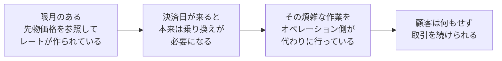
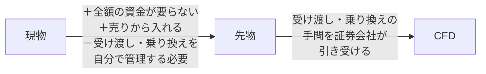
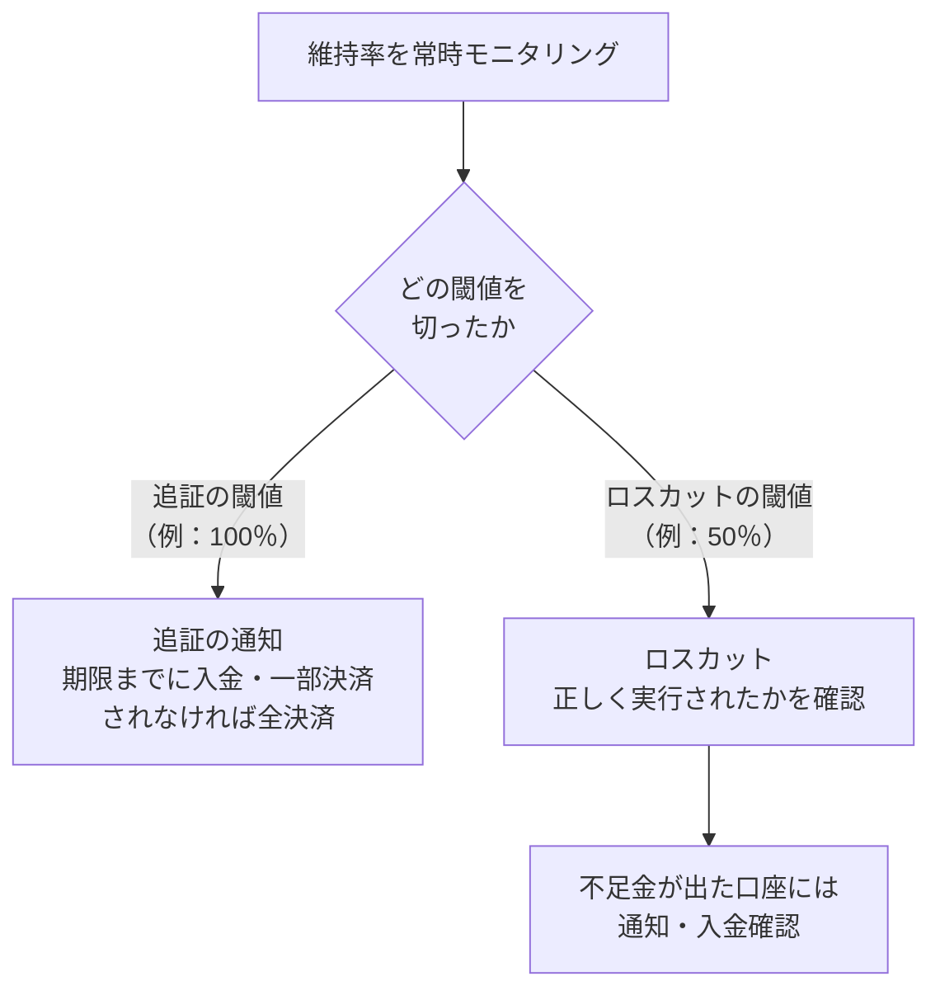
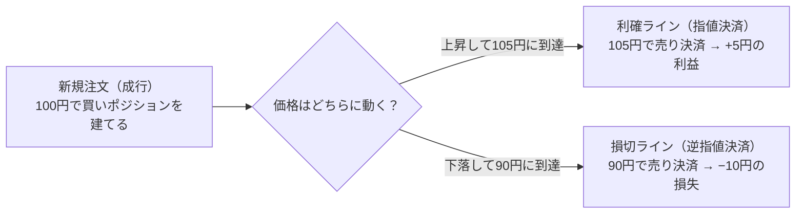
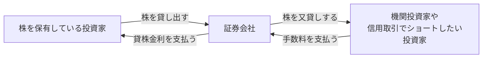

# CFDノート：基礎

🇬🇧 [English version](./cfd-basics.en.md)

[← CFDノートの目次に戻る](./cfd.md)

このファイルでは、CFDの基本的なしくみ（CFDとは何か、なぜ存在するの
か、レバレッジと証拠金、差金決済、ロング／ショート）を扱う。

---

## CFDとは何か

CFDは、金融派生商品（デリバティブ取引）の一種である。デリバティブ取
引とは、原資産（もととなる資産）の価格に依存して価格が決まる取引の
ことで、基本となるのは次の3つである（「三大デリバティブ」と呼ばれる）。

| 取引 | 内容 |
|---|---|
| 先物取引（Futures） | 将来の決められた期日に、特定の商品を現時点で決めた価格で売買する契約（例：日経225先物） |
| オプション取引（Option） | 将来の決められた期日に、特定の商品を現時点で決めた価格で「売買できる権利」を取引するもの |
| スワップ取引（Swap） | 金利や通貨など、異なるキャッシュフロー（資金の受け払い）を当事者間で一定期間交換する取引 |

CFD（差金決済取引）は、これらとは別のデリバティブ取引の1つで、現物
の受け渡しを行わず、売買価格の差額のみを決済する点に特徴がある。た
だし、差額だけを決済する仕組み自体はCFD特有のものではなく、たとえば
日経225先物も、最終的には現物の受け渡しではなく差額のやり取り（SQ〔
特別清算指数〕による現金決済）で清算される。

**CFDという言葉の意味**

- CFDとは、「Contract for Difference（コントラクト・フォー・ディフ
  ァレンス）」の略で、日本語では差金決済取引（さきんけっさいとりひ
  き）と呼ばれる。
- 「差金決済」とは、実際の商品（株式・原油・株価指数など）の受け渡
  しをせず、売買したときの価格差だけをやり取りする取引のことを指す。
  たとえば100円で買って120円で売った場合、実際に100円分のモノを受け
  取ることも、120円分のモノを渡すこともなく、その差額20円だけが手元
  でやり取りされる。
- 日常的によく聞く「FX（外国為替取引）」もCFDの一種である。FXは「為
  替（通貨のペア）」を対象にしたCFD、と言い換えることができる。CFD
  という大きな括りの中に、株価指数・コモディティ・そしてFXが含まれ
  ている、という関係になる。

**店頭取引としてのCFD**

CFDは、証券取引所を介さず、証券会社（ディーラー）と顧客が1対1で契約
を結ぶ、いわゆる店頭取引（OTC取引、Over-The-Counter）である。日本語
では「相対（あいたい）取引」とも呼ばれる。

なお、CFDには取引所で取引される「取引所CFD」もある（東京金融取引所
の「くりっく株365」など）。このノートでは、証券会社と顧客が直接契約
する店頭CFDを前提に説明する。

| | 取引所取引（例：現物株式の取引所取引） | 店頭CFD |
|---|---|---|
| 価格の決まり方 | 多数の売り手・買い手の注文が「板（いた）」と呼ばれる一覧に並び、需給によって価格が決まる | 取引所の板を使わず、証券会社が提示する価格（レート）に対して顧客が売買する |

この違いから、次のような特徴が生まれる。

- 取引所のような厳格な規格（取引単位や満期日など）がないため、証券
  会社が条件を柔軟に決められる。CFDに「乗り換え（ロールオーバー）」
  という仕組みがあるのも、もともと取引所の限月という決まった規格を
  参照しつつ、証券会社側で独自にポジションを繋ぎ直せる自由度がある
  ためである（詳細は[「乗り換え」](./cfd-rollover-and-adjustments.md)の項目で扱う）。
- 証券会社が、顧客から見た売値（Bid）と買値（Ask）を提示し、その差
  額であるスプレッドが実質的なコストになる
- 証券会社（カウンターパーティー）が経営破綻するなどした場合、契約
  が履行されなくなるリスク（カウンターパーティーリスク）がある

スプレッドがどう決まるか、証券会社が顧客との取引で抱えたリスクをど
う処理しているかは、それぞれ後述の[「レートはどう生成されるか」](./cfd-pricing-and-cover.md)
[「カバーディールの考え方」](./cfd-pricing-and-cover.md)で扱う。

##### なぜ「現物を持たない」のに取引ができるのか

CFDは、原資産（株式や商品そのもの、またはその先物）の価格を参照して
作られた商品である。現物や先物を直接取引する場合と比べると、次の点
が違う。

| 観点 | 現物・先物を直接取引する場合 | CFDの場合 |
|---|---|---|
| 必要な資金 | 現物を売買するには全額の資金が必要 | 価格差だけをやり取りするため、少ない資金で取引ができる（レバレッジという考え方につながるが、詳細は「レバレッジと証拠金」で扱う） |
| 受け渡し・乗り換え | たとえばWTI原油の先物を、限月（取引の期限となる月）を超えて持ち続けようとすると、本来は現物（原油そのもの）の受け渡しが発生してしまう。これを避けるには、期限が来る前に自分で次の限月へ乗り換える必要がある | 受け渡しや乗り換えに関わる作業を証券会社が代わりに行うことで、顧客は現物を意識せずに差金取引だけに集中できる |
| 取引時間 | 取引所での取引は、その取引所が開いている時間しかできない | CFDの取引時間は証券会社が決めており、参照先の取引時間に沿うことが多い。証券会社や銘柄によっては、国内の取引所が閉まっている時間帯でも取引できる場合がある |

##### 具体例：CFDは実際に何を売買していることになるのか

CFDが実際に参照している価格は、商品タイプによって異なる。

| 商品 | 参照している価格 |
|---|---|
| 日本225 | 取引所で取引されている日経225先物の価格。参照先の取引所は証券会社によって異なるが、たとえば大阪取引所やSGX（シンガポール取引所）、CME（シカゴ・マーカンタイル取引所）が代表的である |
| WTI原油 | 取引所で取引されているWTI原油先物の価格 |
| 米国半導体ETFなど、ETF型のCFD | ETF（上場投資信託）そのものの価格。たとえば米国半導体ETFのCFDであれば、iShares Semiconductor ETFのような実際のETFの値動き |
| FXや金スポットなど、取引所を介さない商品 | 金融機関同士が直接価格を提示し合う相対取引（あいたいとりひき）で決まるスポット取引（直物取引）の価格 |

- 日経平均株価を参照するCFDに「日本225」のような名前が付いているの
  は、「日経平均」「日経225」が日本経済新聞社の商標であり、その名前
  を商品名に使うには日本経済新聞社の許諾（ライセンス）が必要になる
  ため、と一般に説明されている。そのため、業者によって「日本225」
  「日本N225」「JP225」など呼び方が異なる。
- ETF自体を買うこととETFを参照したCFDを取引することは別物である（詳
  細は補足①）。
- スポット取引については補足②を参照。なお、同じ貴金属でも、先物を
  参照する銘柄もある（詳細は[「商品タイプ別の具体例」](./cfd-product-types.md)を参照）。

このように、CFDは商品ごとに「先物」「ETF」「スポット取引」のいずれ
かを参照価格として作られている。前段で説明した「差金決済」という仕
組みは共通だが、その裏側にある参照先は一様ではない、という点がポイ
ントになる。

**補足①：ETFとは**

ETF（Exchange Traded Fund／上場投資信託）とは、株価指数や商品に連動
するように作られた金融商品。運用会社が集めた資金で構成銘柄の株式な
どを買い、それを購入した顧客は構成銘柄に分散投資しているのと同じ効
果を得られる（配当の代わりに分配金を受け取ることもできる）。

| | ETF自体を買う | ETFを参照したCFDを取引する |
|---|---|---|
| 必要な資金 | 購入金額分の資金が必要 | 価格差だけを決済するので、全額は要らない |
| 何を持つか | 実際にその資産（の一部）を保有していることになる | 実物の資産を持たない。株主としての権利なども発生しない |
| 決済 | ― | 「買ったときの価格」と「売ったときの価格」の差額だけを決済する |

**補足②：スポット取引とは**

スポット取引（直物取引）とは、取引が成立してから短期間（通常2営業日
以内）で現物の受け渡しが完了する取引のこと。取引所を介さず、金融機
関同士でやり取りされる価格がベースになる。

##### 自分（オペレーション）は、CFDのどこに関わっているか

CFDという商品を提供し続けるために、オペレーションが関わる業務は多岐
にわたる。ここでは全体像として整理し、それぞれの詳細は該当する各項
目（乗り換え、レバレッジと証拠金など）に譲る。

| 役割 | 主な業務 |
|---|---|
| 相場・リスク管理 | マーケットの状況確認（サーキットブレーカー・貸株規制など）、顧客ポジションのリスク判断・調整、リスクエクスポージャーの監視、ロスカット（強制決済）のモニタリング、配信レートの異常値チェック |
| 商品運用 | コーポレートアクション対応（新規上場・分社化・株式分割・合併など）、取引所スケジュールの確認、価格調整額の決定と反映、限月の乗り換え（ロールオーバー）、ヘッジ取引 |
| 管理・コンプライアンス | reconciliation（帳簿と実際の残高の突合）、顧客資産の分別管理の確認、金融庁・金融先物取引業協会などへの報告書作成、KYC（顧客確認）・AML（マネーロンダリング対策）対応 |
| システム運用 | 障害対応、事業継続計画（BCP）に基づく代替手順の整備、新規商品リリース前の動作確認（UAT） |

つまり、CFDという商品を1つ提供し続けるためには、「価格を正しく作る」
「リスクを管理する」「規制を守る」「システムを安定稼働させる」とい
う複数の役割が重なって支えている。

##### 3年前の自分がつまずきそうな点

ここまでCFD・FX・ETF・先物・スポット取引と、いろいろな言葉が一度に
出てきたと思う。全部を一度に理解しようとせず、まず1つの商品に絞って、
知識を深めるのがおすすめ。

例えばWTI原油であれば、次の一連の流れを1つの商品で理解できれば、他
の商品にも応用できる。

根っこにあるのは、CFDは常に「価格差を利用した取引であり、現物の受け
渡しがない」という点である。

また、初心者がよく誤解しやすい点として、次のようなものもある。

- **「少ない資金で取引できる＝お金を借りている」と誤解する**
  - CFDは借金ではなく、「価格差だけをやり取りする」仕組みだからこそ、
    少ない資金で取引できる。
- **CFDの価格と、参照している先物やETFの価格が完全に一致すると思っ
  てしまう**
  - CFDの価格にはスプレッド（買値と売値の差）などが含まれるため、参
    照先の価格とは微妙にずれることがある（詳細は補足③）。
- **CFDで株やETFを取引すると、「株を買った」ことになると思ってしま
  う**
  - CFDでは実物の資産を持たないため、株主としての権利（議決権や株主
    優待など）は一切発生しない。

**補足③：スプレッド（オファー／ビッド）とは**

CFDの価格は、常に2つの値が並んで提示される。CFDでは、この2つの価格
を提示している「相手」は証券会社である。

| | 意味 | 顧客から見ると |
|---|---|---|
| オファーレート（Ask） | 売りたい相手が提示している価格 | この価格で買うことになる |
| ビッドレート（Bid） | 買いたい相手が提示している価格 | この価格で売ることになる |

通常、オファー（売り手の希望価格）はビッド（買い手の希望価格）より
高い。この2つの価格差が「スプレッド」であり、CFDの実質的な取引コス
トになっている。

---

## なぜCFDという商品が存在するのか（現物との違い）

現物取引とは、株式・債券・為替・金利・金や原油といった資産そのもの
を所有する取引で、売買にはその現物の受け渡しが発生する。

CFDは、そうした現物取引の対象を「原資産（もととなる資産）」「参照先」
として、その価格差だけをやり取りする取引である。CFDでは現物の受け取
りや、それに付随する株主としての権利なども発生しない。

##### なぜ現物を買わずCFDで取引するメリットがあるのか

現物取引と比べたとき、CFDには次のようなメリットがある。

| メリット | 内容 |
|---|---|
| 取引手数料が無料 | CFDは多くの場合、取引手数料がかからない（スプレッドが実質的なコストになる） |
| 現物の受け渡しがない | 価格差だけのやり取りなので、保管や輸送、受け渡しの手間が一切かからない |
| レバレッジが効く | 少ない証拠金で、大きな金額を取引したときと同じ効果を得られる |
| 空売りがしやすい | 現物は保有していないと売れないが、CFDは新規の売り（ショート）から取引を始められるため、価格が下がる局面でも利益を狙える |
| 銘柄・市場をまたいで一元管理できる | 日本株・米国株・原油・為替など、通常なら別々の口座が必要な商品を、1つの口座でまとめて取引できる |
| 海外の証券口座を開く必要がない | たとえば日本にいながら米国株や海外商品のCFDを取引でき、現地の証券会社に口座を開く手間がかからない |
| 少額から取引できる | 現物株は「単元株（100株単位など）」で買う必要があることが多いが、CFDはより小さい単位から取引できる場合が多い |
| 配当相当額の調整金を受け取れる（個別株・ETF CFDの場合） | 株主ではないが、配当が出るタイミングでその分の調整金を受け取れる（売り建ての場合は逆に支払う）。なお、先物を参照する株価指数CFDでは、配当分は先物価格に織り込まれており、乗り換えのときの価格調整額の中で精算される（詳細は[「商品タイプ別の具体例」](./cfd-product-types.md)を参照） |
| 取引時間が長い | 証券会社や銘柄によっては、国内の取引所の取引時間に縛られず、海外市場を含めて夜間も取引できる |

##### 具体例：WTI原油の現物・先物・CFDでは何が違うのか

現物との違いを具体的に見るために、WTI原油の現物・先物・CFDの3つを比
べてみる。先物も並べるのは、WTI原油CFDが参照しているのが現物ではな
く先物の価格であり、限月や乗り換えといった話はもともと先物の性質だ
からである。

| 項目 | 現物のWTI原油 | WTI原油先物 | WTI原油CFD |
|---|---|---|---|
| 何を売買するか | 原油そのもの（実際に所有する） | 将来の期日に原油を受け渡す約束（限月ごとの契約） | 先物価格を参照し、価格差だけをやり取りする契約 |
| 受け渡し・乗り換え | 買った時点で原油を受け取る。限月という概念はない | 期日まで持ち続けると原油の受け渡しが発生する。避けるには自分で次の限月に乗り換える必要がある | 受け渡しは発生しない。乗り換えは証券会社が代行する |
| 必要な資金 | 取引金額の全額が必要 | 証拠金のみで取引可能（レバレッジが効く） | 証拠金のみで取引可能（レバレッジが効く） |
| 空売り | 原油を持っていなければ売れない | 新規の売りからそのまま入れる | 新規の売り（ショート）からそのまま入れる |
| 取引単位 | 大口の取引が中心で、個人が少量を売買するのは現実的でない | 1枚あたりの単位が大きい | 先物より小さい単位から取引できることが多い |
| 取引時間 | 取引所のような決まった取引時間はない（相対取引が中心） | 先物取引所の取引時間に限られる | 証券会社が定める取引時間（参照先の先物の取引時間に沿うことが多い） |
| 保管・付随コスト | 保管・輸送などのコストが発生する | 保管コストはないが、取引手数料や、乗り換えのときの売買コストがかかる | 保管の概念自体がなく、コストはスプレッドや乗り換え時の価格調整額などに集約される |

このように、参照している値動きは同じでも、違いは2段階で生まれている。

1. 現物から先物になることで「全額の資金が要らない」「売りから入れる」
   という自由度が加わるが、代わりに限月があるため、受け渡しや乗り換
   えを自分で管理する必要が出てくる。
2. CFDは、先物の値動きを参照しつつ、その受け渡しや乗り換えの手間を
   証券会社が引き受けることで、「現物を持つかどうか」も「限月をどう
   管理するか」も顧客が意識しなくてよい形にした商品、と位置づけられ
   る。

##### 自分（オペレーション）は、現物取引とCFD取引の違いをどこで意識するか

CFDは現物を持たない分、現物取引にはない業務がオペレーション側に発生
する。実務でこの違いを特に意識するのは、次のような場面である。

| 場面 | 内容 |
|---|---|
| ロールオーバー（限月の乗り換え） | 先物取引では投資家自身が行う乗り換え作業を、CFDでは証券会社が顧客に代わって行うため、その作業自体がオペレーションの業務になる |
| 調整金の管理 | 乗り換えに伴う価格の不連続を埋め合わせる調整金の計算・付与（個別株・スポットでは、権利調整額や金利調整額の登録・付与も含む） |
| リスク管理 | レバレッジが効く分、現物よりも大きなポジションリスクが発生しうるため、その監視・調整が必要になる |
| 参照先取引所の取引時間の管理 | CFDの取引時間は証券会社が決めるが、参照している先物や現物の取引所には取引時間や休場日があるため、その時間帯やスケジュールを把握しておく必要がある |
| 参照先限月の価格をもとにしたレート生成 | CFDの価格は独自に決まるのではなく、参照している限月の価格をベースに生成されるため、その紐付けの管理が必要 |
| 取引単位の管理 | 現物とは異なる単位でCFDが取引される場合があり、その設定・管理が必要 |
| 証拠金率・レバレッジ倍率の設定と維持率管理 | レバレッジを提供する以上、証拠金が不足した際の対応（維持率の監視）が必要になる |
| ロスカット水準の設定・モニタリング | 現物にはない、強制決済の仕組みそのものの管理 |
| スプレッドの設定 | 現物のような取引手数料の代わりに、CFD特有のコスト構造（買値と売値の差）を管理する |
| 限月マスタのメンテナンス | どの限月をいつまで参照するかというマスタデータ自体の管理（ロールオーバーの前提となる業務） |
| 円転単価の管理 | 海外商品を円建てで提供する場合の為替換算レートの設定 |

つまり、「現物を持たない」というCFDの本質的な特徴が、そのままオペレー
ション側の管理項目（価格・リスク・時間・単位）を増やしている、とい
う関係になっている。

##### 3年前の自分がつまずきそうな点

「現物取引と全く同じ値動きに見えるのに、なぜCFDという別の商品が存在
するのか」——最初はそう疑問に思うかもしれない。「だったら現物を直
接取引すればいいのでは」と。

しかし、原油のような商品では、現物も先物も個人が直接取引するには負
担が大きい。

| 取引のしかた | 負担 |
|---|---|
| 現物を直接取引する | 全額の資金や保管の手間が必要で、個人には現実的でない |
| 先物を直接取引する | 限月が来るたびに自分で乗り換え（ロールオーバー）を行う必要があり、手間がかかる上に、乗り換えを忘れれば実際に現物（原油そのもの）の受け渡しが発生してしまうリスクもある |

CFDは、こうした煩雑な作業や受け渡しのリスクを証券会社が代わりに引き
受けることで成り立っている商品である。

ただし、これは「CFDのほうが一方的にお得」という意味ではない。

- CFDにはスプレッド（買値と売値の差）というコストがある。
- レバレッジが効く分、含み損が広がるスピードも現物より速い。

「受け渡しがなくて便利」なことと、「リスクが小さい」ことは別の話で
あり、CFD特有のコストやリスクも理解した上で使う必要がある。

---

## レバレッジと証拠金

##### レバレッジとは何か（一言でいうと）

レバレッジとは、少ない証拠金（担保として預けるお金）で、その何倍も
の金額の取引ができる仕組みのことである。日本の個人向けCFDでは、レバ
レッジの上限が商品タイプによって法令で定められている（執筆時点。法
令の変更によって上限が変わることもある）。

| 商品タイプ | レバレッジの上限 | 上限の考え方 |
|---|---|---|
| 株価指数 | 10倍 | 1日の価格変動をおおむねカバーできる証拠金の水準を目安に決められている |
| 個別株・ETF | 5倍 | 同上。個別株は1つの企業の業績や出来事で大きく動きやすいため、上限が低く抑えられている |
| 商品（原油・金など） | 20倍 | 株価指数などとは別の法律（商品先物取引法）の枠組みで規制されており、上限も別に定められている |
| （参考）FX | 25倍 | ― |

そのため、「商品は20倍だから株価指数より値動きが小さい」と単純に比
べられるものではない。

たとえば、株価指数CFDで10万円を証拠金として預け入れた場合、レバレッ
ジ10倍であれば、100万円分の取引を行うことができる。つまり、実際に用
意する資金は10万円でも、100万円分の値動きをそのまま損益として受け取
ることになる。

##### 証拠金とは何か、レバレッジとどう関係するか

証拠金（しょうこきん）とは、取引を行う際に担保として証券会社に預け
入れる資金のことである。

レバレッジは、この証拠金を元手にして、何倍もの金額の取引を行う仕組
みなので、証拠金とレバレッジは表裏一体の関係にある。

| 用語 | 意味 |
|---|---|
| 証拠金率 | 取引したい金額（取引金額）に対して、実際に預け入れる証拠金の割合。レバレッジは証拠金率の逆数にあたる（例：証拠金率10％＝レバレッジ10倍） |
| 新規建て証拠金 | 取引を始めるときに必要な証拠金 |
| 有効証拠金 | 口座に残っている純資産。証拠金は、含み損が出た場合にそれを吸収するクッションの役割も果たす |
| 証拠金維持率 | 証拠金に対する有効証拠金の割合。この維持率が一定水準を下回ると、証券会社から追加の証拠金を求められたり（追証）、強制的にポジションが決済されたりする（ロスカット） |

##### 具体例：証拠金○○円でレバレッジ○倍だと、いくらの取引ができるか

日本225のCFDを例に考える。証拠金として10万円を預け入れ、株価指数CFD
の上限であるレバレッジ10倍で取引する場合。

| 項目 | 計算 |
|---|---|
| 取引可能金額 | 10万円 × 10倍 = 100万円 |
| 証拠金率 | 1 ÷ 10 = 10％ |
| 必要証拠金（100万円分の取引をするために必要な証拠金） | 100万円 × 10％ = 10万円 |

つまり、次の関係になっている。

> 必要証拠金 ＝ 取引金額 × 証拠金率
>
> 取引可能金額 ＝ 証拠金 × レバレッジ（または 証拠金 ÷ 証拠金率）

##### 自分（オペレーション）は、証拠金不足（追証）が起きたときどう対応しているか

証拠金維持率は、次の式で計算される。

> 証拠金維持率 ＝ 口座の純資産（有効証拠金）÷ 必要証拠金 × 100％

維持率がどこまで下がったかによって対応が変わるが、具体的な閾値や対
応の期限は証券会社ごとに異なる。以下はあくまで一例である。

| | 追証 | ロスカット |
|---|---|---|
| きっかけ（例） | 維持率が100％を切ったまま翌営業日に持ち越された | 維持率が一定の水準（例：50％）を切った |
| 顧客が対応できる時間 | 短い期限（例：翌営業日中）だけ。それまでに、追証（追加の証拠金を入金すること）、または自分でポジションの一部を決済して維持率を回復させれば、全ポジションを強制決済されることを避けられる。ただし、100％を切った時点で証拠金はすでに足りていない状態であり、余裕があるわけではない | ない。切った瞬間に、全ポジションが強制的に決済される |
| 期限までに解消されないと | 証券会社側でポジションが全決済される | ― |
| ねらい | ― | 顧客の損失がそれ以上膨らまないようにするための救済措置でもある |

ロスカットは「その水準に達したら決済を発動する」仕組みであり、その
水準のレートで決済されることまでは保証されない。相場の急変や窓開け
（前の終値から大きく離れた価格で取引が始まること）があると、ロスカッ
ト水準より大きく不利なレートで決済され、預けた証拠金を超える損失
（不足金）が発生することがある。その場合、顧客は不足金を入金して支
払う必要がある。

オペレーションは、口座ごとの維持率を常時モニタリングし、追証の閾値
を切った口座には追証の通知を行い、ロスカットの閾値を切った口座につ
いてはロスカット処理が正しく実行されているかを確認する。また、ロス
カット後に不足金が発生した口座については、顧客への通知や入金の確認
を行う。

##### 3年前の自分がつまずきそうな点

- **レバレッジを「借金をして取引している」と誤解する**
  - レバレッジは借金ではなく、証拠金という担保を元手に、その何倍か
    の金額の取引を行える仕組みである。
  - ただし「借金ではない＝証拠金以上は損しない」というわけではない。
    維持率が一定の水準を切るとロスカットで強制決済されるが、相場が
    急変すると決済が間に合わず、証拠金を超える損失（不足金）が発生
    し、支払う義務を負うことがある。
- **使える金額いっぱいまでレバレッジをかけるのが当然だと思ってしま
  う**
  - 上限（たとえば株価指数CFDなら10倍）まで取引できるからといって、
    常に上限いっぱいで取引するのが普通というわけではない。レバレッ
    ジを高くするほど、少しの値動きで証拠金維持率が急激に下がりやす
    くなるため、余力を持たせて取引するのが一般的である。
- **証拠金維持率100％を「安全なライン」だと思ってしまう**
  - 実際には、100％を切った時点で既に追証の対象になる。安全に取引を
    続けるためには、100％よりも十分に高い維持率を保っておく必要があ
    る。
- **追証とロスカットを同じものだと誤解する**
  - 追証は、短い期限内に入金や一部決済で対応すれば強制決済を避けら
    れるが、ロスカットは対応する時間がなく即座に全決済される。両者
    はトリガーとなる維持率の水準も、対応できる余地も異なる。
  - ただし、追証が発生している時点で証拠金はすでに足りておらず、期
    限も短い。「まだ時間がある」と考えて放置してよい状態ではない。

---

## 差金決済とは

> 差金決済の基本的な定義（「実際の商品の受け渡しをせず、売買したと
> きの価格差だけをやり取りする取引」）は「CFDとは何か」で既に説明し
> た。ここでは、その基本を踏まえた上で、決済のタイミング・複数回売
> 買した場合の損益計算・オペレーション側の決済処理という3つの切り口
> を掘り下げる。

##### 差金決済の損益は「いつ」確定するのか

差金決済において、損益が確定するタイミングは、顧客が建てたポジショ
ンに対して反対売買（決済注文）が約定した瞬間である。ポジションを持っ
ている間は、価格が動くたびに評価上の損益（未実現損益）が変動するだ
けで、まだ手元の資産としては確定していない。

注文の出し方には、大きく分けて3種類ある。どれも、新規注文（ポジショ
ンを建てるとき）にも、決済注文（ポジションを閉じるとき）にも使える。

| 注文 | 内容 | 新規注文（ポジションを建てる） | 決済注文（ポジションを閉じる） |
|---|---|---|---|
| **成行（なりゆき）** | 現在見えているレートで、その場ですぐに約定させる | 現在のレートでその場で新しいポジションを建てる | 現在のレートでその場でポジションを閉じる |
| **指値（さしね）** | 今より有利なレートを指定し、そのレートに達したら約定させる（買いなら今より安いレート、売りなら今より高いレートを指定する） | 今より有利な指定レートに達した時点で新しいポジションを建てる | 今より有利な指定レートに達した時点でポジションを閉じる |
| **逆指値（ぎゃくさしね）（ストップ注文）** | 今より不利なレートを指定し、そのレートに達したら約定させる（買いなら今より高いレート、売りなら今より安いレートを指定する） | 今より不利な指定レートに達した時点で新しいポジションを建てる | 今より不利な指定レートに達した時点でポジションを閉じる |

決済注文には、利益を確定させる「利確（りかく）」と、損失を確定させ
る「損切（そんぎり）」の2種類がある。

| 決済注文 | 決済するレート | 使う注文 |
|---|---|---|
| 利確 | 今より有利なレート | 指値 |
| 損切 | 今より不利なレート | 逆指値 |

（どちらも、その場で決済したいときは成行でもよい。）

たとえば、100円で成行の新規注文をして買い（ロング）のポジションを持っ
たとする。このポジションの決済は「売り」になる。

- 105円まで上がったら利益を確定したいと考えれば、105円に指値の売り
  決済注文（利確）を入れておく。
- 逆に、90円まで下がった場合に損失がこれ以上膨らむのを避けたいと考
  えれば、90円に逆指値の売り決済注文（損切）を入れておく。
- もし90円に「指値」の売り注文を入れてしまうと、「90円以上なら売る」
  という意味になり、現在の100円で即座に約定してしまう。

このように、あらかじめ利確ラインを指値で、損切ラインを逆指値で設定
しておくことで、値動きを常に見ていなくても損益を確定させることがで
きる。

##### 具体例：複数回売買した場合の損益計算（平均約定単価の考え方）

同じ商品を複数回に分けて売買（買い増し・売り増し）した場合、保有し
ているポジション全体の損益は「平均約定単価」を基準に考えると分かり
やすい。以下の例は、毎回同じ枚数ずつ売買した場合である（枚数が異な
る場合は、枚数で重み付けした平均になる）。

**買い（ロング）を複数回に分けて積み増した場合**

| 回数 | 約定レート |
|---|---|
| 1回目（新規） | 100円 |
| 2回目（買い増し） | 103円 |
| 3回目（買い増し） | 105円 |
| 4回目（買い増し） | 104円 |
| **平均約定単価** | (100+103+105+104)÷4 = **103円** |

平均約定単価が103円になるので、103円より高いレートで決済すれば利益、
低いレートで決済すれば損失になる。

**売り（ショート）を複数回に分けて積み増した場合**

100円で下がると見込んで売り注文を入れたが、レートが上がってしまった
ため103円で売り増し。その後105円まで上がったところでも売り増し、下
がり始めたのを見て104円でも売り増した。

| 回数 | 約定レート |
|---|---|
| 1回目（新規） | 100円 |
| 2回目（売り増し） | 103円 |
| 3回目（売り増し） | 105円 |
| 4回目（売り増し） | 104円 |
| **平均約定単価** | (100+103+105+104)÷4 = **103円** |

ショートの場合は買いと逆で、平均約定単価より低いレートで決済すれば
利益になる。最初の売りが100円だった時点だけを見ると、一時105円まで
逆行して含み損を抱えていたことになるが、平均約定単価（103円）を基準
にすれば、その後レートが103円を下回るところまで戻れば全体としては利
益になる、ということが分かる。

##### 自分（オペレーション）は、決済処理のどの部分に関わっているか

| 業務 | 内容 |
|---|---|
| 顧客側のポジションと、証券会社側のリスク管理を分けて考える | 下記 |
| レート配信異常時の約定修正 | レート配信が正常に行われなかった場合、誤ったレートで約定してしまった取引が発生することがある。その場合、オペレーション側で正しいレートに手動で修正し、対象の顧客に通知する対応が必要になる |
| 決済のreconciliation（突合） | 顧客の決済結果が、社内システムとカバー先（CP）側の記録の両方で正しく一致しているかを確認する。後述の「ロング／ショート」で扱う「カバー先とのポジション照合」の、決済版にあたる |
| 損益・残高反映の確認 | 決済によって確定した損益が、顧客の口座残高に正しく反映されているかを確認する |
| スリッページ対応 | 下記 |

**顧客側のポジションと、証券会社側のリスク管理**

| | 顧客側 | 証券会社側のリスク管理 |
|---|---|---|
| ポジションの持ち方 | 証券会社によっては、同じ銘柄で買いと売りのポジションを同時に持つこと（顧客の「両建て」）ができ、ポジション（建玉）ごとに決済する方式をとっている | 顧客のポジションをグロス（買いと売りを別々に保持する）ではなく、ネット（買いと売りを差し引きした状態）で見る |
| 損益・リスクの見え方 | 損益は決済した建玉ごとに確定する。平均約定単価どおりに損益が決まるのは、全ての建玉をまとめて決済したときである | 顧客がいくつ建玉を持っていても、証券会社にとってのリスクは差し引きした1つのポジションとして把握される |

**スリッページ対応**

- 成行注文や逆指値注文では、注文時に見ていた（または指定した）レー
  トと実際の約定レートに、不利な方向のズレ（スリッページ）が生じる
  ことがある。このズレが許容範囲を超えていないかを確認し、超えてい
  る場合は対応する。
- 指値注文は「指定したレートか、それより有利なレート」でしか約定し
  ないため、不利な方向のスリッページは起きない。

##### 3年前の自分がつまずきそうな点

- **未実現損益を「もう確定した利益・損失」だと思ってしまう**
  - 決済（反対売買）するまでは、どれだけ含み益・含み損があっても、
    それはあくまで評価上の数字に過ぎない。決済注文が約定して初めて、
    損益が確定する。
- **複数回売買すると、損益は必ず1つの平均約定単価で決まると思ってし
  まう**
  - 建玉ごとに決済する方式では、どの建玉を決済したかで確定する損益
    が変わる。平均約定単価は「ポジション全体でどこが損益の分かれ目
    か」を見る目安である。
  - また、証券会社がリスクをネットで管理していることと、顧客の損益
    がどう確定するかは別の話である。
- **逆指値で損切ラインを入れておけば、必ずそのレート通りに決済され
  ると思ってしまう**
  - 逆指値は「指定したレートに達したら決済する」注文であり、そのレー
    トで約定することまでは保証されない。相場が急変したときや、レー
    ト配信の状況によっては、指定したレートより不利なレートで約定す
    る（スリッページ）ことがある。

---

## ロング／ショート

##### ロング・ショートとは何か（一言でいうと）

ロング（買い）・ショート（売り）とは、取引の「方向」を表す言葉であ
る。

| | ロング | ショート |
|---|---|---|
| 意味 | 買いのポジション（保有している建玉／たてぎょく）を持つこと | 売りのポジションを持つこと |
| 利益が出るとき | 自分の持ち値より価格が上がったとき | 自分の持ち値より価格が下がったとき |
| 決済（ポジションを閉じること） | 売りの決済注文で行う | 買いの決済注文で行う |
| ひとことで | 「買いから入って、売って終わる」 | 「売りから入って、買って終わる」 |

##### なぜCFDでは「売り」から入れるのか（現物との違い）

現物取引では、その商品を保有していなければ売ることができない。一方
CFDは「差金決済」という仕組みを使っているため、売買したときの価格差
だけをやり取りする取引になる。

「売りから入る」とは、売った価格と後で買い戻す価格との差額を、決済
時に受け払いする約束をする、ということを意味する。買い戻す価格が売っ
た価格より低ければその差額を受け取り（利益）、高ければその差額を支
払う（損失）。

この仕組みがあるため、現物を保有していなくても空売り（からうり）が
できる。

| | 株式の信用取引で空売りする場合 | CFDでショートする場合 |
|---|---|---|
| 株を借りるか | 証券会社から株を借りて売る | 顧客が株を借りるわけではない |
| かかるもの | 対価として貸株料（株が品薄のときは逆日歩も）を支払う | こうした手続きは必要ない |

イメージとしては、友達とゲーム機の値段について約束をするようなもの
である。「今の値段の1,000円で売ったことにして、後で買い戻したことに
しよう」と約束しておき、買い戻すときの値段が800円まで下がっていれば、
差額の200円を受け取る。逆に1,200円まで上がっていれば、差額の200円を
支払う。ゲーム機そのものを借りたり渡したりはせず、値段の差だけをや
り取りする。

なお、株を借りないからといって、ショートを持ち続けるコストがゼロに
なるわけではない。先物を参照する株価指数CFDでは乗り換えのときの価格
調整額、個別株・ETFのCFDでは権利調整額や金利調整額の受け払いが、ショー
ト側にも発生する（詳細は[「乗り換え」](./cfd-rollover-and-adjustments.md)の項目を参照）。

##### 貸株（かしかぶ）とショートの規制

CFD自体は差金決済であり、顧客との取引だけを見れば現物の株を借りる必
要はない。しかし証券会社は、顧客から受けたショートポジションのリス
クを、実際の株式市場でヘッジ（カバー）することがある（詳細は
[「カバーディールの考え方」](./cfd-pricing-and-cover.md)で扱う）。このヘッジのために証券会社（またはそ
の先のカバー先）が現物株を売る必要が生じた場合、信用取引と同様に、
その株をどこかから借りてくる必要がある。これが「貸株（かしかぶ）」
である。

**貸株の仕組み**

- 株を保有している投資家が、証券会社にその株を貸し出す。貸した投資
  家は、対価として貸株金利を受け取れる（銀行預金より高めの金利であ
  ることが多い）。貸している間も、いつでも通常通り市場でその株を売
  却できる。
- 証券会社は、こうして集めた株を、機関投資家や信用取引でショートし
  たい投資家に又貸しして、手数料を得る。

つまり「売りから入る（ショート）」を現物株式市場で行うには、必ず
「誰かから株を借りてくる」という手順が必要になる。

**貸株が確保できない場合**

貸株が確保できない場合、証券会社は現物市場でのヘッジができなくなる。
ヘッジできないままショートポジションを受け入れ続けると、証券会社自
身が方向性のリスク（相場が逆に動いたときの損失）を抱えたままになっ
てしまう。そのため、貸株が確保できなくなった銘柄については、証券会
社は新規のショート取引そのものを規制せざるを得ない。

**市場側の規制との連動**

これは証券会社が独自に決めるだけの話ではなく、市場側の規制にも連動
する。

- 代表的なのが、株価が大きく下落した銘柄で空売りの価格を制限するルー
  ルで、米国ではSEC（米国証券取引委員会）の規則であるRule 201（いわ
  ゆる201規制）、日本では空売り価格規制がこれにあたる。どちらも空売
  りそのものを禁止するのではなく、「下落中の安値をさらに売り叩く」
  ような空売りを制限するものである。
- また、カバー先の証券会社側で貸株規制がかかった場合にも連動する。

店頭でCFDを提供する証券会社も、こうした規制でカバー先での売りが難し
くなれば、それに合わせて顧客の新規売りを規制することになる。

##### 具体例：ロングとショートで、価格が上がった/下がったときの損益はどうなるか

日本225のCFDを1枚、38,000円のときに取引したとする（取引単位は「1枚
＝指数×10円」とする。数字はいずれも説明用の仮のもの）。

| ポジション | エントリー価格 | 決済価格 | 損益の計算 | 結果 |
|---|---|---|---|---|
| ロング（買い） | 38,000円 | 38,500円（上昇） | (38,500 − 38,000) × 10 | +5,000円の利益 |
| ロング（買い） | 38,000円 | 37,500円（下落） | (37,500 − 38,000) × 10 | −5,000円の損失 |
| ショート（売り） | 38,000円 | 37,500円（下落） | (38,000 − 37,500) × 10 | +5,000円の利益 |
| ショート（売り） | 38,000円 | 38,500円（上昇） | (38,000 − 38,500) × 10 | −5,000円の損失 |

つまり、損益は次の式で決まる。

> ロング：（決済価格 − エントリー価格）× 取引単位
>
> ショート：（エントリー価格 − 決済価格）× 取引単位

価格が上がるとロングが得をしてショートが損をし、価格が下がるとその
逆になる、という表裏の関係になっている。

##### 自分（オペレーション）は、ポジション方向（ロング／ショート）をどこで確認・管理しているか

CFDは証券会社と顧客の相対取引（あいたいとりひき）であるため、まず次
の反転の関係を理解しておく必要がある。

| 顧客 | 証券会社 |
|---|---|
| ロング | ショート |
| ショート | ロング |

オペレーションは、この関係を前提に、いくつかの場面でポジション方向
を確認・管理している。

- **ネットポジションの監視**
  - 商品ごとにポジションリスクの許容量が決められており、マーケット
    の動き・顧客の指値・テクニカルな状況を見ながら、その許容量に収
    まるようカバー（ヘッジ）の判断を素早く行う。
  - 許容量を超えそうな場合は、カバーを増やして対応する。
- **カバー先とのポジション照合（reconciliation）**
  - 証券会社が保有しているヘッジポジションと、PB（プライムブローカー）
    やLP（流動性提供者）側の認識がズレていないかを突き合わせる。
  - 「自社にあってPBにない」「PBにあって自社にない」といった浮いた
    トランザクションがないかを確認し、見つかった場合はLPに問い合わ
    せて、レートのズレや約定の成否を確認する。
  - 照合は、取引が活発な時間帯に合わせて定期的に行っている。常時モ
    ニタリングしているため、約定が滑った（スリッページが起きた）と
    きは通知が来ることが多く、その都度LPと連絡を取り合っている。
- **ロスカット・証拠金維持率のモニタリング**
  - 株価指数や個別株では、一般に、ショートを抱えている方が維持率が
    下がりやすい。理由は主に2つある（下表）。
  - なお、原油などの商品では、コンタンゴかバックワーデーションかに
    よって、価格調整額で不利になる側が入れ替わる。
  - また、ボラティリティが高い局面で相場が一方向に動くと、反対方向
    のポジションを抱えている顧客の維持率を一気に消費してしまう。
  - 顧客のロスカットが発生すると、その顧客と証券会社の間のポジショ
    ンは消えるが、それに対して行っていたカバーは残るため、証券会社
    全体として片方に傾いたポジションが一時的に増えることがある。そ
    のカバーを調整する注文がリジェクト（約定拒否）されるリスクもあ
    るため、常時の監視が欠かせない。
- **ショート特有の規制対応**
  - 貸株規制や空売りの価格規制（米国のRule 201など）が発生した場合、
    顧客の新規売り取引を停止し、顧客取引ページにお知らせを掲示する。
    規制が解除された場合も、解除日を顧客ページに掲示する。
- **レポーティング**
  - 取引高や顧客のロスカット状況などを含め、規制当局等への報告義務
    があり、定期的に対応している。

**ショートの方が維持率が下がりやすい2つの理由（株価指数・個別株）**

| 理由 | 内容 |
|---|---|
| 配当相当額の受け払い | 配当相当額の調整金を、ロングは受け取り、ショートは支払う側になる（個別株・ETFでは配当が出るたびに権利調整額として、先物を参照する株価指数では乗り換えのときの価格調整額の中で、この受け払いが発生する）。ただし、先物を参照する株価指数の価格調整額には金利の影響も含まれるため、金利の影響が配当より大きいとき（執筆時点の米国株価指数など）は向きが逆になり、ショート側が受け取りになる |
| 長期的な上昇傾向 | 株価指数や個別株は長期的には上昇する傾向があるため、同じボラティリティでもショートの方が含み損を抱えたまま長引きやすい |

##### 3年前の自分がつまずきそうな点

- **ショート＝悪いこと、というイメージを持ってしまう**
  - 「空売り」という言葉の響きから、市場に対してネガティブな行為だ
    と感じるかもしれないが、CFDにおいてショートは単なる「取引の方向」
    の1つであり、ロングと対等な選択肢に過ぎない。
- **顧客が儲かれば会社も儲かる、と思い込んでしまう**
  - CFDは相対取引のため、顧客がロングで利益を出しているとき、証券会
    社は理論上その反対のショートで含み損を抱えている。
  - 実際には、カバーした分はカバー先との取引の損益で相殺されるが、
    許容量の範囲内でカバーしていない分はそのまま証券会社の損益にな
    る。顧客との関係だけを見ると真逆になる。
- **CFDのショートも「株を借りている」感覚で理解してしまう**
  - 顧客から見れば、CFDは差金決済なので、実際に株を借りているわけで
    はない。
  - 貸株が必要になるのは、証券会社側がヘッジのために現物市場で売る
    場合の話であり、顧客の契約そのものとは別のレイヤーの話である。
- **維持率がショートで下がりやすいのは「相場が上がっているだけ」と
  考えてしまう**
  - 実際には配当相当額の支払い（個別株・ETFでは権利調整額、先物を参
    照する株価指数では価格調整額を通じて）という構造的な要因も重なっ
    ており、価格が動かなくても時間の経過だけで維持率が下がっていく
    ことがある。
  - ただし、この要因の向きは銘柄や金利の水準によって変わり、金利の
    影響が配当より大きい米国株価指数などでは、逆にロングの方が価格
    調整額を支払う側になる。
