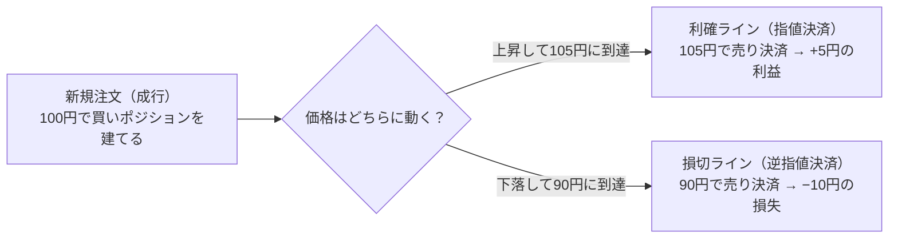

# CFDノート：基礎

🇬🇧 [English version](./cfd-basics.en.md)

[← CFDノートの目次に戻る](./cfd.md)

このファイルでは、CFDの基本的なしくみ（CFDとは何か、なぜ存在するのか、
レバレッジと証拠金、差金決済、ロング／ショート）を扱う。

---

## CFDとは何か

CFDは、金融派生商品（デリバティブ取引）の一種である。デリバティブ取
引とは、原資産（もととなる資産）の価格に依存して価格が決まる取引の
ことで、代表的なものに次の4つがある。

- 先物取引（Futures）：将来の決められた期日に、特定の商品を現時点で
  決めた価格で売買する契約（例：日経225先物）
- オプション取引（Option）：将来の決められた期日に、特定の商品を現時
  点で決めた価格で「売買できる権利」を取引するもの
- スワップ取引（Swap）：金利や通貨など、異なるキャッシュフロー（資金
  の受け払い）を当事者間で一定期間交換する取引
- 差金決済取引（CFD）：現物の受け渡しを行わず、売買価格の差額のみを
  決済する取引

つまりCFDは、先物・オプション・スワップと並ぶデリバティブ取引の1種
類、という位置づけになる。

CFDとは、「Contract for Difference（コントラクト・フォー・ディファ
レンス）」の略で、日本語では差金決済取引（さきんけっさいとりひき）と
呼ばれる。

「差金決済」とは、実際の商品（株式・原油・株価指数など）の受け渡しを
せず、売買したときの価格差だけをやり取りする取引のことを指す。たとえ
ば100円で買って120円で売った場合、実際に100円分のモノを受け取ること
も、120円分のモノを渡すこともなく、その差額20円だけが手元でやり取り
される。

実は、日常的によく聞く「FX（外国為替取引）」もCFDの一種である。FXは
「為替（通貨のペア）」を対象にしたCFD、と言い換えることができる。CFD
という大きな括りの中に、株価指数・コモディティ・そしてFXが含まれてい
る、という関係になる。

CFDは、証券取引所を介さず、証券会社（ディーラー）と顧客が1対1で契約
を結ぶ、いわゆる店頭取引（OTC取引、Over-The-Counter）である。日本語
では「相対（あいたい）取引」とも呼ばれる。

取引所取引（たとえば現物株式の取引所取引）では、多数の売り手・買い手
の注文が「板（いた）」と呼ばれる一覧に並び、需給によって価格が決ま
る。一方CFDは取引所の板を使わず、証券会社が提示する価格（レート）に
対して顧客が売買する形をとる。この違いから、次のような特徴が生まれ
る。

- 取引所のような厳格な規格（取引単位や満期日など）がないため、証券会
  社が条件を柔軟に決められる。CFDに「乗り換え（ロールオーバー）」と
  いう仕組みがあるのも、もともと取引所の限月という決まった規格を参照
  しつつ、証券会社側で独自にポジションを繋ぎ直せる自由度があるためで
  ある（詳細は[「乗り換え」](./cfd-rollover-and-adjustments.md)の項目で扱う）。
- 証券会社が買値（Bid）と売値（Ask）を提示し、その差額であるスプレッ
  ドが実質的なコストになる
- 証券会社（カウンターパーティー）が経営破綻するなどした場合、契約が
  履行されなくなるリスク（カウンターパーティーリスク）がある

スプレッドがどう決まるか、証券会社が顧客との取引で抱えたリスクをどう
処理しているかは、それぞれ後述の[「レートはどう生成されるか」](./cfd-pricing-and-cover.md)[「カバー
ディールの考え方」](./cfd-pricing-and-cover.md)で扱う。

##### なぜ「現物を持たない」のに取引ができるのか

CFDは、原資産（株式や商品そのもの、またはその先物）の価格を参照し
て作られた商品である。実際にその現物を売買するには全額の資金が必要
だが、CFDは価格差だけをやり取りするため、少ない資金で取引ができる
（レバレッジという考え方につながるが、詳細は別項目で扱う）。

また、現物や先物の取引には受け渡しという煩雑さも伴う。たとえばWTI
原油の先物を売買した場合、限月（取引の期限となる月）を超えて持ち続
けようとすると、本来は現物（原油そのもの）の受け渡しが発生してしま
う。これを避けるには、期限が来る前に自分で次の限月へ乗り換える必要
がある。CFDでは、こうした受け渡しや乗り換えに関わる作業を証券会社
が代わりに行うことで、顧客は現物を意識せずに差金取引だけに集中でき
る。

さらに、取引所での取引は、その取引所が開いている時間しかできない。
CFDの取引時間は証券会社が決めており、参照先の取引時間に沿いつつ、
国内の取引所が閉まっている夜間や祝日でも取引できる銘柄が多い。

##### 具体例：CFDは実際に何を売買していることになるのか

CFDが実際に参照している価格は、商品タイプによって異なる。

- 日本225：取引所で取引されている日経225先物の価格を参照している。
  参照先の取引所は証券会社によって異なるが、たとえばSGX（シンガポー
  ル取引所）やCME（シカゴ・マーカンタイル取引所）が代表的である。
- WTI原油：同様に、取引所で取引されているWTI原油先物の価格を参照して
  いる。
- 米国半導体ETFなど、ETF型のCFD：ETF（上場投資信託）そのものの価格を
  参照している。たとえば米国半導体ETFのCFDであれば、iShares
  Semiconductor ETFのような実際のETFの値動きを参照している。なお、
  ETF自体を買うこととETFを参照したCFDを取引することは別物である
  （詳細は補足①）。
- FXや金スポットなど、取引所を介さない商品：金融機関同士が直接価格を
  提示し合う相対取引（あいたいとりひき）で決まるスポット取引（直物取
  引）の価格を参照している（詳細は補足②）。なお、同じ貴金属でも、先
  物を参照する銘柄もある（詳細は[「商品タイプ別の具体例」](./cfd-product-types.md)を参照）。

このように、CFDは商品ごとに「先物」「ETF」「スポット取引」のいずれか
を参照価格として作られている。前段で説明した「差金決済」という仕組み
は共通だが、その裏側にある参照先は一様ではない、という点がポイントに
なる。

---
補足①：ETFとは

ETF（Exchange Traded Fund／上場投資信託）とは、株価指数や商品に連動
するように作られた金融商品。運用会社が集めた資金で構成銘柄の株式など
を買い、それを購入した顧客は構成銘柄に分散投資しているのと同じ効果
を得られる（配当の代わりに分配金を受け取ることもできる）。ETF自体を
買う場合は購入金額分の資金が必要で、実際にその資産（の一部）を保有し
ていることになる。一方、CFDは実物の資産を持たないため、株主としての
権利などは発生せず、「買ったときの価格」と「売ったときの価格」の差額
だけを決済する取引になる。

補足②：スポット取引とは

スポット取引（直物取引）とは、取引が成立してから短期間（通常2営業日
以内）で現物の受け渡しが完了する取引のこと。取引所を介さず、金融機関
同士でやり取りされる価格がベースになる。

##### 自分（オペレーション）は、CFDのどこに関わっているか

CFDという商品を提供し続けるために、オペレーションが関わる業務は多岐
にわたる。ここでは全体像として整理し、それぞれの詳細は該当する各項目
（乗り換え、レバレッジと証拠金など）に譲る。

- 相場・リスク管理：マーケットの状況確認（サーキットブレーカー・貸株
  規制など）、顧客ポジションのリスク判断・調整、リスクエクスポージャ
  ーの監視、ロスカット（強制決済）のモニタリング、配信レートの異常値
  チェック
- 商品運用：コーポレートアクション対応（新規上場・分社化・株式分割・
  合併など）、取引所スケジュールの確認、価格調整額の決定と反映、限月
  の乗り換え（ロールオーバー）、ヘッジ取引
- 管理・コンプライアンス：reconciliation（帳簿と実際の残高の突合）、
  顧客資産の分別管理の確認、金融庁・金融先物取引業協会などへの報告書
  作成、KYC（顧客確認）・AML（マネーロンダリング対策）対応
- システム運用：障害対応、事業継続計画（BCP）に基づく代替手順の整
  備、新規商品リリース前の動作確認（UAT）

つまり、CFDという商品を1つ提供し続けるためには、「価格を正しく作
る」「リスクを管理する」「規制を守る」「システムを安定稼働させる」と
いう複数の役割が重なって支えている。

##### 3年前の自分がつまずきそうな点

ここまでCFD・FX・ETF・先物・スポット取引と、いろいろな言葉が一度に出
てきたと思う。全部を一度に理解しようとせず、まず1つの商品に絞って、
知識を深めるのがおすすめ。

例えばWTI原油であれば、「限月のある先物価格を参照してレートが作られ
ている」→「決済日が来ると本来は乗り換えが必要になる」→「その煩雑な
作業をオペレーション側が代わりに行っているから、顧客は何もせず取引を
続けられる」という一連の流れを1つの商品で理解できれば、他の商品にも
応用できる。根っこにあるのは、CFDは常に「価格差を利用した取引であ
り、現物の受け渡しがない」という点である。

また、初心者がよく誤解しやすい点として、次のようなものもある。

- 「少ない資金で取引できる＝お金を借りている」と誤解する：CFDは借金
  ではなく、「価格差だけをやり取りする」仕組みだからこそ、少ない資金
  で取引できる。
- CFDの価格と、参照している先物やETFの価格が完全に一致すると思って
  しまう：CFDの価格にはスプレッド（買値と売値の差）などが含まれるた
  め、参照先の価格とは微妙にずれることがある（詳細は補足③）。
- CFDで株やETFを取引すると、「株を買った」ことになると思ってしまう：
  CFDでは実物の資産を持たないため、株主としての権利（議決権や株主優
  待など）は一切発生しない。

補足③：スプレッド（オファー／ビッド）とは

CFDの価格は、常に2つの値が並んで提示される。

- オファーレート（Ask）：売りたい相手が提示している価格。買う側から
  すると、この価格で買うことになる。
- ビッドレート（Bid）：買いたい相手が提示している価格。売る側から
  すると、この価格で売ることになる。

通常、オファー（売り手の希望価格）はビッド（買い手の希望価格）より
高い。この2つの価格差が「スプレッド」であり、CFDの実質的な取引コス
トになっている。

---

## なぜCFDという商品が存在するのか（現物との違い）

現物取引とは、株式・債券・為替・金利・金や原油といった資産そのものを
所有する取引で、売買にはその現物の受け渡しが発生する。

CFDは、そうした現物取引の対象を「原資産（もととなる資産）」「参照
先」として、その価格差だけをやり取りする取引である。CFDでは現物の受
け取りや、それに付随する株主としての権利なども発生しない。

##### なぜ現物を買わずCFDで取引するメリットがあるのか

現物取引と比べたとき、CFDには次のようなメリットがある。

- 取引手数料が無料：CFDは多くの場合、取引手数料がかからない（スプレ
  ッドが実質的なコストになる）。
- 現物の受け渡しがない：価格差だけのやり取りなので、保管や輸送、受け
  渡しの手間が一切かからない。
- レバレッジが効く：少ない証拠金で、大きな金額を取引したときと同じ効
  果を得られる。
- 空売りがしやすい：現物は保有していないと売れないが、CFDは新規の売
  り（ショート）から取引を始められるため、価格が下がる局面でも利益を
  狙える。
- 銘柄・市場をまたいで一元管理できる：日本株・米国株・原油・為替な
  ど、通常なら別々の口座が必要な商品を、1つの口座でまとめて取引でき
  る。
- 海外の証券口座を開く必要がない：たとえば日本にいながら米国株や海外
  商品のCFDを取引でき、現地の証券会社に口座を開く手間がかからない。
- 少額から取引できる：現物株は「単元株（100株単位など）」で買う必要
  があることが多いが、CFDはより小さい単位から取引できる場合が多い。
- 配当相当額の調整金を受け取れる（個別株・ETF CFDの場合）：株主では
  ないが、配当が出るタイミングでその分の調整金を受け取れる（売り建て
  の場合は逆に支払う）。なお、先物を参照する株価指数CFDでは、配当分は
  先物価格に織り込まれており、乗り換えのときの価格調整額の中で精算さ
  れる（詳細は[「商品タイプ別の具体例」](./cfd-product-types.md)を参照）。
- 夜間や祝日、24時間近く取引できる：取引所が開いている時間に縛られ
  ず、海外市場を含めて夜間でも取引できる商品が多い。

##### 具体例：WTI原油の現物・先物・CFDでは何が違うのか

現物との違いを具体的に見るために、WTI原油の現物・先物・CFDの3つを
比べてみる。先物も並べるのは、WTI原油CFDが参照しているのが現物では
なく先物の価格であり、限月や乗り換えといった話はもともと先物の性質
だからである。

| 項目 | 現物のWTI原油 | WTI原油先物 | WTI原油CFD |
|---|---|---|---|
| 何を売買するか | 原油そのもの（実際に所有する） | 将来の期日に原油を受け渡す約束（限月ごとの契約） | 先物価格を参照し、価格差だけをやり取りする契約 |
| 受け渡し・乗り換え | 買った時点で原油を受け取る。限月という概念はない | 期日まで持ち続けると原油の受け渡しが発生する。避けるには自分で次の限月に乗り換える必要がある | 受け渡しは発生しない。乗り換えは証券会社が代行する |
| 必要な資金 | 取引金額の全額が必要 | 証拠金のみで取引可能（レバレッジが効く） | 証拠金のみで取引可能（レバレッジが効く） |
| 空売り | 原油を持っていなければ売れない | 新規の売りからそのまま入れる | 新規の売り（ショート）からそのまま入れる |
| 取引単位 | 大口の取引が中心で、個人が少量を売買するのは現実的でない | 1枚あたりの単位が大きい | 先物より小さい単位から取引できることが多い |
| 取引時間 | 取引所を介さない相対取引が中心 | 先物取引所の取引時間に限られる | 証券会社が定める取引時間（参照先の先物の取引時間に沿うことが多い） |
| 保管・付随コスト | 保管・輸送などのコストが発生する | 保管コストはないが、取引手数料や、乗り換えのときの売買コストがかかる | 保管の概念自体がなく、コストはスプレッドや乗り換え時の価格調整額などに集約される |

このように、参照している値動きは同じでも、違いは2段階で生まれてい
る。まず、現物から先物になることで「全額の資金が要らない」「売りから
入れる」という自由度が加わるが、代わりに限月があるため、受け渡しや
乗り換えを自分で管理する必要が出てくる。CFDは、先物の値動きを参照し
つつ、その受け渡しや乗り換えの手間を証券会社が引き受けることで、
「現物を持つかどうか」も「限月をどう管理するか」も顧客が意識しなく
てよい形にした商品、と位置づけられる。

##### 自分（オペレーション）は、現物取引とCFD取引の違いをどこで意識するか

CFDは現物を持たない分、現物取引にはない業務がオペレーション側に発生
する。実務でこの違いを特に意識するのは、次のような場面である。

- ロールオーバー（限月の乗り換え）：先物取引では投資家自身が行う乗
  り換え作業を、CFDでは証券会社が顧客に代わって行う。その乗り換え作
  業そのもの
- 調整金の管理：乗り換えに伴う価格の不連続を埋め合わせる調整金の計
  算・付与（個別株・スポットでは、権利調整額や金利調整額の登録・付与
  も含む）
- リスク管理：レバレッジが効く分、現物よりも大きなポジションリスクが
  発生しうるため、その監視・調整が必要になる
- 参照先取引所の取引時間の管理：CFD自体は夜間や祝日も取引できるが、
  参照している先物や現物の取引所には取引時間があるため、その時間帯や
  スケジュールを把握しておく必要がある
- 参照先限月の価格をもとにしたレート生成：CFDの価格は独自に決まるの
  ではなく、参照している限月の価格をベースに生成されるため、その紐付
  けの管理が必要
- 取引単位の管理：現物とは異なる単位でCFDが取引される場合があり、そ
  の設定・管理が必要
- 証拠金率・レバレッジ倍率の設定と維持率管理：レバレッジを提供する以
  上、証拠金が不足した際の対応（維持率の監視）が必要になる
- ロスカット水準の設定・モニタリング：現物にはない、強制決済の仕組み
  そのものの管理
- スプレッドの設定：現物のような取引手数料の代わりに、CFD特有のコス
  ト構造（買値と売値の差）を管理する
- 限月マスタのメンテナンス：どの限月をいつまで参照するかというマスタ
  データ自体の管理（ロールオーバーの前提となる業務）
- 円転単価の管理：海外商品を円建てで提供する場合の為替換算レートの設
  定

つまり、「現物を持たない」というCFDの本質的な特徴が、そのままオペレ
ーション側の管理項目（価格・リスク・時間・単位）を増やしている、とい
う関係になっている。

##### 3年前の自分がつまずきそうな点

「現物取引と全く同じ値動きに見えるのに、なぜCFDという別の商品が存在
するのか」——最初はそう疑問に思うかもしれない。「だったら現物を直接
取引すればいいのでは」と。

しかし、原油のような商品は、現物を直接取引しようとすると全額の資金
や保管の手間が必要で、個人には現実的でない。かといって先物を直接取
引すると、限月が来るたびに自分で乗り換え（ロールオーバー）を行う必
要があり、手間がかかる上に、乗り換えを忘れれば実際に現物（原油その
もの）の受け渡しが発生してしまうリスクもある。CFDは、こうした煩雑な
作業や受け渡しのリスクを証券会社が代わりに引き受けることで成り立っ
ている商品である。

ただし、これは「CFDのほうが一方的にお得」という意味ではない。CFDには
スプレッド（買値と売値の差）というコストがあり、レバレッジが効く分、
含み損が広がるスピードも現物より速い。「受け渡しがなくて便利」なこと
と、「リスクが小さい」ことは別の話であり、CFD特有のコストやリスクも
理解した上で使う必要がある。

---

## レバレッジと証拠金

##### レバレッジとは何か（一言でいうと）

レバレッジとは、少ない証拠金（担保として預けるお金）で、その何倍も
の金額の取引ができる仕組みのことである。日本の個人向けCFDでは、
レバレッジの上限が商品タイプによって法令で定められており、執筆時点では
株価指数は10倍、商品（原油・金など）は20倍、個別株・ETFは5倍までと
なっている（FXは25倍まで）。法令の変更によって上限が変わることもある。
商品タイプによって上限が異なるのは、値動きの激しさが
異なるためである。個別株は1つの企業の業績や出来事で大きく動きやすい
ため、上限が低く抑えられている。

たとえば、株価指数CFDで10万円を証拠金として預け入れた場合、レバレ
ッジ10倍であれば、100万円分の取引を行うことができる。つまり、実際に
用意する資金は10万円でも、100万円分の値動きをそのまま損益として受け
取ることになる。

##### 証拠金とは何か、レバレッジとどう関係するか

証拠金（しょうこきん）とは、取引を行う際に担保として証券会社に預け
入れる資金のことである。

レバレッジは、この証拠金を元手にして、何倍もの金額の取引を行う仕組
みなので、証拠金とレバレッジは表裏一体の関係にある。取引したい金額
（取引金額）に対して、実際に預け入れる証拠金の割合を「証拠金率」と
呼び、レバレッジは証拠金率の逆数にあたる（例：証拠金率10％＝レバ
レッジ10倍）。

証拠金は、取引を始めるときに必要な「新規建て証拠金」だけでなく、含
み損が出た場合にそれを吸収するクッションの役割も果たす。証拠金に対
して、口座に残っている純資産（有効証拠金）の割合を「証拠金維持率」
と呼び、この維持率が一定水準を下回ると、証券会社から追加の証拠金を
求められたり（追証）、強制的にポジションが決済されたりする（ロスカ
ット）。

##### 具体例：証拠金○○円でレバレッジ○倍だと、いくらの取引ができるか

日経225のCFDを例に考える。証拠金として10万円を預け入れ、株価指数
CFDの上限であるレバレッジ10倍で取引する場合。

- 取引可能金額：10万円 × 10倍 = 100万円
- 証拠金率：1 ÷ 10 = 10％
- 必要証拠金（100万円分の取引をするために必要な証拠金）：100万円 ×
  10％ = 10万円

つまり「取引金額 × 証拠金率」で必要証拠金が求まり、「証拠金 × レバ
レッジ」（または「証拠金 ÷ 証拠金率」）で取引可能金額が求まる、と
いう関係になっている。

##### 自分（オペレーション）は、証拠金不足（追証）が起きたときどう対応しているか

証拠金維持率は、「口座の純資産（有効証拠金）÷ 必要証拠金 × 100％」
で計算される。維持率がどこまで下がったかによって対応が変わるが、具
体的な閾値や猶予時間は証券会社ごとに異なる。以下はあくまで一例であ
る。

- 維持率が100％を切ったまま翌営業日に持ち越された場合：猶予があ
  る。一定の期限（例：翌営業日中）までに、追証（追加の証拠金を入金
  すること）、または自分でポジションの一部を決済して維持率を回復さ
  せることで、全ポジションを強制決済されることを避けられる。期限ま
  でに解消されなければ、証券会社側でポジションが全決済される。
- 維持率が一定の水準（例：50％）を切った場合：猶予はない。切った瞬
  間に、全ポジションが強制的に決済される（ロスカット）。これは、顧
  客の損失がそれ以上膨らまないようにするための救済措置でもある。た
  だし、ロスカットは「その水準に達したら決済を発動する」仕組みであ
  り、その水準のレートで決済されることまでは保証されない。相場の急
  変や窓開け（前の終値から大きく離れた価格で取引が始まること）があ
  ると、ロスカット水準より大きく不利なレートで決済され、預けた証拠
  金を超える損失（不足金）が発生することがある。その場合、顧客は不
  足金を入金して支払う必要がある。

オペレーションは、口座ごとの維持率を常時モニタリングし、猶予のある
閾値を切った口座には追証の通知を行い、猶予のない閾値を切った口座に
ついてはロスカット処理が正しく実行されているかを確認する。また、ロ
スカット後に不足金が発生した口座については、顧客への通知や入金の確
認を行う。

##### 3年前の自分がつまずきそうな点

- レバレッジを「借金をして取引している」と誤解する：レバレッジは借
  金ではなく、証拠金という担保を元手に、その何倍かの金額の取引を行
  える仕組みである。ただし「借金ではない＝証拠金以上は損しない」と
  いうわけではない。維持率が一定の水準を切るとロスカットで強制決済
  されるが、相場が急変すると決済が間に合わず、証拠金を超える損失
  （不足金）が発生し、支払う義務を負うことがある。
- 使える金額いっぱいまでレバレッジをかけるのが当然だと思ってしま
  う：上限（たとえば株価指数CFDなら10倍）まで取引できるからといっ
  て、常に上限いっぱいで取引するのが普通というわけではない。レバレッジを高くするほど、少しの値動きで証拠金
  維持率が急激に下がりやすくなるため、余力を持たせて取引するのが一
  般的である。
- 証拠金維持率100％を「安全なライン」だと思ってしまう：実際には、
  100％を切った時点で既に追証の対象になる。安全に取引を続けるため
  には、100％よりも十分に高い維持率を保っておく必要がある。
- 追証とロスカットを同じものだと誤解する：追証には猶予があり、期限
  内に対応すれば強制決済を避けられるが、ロスカットは猶予なく即座に
  全決済される。両者はトリガーとなる維持率の水準も、対応できる余地
  も異なる。

---

## 差金決済とは

> 差金決済の基本的な定義（「実際の商品の受け渡しをせず、売買したと
> きの価格差だけをやり取りする取引」）は「CFDとは何か」で既に説明し
> た。ここでは、その基本を踏まえた上で、決済のタイミング・複数回売
> 買した場合の損益計算・オペレーション側の決済処理という3つの切り口
> を掘り下げる。

##### 差金決済の損益は「いつ」確定するのか

差金決済において、損益が確定するタイミングは、顧客が建てたポジショ
ンに対して反対売買（決済注文）を行った瞬間である。ポジションを持っ
ている間は、価格が動くたびに評価上の損益（未実現損益）が変動するだ
けで、まだ手元の資産としては確定していない。

注文の出し方には、大きく分けて3種類ある。

- 成行（なりゆき）注文：現在見えているレートで、その場ですぐに約定
  させる注文
- 指値（さしね）注文：今より有利なレートを指定し、そのレートに達し
  たら約定させる注文（買いなら今より安いレート、売りなら今より高い
  レートを指定する）
- 逆指値（ぎゃくさしね）注文（ストップ注文）：今より不利なレートを
  指定し、そのレートに達したら約定させる注文（買いなら今より高いレ
  ート、売りなら今より安いレートを指定する）

これは新規注文（ポジションを建てるとき）にも、決済注文（ポジション
を閉じるとき）にも、どちらにも使える。

| | 新規注文（ポジションを建てる） | 決済注文（ポジションを閉じる） |
|---|---|---|
| **成行** | 現在のレートでその場で新しいポジションを建てる | 現在のレートでその場でポジションを閉じる |
| **指値** | 今より有利な指定レートに達した時点で新しいポジションを建てる | 今より有利な指定レートに達した時点でポジションを閉じる |
| **逆指値** | 今より不利な指定レートに達した時点で新しいポジションを建てる | 今より不利な指定レートに達した時点でポジションを閉じる |

決済注文には、利益を確定させる「利確（りかく）」と、損失を確定させ
る「損切（そんぎり）」の2種類がある。利確は今より有利なレートで決
済することなので指値を、損切は今より不利なレートで決済することなの
で逆指値を使う（どちらも、その場で決済したいときは成行でもよい）。

たとえば、100円で成行の新規注文をして買い（ロング）のポジションを
持ったとする。このポジションの決済は「売り」になる。105円まで上が
ったら利益を確定したいと考えれば、105円に指値の売り決済注文（利
確）を入れておく。逆に、90円まで下がった場合に損失がこれ以上膨らむ
のを避けたいと考えれば、90円に逆指値の売り決済注文（損切）を入れて
おく。もし90円に「指値」の売り注文を入れてしまうと、「90円以上なら
売る」という意味になり、現在の100円で即座に約定してしまう。

このように、あらかじめ利確ラインを指値で、損切ラインを逆指値で設定
しておくことで、値動きを常に見ていなくても損益を確定させることがで
きる。

##### 具体例：複数回売買した場合の損益計算（平均約定単価の考え方）

同じ商品を複数回に分けて売買（買い増し・売り増し）した場合、損益は
「平均約定単価」を基準に計算される。

**買い（ロング）を複数回に分けて積み増した場合**

| 回数 | 約定レート |
|---|---|
| 1回目（新規） | 100円 |
| 2回目（買い増し） | 103円 |
| 3回目（買い増し） | 105円 |
| 4回目（買い増し） | 104円 |
| **平均約定単価** | (100+103+105+104)÷4 = **103円** |

平均約定単価が103円になるので、103円より高いレートで決済すれば利
益、低いレートで決済すれば損失になる。

**売り（ショート）を複数回に分けて積み増した場合**

100円で下がると見込んで売り注文を入れたが、レートが上がってしまっ
たため103円で売り増し。その後105円まで上がったところでも売り増し、
下がり始めたのを見て104円でも売り増した。

| 回数 | 約定レート |
|---|---|
| 1回目（新規） | 100円 |
| 2回目（売り増し） | 103円 |
| 3回目（売り増し） | 105円 |
| 4回目（売り増し） | 104円 |
| **平均約定単価** | (100+103+105+104)÷4 = **103円** |

ショートの場合は買いと逆で、平均約定単価より低いレートで決済すれば
利益になる。最初の売りが100円だった時点だけを見ると、一時105円まで
逆行して含み損を抱えていたことになるが、平均約定単価（103円）を基
準にすれば、その後レートが103円を下回るところまで戻れば全体として
は利益になる、ということが分かる。

##### 自分（オペレーション）は、決済処理のどの部分に関わっているか

- ネットポジションでの管理：証券会社側では、顧客のポジションをグロ
  ス（ショートとロングをそれぞれ別々に保持する）ではなく、ネット
  （ショートとロングを差し引きした状態）で管理する。これは、前段で
  説明した「平均約定単価」の考え方がそのまま反映された形であり、複
  数回の売買があっても、最終的には1つの合算ポジションとして扱われ
  る。
- レート配信異常時の約定修正：レート配信が正常に行われなかった場
  合、誤ったレートで約定してしまった取引が発生することがある。その
  場合、オペレーション側で正しいレートに手動で修正し、対象の顧客に
  通知する対応が必要になる。
- 決済のreconciliation（突合）：顧客の決済結果が、社内システムとカ
  バー先（CP）側の記録の両方で正しく一致しているかを確認する。
  ロング／ショートのセクションで触れた「カバー先とのポジション照
  合」の、決済版にあたる。
- 損益・残高反映の確認：決済によって確定した損益が、顧客の口座残高
  に正しく反映されているかを確認する。
- スリッページ対応：成行注文や逆指値注文では、注文時に見ていた（ま
  たは指定した）レートと実際の約定レートに、不利な方向のズレ（スリ
  ッページ）が生じることがある。このズレが許容範囲を超えていないか
  を確認し、超えている場合は対応する。なお指値注文は「指定したレー
  トか、それより有利なレート」でしか約定しないため、不利な方向のス
  リッページは起きない。

##### 3年前の自分がつまずきそうな点

- 未実現損益を「もう確定した利益・損失」だと思ってしまう：決済（反
  対売買）するまでは、どれだけ含み益・含み損があっても、それはあく
  まで評価上の数字に過ぎない。決済注文が約定して初めて、損益が確定
  する。
- 複数回売買すると、それぞれの取引が別々に管理されると思ってしま
  う：実際には証券会社側ではグロスではなくネットで管理されるため、
  個々の取引レートよりも「平均約定単価」という1つの基準に集約され
  る。途中の値動きに一喜一憂するより、平均約定単価がどこにあるかを
  意識する方が実務的に重要になる。
- 逆指値で損切ラインを入れておけば、必ずそのレート通りに決済される
  と思ってしまう：逆指値は「指定したレートに達したら決済する」注文
  であり、そのレートで約定することまでは保証されない。相場が急変し
  たときや、レート配信の状況によっては、指定したレートより不利なレ
  ートで約定する（スリッページ）ことがある。

---

## ロング／ショート

##### ロング・ショートとは何か（一言でいうと）

ロング（買い）・ショート（売り）とは、取引の「方向」を表す言葉であ
る。

- ロングを持つ：買いのポジション（保有している建玉／たてぎょく）を
  持つこと。自分の持ち値より価格が上がれば利益が出る。
- ショートを持つ：売りのポジションを持つこと。自分の持ち値より価格
  が下がれば利益が出る。

決済（ポジションを閉じること）は、逆方向の取引で行う。

- ロング（買い）の決済 → ショート（売り）することで行う
- ショート（売り）の決済 → ロング（買い）することで行う

つまり、「買いから入って、売って終わる」のがロング、「売りから入っ
て、買って終わる」のがショート、という関係になる。

##### なぜCFDでは「売り」から入れるのか（現物との違い）

現物取引では、その商品を保有していなければ売ることができない。一方
CFDは「差金決済」という仕組みを使っているため、売買したときの価格
差だけをやり取りする取引になる。

「売りから入る」とは、売った価格と、後で買い戻した価格との差額を受
け取る権利と、買い戻す義務を持つ、ということを意味する。決済時に
は、この権利と義務を行使することで、差額を損益として確定する。

この仕組みがあるため、現物を保有していなくても空売り（からうり）が
できる。株式の信用取引のように、証券会社から株を借りて金利を支払う
といった手続きは必要ない。

たとえば、友達からゲーム機を借りて1,000円で売り、後で買い戻して友
達に返す、という流れをイメージすると分かりやすい。もし買い戻すとき
の価格が800円まで下がっていれば、売った1,000円と買い戻した800円の
差額200円が自分の利益になる。これが空売りの基本的な仕組みである。
CFDでは、この「借りて売って、買い戻して返す」という一連の流れを、
証券会社が裏側で処理してくれるため、顧客は権利・義務のやり取り
（＝ショートポジションを持つこと）だけを意識すればよい。

##### 貸株（かしかぶ）とショートの規制

CFD自体は差金決済であり、顧客との取引だけを見れば現物の株を借りる
必要はない。しかし証券会社は、顧客から受けたショートポジションのリ
スクを、実際の株式市場でヘッジ（カバー）することがある（詳細は[「カ
バーディールの考え方」](./cfd-pricing-and-cover.md)で扱う）。このヘッジのために証券会社（または
その先のカバー先）が現物株を売る必要が生じた場合、信用取引と同様
に、その株をどこかから借りてくる必要がある。これが「貸株（かしか
ぶ）」である。

貸株の仕組み：

- 株を保有している投資家が、証券会社にその株を貸し出す。貸した投資
  家は、対価として金利を受け取れる（銀行預金より高めの金利であるこ
  とが多い）。貸している間も、いつでも通常通り市場でその株を売却で
  きる。
- 証券会社は、こうして集めた株を、機関投資家や信用取引でショートし
  たい投資家に又貸しして、手数料を得る。

つまり「売りから入る（ショート）」を現物株式市場で行うには、必ず
「誰かから株を借りてくる」という手順が必要になる。

貸株が確保できない場合、証券会社は現物市場でのヘッジができなくな
る。ヘッジできないままショートポジションを受け入れ続けると、証券会
社自身が方向性のリスク（相場が逆に動いたときの損失）を抱えたままに
なってしまう。そのため、貸株が確保できなくなった銘柄については、証
券会社は新規のショート取引そのものを規制せざるを得ない。

これは証券会社が独自に決めるだけの話ではなく、市場側の規制にも連動
する。代表的なのが、株価が大きく下落した銘柄で空売りの価格を制限す
るルールで、米国ではSEC（米国証券取引委員会）の規則であるRule 201
（いわゆる201規制）、日本では空売り価格規制がこれにあたる。どちらも
空売りそのものを禁止するのではなく、「下落中の安値をさらに売り叩
く」ような空売りを制限するものである。また、カバー先の証券会社側で
貸株規制がかかった場合にも連動する。店頭でCFDを提供する証券会社も、
こうした規制でカバー先での売りが難しくなれば、それに合わせて顧客の
新規売りを規制することになる。

##### 具体例：ロングとショートで、価格が上がった/下がったときの損益はどうなるか

日経225のCFDを1枚、24,000円のときに取引したとする。

| ポジション | エントリー価格 | 決済価格 | 損益の計算 | 結果 |
|---|---|---|---|---|
| ロング（買い） | 24,000円 | 24,500円（上昇） | 24,500 − 24,000 | +500円の利益 |
| ロング（買い） | 24,000円 | 23,500円（下落） | 23,500 − 24,000 | −500円の損失 |
| ショート（売り） | 24,000円 | 23,500円（下落） | 24,000 − 23,500 | +500円の利益 |
| ショート（売り） | 24,000円 | 24,500円（上昇） | 24,000 − 24,500 | −500円の損失 |

つまり、ロングは「決済価格 − エントリー価格」、ショートは「エント
リー価格 − 決済価格」で損益が決まる。価格が上がるとロングが得をし
てショートが損をし、価格が下がるとその逆になる、という表裏の関係に
なっている。

##### 自分（オペレーション）は、ポジション方向（ロング／ショート）をどこで確認・管理しているか

CFDは証券会社と顧客の相対取引（あいたいとりひき）であるため、まず
「顧客がロング→当社はショート」「顧客がショート→当社はロング」と
いう反転の関係を理解しておく必要がある。オペレーションは、この関係
を前提に、いくつかの場面でポジション方向を確認・管理している。

- ネットポジションの監視：商品ごとにポジションリスクの許容量が決め
  られており、マーケットの動き・顧客の指値・テクニカルな状況を見な
  がら、その許容量に収まるようカバー（ヘッジ）の判断を素早く行う。
  許容量を超えそうな場合は、カバーを増やして対応する。
- カバー先とのポジション照合（reconciliation）：当社が保有している
  ヘッジポジションと、PB（プライムブローカー）やLP（流動性提供者）
  側の認識がズレていないかを突き合わせる。「当社にあってPBにない」
  「PBにあって当社にない」といった浮いたトランザクションがないかを
  確認し、見つかった場合はLPに問い合わせて、レートのズレや約定の成
  否を確認する。照合はTokyo・London・NYの各時間帯で少なくとも1回、
  実際には各時間帯2回程度行っている。常時モニタリングしているた
  め、約定が滑った（スリッページが起きた）ときは通知が来ることが多
  く、その都度LPと連絡を取り合っている。
- ロスカット・証拠金維持率のモニタリング：一般に、ショートを抱えて
  いる方が維持率が下がりやすい。理由は主に2つある。1つは、配当相当
  額の調整金を、買い建て（ロング）は受け取り、売り建て（ショート）は
  支払う側になるため、時間の経過だけで純資産がじわじわ減っていくこと
  （個別株・ETFでは配当が出るたびに権利調整額として、先物を参照する株
  価指数では乗り換えのときの価格調整額の中で、この受け払いが発生す
  る）。もう1つは、株価指数や個別株は長期的には上昇す
  る傾向があるため、同じボラティリティでもショートの方が含み損を抱
  えたまま長引きやすいこと。またボラティリティが高い局面で相場が一
  方向に動くと、反対方向のポジションを抱えている顧客の維持率を一気
  に消費してしまう。顧客のロスカットが発生すると、その分当社側の持
  ちポジションが増える可能性もあり、カバーのリジェクト（約定拒否）
  が起きるリスクもあるため、常時の監視が欠かせない。
- ショート特有の規制対応：貸株規制や空売りの価格規制（米国のRule
  201など）が発生した場合、顧客の新規売り取引を停止し、顧客取引ペー
  ジにお知らせを掲示する。規制が解除された場合も、解除日を顧客ペー
  ジに掲示する。
- レポーティング：取引高や顧客のロスカット状況などを含め、規制当局
  等への報告義務があり、基本的には月次で対応している。

##### 3年前の自分がつまずきそうな点

- ショート＝悪いこと、というイメージを持ってしまう：「空売り」とい
  う言葉の響きから、市場に対してネガティブな行為だと感じるかもしれ
  ないが、CFDにおいてショートは単なる「取引の方向」の1つであり、ロ
  ングと対等な選択肢に過ぎない。
- 顧客が儲かれば会社も儲かる、と思い込んでしまう：CFDは相対取引の
  ため、顧客がロングで利益を出しているとき、証券会社は理論上その反
  対のショートで含み損を抱えている（実際はヘッジしているため損益は
  カバー先との関係で相殺されるが、顧客との関係だけを見ると真逆にな
  る）。
- CFDのショートも「株を借りている」感覚で理解してしまう：顧客から
  見れば、CFDは差金決済なので、実際に株を借りているわけではない。
  貸株が必要になるのは、証券会社側がヘッジのために現物市場で売る場
  合の話であり、顧客の契約そのものとは別のレイヤーの話である。
- 維持率がショートで下がりやすいのは「相場が上がっているだけ」と考
  えてしまう：実際には配当相当額の支払い（個別株・ETFでは権利調整
  額、先物を参照する株価指数では価格調整額を通じて）という構造的な
  要因も重なっており、価格が動かなくても時間の経過だけで維持率が下
  がっていくことがある。
