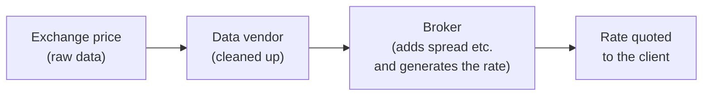
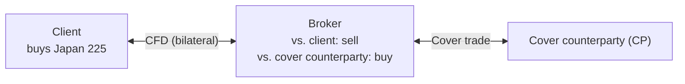
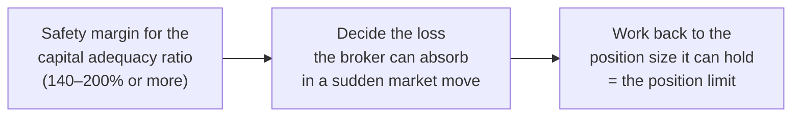

# CFD Notes: Pricing and Risk Management (Rate Generation, Cover, Position Limits)

🇯🇵 [日本語版](./cfd-pricing-and-cover.md)

[← Back to the CFD notes index](./cfd.en.md)

This file covers how the rates quoted to clients are built, and how the
risk taken on from client trades is handled and managed (cover deals and
position limits).

---

### How are rates generated?

A CFD's rate is generated independently by the broker, based on the
exchange price of whatever it references (a futures contract or the
physical asset). The broker doesn't simply pass that reference price
straight through to clients, though.

A CFD's rate also isn't a single number — it's quoted as two prices: an
ask (the price at which the client can buy) and a bid (the price at
which the client can sell). The gap between the two is the spread, which
is effectively the cost of the trade.

Two-way pricing in itself isn't unique to OTC trading. An exchange order
book also shows two prices, a best bid and a best ask. The difference
lies in who is putting those prices out.

- **Exchange order book**: many market participants (investors,
  securities firms, market makers, and so on) each place their own buy
  and sell orders. The two prices shown are the highest buy order among
  them (the best bid) and the lowest sell order (the best ask). The gap
  between the two (the spread) is a cost for anyone who trades, but it
  isn't set aside as any particular firm's revenue.
- **OTC CFD**: the broker itself, as the client's counterparty, quotes
  both the buy and the sell price. The gap between the two (the spread)
  becomes the broker's revenue as its effective fee.

#### How the referenced futures/physical price relates to the rate

A CFD's rate moves in step with the exchange price of whatever it
references (futures or physical). For products that roll over, though,
"which contract month is currently being referenced" has a direct effect
on the rate, which makes managing the reference month especially
important.

#### A concrete example: where do the rates for Japan 225 or WTI crude oil actually come from?

Raw exchange data is difficult to work with as-is, so it's usually
supplied in a cleaned-up form — as tick data or one-minute bars — by
major data vendors. A broker offering CFDs receives real-time data from
one of these vendors, layers on adjustments like the spread, and
generates the rate it quotes to clients.

**Why brokers use data vendors**

| | Sourcing data directly from exchanges | Contracting with a data vendor |
|---|---|---|
| Connections and contracts | Technically possible, but a connection and a contract are needed with every individual exchange | Can be covered in one contract |
| Development cost | If a broker offers dozens of products, it would have to connect to every exchange involved (CME, ICE, NYSE, and so on), which adds cost | Far more efficient, both contractually and in terms of system development |

Brokers also contract with more than one data vendor so that an outage
at one vendor doesn't have to interrupt the rates quoted to clients
(more on this below).

#### Where do I (in operations) monitor rate generation and distribution?

Operations continuously monitors two things: that rates never stop
flowing, and that they never drift away from where the market actually
is.

- **Deciding on failover**
  - If the main data vendor has an outage and client-facing rates become
    abnormal (or stop being generated at all), the priority is the
    client — operations switches over to the secondary data vendor.
  - Before switching, operations checks the secondary vendor's prices
    against actual market levels (using another source not used for rate
    generation, for example) to confirm there's no significant
    discrepancy.
  - Investigating the root cause of the outage comes later; responding
    to clients comes first.
- **Managing spread width**
  - How wide the spread is set depends on the risk and cost profile of
    each product, and it's the broker that sets it.
- **Halting distribution of abnormal rates (abnormal rate detection)**
  - When abnormal price movement is detected — a sudden spike or drop in
    the market price — the system automatically pauses distributing
    rates to clients, so that client orders don't get executed at an
    incorrect price. Brokers call this by names such as "abnormal rate
    detection" or a "rate filter."
  - The movement itself might reflect a genuine market event (a major
    economic data release, for example) or a data problem — the two
    can't be told apart in the moment. So the procedure is to pause
    distribution, confirm where the market actually is, and resume once
    there's no issue.
- **Post-trade monitoring**
  - How often distribution is halted, and which triggers are most
    common, is an important thing middle/back office keeps an eye on.
  - A sudden jump in halts, or an unnatural clustering of them, can be a
    sign of a system bug or a misconfiguration — so this monitoring
    includes reviewing order history and logs to confirm no client was
    unfairly disadvantaged.

**Typical triggers for halting distribution**

| Trigger | Details |
|---|---|
| Stale pricing from latency | Network delay causes a gap between the incoming price and the broker's own latest internal rate that exceeds a pre-set tolerance |
| Sharp volatility | Around major economic data releases, for example, the market price moves so fast that price reliability temporarily can't be guaranteed |
| Detecting an outlier (a spike) | The feed itself contains a bug or an abnormal value, and the system catches it |

Note that the rate generated for clients (based on data vendor prices)
and the rate a cover counterparty (CP) quotes for cover trades are two
different things. So a rejection on the cover side (such as "last look")
is a separate issue from rate generation. That said, errors on the cover
side can be a sign that something is wrong with the market or the data,
so it's still something operations keeps in mind when monitoring rate
generation (covered in more detail under "The idea behind cover deals").

#### Where I would have stumbled three years ago

Two points in particular are easy to mix up, so they're worth spelling
out a bit more.

**① Assuming "the rate is the exchange price itself"**

- Looking at the rate on a CFD screen, it can look as if the exchange
  price is simply flowing straight through. In reality, it goes through
  three stages before it ever reaches the client: exchange price →
  cleaned up by a data vendor → generated into a final rate by the
  broker, spread and all (see the diagram in the concrete example
  above).
- In other words, a CFD's rate isn't "a copy of the exchange price" —
  it's "a separate price the broker builds on top of the exchange
  price." Not matching the reference price exactly isn't an anomaly;
  it's simply how the mechanism works.

**② Treating "rate generation" and "cover (hedging)" as the same thing**

| | Rate generation | Cover (hedging) |
|---|---|---|
| What it's about | What price gets shown to the client | How the client's order gets passed on to a cover counterparty (CP), so the broker can hedge its own risk externally |
| Rate used | Based on data vendor prices | The rate the cover counterparty quotes |

They can look connected, but they're two different pieces of work, two
different processes. For example, rates can be generated and distributed
to clients completely normally while, separately, an order to the cover
counterparty gets rejected (for example, through last look). "Rates are
being generated correctly" doesn't necessarily mean "cover is also going
through correctly" — a distinction that's easy to conflate at first.
This gets covered in more depth under "The idea behind cover deals."

---

### The idea behind cover deals

A cover deal means holding a position outside the broker (with a cover
counterparty, or CP) in the opposite direction to the position the
broker took on from the client — that is, in the same direction as the
client.

In the course of offering CFDs and similar products to clients, the
broker ends up holding the opposite side of the client's order itself.
For example, if a client goes long (buys), the broker ends up holding
the opposite, a short (sell) position. That's a state of carrying
"market risk" — the risk of a loss from the price of a held position
moving.

If the broker let this market risk build up unchecked, a large market
move could seriously damage its own financial position. So it passes the
position it's holding on to an outside cover counterparty (CP) to manage
the risk down. This whole sequence of trades is called a "cover trade,"
or a "cover deal."

**The three-layer structure that bilateral trading creates**

A CFD is a bilateral (aitai, 相対) contract between the broker and the
client — a one-to-one agreement with no exchange in between. This
bilateral nature is what produces the following three-layer structure.

Example: a client opens a long ("buy") position in a Japan 225 CFD

| Layer | Position | Details |
|---|---|---|
| 1. Client position | Buy | Long on the underlying (Japan 225) |
| 2. Broker's client-facing position (the CFD itself) | Sell | Because it's a bilateral trade, the broker automatically ends up holding the opposite side as the client's counterparty |
| 3. Broker's hedge position (the cover) | Buy | To offset the price-move risk from the short it's now holding, the broker holds a buy in the underlying or futures with an outside cover counterparty (CP) |

The end result is that the position the broker holds externally for
hedging (a buy) points in the same direction as the client's original
position (also a buy). By combining "short against the client" with
"long in the market," the broker creates a state where, for the covered
portion, its own P&L is offset no matter which way the market moves
(delta neutral).

**Delta risk and delta hedging**

The risk of loss from a held position's value moving as the price of the
underlying moves is called "delta risk." Delta is a sensitivity measure:
how much the value of your position moves when the price of the
underlying moves by 1 unit.

| Position | Delta | If the underlying rises 100 yen | If the underlying falls 100 yen |
|---|---|---|---|
| A long position in the physical asset or futures | +1 | The position's value rises by 100 yen | Falls by 100 yen |
| A short position in the physical asset or futures | -1 | The position's value falls by 100 yen (i.e., a rise in price means a loss) | Rises by 100 yen |

Being "exposed to delta risk" means your total delta across your
positions is tilted positive or negative — you're in a state where "a
move in one particular direction in the market will cost you" (i.e.,
you're carrying directional risk).

An example of the delta risk a broker takes on:

1. A client opens a one-unit long ("buy," +1) position in a Japan 225
   CFD. The broker, as the counterparty, automatically ends up holding a
   one-unit short ("sell," -1) in the Nikkei 225. The broker is now
   carrying "a delta of -1."
2. If the Nikkei then spikes upward, the loss on the broker's short
   position grows without limit. This is the state of "delta risk being
   left open (unhedged)."
3. To offset its own "-1" delta, the broker buys one unit of Nikkei 225
   futures (or an ETF that tracks the Nikkei Stock Average, for example)
   with an outside cover counterparty (CP). The buy position at the
   cover counterparty produces a "+1" delta.

> Short against the client (-1) + buy at the cover counterparty (+1) =
> total delta of 0

A state where the total delta across all held positions nets out to zero
is called "delta neutral."

A financial institution's business model is basically to earn from fees
and spreads collected from clients, not to bet on which way the market
will move. So it does the work of reducing the delta risk it's picked up
— delta hedging. That said, within the position limit described later, a
broker may deliberately leave some risk uncovered, so it isn't driving
every bit of delta risk to zero at all times.

Note that, for simplicity, this example treats "one CFD unit" and "one
unit at the cover counterparty" as the same size. In reality, the two
trade units often don't match. WTI crude oil futures, for example, trade
on the exchange at 1,000 barrels per contract, while a broker may set a
much smaller trade unit for the CFD. In that case, cover trades require
converting "how many CFD units equal one futures contract" before
deciding the quantity to trade with the cover counterparty.

#### A concrete example: when a client opens a long position, what does the broker do?

Say a client places a new long ("buy") order in a WTI crude oil CFD.

1. Because a CFD is a bilateral trade between the broker and the client,
   the moment the client goes long, the broker automatically ends up
   holding the opposite side — a short ("sell") position.
2. Left as is, the broker is now stuck holding a short position that
   loses money if the oil price rises.
3. So the broker places a buy order in the same product with a cover
   counterparty (CP), taking a long position there. This lets the broker
   offset (hedge) the risk from the short it picked up with the client,
   using a trade in the opposite direction at the cover counterparty.

In other words, the position the broker took on in the client trade and
the position it created in the cover-counterparty trade point in
opposite directions (client long → broker short against the client →
broker long against the cover counterparty). This whole flow is what a
cover deal actually looks like in practice.

#### Where do I (in operations) fit into confirming and executing cover trades?

The work operations does around cover trades breaks down into six main
areas.

| Area | Overview |
|---|---|
| Checking trading-liquidity risk | Regularly checking for the risk that a cover trade can't be executed smoothly |
| Credit management of the cover counterparty (CP) | Managing the cover counterparty's creditworthiness on an ongoing basis |
| Timing and automating cover trades | Covering manually during liquid hours, or automatically via the position limit |
| Day-to-day confirmation work | Continuously checking executions, reconciliation, own positions, and the cover counterparty's limits |
| Cover rollovers | For products with a contract month, rolling the position at the cover counterparty from the near month to the next |
| How halt decisions are made | Pinning down where the problem is and how far it reaches, then deciding what to halt |

**Checking trading-liquidity risk**

Operations regularly checks for "trading-liquidity risk" — the risk that
a cover trade can't be executed smoothly. Concretely, this means
checking the credit rating of cover counterparties (making sure there's
no credit concern), plus logging and analyzing any incident where a
cover trade wasn't executed promptly. The main causes fall into four
patterns:

- A system failure (at the broker itself, the cover counterparty, or the
  exchange) causing the cover to be rejected
- The cover being rejected because the exchange hit limit-up or
  limit-down (the price has moved as far as the daily limit allows,
  making it hard for trades to go through)
- The cover being rejected because the cover counterparty is short on
  margin, has hit a position limit, or faces a margin call
- A carry-over caused by a corporate action (a stock split, reverse
  stock split (share consolidation), spin-off, etc.)

**Credit management of the cover counterparty (CP)**

The creditworthiness of the cover counterparty itself is also managed on
an ongoing basis. Metrics watched include:

| Metric | Details |
|---|---|
| Credit rating | Ratings from credit agencies |
| CDS spread | A credit default swap, or CDS, is an insurance-like contract that pays out if the company defaults; its premium is the CDS spread, and the wider it is, the stronger the signal of credit concern |
| Concentration | Whether exposure is overly concentrated in one particular cover counterparty |
| G-SIFI status | Whether the counterparty is a G-SIFI (Global Systemically Important Financial Institution — a large international institution whose failure could seriously disrupt the global financial system, and which is therefore subject to special supervision) |

**Timing and automating cover trades**

| | Covering manually | Covering automatically |
|---|---|---|
| Timing | It's more efficient to do it during a liquid period — when that instrument is most actively traded. Covering during a thin-liquidity window tends to have a bigger price impact and higher cost | A "position limit" (the position size above which a cover trade is triggered automatically) is set in advance |
| Note | — | How that limit is set is worked out in detail per broker and per instrument, and it ties directly into a management-level judgment call: how much risk (position) the broker is willing to carry (the relationship between limit size and profitability is covered under "Position limits and cover strategy") |

**Day-to-day confirmation work**

This is an ongoing process: confirming execution details, reconciling
(matching the books against actual balances), checking the broker's own
positions, and confirming that the cover counterparty's margin level and
trading limits haven't been breached.

**Cover rollovers**

For products with a contract month (i.e., not perpetual), it's not just
the CFD itself that needs to roll — the position at the cover
counterparty also needs to roll from the near month to the next month.
The reference at the cover counterparty needs to be switched over too.

**How halt decisions are made**

When something goes wrong with cover trading or rate distribution,
operations first pins down where the problem is (a cover counterparty,
the broker's own systems, or the reference exchange) and how far its
impact reaches, and then decides what to halt (covered in detail under
"Where do I (in operations) fit into limit management and halt
decisions?" below).

#### Where I would have stumbled three years ago

The first time you hear about cover trades, the point of "why bother
doing a trade in the opposite direction at all" can be hard to grasp.

- The key is that the broker ends up carrying market risk it never
  wanted, the instant it trades with a client. If a client goes long,
  the broker ends up short, and that position's value moves with the
  price.
- A cover trade is the act of pushing that "unwanted risk" out to an
  external cover counterparty, keeping the broker's own position within
  a tolerable range.
- The thing worth internalizing early is that this is "a trade to reduce
  excess risk," not "a trade to make money."

A few more misconceptions worth flagging:

- **Treating "cover isn't working" as one single kind of problem**
  - In reality there are three different kinds of causes (see the table
    below). Rather than lumping it all together as "the cover failed,"
    in practice it matters to separate out which kind it is.
- **Assuming "a client's loss = the broker's profit"**
  - For whatever has been covered, the risk created by a client's trade
    has already been pushed out externally, so a client winning or
    losing doesn't directly translate into the broker's own P&L.
  - Whatever is left uncovered within the position limit, however, flows
    straight into the broker's P&L as the mirror image of the client's.
- **Assuming "the cover counterparty = the exchange"**
  - A cover counterparty is simply a financial institution the broker
    has a trading relationship with (a CP) — it isn't directly connected
    to the exchange the CFD references.
- **Assuming "every single order gets covered individually"**
  - In practice, positions are often held in aggregate within the limit
    and covered once certain conditions are met, rather than being
    covered order by order.
  - One likely reason is the difference in trade units: futures at the
    cover counterparty can't be traded in fractions of a contract, so
    it's hard to convert each small CFD order into futures one by one —
    the position is often covered once enough has built up to equal one
    futures contract.
- **Conflating "a rejection from the cover counterparty" with "halting
  distribution of abnormal rates on the broker's own side"**
  - These happen in different places, for different reasons — they're
    separate issues (see the table below).

**Three kinds of causes when cover isn't working**

| Kind | Examples |
|---|---|
| System or connectivity issues | A failure at the broker, the cover counterparty, or the exchange |
| Issues in the market itself | Price-move limits, liquidity drying up |
| Issues on the cover counterparty's side | A margin shortfall, hitting a position limit |

**A rejection from the cover counterparty vs. halting distribution of
abnormal rates**

| | Rejection from the cover counterparty (such as last look) | Halting distribution of abnormal rates |
|---|---|---|
| Where it happens | At the counterparty (CP) the cover trade was offered to | On the broker's own side |
| What happens | The cover counterparty declines the trade it was offered | The broker temporarily stops the rates it distributes to clients when it detects an abnormal value |

---

### Position limits and cover strategy (capital adequacy and market risk management)

The capital adequacy ratio is a metric showing how much financial
cushion a financial instruments business operator (a securities firm or
an FX/CFD broker) has to absorb an unexpected loss or a price swing on
its own. It expresses, as a ratio, how much readily usable capital the
firm has relative to the risk it's carrying.

$$\text{Capital Adequacy Ratio} = \frac{\text{Non-fixed capital}}{\text{Total risk equivalents}} \times 100$$

| Item | Details |
|---|---|
| Non-fixed capital (the numerator) | Capital minus fixed assets and the like — the portion that can readily be turned into cash or used to absorb risk |
| Total risk equivalents (the denominator) | The total of the risks the business can incur, converted into a monetary amount. Under the Cabinet Office Ordinance, it's made up of the three components below |

| Component of total risk equivalents | Details |
|---|---|
| Market risk | The risk of loss from price moves in held positions (equities, commodities, etc.) — market risk for FX will be covered separately in the FX notes |
| Counterparty risk | The risk of loss from a trading counterparty (a cover counterparty (CP) or a client) defaulting or going insolvent |
| Basic risk | The risk of loss that can arise from day-to-day business, such as system failures, processing errors, and legal trouble |

Under Japan's Financial Instruments and Exchange Act, a Type I financial
instruments business operator (such as a securities firm or an FX/CFD
broker) is legally required to maintain a capital adequacy ratio of at
least 120% at all times (Article 46-6, Paragraph 2). Regulatory measures
escalate in stages (all figures are as of writing).

| Capital adequacy ratio | Regulatory measure |
|---|---|
| Below 140% | A mandatory filing with the Financial Services Agency (FSA) |
| Below 120% | The FSA can order changes to business practices or require a deposit of assets, among other supervisory measures |
| Below 100% | Can lead to an order suspending all or part of the business for up to three months |

In practice, securities firms and FX/CFD brokers typically manage
themselves to a much higher safety margin — 140–200% or more, day to day
— using tools like position limits and cover-deal operations, to stay
ready for sudden market moves or a spike in client positions.

#### How is market risk calculated?

Market risk is the risk of loss from a revaluation of a held position.
Under the rules, when a financial instruments business operator holds a
position, a set proportion of it is calculated as "market risk," which
feeds into the total risk equivalents (the denominator of the capital
adequacy ratio). The calculation method differs between equities and
commodities (the percentages are as of writing).

**For equities**

- Market risk equals "net amount × 8% (general risk)" plus "gross amount
  × 8% (specific risk)."
- Net amounts can be netted within the same country (e.g., a long in the
  Dow and a short in the S&P 500 can be netted; a long in Japan 225 and
  a short in the Dow cannot).
- Gross amounts are exempt for "major stock indices of designated
  countries" (Nikkei 225, S&P 500, DAX, FTSE, and so on). Also, unlike
  commodities, this isn't "gross across CP and client positions" — it
  only covers the uncovered portion.
- For foreign-currency-denominated products, an FX risk charge (held
  position × 8%) is booked separately on top of the above.

Concrete example: say a broker holds only a long position worth 10
million yen in Japan 225 CFDs.

| Item | Calculation |
|---|---|
| Net side | 10,000,000 × 8% = 800,000 yen |
| Gross side | Since the Nikkei 225 qualifies as a "major stock index of a designated country," the gross-side 8% that would normally also apply is exempted |
| Market risk | 800,000 yen |

**For commodities**

- Gold: market risk equals "net amount × 8%." Under the rules it's
  classified as an FX risk (gold's market risk = the absolute value of
  gold's uncovered position in yen × 8%).
- Everything else: market risk equals "net amount × 15%" plus "the sum
  of each product's gross position in yen × 3%." This gross position
  means "all positions across both CP and client sides," and it's the
  sum of the absolute value of each position, regardless of buy/sell
  direction.
- Net amounts can't be netted across different products (e.g., a long in
  crude oil and a short in corn can't offset). Total net-side commodity
  risk = the sum of (absolute value of each product's net position ×
  15%), with the gross-side 3% added on top.
- For foreign-currency-denominated products, an FX risk charge (held
  position × 8%) is booked separately on top of the above.

Concrete example: say a broker holds only a long position worth 5
million yen in WTI crude oil (a non-gold commodity). The net amount is 5
million yen and the gross position is also 5 million yen.

| Item | Calculation |
|---|---|
| Net side | 5,000,000 × 15% = 750,000 yen |
| Gross side | 5,000,000 × 3% = 150,000 yen |
| Market risk (total) | 900,000 yen |
| (Separately) FX risk charge | Since WTI crude oil is denominated in US dollars, 5,000,000 × 8% = 400,000 yen is also booked |

Note: the market risk calculation for FX will be covered separately in
the FX notes.

#### What is a position limit, and why set one?

A position limit is the cap on how large a position (long or short) can
be held without covering. An automatic cover setup typically involves
values like these (what they're called varies by broker):

| Value | Details |
|---|---|
| Position limit | Once the position size exceeds this value, a cover trade is triggered |
| Post-cover target level | A cover trade is executed so that the resulting position size lands between this level and the position limit |
| Maximum size per cover order | Covering a large amount in one go increases market impact (the broker's own order moving the price), so the size of each cover order is capped and, where needed, the cover is split into several orders |
| Guide quantity for manual cover | The rough quantity (in units of the underlying) used as a guide when covering manually |

Concrete example (illustrative numbers): say the position limit is 100
lots and the maximum size per cover order is 50 lots. Client trades
build up until the position exceeds 100 lots, and by the time the cover
is triggered it has reached 200 lots. The excess 100 lots is then
covered in two orders of 50 lots each.

**How a position limit is set**

A position limit is set by working backward from an acceptable loss
tolerance.

As covered above, the capital adequacy ratio is managed day to day to
stay within a 140–200%-plus safety margin. The broker first decides how
much loss it can absorb in a sudden market move — in other words, how
far the capital adequacy ratio can drop before it breaches that safety
margin — and then works backward from that to arrive at "this is the
position size we can hold and still be fine." That's what a position
limit really is.

Setting a limit means deciding on two numbers:

- An overall cap across all products combined
- A per-product limit quantity

#### How should limit size be weighed against profitability and risk?

The size of the limit is, within the bounds set by working backward from
an acceptable loss tolerance (above), a direct call about how to balance
profitability against risk.

**The relationship between limit size, cover ratio, and cost**

| | Small limit | Large limit |
|---|---|---|
| Cover ratio | High (limit 0 = 100% cover ratio) | Low |
| Cover cost | Adds up | Kept down (executing a cover trade carries some cost) |
| Broker's own position | Small | Large (market moves have a bigger impact on earnings) |
| Expected return | Harder to grow | Tends to be higher |
| Dispersion of returns | Kept down | Grows |

- Limit size and cover ratio tend to run: "limit 0 (i.e., 100% cover
  ratio) > small limit > medium limit > large limit."
- The broker's main source of revenue is the spread, and the P&L on any
  position it holds swings with the market. In particular, when clients
  are trading in the same direction the market moves, the position tends
  to lose money.
- So "a bigger limit is always better" doesn't hold — striking the right
  balance between profitability and risk is what matters. Which size
  works best depends on market conditions and how clients are trading
  (see below).

**Profitability tendencies factoring in market conditions**

Here, "trend-following" means trading in the direction the market is
already moving (buying when it's rising, selling when it's falling), and
"contrarian" means the opposite — betting on a reversal (selling when
it's rising, buying when it's falling). Depending on the market
environment (i.e., the pattern of price moves and how clients are
trading), the relationship between limit size and profitability tends to
look like this:

| Market | Client trading | Tendency of limit size vs. profitability |
|---|---|---|
| No clear pattern (or client trading is random) | — | Returns tend to be fairly stable, though there's not much room for outsized gains either. The optimal limit tends to scale with client trading volume |
| Trends in one direction | Contrarian | The larger the limit, the higher the expected return tends to be (without much added dispersion). The position clients generate for the broker tends to end up, in a good way, trend-following |
| Trends in one direction | Trend-following | A large limit tends to lower expected return. If the market is moving slowly, lowering the limit can recover some of that return. If the market is moving fast, lowering the limit often doesn't help much either, because the cover counterparty's spread tends to widen at the same time |
| Moves choppily | Contrarian | Regardless of limit size, the broker's own returns tend to be poor. The position clients generate for the broker tends to end up looking like "selling the bottom, buying the top." Lowering the limit doesn't fix this either — it increases the number of cover trades, and the broker's own trading can create market impact that worsens the cover counterparty's rates, which is usually counterproductive |

Concrete example (a one-directional market with contrarian clients): say
WTI crude oil rises steadily in one direction, from $70 to $80 a barrel.

- If, through this move, clients keep entering short (betting "it should
  turn down soon" — contrarian), the broker ends up building up a long
  position on the other side.
- With a large limit — and a correspondingly low cover ratio — the
  broker gets to hold onto more of the unrealized gain on that long
  position as oil keeps rising.
- Cover frequently with a small limit instead, and the broker keeps
  passing its position on to the cover counterparty mid-rally, missing
  out on the gains from the rest of the move.

#### Where do I (in operations) fit into limit management and halt decisions?

The work I (in operations) do around limit management and halt decisions
breaks down into two main areas.

**Halt decisions (in detail)**

When a problem arises with a particular cover counterparty, the response
falls into three patterns. "Price" here means the rates that cover
counterparty quotes for cover trades (receiving and using them).

| Pattern | Cases |
|---|---|
| Halt both cover and price (cut the connection to that cover counterparty) | A delay in the rate feed from the cover counterparty; a system failure at the cover counterparty meaning no rates or abnormal rates; an inability to connect to the cover counterparty due to a problem on the broker's own side, or a need to cut the connection as part of responding to a problem with the broker's own systems |
| Halt cover only | A large volume of unmatched trades (mismatched execution details) with a particular cover counterparty; the cover counterparty (or the prime broker behind it) approaching its net open position (NOP — the aggregate exposure per currency or product) limit; the cover counterparty's rates are arriving normally, but cover trades aren't executing |
| Halt price only | Some cover counterparties' mid-prices have drifted to one side relative to other cover counterparties or the market (the spread widening on only one side, rates coming and going intermittently, and so on). With multiple cover counterparties, the broker can stop using just that counterparty's rates and cover through the remaining ones |

Note: if unmatched trades break out simultaneously across many cover
counterparties, the problem is more likely on the matching side than
with any individual counterparty, so the "halt cover only" pattern
doesn't apply.

**Responding when the reference exchange has a problem ("cover isn't
working," "the rate isn't moving," etc.)**

- First, check whether there's trouble at the reference exchange. If the
  reference exchange is in a trading halt, stop distributing the CFD
  rate.
- For products that can reference prices from more than one exchange, it
  can sometimes be handled by setting things up so the reference can be
  switched.
- If cover isn't possible because of a problem at the cover counterparty
  broker rather than the exchange (a system failure, no shares available
  to borrow, etc.), the response falls under the halt decisions above or
  under ["Stock borrowing and short-selling
  restrictions"](./cfd-basics.en.md).

The reason for halting comes down to two risks:

- If the broker allows client trading to continue while it's unable to
  cover, it risks accumulating unbounded market risk.
- If it's unclear whether the reference price reflects real market
  levels, leaving things running could end up distributing a broken rate
  to clients.

Concrete situations that call for halting trading include:

- A short-selling restriction on single-stock CFDs is triggered, either
  by the exchange or the broker (applies to new short sales only)
- The reference exchange takes a sudden unscheduled holiday and there
  isn't time to adjust trading hours
- A system failure or circuit breaker is triggered at the reference
  exchange
- The broker's own systems suffer a serious failure and can't keep
  distributing rates
- A system failure means end-of-day (EOD) processing hasn't finished —
  letting the next day's trading start as-is would compound the system
  failure, so for CFDs, trading has to be halted manually
- An extreme event — a serious natural disaster, terrorism, war, and so
  on — has drained market liquidity

#### Where I would have stumbled three years ago

The first time you hear about capital adequacy ratios and limits, it's
easy to fall into a few misconceptions worth flagging.

- **Treating "market risk" as the same thing as actual unrealized P&L
  (how much you're up or down right now)**
  - In reality, market risk is a regulatory calculated figure — an
    estimate of how much you could potentially lose — and it's a
    different thing from your actual, current P&L.
- **Assuming "once a position limit is hit, clients' new orders stop
  going through"**
  - In reality, as the definition of a position limit spells out, what
    happens once the limit is exceeded is a cover trade — it's not a
    mechanism for halting client trading itself.
- **Assuming "a smaller limit is always safer"**
  - As covered above, depending on market conditions, too small a limit
    can actually cost you trading opportunity or hurt performance. It's
    tempting to equate "smaller" with "safer," but in practice there's a
    real trade-off.
