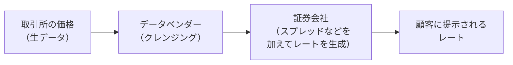
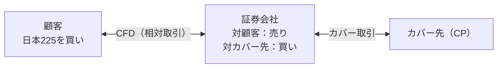
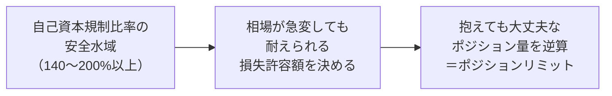

# CFDノート：価格とリスク管理（レート生成・カバー・ポジションリミット）

🇬🇧 [English version](./cfd-pricing-and-cover.en.md)

[← CFDノートの目次に戻る](./cfd.md)

このファイルでは、顧客に提示するレートがどう作られるか、顧客との取
引で抱えたリスクをどう処理・管理するか（カバーディール、ポジション
リミット）を扱う。

---

## レートはどう生成されるか

CFDのレートは、参照している先物や現物の取引所価格をもとに、証券会社
が独自に生成している。ただし、その参照価格をそのまま顧客に提示して
いるわけではない。

また、CFDのレートは1本の値段ではなく、顧客から見た買値（Ask）と売値
（Bid）の2本値で提示される。この2本値の差がスプレッドであり、実質的
なコストになる。

2本値であること自体は、店頭取引に特有のものではない。

| | 取引所の板 | 店頭CFD |
|---|---|---|
| 2本の値段 | 「買いたい人の最も高い値段（買い気配）」と「売りたい人の最も安い値段（売り気配）」の2本が並んでいる | 2本の値段を証券会社自身が提示する |
| 2本の差（スプレッド） | ― | 実質的な手数料として証券会社の収益になる |

##### 参照している先物・現物とレートの関係

CFDのレートは、参照先（先物または現物）の取引所価格と連動して動く。
ただし、乗り換え（ロールオーバー）が発生する商品の場合、「今どの限
月を参照しているか」がレートに直接影響するため、参照限月の管理が特
に重要になる。

##### 具体例：日本225やWTI原油のレートは実際どこから来ているか

取引所のデータは、そのままでは扱いにくい生データのため、大手データ
ベンダー各社がティックデータや1分足データに整理（クレンジング）した
形で提供していることが多い。CFDを提供する証券会社は、このデータベン
ダーからリアルタイムデータを受信し、そこにスプレッドなどを加味した
加工を行って、顧客向けのレートを生成している。

**データベンダーを使う理由**

| | 取引所から直接データを取得する | データベンダーと契約する |
|---|---|---|
| 接続・契約 | 技術的には可能だが、取引所ごとに接続・契約を結ぶ必要がある | まとめて契約できる |
| 開発コスト | たとえば数十種類の商品を取り扱う場合、CME・ICE・NYSEなど個別の取引所すべてと連携する必要があり、コストがかかる | 契約もシステム開発も効率的になる |

また、データベンダーを複数契約しているのは、1社に障害が起きても顧客
向けレートを止めずに済むようにするためである（詳細は次項）。

##### 自分（オペレーション）は、レート生成・配信のどこを監視しているか

オペレーションは、レートが「止まらないこと」と「市場実勢からズレて
いないこと」の両方を常時監視している。

- **フェイルオーバーの判断**
  - メインのデータベンダーで障害が起き、顧客向けレートに異常が出た
    （または生成されなくなった）場合、まず顧客を最優先に考え、サブ
    のデータベンダーへの切り替えを行う。
  - 切り替えの判断時には、自社がレート生成に使っていない別のベンダー
    などを使って市場実勢とサブのベンダーのレートを比較し、大きな差
    異がないかを確認したうえで切り替える。
  - 障害の原因調査は後回しにし、まず顧客対応を優先する。
- **スプレッドの厚みの管理**
  - スプレッドの幅は、商品ごとのリスクやコストに応じて証券会社側が
    設定している。
- **異常レートの配信停止（異常レート判定）**
  - 市場価格が急に跳ね上がる（または落ちる）といった異常な値動きを
    検知した際に、正しくないレートで顧客の注文が約定してしまわない
    よう、システムが自動的に顧客へのレート配信を一旦止める仕組みで
    ある。業者によって「異常レート判定」「レートフィルター」などと
    呼ばれる。
  - 値動きそのものが実際の市場の動き（重要な経済指標の発表など）に
    よる場合もあれば、データの不具合による場合もあり、その場では区
    別できない。そのため、いったん配信を止めて市場実勢を確認し、問
    題がなければ配信を再開する、という手順になる。
- **ポストトレードでの監視**
  - 配信停止の発生状況（頻度、どの要因が多いか）は、ミドル・バック
    オフィス側の重要な監視対象になっている。
  - 発生率が急に増えたり、不自然な頻発が見られる場合は、システムの
    不具合や設定ミスのサインになりうるため、注文履歴やログを確認し、
    顧客に不当な不利益が出ていないかを確認する業務がある。

**配信停止が発生する典型的な要因**

| 要因 | 内容 |
|---|---|
| レイテンシ（通信の遅延）による価格の陳腐化 | ネットワークの遅延などで、社内の最新レートとの間にズレが生じ、あらかじめ決めた許容範囲を超えた場合 |
| 急激なボラティリティ | 重要な経済指標の発表時など、市場価格が急変し、一時的に価格の信頼性が保てなくなる場合 |
| 異常値（スパイク）の検知 | 配信元のデータそのものにバグや異常な値が含まれていて、それをシステムが検知した場合 |

なお、顧客向けに生成しているレート（データベンダーの価格がもと）と、
カバー取引の際にカバー先（CP）が提示するレートは別物である。そのた
め、カバー先側の約定拒否（ラストルックなど）は、このレート生成の話
とは別の論点になる。とはいえ、カバー側でエラーが起きている状況は、
市場やデータの異常のサインであることもあるため、レート生成の監視に
おいても重要な視点として意識している（詳細は「カバーディールの考え
方」の項目で扱う）。

##### 3年前の自分がつまずきそうな点

ここでは特に混同しやすい2点を、少し詳しく補足しておく。

**①「レートは取引所の価格そのもの」だと思ってしまう**

- CFDの画面に表示されているレートを見ると、まるで取引所の価格がその
  まま流れてきているように見える。しかし実際には、取引所の価格→デー
  タベンダーがクレンジングした価格→証券会社が独自にスプレッドなど
  を加えて生成した価格、という3段階の加工を経て、初めて顧客に提示さ
  れる（上の「具体例」の図を参照）。
- つまり、CFDのレートは「取引所の値段のコピー」ではなく、「取引所の
  値段を土台にして、証券会社が作り上げた別の値段」である。参照先と
  完全に一致しないのは異常なことではなく、そもそもの仕組み上、当然
  のことである。

**②「レート生成」と「カバー（ヘッジ）」を同じ話だと思ってしまう**

| | レート生成 | カバー（ヘッジ） |
|---|---|---|
| 何の話か | 顧客に何の値段を見せるか | 証券会社が自社のリスクを外部でヘッジするために、顧客の注文をカバー先（CP）にどう流すか |
| 使うレート | データベンダーの価格がもと | カバー先が提示するレート |

この2つは連動しているように見えるが、実際は別の業務・別のプロセスで
ある。たとえば、顧客向けのレート自体は正常に生成・配信できていても、
カバー先への発注が約定拒否（ラストルックなど）される、という状況は
別々に起こりうる。「レートが正しく出ている＝カバーも正しく取れてい
る」とは限らない、という点を最初のうちは混同しやすい。この違いは、
次の「カバーディールの考え方」の項目でさらに詳しく扱う。

---

## カバーディールの考え方

カバーディールとは、顧客との取引で証券会社が抱えたポジションと反対
方向の（＝顧客と同じ方向の）ポジションを、証券会社の外部（カバー先
／CP）に持つことである。

証券会社は、顧客にCFDなどの取引を提供する過程で、顧客の注文の反対側
のポジションを自社で抱えることになる。たとえば顧客がロング（買い）
で取引すれば、証券会社側はその反対のショート（売り）のポジションを
持つ形になる。これは「市場リスク（保有しているポジションの価格が変
動することで損失が出るリスク）」を抱えている状態である。

証券会社がこの市場リスクを過大に抱えたままにしておくと、相場が大き
く動いた際に自社の財務状況を悪化させる恐れがある。そのため、抱えた
ポジションを外部のカバー先（CP）に流してリスクを整理する。この一連
の取引を「カバー取引」あるいは「カバーディール」と呼ぶ。

**相対取引から生まれる3層構造**

CFDは証券会社と顧客の相対取引（あいたいとりひき）＝取引所を介さない
一対一の契約である。この相対取引という性質から、次の3層構造が生まれ
る。

例：顧客がCFDで日本225を「買い」でエントリーした場合

| 層 | ポジション | 内容 |
|---|---|---|
| 1. 顧客ポジション | 買い | 対象商品（日本225）を「買い」 |
| 2. 証券会社の対顧客ポジション（CFD） | 売り | 相対取引のため、証券会社は顧客の取引相手として、自動的に反対の「売り」ポジションを抱える |
| 3. 証券会社のヘッジポジション（カバー） | 買い | 証券会社が抱えた「売り」による価格変動リスクを打ち消すために、外部のカバー先（CP）で原資産や先物を「買い」で保有する |

結果として、証券会社が外部でヘッジのために持つポジション（買い）は、
顧客が最初に持ったポジション（買い）と同じ方向になる。証券会社は
「顧客に対する売り」と「市場での買い」を組み合わせることで、カバー
した分については、相場がどう動いても自社の損益が相殺される状態（デ
ルタニュートラル）を作り出している。

**デルタリスクとデルタヘッジ**

保有しているポジションが、原資産の価格変動によって損益が生じるリス
クのことを「デルタリスク」と呼ぶ。デルタとは「原資産価格が1動いたと
きに、自分が持っているポジションの価値がどれだけ動くか」を示す感応
度である。

| ポジション | デルタ | 原資産が100円上がると | 原資産が100円下がると |
|---|---|---|---|
| 現物・先物の買いポジション（ロング） | +1 | ポジションの価値は100円増える | 100円減る |
| 現物・先物の売りポジション（ショート） | -1 | ポジションの価値は100円減る（＝上がると損失） | 100円増える |

デルタリスクを抱えている状態とは、保有ポジションの合計デルタがプラ
スまたはマイナスに傾いており、「相場がどちらか一方に動いたときに損
をする状態（＝方向性のリスクを負っている状態）」を指す。

証券会社が抱えるデルタリスクの例：

1. 顧客が日本225のCFDを一単位「買い（+1）」でエントリーすると、取引
   相手となる証券会社は、自動的に日経225を一単位「売り（-1）」で抱
   える。証券会社は「マイナス1のデルタ」を抱え込む。
2. このまま日経平均が暴騰すれば、証券会社が抱える売りポジションの損
   失は青天井で膨らんでいく。これが「デルタリスクがオープン（無防備）
   になっている状態」である。
3. 自社の「マイナス1」のデルタを打ち消すために、証券会社は外部のカ
   バー先（CP）で日経225先物（または日経平均に連動するETFなど）を
   「一単位買い」する。外部のカバー先での買いポジションが「プラス」
   のデルタを生み出す。

> 顧客に対する売り（-1）＋ カバー先での買い（+1）＝ 合計デルタ0

保有ポジションの合計デルタがゼロになった状態を「デルタ・ニュートラ
ル」と呼ぶ。

金融機関のビジネスモデルは、顧客から受け取る手数料やスプレッドで稼
ぐことが基本であり、相場の上下を当てることではない。そのため、抱え
込んだデルタリスクを減らす作業（デルタヘッジ）を行う。ただし、後述
のポジションリミットの範囲内では、リスクをあえてカバーせずに持って
おく運用もあり、すべてのデルタリスクを常にゼロにしているわけではな
い。

なお、ここでは分かりやすさのために「CFD一単位」と「カバー先での一単
位」を同じ大きさとして説明したが、実際には両者の取引単位は一致しな
いことが多い。たとえばWTI原油先物は取引所では1枚＝1,000バレルで取引
されるが、CFDでは業者がそれより小さな取引単位を設定していることがあ
る。その場合、カバー取引の際には「CFD何枚分で先物1枚に相当するか」
を換算したうえで、カバー先での数量を決める必要がある。

##### 具体例：顧客がロングでポジションを持ったとき、会社側は何をしているか

WTI原油CFDで、顧客が新規にロング（買い）注文を入れたとする。

1. CFDは証券会社と顧客の相対取引（あいたいとりひき）のため、顧客が
   ロングを持つと、その反対側で証券会社は自動的にショート（売り）の
   ポジションを持つことになる。
2. このままでは、証券会社は原油価格が上がれば損失が出るショートポジ
   ションを抱えたままになる。
3. そこで、証券会社はカバー先（CP）に対して同じ商品の買い注文を入れ、
   カバー先でロングポジションを持つ。これにより、顧客との取引で生じ
   たショートのリスクを、カバー先での反対方向の取引によって打ち消す
   （ヘッジする）ことができる。

つまり、顧客との取引でできたポジションと、カバー先との取引でできた
ポジションは、方向が逆になる（顧客がロング→自社は顧客に対してショー
ト→カバー先に対してロング）。この一連の流れがカバーディールの実態
である。

##### 自分（オペレーション）は、カバー取引の確認・実行でどんな作業をしているか

オペレーションがカバー取引で行っている作業は、大きく分けて次の6つに
なる。

| 作業 | 概要 |
|---|---|
| 取引流動性リスクの確認 | カバー取引が円滑に行えないリスクがないかを定期的に確認する |
| カバー先（CP）の与信管理 | カバー先の信用力を継続的に管理する |
| カバーのタイミングと自動化 | 手動なら流動性の高い時間帯に、自動ならポジションリミットで発動させる |
| 日々の確認業務 | 約定・リコンサイル・自社ポジション・カバー先の上限などを常時確認する |
| カバー乗り換え | 限月のある商品で、カバー先のポジションも期近から期先へ乗り換える |
| 停止判断の考え方 | 問題が起きている場所と影響範囲を切り分けて、何を止めるかを判断する |

**取引流動性リスクの確認**

カバー取引が円滑に行えないリスク（取引流動性リスク）がないか、定期
的に確認する。具体的には、カバー先企業の格付け確認（信用力に問題が
ないか）に加え、カバー取引が速やかに行われなかった事態を記録・分析
する。主な原因は次の4パターンである。

- システム障害（自社・カバー先・取引所いずれか）によるカバーの拒否
- 取引所のストップ高・ストップ安（値幅制限いっぱいまで価格が動き、
  取引が成立しにくくなる状態）によるカバーの拒否
- カバー先の証拠金不足・建玉（たてぎょく、保有しているポジションの
  数量）上限超過・追加証拠金の発生によるカバーの拒否
- コーポレートアクション（株式分割・併合・スピンオフなど）による持
  ち越し

**カバー先（CP）の与信管理（よしんかんり）**

カバー先の信用力そのものも継続的に管理する。見ている指標には、次の
ようなものがある。

| 指標 | 内容 |
|---|---|
| 格付け | 格付け機関による評価 |
| CDSスプレッド | CDS（クレジット・デフォルト・スワップ）は、その会社が破綻した場合に保険金が下りる保険のような金融商品。その保険料率がCDSスプレッドで、高いほど信用不安のサインとされる |
| 建玉の集中 | 建玉が特定のカバー先に集中していないか |
| G-SIFIsへの該当 | G-SIFIs（Global Systemically Important Financial Institutions／システム上重要なグローバル金融機関。経営危機時に世界の金融システムへの影響が大きいため特別な監督対象となる金融機関）に該当するかどうか |

**カバーのタイミングと自動化**

| | 手動でカバーする場合 | 自動でカバーする場合 |
|---|---|---|
| タイミング | 流動性が高い（一番取引が活発な）時間帯を狙って実施するほうが効率がよい。流動性が薄い時間帯にカバーすると、価格への影響やコストが大きくなりやすいためである | あらかじめ「ポジションリミット（これを超えたら自動でカバー取引が行われる保有量の上限）」を設定しておく |
| 補足 | ― | このリミットの設定方法は証券会社や商品ごとに細かく決められており、「会社としてどれだけのリスク（ポジション）を抱えられるか」という経営判断そのものにつながっている（リミットの設定と収益性の関係は「ポジションリミットとカバー戦略」の項目で扱う） |

**日々の確認業務**

約定内容の確認、リコンサイル（帳簿と実際の残高の突合）、自社ポジショ
ンのチェック、カバー先の証拠金維持率や取引上限を超えていないかの確
認などを常時行う。

**カバー乗り換え**

限月のある商品（無期限ではない商品）は、CFD自体の乗り換えだけでなく、
カバー先のポジションも期近から期先へ乗り換える必要がある。あわせて、
カバー先の参照そのものも切り替える。

**停止判断の考え方**

カバー取引やレート配信に問題が生じた場合は、問題が起きている場所
（カバー先・自社・参照元の取引所）と影響の範囲を切り分けたうえで、
何を止めるかを判断する（詳細は後述の「自分（オペレーション）は、リ
ミット運用・停止判断でどんな作業をしているか」で扱う）。

##### 3年前の自分がつまずきそうな点

カバー取引を最初に聞いたとき、「なぜわざわざ反対方向の取引をするの
か」という意図が分かりにくいかもしれない。

- ポイントは、証券会社は顧客と取引した瞬間に、望んでいないのに市場
  リスクを抱えてしまう、という点である。顧客がロングを持てば自社は
  ショートを持ち、その価格変動によって損益が発生する。
- カバー取引は、この「望んでいないリスク」を外部のカバー先に流すこ
  とで、自社のポジションを許容できる範囲に抑える行為である。
- 「儲けるための取引」ではなく、「持ちすぎたリスクを減らすための取
  引」だという点を最初に押さえておくと理解しやすい。

また、次のような誤解もしやすいので、あわせて整理しておく。

- **「カバーがうまくいかない」＝一括りの現象だと思ってしまう**
  - 実際には、性質の異なる3種類の原因がある（下表）。「カバーが失敗
    した」で片付けず、どの種類かを切り分けて考える習慣が実務では重
    要になる。
- **「顧客の損失＝会社の利益」だと思ってしまう**
  - カバー取引をしている分については、顧客との取引で生じたリスクは
    外部に流されているため、顧客の勝ち負けがそのまま自社の損益に直
    結するわけではない。
  - ただし、ポジションリミットの範囲内でカバーしていない分は、顧客
    の損益の反対側がそのまま自社の損益になる。
- **「カバー先＝取引所」だと思ってしまう**
  - カバー先はあくまでCP（カバー取引の相手方として契約している金融
    機関）であり、CFDが参照している取引所そのものと直接つながってい
    るわけではない。
- **「すべての注文を1件ずつ個別にカバーしている」と思ってしまう**
  - 実際には、リミットの範囲内でポジションをある程度まとめて保有し、
    条件を満たした時点でカバーする、というやり方もある。
  - その理由の1つとして考えられるのが、取引単位の違いである。カバー
    先の先物は1枚未満では取引できないため、CFDの小さな取引単位での
    注文を1件ずつ先物に置き換えることは難しく、先物1枚分に相当する
    量がたまってからカバーすることが多い。
- **「カバー先の約定拒否」と「自社側の異常レートの配信停止」を同じ
  ものだと思ってしまう**
  - 両者は発生する場所も目的も異なる、別々の話である（下表）。

**カバーがうまくいかない原因の3種類**

| 種類 | 例 |
|---|---|
| システムや接続の問題 | 自社・カバー先・取引所いずれかの障害 |
| 市場そのものの問題 | 値幅制限、流動性の枯渇など |
| カバー先側の事情 | 証拠金不足、建玉上限への抵触など |

**カバー先の約定拒否と、異常レートの配信停止の違い**

| | カバー先の約定拒否（ラストルックなど） | 異常レートの配信停止 |
|---|---|---|
| どこで起きるか | カバー取引を申し込んだ相手（CP）側 | 自社側 |
| 何が起きるか | CP側がカバー取引を拒否する | 自社が顧客に配信するレートを、異常値を検知した際に一時的に止める |

---

## ポジションリミットとカバー戦略（自己資本規制・市場リスク管理の観点）

自己資本規制比率とは、予期せぬ損失や価格変動が起きた際に、金融商品
取引業者（証券会社やFX/CFD業者）が自力で耐えられる財務上の体力（資
金的ゆとり）を示す指標である。事業者が抱えている潜在的な危険度（リ
スク）に対して、すぐに使える自己資金がどれくらいあるかを割合で表す。

$$\text{自己資本規制比率} = \frac{\text{固定化されていない自己資本}}{\text{リスク相当額}} \times 100$$

| 項目 | 内容 |
|---|---|
| 固定化されていない自己資本（分子） | 自己資本から固定資産などを差し引いた、すぐに現金化・リスク対応に充てられる手元資金 |
| リスク相当額（分母） | 事業運営で発生し得るリスクを金額に換算した合計額で、府令上は次の3種類からなる |

| リスク相当額の種類 | 内容 |
|---|---|
| 市場リスク | 保有ポジション（株式・コモディティ等）の価格変動に伴う損失リスク（FXの市場リスクは、FXノートで別途扱う予定） |
| 取引先リスク | 取引相手（カバー先（CP）や顧客）の破綻・デフォルトによる損失リスク |
| 基礎的リスク | システム障害や事務処理エラー、法的トラブルなど、日常の業務に伴って発生しうる損失リスク |

金融商品取引法上、第一種金融商品取引業者（証券会社やFX/CFD業者など）
は自己資本規制比率を常時120%以上に維持する法令上の義務がある（同法
46条の6第2項）。規制上の措置は段階的に定められている（数値はいずれ
も執筆時点のもの）。

| 自己資本規制比率 | 規制上の措置 |
|---|---|
| 140%を下回る | 金融庁への届出が必要になる |
| 120%を下回る | 金融庁が業務の方法の変更や財産の供託などを命じることができる |
| 100%を下回る | 3ヶ月以内の期間を定めて業務の全部または一部の停止を命じられることがある |

一般的な証券・FX/CFD事業者では、市場の急変や顧客ポジションの急増に
備え、日常的に140〜200%以上の安全水準（ポジションリミットやカバーデ
ィール運用による調整）を維持するよう管理されている。

##### 市場リスクはどう計算されるか

市場リスクとは、保有ポジションの評価替えにより損をするリスクである。
法令上、金融商品取引業者がポジションを保有する場合、その数量の一定
割合が「市場リスク」として算定され、自己資本規制比率の分母（リスク
相当額）を増やす要因になる。計算方法は、株式とコモディティで異なる
（掛け目（%）は執筆時点のもの）。

**株式の場合**

- 保有ポジションの「ネット金額×8%（一般リスク）」＋「グロス金額×
  8%（個別リスク）」が市場リスクとなる。
- ネット金額は国別にネット可能である（例：米国30の買いと米国S&P500
  の売りはネット可能。日本225の買いと米国30の売りはネット不可）。
- グロス金額については、「指定国の主要な株価指数（日経225・S&P500・
  DAX、FTSEなど）」は免除される。また、コモディティとは異なり「対CP
  と対顧客のグロス」ではなく、あくまで未カバー分のみが対象になる点
  に注意する。
- 外貨建ての銘柄の場合、これとは別に外国為替としてのリスク（保有ポ
  ジション×8%）を計上する。

具体例：日本225のCFDで、証券会社が1,000万円分のロングのみを保有して
いる場合

| 項目 | 計算 |
|---|---|
| ネット分 | 1,000万円 × 8% ＝ 80万円 |
| グロス分 | 日経225は「指定国の主要な株価指数」に該当するため、通常であれば別途かかるグロス分の8%は免除される |
| 市場リスク | 80万円 |

**コモディティの場合**

- 金：保有ポジションの「ネット金額×8%」が市場リスクとなる。法令上
  は外国為替リスクに分類される（金の市場リスク＝金の未カバーポジショ
  ンの円貨額の絶対値×8%）。
- 金以外：「保有ポジションのネット金額×15%」＋「各銘柄のグロスポジ
  ション円貨額×3%の合計」が市場リスクとなる。このグロスポジション
  は「対CPと対顧客のすべてのポジション」を指し、売買の方向に関係な
  く各ポジションの絶対値を合計する。
- ネット金額は、異なる銘柄の場合は相殺できない（例：原油の買いとコー
  ンの売りは相殺不可）。ネット分の商品リスク合計＝各銘柄のネットポ
  ジションの絶対値×15%の合計（これにグロス分の3%が加わる）。
- 外貨建て銘柄の場合、これとは別に外国為替としてのリスク（保有ポジ
  ション×8%）を計上する。

具体例：WTI原油（金以外のコモディティ）を500万円分ロングのみ保有し
ている場合（ネット金額は500万円、グロスポジションも同じく500万円）

| 項目 | 計算 |
|---|---|
| ネット分 | 500万円 × 15% ＝ 75万円 |
| グロス分 | 500万円 × 3% ＝ 15万円 |
| 市場リスク（合計） | 90万円 |
| （別途）外国為替としてのリスク | WTI原油は米ドル建てのため、500万円 × 8% ＝ 40万円も計上する |

なお、FX（為替）の市場リスク計算は、FXノートで別途扱う予定である。

##### ポジションリミットとは何か、なぜ設定するのか

ポジションリミットとは、カバーせずに保有できるポジション量（売買そ
れぞれ）の上限値のことである。自動カバーの仕組みでは、主に次のよう
な値を決めておく（呼び方は業者によって異なる）。

| 値 | 内容 |
|---|---|
| ポジションリミット | 保有量がこの値を超えたら、カバー取引が行われる |
| カバー後の目標水準 | カバー取引は、取引後の保有量がこの値とポジションリミットの間に収まるように行われる |
| 1回あたりのカバー数量の上限 | 大きな量を一度にカバーするとマーケットインパクト（自社の注文で価格が動いてしまうこと）が大きくなるため、1回に出すカバー注文の量に上限を設け、必要に応じて分割して発注する |
| 手動カバーの目安数量 | カバー取引を手動で行う際の目安となる数量（原資産単位） |

具体例（数字は説明用の仮のもの）：ポジションリミットを100枚、1回あ
たりのカバー数量の上限を50枚とする。顧客の取引が積み上がって保有量
が100枚を超え、カバーが発動した時点で200枚になっていた場合、超過分
の100枚を、50枚ずつ2回に分けてカバーする。

**ポジションリミットの決め方**

ポジションリミットは、想定される損失許容額から逆算して決める。

前段で説明したとおり、自己資本規制比率は140〜200%以上の安全水域を保
つよう日常的に管理されている。相場が急変した場合にどこまでの損失な
ら耐えられるか（＝自己資本規制比率をどこまで下げても安全水域を割ら
ないか）を先に決め、そこから「このポジション量までなら抱えても大丈
夫」という上限を逆算する。これがポジションリミットの正体である。

リミットを決める際は、次の2つの数値を定める必要がある。

- 全銘柄合計での上限値
- 銘柄ごとのリミット数量

##### リミットの大小と、収益性・リスクのバランスはどう考えるか

リミットの大きさは、前段で決めた「損失許容額から逆算した上限」の範
囲内で、収益性とリスクのバランスをどう取るかという判断にそのままつ
ながっている。

**リミットとカバー率・コストの関係**

| | リミットが小さい | リミットが大きい |
|---|---|---|
| カバー率 | 高い（リミット0＝カバー率100%） | 低い |
| カバーコスト | かさむ | 抑えられる（カバー取引には一定のコストが必要なため） |
| 自社の保有ポジション量 | 小さい | 大きい（相場変動による収益への影響が大きくなる） |
| 収益の期待値 | 伸びにくい | 高くなりやすい |
| 収益のブレ幅 | 抑えられる | 大きくなる |

- リミットとカバー率は、「リミット0（＝カバー率100%）＞リミット小＞
  リミット中＞リミット大」という傾向がある。
- 業者の収益の柱はスプレッドであり、抱えたポジションは相場の動きに
  よって損益がぶれる。特に、顧客の取引が相場の方向と一致していると
  きは、損失になりやすい。
- そのため、「リミットは大きいほどいい」というものではなく、収益性
  とリスクのバランスをとることが重要になる。どの大きさが適している
  かは、相場状況や顧客の取引動向によって変わる（次項）。

**相場状況も踏まえた収益性の傾向**

ここでいう「順張り（じゅんばり）」とは、相場が動いている方向につい
ていく取引（上がっているときに買う、下がっているときに売る）のこと
で、「逆張り（ぎゃくばり）」とは、その逆に相場の反転を見込んで取引
すること（上がっているときに売る、下がっているときに買う）を指す。
相場環境（＝値動きの状況と顧客の取引動向）により、リミットと収益性
には次のような傾向がある。

| 相場 | 顧客取引 | リミットと収益性の傾向 |
|---|---|---|
| パターン性がない（または顧客取引がランダム） | ― | 収益率は割と安定的に推移するが、高望みもしづらい状況。最適なリミット値は顧客の取引量に比例して決まる場合が多い |
| 一方向に動く | 逆張り | リミットが大きければ大きいほど、収益率の期待値が上がる（かつブレ幅もさほど出ない）傾向が高い。顧客取引によってもたらされるポジションがいい意味で順張りになるケースが多い |
| 一方向に動く | 順張り | リミットが大きいと収益の期待値が下がる傾向が高い。相場の値動きのスピードが緩い場合、リミットを下げることで収益率をある程度回復できる。相場の値動きのスピードが速い場合、（カバー先のスプレッドが広がることで）リミットを下げても収益率が芳しくないことが多い |
| ギザギザ動く | 逆張り | リミットの大小にかかわらず、自社の収益率は芳しくないことが多い。顧客取引によってもたらされるポジションが「底値売り、天井買い」となるケースが多い。だからといって、リミットを下げると、カバー取引の回数が増える。自社の取引がマーケットインパクトを与えてカバー先のレートが不利になることもあるため、往々にして逆効果となる |

具体例（相場が一方向に動き、顧客取引が逆張りの場合）：WTI原油が1バ
レル70ドルから80ドルまで一方向に上昇し続けているとする。

- この間、顧客が「そろそろ下がるはず」とショート（逆張り）で入り続
  けると、証券会社側はその反対のロングを積み増していく形になる。
- リミットを大きく設定してカバー率を抑えておけば、証券会社は原油上
  昇にともなうロングポジションの評価益をそのまま多く抱えられる。
- 逆にリミットを小さくしてこまめにカバーしてしまうと、上昇の途中で
  保有ポジションをカバー先に流してしまうため、その後の上昇分の利益
  を取り逃すことになる。

##### 自分（オペレーション）は、リミット運用・停止判断でどんな作業をしているか

自分（オペレーション）がリミット運用・停止判断で行っている作業は、
大きく2つある。

**停止判断（詳細）**

特定のカバー先で問題が生じた場合は、次の3パターンに分けて対応を判断
する。ここでの「プライス」は、カバー先が提示するカバー用のレート
（の受信・利用）を指す。

| パターン | 事例 |
|---|---|
| カバー・プライスとも止める（そのカバー先との接続を切る） | カバー先からのレート配信に遅延が発生している／カバー先のシステム障害で、レートが出ない、または正常でない／自社側の要因でカバー先に接続できない、または自社システムの異常への対応としてカバー先との接続を切る必要がある |
| カバーのみ止める | 特定のカバー先との間で、約定内容の不一致（アンマッチ）が大量に発生している／カバー先（またはその先のプライムブローカー）のネットオープンポジション（NOP、通貨や商品ごとの持ち高の合計）が上限に達しそうである／カバー先のレートは正常に届いているのに、カバー取引が約定しない |
| プライスのみ止める | 一部のカバー先の仲値（MID）が、他のカバー先や市場実勢から片側にずれている場合（スプレッドが片側だけ広がる、レートが出たり出なかったりする、など）。カバー先が複数あれば、そのカバー先のレートの利用だけを止め、残りのカバー先で対応できる |

なお、多数のカバー先で同時にアンマッチが発生している場合は、個別の
カバー先ではなく照合の仕組みの側の問題である可能性が高く、「カバー
のみ止める」のパターンには当たらない。

**参照元の取引所で問題が起きた場合の対応（「カバー取引できない」
「レートが動かない」など）**

- まず、参照元の取引所でトラブルが起きていないかを確認する。参照元
  の取引所が売買停止中であれば、CFDのレート配信を止める。
- 複数の取引所の価格を参照できる銘柄については、参照先を切り替えら
  れるように設定しておくことで対応できる場合もある。
- 取引所ではなくカバー先のブローカー側の問題（システム障害、貸株が
  確保できない、など）でカバーできない場合は、前述の停止判断や、
  [「貸株とショートの規制」](./cfd-basics.md)で扱う対応になる。

なぜ止めるかというと、次の2つの恐れがあるためである。

- カバー取引が不可能な状況で顧客の取引を許容すると、自社が無限に市
  場リスクを抱えてしまう恐れがある。
- 参照元の価格が市場実勢を反映しているか疑わしい状況で放置すると、
  誤ったレートを顧客に配信してしまう恐れもある。

取引を止める具体的な場面には、次のようなものがある。

- 個別株CFDにおいて、取引所または証券会社側の空売り規制が発動した場
  合（新規売りのみ対象）
- 参照元の取引所の急な臨時休業で、取引時間の変更が間に合わない場合
- 参照元の取引所でシステム障害やサーキットブレーカーが発生している
  場合
- 自社の重篤なシステム障害で、レートを配信し続けられる状況ではない
  場合
- システム障害でEOD（End of Day、日次のクローズ処理）が終了していな
  い場合（そのまま翌日の取引を開始するとシステム障害が複雑化するた
  め、CFDでは手動で取引を停止する必要がある）
- 重篤な天災・テロ・戦争などの究極的な事態により、市場の流動性が枯
  渇している場合

##### 3年前の自分がつまずきそうな点

自己資本規制比率やリミットの仕組みを最初に聞いたとき、次のような誤
解をしやすいので、あわせて整理しておく。

- **「市場リスク」を、実際の評価損益（今どれだけ儲かっている、また
  は損しているか）と同じものだと思ってしまう**
  - 実際には、市場リスクは規制上の算定額——潜在的にどこまで損する
    可能性があるかの見積もり——であり、現在の実際の損益とは別物で
    ある。
- **「ポジションリミットに達したら、顧客の新規注文自体が止まる」と
  思ってしまう**
  - 実際にはポジションリミットの定義の通り、リミットを超えた時点で
    発生するのは「カバー取引」であって、顧客の取引そのものを止める
    仕組みではない。
- **「リミットは小さいほど常に安全で良い」と思ってしまう**
  - 相場状況によっては小さすぎるリミットがむしろ収益機会を逃す、あ
    るいはパフォーマンスを損なう場合がある。「小さい＝安全」と単純
    に結びつけがちだが、実際はトレードオフがある。
