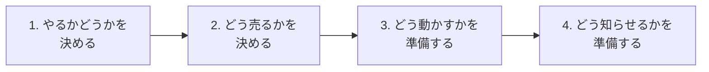
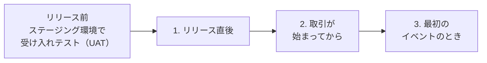

# CFDノート：銘柄追加の実務

🇬🇧 [English version](./cfd-product-listing.en.md)

[← CFDノートの目次に戻る](./cfd.md)

このファイルでは、CFDで新しい銘柄を取り扱い始めるときに、どんな検討
や準備をしているかを扱う。

---

## CFD銘柄追加の実務（新しい銘柄を取り扱い始めるときの流れ）

CFDノートのほかのファイルでは、CFDのしくみ（参照先・乗り換え・調整
金・カバーなど）を説明してきた。この項目では、それらを前提に、CFDで
新しい銘柄を取り扱い始めるときに、どんな検討や準備をしているかを整
理する。

##### 銘柄追加の全体の流れを一言でいうと？

銘柄追加は、大きく「やるかどうかを決める」→「どう売るかを決める」
→「どう動かすかを準備する」→「どう知らせるかを準備する」という4つ
の段階で進む。

| 段階 | 工程 | 何を決める・確認するか |
|---|---|---|
| 1. やるかどうかを決める | 商品性の検討 | 顧客にとって魅力的な商品か、ニーズがあるか、マーケティングに使えるか（売り出せるか）、取り扱うに値する取引量（ボリューム）が見込めるか |
| | 費用対効果の確認 | データの使用料（データライセンス料）などの費用に見合うか。定期的に手間がかかる商品なら、その手間に見合う収益が見込めるか。データベンダーに、取り扱いの可否や費用を確認する |
| 2. どう売るかを決める | 参照先の取引所と営業時間 | どこの取引所を参照し、何時から何時まで取引できるようにするか |
| | スプレッド | リスクと収益を考えたうえで、スプレッド（買値と売値の差）をどのくらいに設定する必要があるか |
| | 取引ルール | 特別な取引ルールが必要か。取引上限（1注文あたり・1日あたり・建玉の量）などの設定 |
| 3. どう動かすかを準備する | データの連携 | データベンダーと連携し、価格データを自社のシステムに通す準備を始める。エンジニアとの連携も必要になる |
| | 市場リスクの掛け目 | 銘柄ごとに、法令上の市場リスクの計算でどの区分に入るか（区分ごとに掛け目が法令で決まっている）を確認し、あわせて社内のリスク管理で使う設定（社内の掛け目やポジションリミットなど）を決める（詳細は[「ポジションリミットとカバー戦略」](./cfd-pricing-and-cover.md)を参照）。システムに設定する情報なので、財務の部署にも確認する |
| | プライシングのパラメータとカバーの設定 | プライシング（価格づけ）のためのパラメータ（スプレッドの決め方や、異常なレートを判定する基準など。詳細は「取引ルールはどう決めるか」で扱う）を決める。あわせて、カバー先の選定と、ポジションリミット（これを超えたら自動でカバー取引が発動する保有量の上限）や、1回あたりのカバー数量の上限を決める |
| 4. どう知らせるかを準備する | 公開の準備 | 顧客向けの取引ルールの作成、コンプライアンスのチェック（広告や説明の内容が規制に沿っているかの確認）、お知らせ、チャート用の過去データの準備 |

なお、「どう動かすか」の段階では、価格データを受け取る相手（データ
ベンダー）と、カバー取引の相手（カバー先）の両方との準備が必要にな
る。両者は基本的に別の相手であり、それぞれと契約や接続を整える必要
がある（「外部の費用とデータの準備で何を確認するか」を参照）。

**この順番になっている理由**

前の工程で決まったことが、次の工程の前提になっているためである。

- 「やるかどうか」を最初に決めるのは、商品としての魅力や費用対効果
  がなければ、その先の準備がすべて無駄になるためである。
- 「どう売るか」の中では、参照先の取引所と営業時間を先に決める。ど
  の取引所の、どの時間帯を参照するかによって、流動性（取引の活発さ）
  が変わり、それがスプレッドや取引上限を決める材料になるためである。
  また、営業時間を検討した結果、そもそも銘柄を追加するかどうかの判
  断が変わることもある。
- 「どう動かすか」は、売り方（取引所・営業時間・スプレッド・取引ルー
  ル）が決まってからでないと、システムに何を設定すればよいかが決ま
  らない。
- 「どう知らせるか」は、すべてのルールが固まってから、最後に顧客向
  けに整える。

##### 対象銘柄はどう絞り込むか

新しい銘柄を扱うかどうかには、「この条件を満たせばOK、満たさなけれ
ばNG」とすぱっと判断できる絶対的な基準はない。目安になるのは、「こ
の銘柄を追加することが合理的だと主張できるストーリーを描けるか」で
ある。つまり、「なぜこの銘柄を追加すべきなのか」を、関係するそれぞ
れの相手が気にする観点から、筋道立てて説明できるかどうかが問われる。

**確認する観点**

| 観点 | 何を確認するか |
|---|---|
| ビジネスとして成立するか | 顧客にとって魅力的な商品か、ニーズがあるか。マーケティングに使えるか（売り出せるか）。取り扱うに値する取引量が見込めるか。会社として最低限必要な収益を確保できるか |
| 費用対効果 | データの使用料（データライセンス料）や、システム開発の費用に見合う収益が見込めるか。定期的に手間がかかる商品なら、その手間に見合うか |
| カバーできるか | カバー先の市場に十分な流動性（取引の活発さ）があるか。今のカバー先で取り次ぎができる市場か（新しいカバー先を追加する場合を除く） |
| 法令・規制のうえで扱えるか | 下記を参照 |
| 契約のうえで扱えるか | 取引所やデータベンダーの利用規約で、データの使い方（顧客への再配信など）が制限されていないか。株価指数の場合は、指数の算出元（日経平均なら日本経済新聞社）の利用許諾（ライセンス）が必要か |

なお、どの取引所の、どの時間帯を参照するかによって、流動性や取引量
の見込みは変わる。営業時間を検討した結果、そもそも銘柄を追加するか
どうかの判断が変わることもあるため、その可能性がある場合は、この段
階で営業時間も合わせて検討しておく。

**法令・規制の観点で確認すること**

- **取り扱える商品の範囲**
  - CFDの種類によって、根拠になる法律が違う。株価指数や個別株のCFD
    は金融商品取引法の対象になる。原油・金などの商品CFDは、商品先物
    取引法の許可がないと扱えない。
  - まず、会社としてその商品を扱う資格があるかが最初の関門になる。
- **業界団体の自主規制**
  - 扱う商品によって、ルールを定める団体が異なる。株価指数や個別株
    などのCFDは日本証券業協会、FXなど通貨関連は金融先物取引業協会、
    原油・金などの商品CFDは日本商品先物取引協会が、それぞれ自主規制
    のルールを定めている。
  - ただし、実際にどの協会の規則に従うかは、業者が加入している協会
    によって決まり、複数の協会に加入している業者も多い。
  - また、個人の顧客に提供できるレバレッジには、商品タイプごとに法
    令で上限が定められている。法令や規則は変更されることがあるため、
    新しい銘柄を追加する際は、その時点のルールを確認する必要がある。
- **顧客への説明のしやすさ**
  - 個人の顧客に提供する以上、商品のリスクをきちんと説明できるかが
    問われる（適合性の原則：顧客の知識・経験・財産の状況・取引の目
    的に照らして、ふさわしくない勧誘をしないこと／説明義務）。
  - VIXやレバレッジ型ETFのように、しくみが複雑だったり値動きが特殊
    だったりする商品は、説明資料や注意喚起を厚くする必要がある。広
    告の内容も審査を受ける。
- **扱いに注意が必要な銘柄**
  - 経済制裁の対象になっている国や企業の銘柄は扱えない。
  - また、自社や関係会社の株など、利益相反（会社と顧客の利害がぶつ
    かること）の観点から注意が必要な銘柄もある。

**ストーリーは誰に向けて描くか**

中心になるのは社内の承認だが、同じストーリーが、複数の相手への説明
を兼ねることになる。

| 相手 | その相手が気にすること |
|---|---|
| 経営・社内の承認者 | ビジネスとして成立するか（ニーズ・取引量・収益性・費用対効果） |
| リスク管理・財務 | 会社が抱える市場リスクや、自己資本への負担に耐えられるか。カバーできるだけの流動性があるか |
| コンプライアンス（法令遵守の担当部署） | 法令・自主規制のうえで扱えるか。顧客に説明できる商品か |
| 外部（カバー先・データベンダー・指数の算出元） | 取り次ぎや、データ・指数の利用・再配信が契約上できるか |

**一番引っかかりやすいのは費用対効果**

これらの観点の中で、実務で一番引っかかりやすいのは費用対効果である。
銘柄を1つ追加するだけでも、さまざまな費用や手間がかかる一方で、その
銘柄でどれだけの収益が見込めるかは、取り扱いを始めてみるまで確実に
は分からないためである。

かかる費用や手間には、次のようなものがある。

| 費用・手間 | 内容 |
|---|---|
| データの費用 | 取引所やデータベンダーに支払うデータの使用料。銘柄を追加したことで、すでに払っている費用とは別に、新たな費用が発生することがある（下記） |
| システム開発の費用 | 価格データを自社のシステムに取り込む連携や、レートを作るための設定など、エンジニアと協力して開発が必要になる |
| 継続的な手間 | 商品によっては、定期的に発生する作業がある。たとえば、先物を参照する商品の乗り換え（価格調整日の設定）、個別株・ETFの配当（権利調整額の登録）、株式分割・併合への対応などである（下記） |
| 説明・審査の手間 | しくみが複雑な商品ほど、顧客向けの説明資料の作成や、広告の審査などに手間がかかる |
| 人手の取り合い | エンジニアやオペレーションの人手には限りがある。ほかの案件と比べて優先順位を決める必要があり、「その人手を別のことに使ったら、もっと収益を上げられるのではないか」という比較（機会費用）も問われる |
| やめるときのコスト | 一度扱い始めると、簡単にはやめられない。取り扱いをやめるには、顧客への告知期間を設けたり、残っているポジションを決済してもらったりする必要がある。そのため「とりあえず始めてみて、だめならやめる」という判断がしにくく、始める前の検討が慎重になる |

- **データの費用はまとめてかかることがある**
  - 費用は銘柄ごとではなく、まとめてかかることがある。すでに扱って
    いる取引所の銘柄を1つ足すだけなら費用は小さいが、新しい取引所に
    初めてつなぐときは大きな費用がかかる。
  - そのため、1銘柄だけでは割に合わなくても、同じ取引所の複数の銘柄
    をまとめて追加すれば成り立つ、という判断になることもある。
- **レバレッジ型・インバース型のETFは、併合を繰り返すことが多い**
  - レバレッジ型は、元の指数の1日の値動きの2倍・3倍などに連動するよ
    うに作られたETFで、インバース型は、値動きと逆向きに連動するETF
    である。両方を組み合わせた「マイナス3倍」のようなものもある（例
    ：半導体株の指数のマイナス3倍に連動するSOXS）。
  - こうしたETFは、毎日倍率を保つための調整の影響で、値動きの大きい
    相場では目減りしやすく、価格が小さくなりすぎないよう併合を行う
    （例：ナスダック100指数のマイナス3倍に連動するSQQQは、1対5の併
    合を数年おきに行っている）。そのたびに対応が必要になる。

一方、収益の側には、次のような不確かさがある。

| 不確かさ | 内容 |
|---|---|
| 取引量が読めない | どれだけの顧客が、どれだけ取引するかは、始めてみるまで分からない |
| スプレッドを広く取れるとは限らない | 収益の多くはスプレッドから得るが、競合他社と比べてスプレッドを狭くしないと顧客が集まらない。取引量を増やすためにスプレッドを狭めると、1回あたりの収益は減る |
| カバーのコスト | 参照先やカバー先の市場の流動性が低いと、カバー取引のコスト（不利な価格での約定など）が大きくなり、収益を圧迫する |

つまり、最初に確実にかかる費用や手間と、始めてみるまで分からない収
益とを比べて、それでも追加する価値があると説明できるかが、ストーリー
の中で最も問われる部分になる。

##### 取引ルールはどう決めるか

取引ルールとは、顧客にどんな条件で取引してもらうかを決めたものであ
る。営業時間・呼値の単位・取引単位など、その多くは顧客向けの銘柄一
覧に載る情報になる。主に次の項目を決める。

| 項目 | 決めること |
|---|---|
| 営業時間 | どこの取引所を参照し、何時から何時まで取引できるようにするか |
| 呼値（よびね）の単位 | 配信する価格（呼値）を、どの刻み幅で出すか（例：1円刻み、0.01ドル刻み） |
| 取引単位 | 1枚あたりの数量（例：指数×10円、10バレル）、最小取引数量（最低何枚から取引できるか）、注文単位（1枚単位か0.1枚単位かといった数量の刻み） |
| 取引上限 | 1回の注文の最大数量（最大注文数量）、1日あたりの取引量、建玉（保有ポジション）の量の上限 |
| 調整金の有無 | 価格調整額・権利調整額・金利調整額のどれが発生するか |
| 価格調整日の決め方 | 先物を参照する商品の場合、いつ乗り換えるか |
| スプレッド | 顧客に提示する買値と売値の差をどのくらいにするか |
| プライシングのパラメータ | スプレッドの細かな決め方や、異常なレートから顧客を守るための基準 |

**営業時間**

参照先の取引所の営業時間と、時間帯ごとの流動性（時間別の約定の量や、
提示されている注文の量）を確認したうえで、自社の営業時間を決める。
考え方は次のとおりである。

- 参照先の取引所の営業時間からはみ出さない（ぴったり重なるのはよい）。
  参照先が閉まっている時間に取引を受け付けると、元になる価格がなく、
  カバーもできないためである。
- 流動性が極端に低い時間帯は、営業を控える。

ただし、この原則がそのまま当てはまらない商品もある。

| 商品 | 営業時間の考え方 |
|---|---|
| 日本225のように、時間帯によって参照する取引所を切り替える商品 | 1つの取引所の営業時間ではなく、切り替え先も含めて、参照できる価格がある時間帯で考える |
| 金スポットのように、取引所のない相対取引の商品 | カバー先が価格を提示し、取引に応じている時間帯が基準になる |

ここで確認した時間帯ごとの流動性は、このあと決めるスプレッドや取引
上限の材料にもなる。

**取引上限**

1注文あたり・1日あたり・建玉の量について上限を決める。新しい銘柄の
上限は、すでにある区分（似た性質の銘柄のグループ）に入れるか、新し
く区分を作るかを検討する。

**調整金の有無と、価格調整日の決め方**

- どの調整金が発生するかは、参照先によって決まる（詳細は
  [「商品タイプ別の具体例」](./cfd-product-types.md)の「それぞれの商品タイプで、乗り換えや調整金
  の扱いに違いはあるか」を参照）。
- 権利調整額が発生する銘柄の場合は、配当にかかる源泉徴収の有無を、
  事前に税務の専門家に確認しておく。
- 先物を参照する商品の場合は、価格調整日の決め方も決める。基準は
  「期近と期先の流動性がちょうど逆転しそうな日」で、株価指数はSQの
  直前、原油は取引最終日より前（何営業日前かは業者による）、穀物は
  納会よりかなり前、など商品によって異なる（詳細は同じ箇所を参照）。

**スプレッド**

- スプレッドは、競合他社のスプレッドに合わせるのがベースになる。CFD
  はFXに比べて扱っている会社が少ないため、決めるための手がかりは多
  くない。参照先の取引所の最良気配（いちばん良い売値と買値）の差や、
  すでに扱いのある競合他社のスプレッドなどを手がかりに、リスクと収
  益のバランスを考えて決める。
- また、スプレッドはいつも同じとは限らない。流動性の高い時間帯はス
  プレッドを狭くし、流動性の低い時間帯は広くする、というように、時
  間帯によって変えることも行う。経済指標の発表の前後など、相場が大
  きく動きやすい場面でも変えることがある。
- 流動性が低かったり、相場が急に動いたりする場面では、参照先の価格
  そのものが飛びやすく、カバー取引のコストも大きくなりやすいためで
  ある。

**プライシングのパラメータ**

スプレッドの大まかな水準に加えて、レートを作るための細かなパラメー
タも決める。主に次のようなものがある。

| パラメータ | 内容 |
|---|---|
| スプレッドの決め方 | 参照する価格のスプレッドに、どれだけ上乗せして顧客に提示するかを決める方法や、通常はスプレッドを一定の値に固定し、市場が荒れてスプレッドが一定の範囲を超えたら広げたうえで、落ち着いたら段階的に固定の値に戻す方法などがある |
| スプレッドの上限 | どれだけ市場が荒れても、スプレッドがこれ以上広がらないようにする上限を設ける |
| 流動性に応じたスプレッド | 配信元から受け取る価格の流動性（提示されている数量）に応じて、適用するスプレッドを決める |
| 異常なレートを判定する基準 | レートの配信やレートの生成を止める基準を決める（下記） |
| 配信元どうしの価格の乖離（かいり）の監視 | 複数の配信元から受け取る価格どうしが一定以上離れたら、警告やエラーを出す基準を決める |

異常なレートを判定する基準は、動いた幅と、その状態が続いている時間
の組み合わせで決めることが多い。具体的な値は業者ごとに異なり、一般
には公開されていない（[「レートはどう生成されるか」](./cfd-pricing-and-cover.md)の「自分（オペレーション）
は、レート生成・配信のどこを監視しているか」にある「異常レートの配
信停止」を参照）。主な場面は次のとおりである。

- 取引開始時に、前日の終値と当日の始値が大きく離れていた（窓開け）
- 直前のティック（直前に届いた価格）から、一定の幅以上動いた（一定
  時間、配信を止める）
- 一定の幅以上の変動が、一定時間以上続いた（一時的に、レートの生成
  そのものを止める）

これらのパラメータは、一度決めたら終わりではない。市場の状況（値動
きの大きさや流動性）や、競合他社のスプレッドは変わっていくため、そ
れに合わせて見直し、調整している。適切な値は市場とともに変わるため、
取引ルールの中でも、特に手間がかかり、悩みどころになりやすい部分で
ある。

##### 外部の費用とデータの準備で何を確認するか

新しい銘柄を扱うには、その銘柄の価格データを受け取る準備と、カバー
取引ができる準備が欠かせない。どちらも外部の会社とのやりとりが必要
で、費用や契約の確認から、実際に使える状態にする（開通させる）まで
に時間がかかる。

**届出・報告の確認**

- 商品の種類によっては、銘柄を追加する際に、監督官庁や自主規制団体
  への届出・報告が必要になる場合がある。
- たとえば商品CFDは、そもそも扱うために商品先物取引法にもとづく許可
  が必要であり、すでに扱っている場合でも、追加の内容によっては主務
  官庁への変更届出や、日本商品先物取引協会への報告が必要になること
  がある。
- 必要な手続きは追加する内容によって変わり、法令や規則も変更される
  ことがあるため、事前にコンプライアンスの担当部署と確認しておく。

**データの費用の確認**

- まず、取引所とデータベンダーに、データ受信の費用体系を確認する。
  ポイントは「この銘柄を追加したら、費用が増えるかどうか」である。
- 個別株の場合は、価格データとは別に、企業情報のデータについても確
  認する。
- 新たに費用が発生する場合は、社内の承認手続き（稟議）が必要になる。
- 年単位で支払っている費用とは別に、銘柄を追加した分だけ途中で請求
  されることもあるため、どの費用がいつ発生するかを把握しておく。

**データベンダーとの作業と開通**

データベンダーごとに、必要な作業が異なる。主なものは次のとおりであ
る。

- データ受信の契約を結ぶ
- データ受信の手数料を支払う
- 取引所への報告（データをどう使うかの報告など）を行う
- データ端末で、追加する銘柄の購読を申し込む

ベンダーや銘柄の区分によっては、既存の契約のままで対応でき、追加の
作業がいらない場合もある。手続きが済んだら、実際に価格データが自社
のシステムに正しく届くようにする（開通させる）。

**カバー先との契約と開通**

カバー取引ができなければ、顧客の取引で抱えたリスクを外に流せない。
そのため、新しい銘柄をカバー先で取引できるように、契約と接続を整え
る。必要な契約は、カバーの方法によって異なる。

| | 相対取引でカバーする商品（FX・貴金属スポットなど） | 取引所の先物でカバーする商品 |
|---|---|---|
| カバー先 | 銀行など | 先物の注文を取り次ぎ・清算する会社（清算ブローカー） |
| 主な契約 | 業界標準の基本契約であるISDAマスター契約（国際スワップ・デリバティブズ協会〔ISDA〕の標準書式による基本契約）や、担保のやりとりを定めたCSA（担保に関する付属契約）。新しい商品を扱う際に、カバー先との取引契約の見直しや追加が必要になることがある | 清算ブローカーとの口座契約、取引所への接続、相場データの利用の契約。注文の執行と清算を別の会社に分ける場合は、それを取り決める契約（Give-Up契約）も結ぶ |
| 担保の取り決め | 相手と1対1で取り決める | 取引所の清算機関が取引の相手方のリスクを引き受けるため、ISDAマスター契約やCSAのような1対1の担保の取り決めは必要ない |

契約が整ったら、実際にカバー取引の注文が出せて、約定が返ってくる状
態にする（開通させる）。

**特に注意が必要な理由**

この中でも、データベンダーとの作業と開通、カバー先との契約と開通は、
最も手間がかかるうえに、顧客や収益に直接影響する部分であるため、特
に注意している。

- データの開通に問題があると、正しい価格が届かず、顧客に誤ったレー
  トを配信してしまうおそれがある。
- カバー先との開通に問題があると、顧客の取引で抱えたリスクを外に流
  せず、会社が市場リスクを抱えたままになってしまう。
- どちらも外部の会社とのやりとりなので、自社だけでは進められない。
  準備が遅れると、取り扱い開始の日程そのものが遅れ、見込んでいた収
  益も後ろにずれる。

**チャート用の過去データ**

顧客が取引画面で見るチャートのために、過去の価格データを用意する。

- 始値・高値・安値・終値（四本値）の日足を数年分用意し、そこから週
  足・月足を作る。
- 1分足や30分足などの短い時間の足は、リアルタイムのレートから作るた
  め、早めにシステム側と調整しておく。
- 先物を参照する銘柄では、限月が切り替わるところで、過去データをど
  うつなぐかも決める。つなぎ方には次の3つがあり、どれを使うかは業者
  によって異なる。

| つなぎ方 | 特徴 |
|---|---|
| 調整せずにそのままつなぐ | 乗り換えの日に窓が残る |
| 期近と期先の価格差を過去データに足し引きする | 値幅は保たれるが、過去の価格が実際の値と変わり、マイナスになることもある |
| 価格の比率を過去データに掛ける | 変化率は保たれるが、値幅が実際と変わる |

作ったデータは、ダブルチェックする。主な確認のポイントは次のとおり
である。

- 日足の日付の定義（1日を何時で区切っているか）
- 計算式
- ランダムに選んだ週や月の四本値が合っているか

##### 商品タイプによって追加作業はどう変わるか

銘柄を追加するときの立ち上げ作業は、参照先によって大きく変わる。こ
こでは、銘柄を追加するときに必要になる作業を、参照先ごとに整理する
（追加したあとの日々の運用で、商品タイプによって変わる対応は
[「商品タイプ別の具体例」](./cfd-product-types.md)の「自分（オペレーション）は、商品タイプによっ
て対応が変わる場面があるか」を参照）。

**先物を参照する商品（指数・商品）**

| 作業 | 内容 |
|---|---|
| 価格調整日の原則を決め、価格調整（乗り換え）の業務に加える | 基準は「期近と期先の流動性がちょうど逆転しそうな日」で、株価指数はSQの直前、原油は取引最終日より前（何営業日前かは業者による）、コーン・大豆などの穀物は納会よりかなり前、など商品によって異なる（詳細は[「商品タイプ別の具体例」](./cfd-product-types.md)の「それぞれの商品タイプで、乗り換えや調整金の扱いに違いはあるか」を参照） |
| 限月の情報を登録する | どの限月を、いつからいつまで参照するかの情報（限月マスタ）を、新しい銘柄の分も登録する |
| 参照先の先物の決済方法を確認する | 期日に差金で清算されるもの（日経225先物など）か、現物の受け渡しがあるもの（WTI原油先物など）かを確認する（下記） |
| 取引単位の換算を設定する | CFD何枚分が先物1枚にあたるかを、カバー取引のために設定する |
| 参照する取引所の切り替えを設定する | 日本225のように、時間帯によって参照する取引所を切り替える商品は、どの時間帯にどの取引所を参照するかを設定する |

受け渡しがある商品は、カバー建玉を受け渡しの前に乗り換えておく必要
があるため、その期限を最初に決めておく。この期限は、顧客向けの価格
調整日とは別の基準で決まる。

| | 顧客向けの価格調整日 | カバー建玉の乗り換え期限 |
|---|---|---|
| 決める基準 | 流動性が移る日 | 受け渡しを避けられる期限 |
| 例 | 株価指数はSQの直前、原油は取引最終日より前、穀物は納会よりかなり前 | WTI原油先物は取引最終日まで。コーン・大豆などの穀物の先物は、受渡月の前に来る受渡通知の初日（First Notice Day：買い手に受け渡しの通知が届き始める日）の前まで |

**個別株・ETFを参照する商品**

| 作業 | 内容 |
|---|---|
| 初回の権利調整額を準備する | 取り扱いを始めて最初の権利調整額は、事前にデータ端末などで配当の発表内容を確認しておき、システムに登録できるようになった時点で登録する。新しい銘柄の追加と、権利落ち日が重なる場合は、登録が間に合うよう事前に確認しておく（権利調整額そのものについては[「配当が出たとき（権利調整額）」](./cfd-rollover-and-adjustments.md)を参照） |
| 源泉徴収の有無を確認する | 配当に源泉徴収がかかるかどうかや税率は、株を発行している会社（ETFならファンド）が属する国（居住地国）の税制によって異なるため、事前に税務の専門家に確認する |
| 金利調整日数を登録する | 金利調整額を計算するための日数（週末や祝日をまたぐ場合にまとめて計算する日数）をシステムに登録する |
| コーポレートアクションの監視対象に加える | 分割・併合・スピンオフなどを見落とさないよう、新しい銘柄を監視の対象に加える（[「スピンオフ・併合・分割が起きたとき」](./cfd-rollover-and-adjustments.md)を参照） |
| ショート（売り建て）の扱いを確認する | 貸株の状況や空売り規制を確認し、最初からショートを受け付けるかどうかを決める |
| 決算などの予定を把握する | 決算発表の予定日など、価格が大きく動きそうな予定を把握しておく |
| ETFならではの点を確認する | 分配金の頻度（毎月・四半期ごとなど）、分割・併合の頻度（レバレッジ型・インバース型は併合が多い）、中身が先物のETFかどうか、レバレッジ型かどうかを確認する（ETFの特徴は[「商品タイプ別の具体例」](./cfd-product-types.md)の「指数CFD・商品CFD・米国株/ETF CFDの違いを一言でいうと？」を参照） |

**スポット取引を参照する商品（金スポットなど）**

| 作業 | 内容 |
|---|---|
| 金利調整額の設定 | 金利調整額の計算に使う金利を、どこから取得し、どう設定するかを決める |
| 金利調整日数を登録する | 受渡日の数え方に合わせて、週末や祝日をまたぐときにまとめて計算する日数を登録する（スポット取引では、FXと同じく水曜日の持ち越しで3日分になることが多い。業者によって異なる） |
| カバー先との契約の確認 | 銀行などとの相対取引でカバーする商品では、カバー先との取引契約の見直しや追加が必要になることがある（「外部の費用とデータの準備で何を確認するか」を参照） |

**参照先の市場によって変わるもの（商品タイプ共通）**

| 作業 | 内容 |
|---|---|
| 休場日を登録する | 参照先の市場の休場日（祝日など）を登録する。初めて扱う国の市場なら、その国のカレンダーを新たに用意する |
| 夏時間に対応する | 夏時間がある市場の場合、切り替えの時期と、営業時間の変更を設定する |
| 新しい通貨に対応する | 初めて扱う通貨建ての銘柄（例：初めての香港ドル建て）の場合、円に換算するための為替レート（円転単価）を新たに用意する |
| 市場リスクの区分を決める | 法令上の市場リスクの計算で、どの区分（株式〔株価指数を含む〕・金・金以外のコモディティなど）に入れるかを決め、対応する掛け目をシステムに設定する。株価指数なら、法令上の「主要な株価指数」に当たるかどうかでも計算が変わる。外貨建ての銘柄は、これとは別に為替のリスクも計算される。社内のリスク管理で使う掛け目やリミットも、あわせて決める（「銘柄追加の全体の流れを一言でいうと？」を参照） |
| 届出・報告を確認する | 商品の種類によっては、監督官庁や自主規制団体への届出・報告が必要になる場合がある（「外部の費用とデータの準備で何を確認するか」を参照） |

どの作業も、漏れると顧客の口座や会社のリスクに直接影響するため、商
品タイプにかかわらず気を遣う部分である。

##### 自分（オペレーション）は、銘柄追加のどこに関わっているか

銘柄追加をどの部署が担当するかは、会社によって異なる。オペレーショ
ンのメンバーが主担当になることも多く、その場合は、「銘柄追加の全体
の流れを一言でいうと？」で整理した4つの段階すべてに関わることになる。

**主担当としての役割：関係する部署をつなぎ、リリースまで進める**

主担当の役割は、ここまでに挙げた検討や準備を、関係する部署と一つひ
とつ整理・確認しながら、数か月でリリース（取り扱い開始）まで持って
いくことである。自分ひとりですべてを決めるのではなく、それぞれの部
署が担当する内容を集め、抜けや食い違いがないように全体をまとめてい
く役割に近い。

| やりとりする相手 | 主に確認すること |
|---|---|
| マーケティング | 顧客にとって魅力的な商品か、売り出せるか。お知らせや紹介ページの準備 |
| 経営企画 | プレスリリースの準備 |
| エンジニア（システム） | データの連携、レートを作るための設定、チャート用データの準備 |
| リスク管理・財務 | 市場リスクの掛け目、取引上限やポジションリミット |
| コンプライアンス | 法令・自主規制のうえで扱えるか、届出・報告の要否、取引ルールや広告の審査 |
| 税務の専門家 | 権利調整額がある場合の源泉徴収の有無 |
| 顧客対応の窓口（コールセンター） | 新しい銘柄についての問い合わせに答えられるよう、取引ルールや注意点を共有する |
| データベンダー | データの費用、契約、購読の手続き、開通 |
| カバー先 | 取引契約、取り次ぎができるか、開通 |

**顧客向けの取引ルール・紹介ページの作り方**

顧客向けの取引ルールや銘柄紹介のページは、業務の要件（営業時間・取
引単位・取引上限など）に直接かかわるため、主担当の側が中心になって
作る。進め方は、おおむね次の順番になる。

1. 原稿を作成する
2. マーケティング・システムの担当と、内容や表示のしかたを調整する
3. 広告審査（コンプライアンスによる、表現が規制に沿っているかの確認）
   を依頼する
4. ページなどのコンテンツの作成を依頼する

コンプライアンスの広告審査を通ってはじめて、顧客に公開できる。

**リリースの前と後に確認すること**

確認は、リリースの前と後の2段階で行う。

まず、リリースの前に、ステージング環境（本番と同じ構成で用意された、
テスト用の環境）で受け入れテスト（UAT：User Acceptance Test。システ
ムを使う側の立場で、業務の要件どおりに動くかを確かめるテスト）を行
い、想定される事象をできるだけ確認しておく。レートの生成・配信、顧
客の取引、カバー取引、リコンサイルに加えて、価格調整（乗り換え）や
権利調整額の付与のように、本番ではしばらく経たないと起きない事象も、
テスト用の環境ではあらかじめ起こして確かめておく。

そのうえで、本番環境にリリースしたあとも、段階を追って確認を行う。
次に挙げる項目は、いずれもリリース前にテスト用の環境で一通り確認済
みであることが前提である。リリース後の確認は、本番の環境・実際の市
場データ・実際の顧客の取引でも、テストどおりに正しく動いているかを、
改めて確かめるためのものである。

1. リリース直後
   - レートが正しく生成・配信されているか
   - 顧客が取引できる状態になっているか
   - 成行・指値・逆指値などの注文が、それぞれ正しく受け付けられ、約
     定しているか
   - チャートや銘柄一覧など、顧客の画面に正しく表示されているか
   - 顧客向けの取引ルールやお知らせに書いた内容（営業時間・取引単位・
     取引上限など）と、実際のシステムの設定が一致しているか
   - 取引上限やスプレッドの設定が、意図どおりに効いているか
   - 異常レート判定の基準が、厳しすぎて必要以上に配信が止まったり、
     緩すぎて異常なレートを見逃したりしていないか
   - 異常レートの監視や、ポジションの監視などの画面・アラートの対象
     に、新しい銘柄が入っているか
2. 取引が始まってから
   - リコンサイル（帳簿と実際の残高やポジションの突合）で問題が生じ
     ていないか
   - カバー取引が正常にできているか。ポジションリミットを超えたとき
     に、自動のカバー取引が意図どおりに発動するか
   - 時間帯によって参照する取引所を切り替える銘柄で、切り替えが正し
     く行われているか
   - 必要証拠金率が正しく設定され、証拠金維持率の計算に正しく反映さ
     れているか
   - ロスカット（強制決済）が正しく動くか
   - 米ドル建てなど円以外の通貨の銘柄で、損益が正しい為替レート（円
     転単価）で円に換算されているか
   - 営業時間の開始・終了や、日をまたぐ処理が正しく動くか
   - 値洗い・清算処理や、金利調整額の付与などの日次の処理が正しく動
     くか
   - 新しい銘柄のポジションが、市場リスクの計算に正しく反映されてい
     るか
   - 顧客向けの取引報告書や、規制当局などへの報告に、新しい銘柄が正
     しく載っているか
   - 最初の数日の取引量や、顧客からの問い合わせの内容
3. 最初のイベントのとき
   - 初回の価格調整や、初回の権利調整額の付与のときに、顧客への受け
     払いが正常にできているか（円以外の通貨の銘柄では、円への換算も
     含めて）
   - 初めて迎える休場日や夏時間の切り替えで、営業時間などが正しく切
     り替わるか

   テスト用の環境では確認済みでも、本番の市場データや本番の顧客のポ
   ジションで正しく動くかは、実際にそのイベントが来たときに改めて確
   かめる。

##### 3年前の自分がつまずきそうな点

**「銘柄を追加する＝システムに銘柄を1つ登録するだけ」だと思ってしま
う**

顧客の立場から見ると、新しい銘柄は、ある日突然、取引画面の銘柄一覧
に1行増えるだけに見える。そのため、銘柄の追加は、システムに銘柄を1
つ登録すれば済む作業のように思えるかもしれない。

しかし実際には、銘柄の追加は数か月かかる案件である。その1行の裏側に
は、「銘柄追加の全体の流れを一言でいうと？」で整理した4つの段階があ
る。

| 段階 | 中身 |
|---|---|
| 「やるかどうか」 | 顧客にとって魅力があるか、費用に見合うか、法令のうえで扱えるか |
| 「どう売るか」 | 営業時間・スプレッド・取引上限などの取引ルール |
| 「どう動かすか」 | データベンダーとカバー先との契約と開通、市場リスクの掛け目、プライシングのパラメータ |
| 「どう知らせるか」 | 取引ルールの作成、コンプライアンスのチェック、お知らせ |

これらを、マーケティング・エンジニア・リスク管理・コンプライアンス・
外部の会社など、多くの相手と一つひとつ確認しながら進めていく。銘柄
一覧の1行は、そうした準備がすべてそろって、はじめて出せるものである。

また、次のような誤解もしやすいので、あわせて整理しておく。

- **「良い商品なら追加すべき」と思ってしまう**
  - 顧客にとって魅力のある商品でも、それだけで追加が決まるわけでは
    ない。
  - 実務で一番の壁になりやすいのは費用対効果で、特にシステム開発の
    費用や、乗り換え・配当・分割併合のような継続的な手間に見合う収
    益が見込めるかが問われる（「対象銘柄はどう絞り込むか」を参照）。
- **「データさえ取れれば価格は出せる」と思ってしまう**
  - 価格を出すことと、カバーできることは別の話である。価格データを
    受け取るデータベンダーと、カバー取引の相手であるカバー先は、基
    本的に別の相手であり、両方との契約と開通がそろわなければ、銘柄
    を扱うことはできない。
  - 価格だけ出せてもカバーができなければ、顧客の取引で抱えたリスク
    を外に流せず、会社が市場リスクを抱えたままになってしまう（「外
    部の費用とデータの準備で何を確認するか」を参照）。
- **「リリースしたら終わり」と思ってしまう**
  - リリースのあとも、初回の価格調整や権利調整額の付与、初めての休
    場日や夏時間の切り替えなど、最初のイベントを迎えるたびに確認が
    続く（「自分（オペレーション）は、銘柄追加のどこに関わっている
    か」を参照）。
  - また、プライシングのパラメータは、市場の状況や競合のスプレッド
    の変化に合わせて、その後も見直し続ける（「取引ルールはどう決め
    るか」を参照）。
