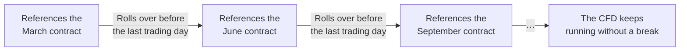
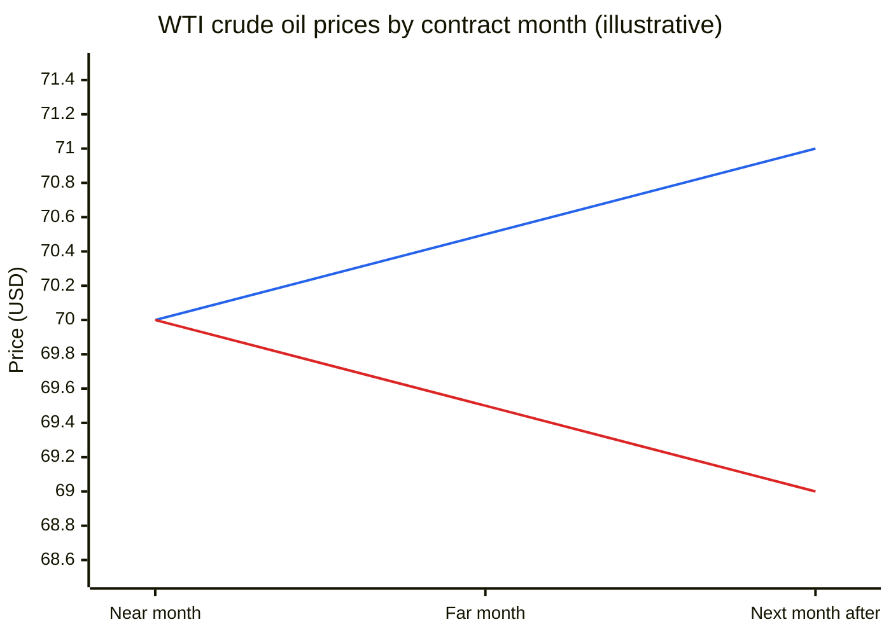
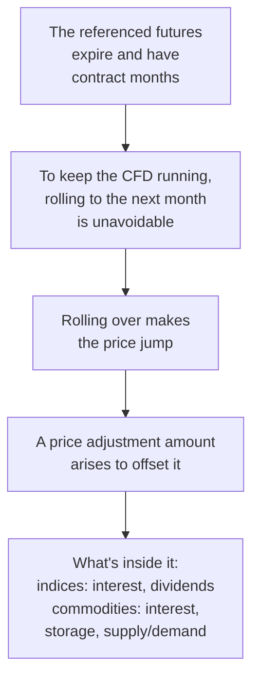
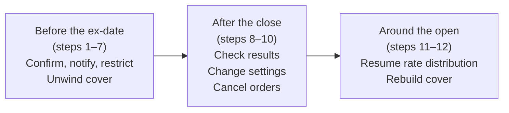
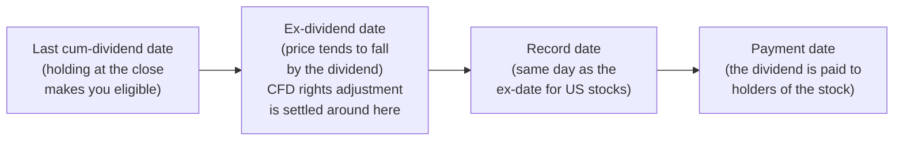

# CFD Notes: Rollover and Adjustments (Rollover, Spin-offs and Splits, Dividends)

🇯🇵 [日本語版](./cfd-rollover-and-adjustments.md)

[← Back to the CFD notes index](./cfd.en.md)

This file covers futures contract-month rollovers, and the adjustments
that arise from corporate actions (spin-offs, reverse splits, splits)
and dividends.

---

### What is a rollover?

A rollover is switching to the next contract month's futures when the
futures contract a CFD's price is based on reaches its expiry (its
contract month). It happens on products that reference futures, such as
Japan 225 and WTI crude oil.

A CFD itself has no expiry, but the futures contract it's based on does
— so a rollover is needed to keep the CFD running.

**The two parts of a rollover**

| Part | What happens |
|---|---|
| Rolling the position | When the referenced futures contract expires, delivery or final settlement takes place, so the near-month position is closed out and re-opened in the far month |
| Shifting the reference month | The price reference moves from the near month (the closest contract month) to the far month (the next contract month) |

How the position is rolled depends on whose position it is.

- The hedge position the broker holds with its cover counterparty: the
  near month is closed out and re-opened in the far month.
- The client's CFD position: this varies by broker. Some carry the
  position over and offset the jump with a price adjustment amount,
  while others close it once and re-open it in the far month.

**The reference is the month with the highest trading volume**

A high-volume month trades actively, so its price is stable and
reliable. Referencing a low-volume month, on the other hand, causes
problems like these:

| Problem | What happens |
|---|---|
| The rate looks frozen | So few trades go through that the rate appears stuck for long stretches |
| The spread widens | Low-volume months have a wide gap between bid and ask (the spread). Referencing one widens the CFD spread quoted to clients too, giving them a worse price |
| The price is easily distorted | Small orders can move the price a lot, so the reference price may drift away from where the market really is |
| It diverges from the market's representative price | The price shown in the news or by other firms is normally that of the high-volume month. Referencing a different month means the CFD rate differs from what clients see elsewhere, which causes confusion |
| Cover is impossible, or expensive | With little trading, the risk taken on from client trades can't be covered in that month. Even if it can, fills at unfavorable prices are likely with so little size available, and cover costs go up |

The center of trading volume normally sits in the near month, but it
shifts to the far month as expiry approaches. Precisely because the
principle is "reference the month with the highest volume," the
reference month is rolled over in step with that shift (for the timing
of rollover, see "Why does a rollover happen?" next).

---

### Why does a rollover happen?

The futures contracts a CFD references have a "contract month" — a set
date by which the underlying is to be delivered, at a price agreed in
advance. A "March contract," for example, is delivered on a set day in
March.

| | Futures | CFD |
|---|---|---|
| Expiry | Yes (the contract month) | No |
| What happens at expiry | Delivery of the underlying or final settlement (equity index futures, for example, are cash-settled against the Special Quotation, or SQ) | Nothing (it keeps exchanging only the price difference, with no expiry) |

A CFD can't have delivery or final settlement happen at expiry. That's
why it has to roll over into the next contract month before the
referenced futures contract expires. Even though the CFD itself has no
expiry, the underlying futures do — and by continuing to roll over, the
CFD can be offered as a product with no expiry.

**How the rollover day (price adjustment day) is set**

The rollover happens shortly before the expiry date, not on the day
itself.

| Point | Details |
|---|---|
| Who sets it | Not the exchange — each CFD provider sets its own |
| When | The only common rule is that it comes before the referenced futures contract's last trading day. How many business days before varies by provider and product |
| How it's chosen | For example, around the day when liquidity is about to shift from the near month to the far month; it varies by product (see ["Examples by Product Type"](./cfd-product-types.en.md)) |
| Can it change? | A planned day may be changed depending on liquidity and volume at the reference |
| Effect of holidays | It can be pulled forward (see below) |
| Notice to clients | It is announced in advance on the provider's website or trading screen, so clients can decide ahead of time what to do with their positions |

Holidays can pull the day forward for the following reasons:

1. The referenced futures contract's last trading day is fixed by the
   exchange's rules, and if it falls on a holiday or other non-business
   day it moves to the previous business day (for example, the last
   trading day for Nikkei 225 futures is the business day before the SQ
   date — the second Friday of the contract month, or the previous
   business day if that's a holiday).
2. The price adjustment day has to come before that last trading day.
3. As a result, the price adjustment day is pulled forward too.

#### What happens to the rate and position at rollover?

This section assumes the approach where the position is carried over and
offset with a price adjustment amount.

Whenever the most actively traded contract month changes, the broker
rolls the reference contract month over to the next one. This is what
lets a CFD keep running without ever expiring, so clients can keep
trading without having to think about contract months.

The moment the reference month changes, though, the price jumps
discontinuously — and so does the unrealized P&L on any open position.

To offset this, an amount equal to the change in the position's
unrealized P&L, but in the opposite direction, is credited or debited to
the client. This is called an adjustment amount.

| Price change at rollover | Long's unrealized P&L | Long's adjustment | Short's unrealized P&L | Short's adjustment |
|---|---|---|---|---|
| Rises (before < after) | + | − (pays) | − | + (receives) |
| Falls (before > after) | − | + (receives) | + | − (pays) |

In other words, any gain from the rollover is cancelled out by the
adjustment, and any loss is made up by it — so the rollover itself
leaves the client neither better nor worse off.

**What creates the price gap**

The size of the adjustment (the price adjustment amount) is set by the
price gap between the near month and the far month — and what creates
that gap differs by product type.

| Component | What it is | Equity index futures | Commodity futures (oil, grains, etc.) |
|---|---|---|---|
| Interest adjustment | A short-term interest equivalent for the time remaining to settlement. It reflects the interest-rate gap between holding the spot asset and holding a futures position, and it's built into the futures price in advance (in most cases, added on top) | Applies | Applies |
| Rights adjustment (an adjustment for dividends and other shareholder rights) | The expected future dividends. Since a company's value (and so its share price) drops by roughly the dividend amount when it's paid out, futures prices are set lower in advance to account for it | Applies | Doesn't apply (no dividends) |
| Storage costs | The cost of holding the physical commodity until a later date — warehousing, insurance, and so on. It tends to push the far month higher | Doesn't apply | Applies |
| Supply and demand | When near-term supply is short and demand for "right now" is strong, the near month trades above the far month | — | Has a big effect |

The interest adjustment affects every product type (indices, FX, metals,
energy, commodities, etc.). The rights adjustment, as a component of the
futures price, only applies to equity indices — not to FX, metals, or
energy, which pay no dividends.

For equity indices, when the dividend effect outweighs interest, the
further out a contract month is (the longer until settlement), the more
dividends it deducts, so it trades at a lower price. As expiry
approaches, both the interest and dividend components for the remaining
period shrink, and at expiry the futures price matches the spot price
(for Nikkei 225 futures, the SQ value).

For commodity futures, a state where the far month is higher is called
"contango"; one where the near month is higher is called "backwardation"
(see "Note: contango and backwardation" below).

The interest adjustment, rights adjustment, and storage costs described
here are all "ingredients" built into the futures price — the client
never pays or receives them separately. What the client actually pays or
receives is the price adjustment amount, which reflects all of them at
once. (For how this differs from the interest and rights adjustments
paid directly on single stocks and similar products, see ["Examples by
Product Type"](./cfd-product-types.en.md).)

**Direction of the price adjustment amount**

The direction of the price adjustment amount (whether longs receive or
pay) is tied to what's inside that price gap.

| Product | Situation | Price at rollover | Longs |
|---|---|---|---|
| Equity indices | The dividend effect outweighs interest (as with Japan 225) | Falls (the further out the month, the more expected dividends are subtracted) | Tend to receive |
| Equity indices | The interest effect outweighs dividends (as with US equity indices as of writing) | Rises (the further out the month, the higher the price) | Pay |
| Commodities | Contango (far month higher) | Rises | Pay |
| Commodities | Backwardation (near month higher) | Falls | Receive |

- When longs receive on an equity index, it has the same effect as longs
  receiving the dividend-equivalent — the same idea as longs receiving
  the rights adjustment on a single-stock CFD.
- For commodities, which one applies shifts with supply and demand (see
  the note below).

**How the price adjustment amount is calculated**

> Price adjustment amount = (near-month mid − far-month mid) × contract size × FX conversion rate

This formula uses the mid price, but some brokers use the exchange's
official settlement prices for the near and far months instead. See
"When and at what price are adjustments calculated?" in ["Examples by
Product Type"](./cfd-product-types.en.md).

**Worked examples** (all figures are illustrative)

| | Japan 225 (yen-denominated) | WTI crude oil (USD-denominated) |
|---|---|---|
| Near-month mid (the midpoint between bid and ask) | ¥38,000 | $70.00 |
| Far-month mid | ¥37,900 | $70.50 |
| Contract size | 1 lot = index × ¥10 | 1 lot = 10 barrels |
| FX conversion rate (the rate for converting dollars into yen) | 1 (yen-denominated) | ¥150 per dollar |
| Calculation | (38,000 − 37,900) × 10 × 1 = +¥1,000 | (70.00 − 70.50) × 10 × 150 = −¥750 |
| Client long 1 lot | Receives ¥1,000 | Pays ¥750 |
| Client short 1 lot | Pays ¥1,000 | Receives ¥750 |
| What happened | The price fell ¥100 at rollover, cutting the long's unrealized P&L by ¥1,000, and the adjustment makes up for it | In contango, the price rose at rollover |

The day the price adjustment is applied is called the "price adjustment
day." It coincides with the rollover, and the adjustment is applied
after that day's trading closes.

**Note: contango and backwardation**

Even for the same commodity, futures prices differ by contract month.
When you line up the prices from the near month out to the far months,
the "shape" falls into two broad patterns, each with its own name.

| | Contango | Backwardation |
|---|---|---|
| Meaning | The far month is priced above the near month | The near month is priced above the far month |
| Price shape | Near < far (higher the further out) | Near > far (lower the further out) |
| Main reason | The cost of "holding until later" — storage, interest — is added to the far month | Near-term supply shortage makes "right now" demand strong, pushing the near month up |
| Price at rollover | Rises | Falls |
| Price adjustment amount at rollover | Longs pay, shorts receive | Longs receive, shorts pay |

Example (illustrative figures): with WTI crude's near month at $70.00,

- Far month at $70.50 → contango. Holding crude for another month costs
  warehousing, insurance, and interest on the capital tied up, so the
  far month is higher by that much.
- Far month at $69.50 → backwardation. With production cuts or similar
  leaving near-term crude in short supply, more people want "crude now"
  rather than "crude a month from now," so the near month is higher.

(Blue line: contango, higher the further out. Red line: backwardation,
lower the further out.)

Storable commodities (oil, grains, metals) cost money to hold, so when
supply and demand are calm they tend toward contango. When supply gets
tight, they flip to backwardation. In other words, the state isn't fixed
— it shifts with supply and demand.

As an extreme example, in April 2020 storage for WTI crude ran out,
leaving no place to put crude that would be delivered to anyone still
holding the near-month contract. A rush to dump the near month pushed
its price far below the far month, and it briefly traded at a negative
price. That was an extreme case of contango, and the gap couldn't be
explained at all by the usual logic of interest or storage costs — it
came from a lack of storage space and from supply and demand.

The terms contango and backwardation apply to futures in general, not
just commodities. For equity index futures, when the dividend effect
outweighs interest, the further out the month, the more expected
dividends are subtracted, so the curve takes the shape of backwardation
(which is why, as of writing, longs on Japan 225 tend to receive the
price adjustment amount). Conversely, when the interest effect is
larger, the curve takes the shape of contango.

What matters most for CFD clients:

- Holding a long for a long time on a product that stays in contango
  means paying the price adjustment amount at every rollover. Even if
  the price of crude itself goes nowhere, the payments pile up with each
  rollover and gradually eat into P&L.
- Conversely, holding a short on a product that stays in backwardation
  also means paying at every rollover.

#### What do I (in operations) do at that point?

On a price adjustment (rollover) day, operations handles four main
tasks.

| Task | Details | Deadline |
|---|---|---|
| 1. Setting the price adjustment day | Pull the rollover schedule from the data vendor, confirm the dates, register them in the system, and publish the schedule to clients | In advance |
| 2. Rolling the reference contract month | Verify the far month's price settings are correct, and confirm the switch to the new reference month is complete | On the price adjustment day |
| 3. Settling the price adjustment amount | The system applies the adjustment to client accounts automatically, but since a wrong figure directly affects client P&L, checking it beforehand is especially important | On the price adjustment day (checked in advance) |
| 4. Rolling the cover position | The hedge position the broker holds with its cover counterparty (which points in the same direction as the client's position) also has to be closed and re-opened in the far month, in the same size, before settlement | Before the price adjustment day |

Note that task 2 is confirmed as complete *on* the price adjustment day,
whereas task 4 needs to be complete *before* it.

#### Summary

These pieces all trace back to a single thread.

Because the futures contract behind a CFD always has an expiry and a
contract month, the CFD has to roll over to keep running without
interruption. Rolling over always creates a price discontinuity, which
the price adjustment amount exists to offset — and that amount is itself
built from interest rates plus dividends (for equity indices) or storage
costs and supply and demand (for commodities), the very things that
shape the futures price in the first place.

Rollover, the adjustment, and interest/dividends/storage costs aren't
separate topics — they all fall out of one fact: futures contracts
expire.

---

### When a spin-off, reverse split, or stock split happens

A foreign stock CFD uses an overseas individual stock as its underlying
(the instrument the CFD's price is based on). So when the company that
issued the underlying carries out a corporate action, the CFD is
affected too.

| CFDs that are affected | CFDs that aren't affected |
|---|---|
| Foreign stock CFDs, and ETF CFDs (index-tracking ETFs, leveraged ETFs, and so on) | CFDs on a stock index itself, such as Japan 225, and on commodities such as WTI crude oil |

#### What is a corporate action in the first place?

A corporate action is a financial decision made by a company that issues
shares. Examples include dividends, stock splits, reverse splits (share
consolidations), capital increases, mergers, and spin-offs.

From a shareholder's point of view, a corporate action is "something
that happens to the shares you hold."

| Corporate action | What happens from the shareholder's point of view |
|---|---|
| Dividend | You receive part of the company's profit in cash |
| Stock split | Your share count goes up and the price per share goes down |
| Reverse split | Your share count goes down and the price per share goes up |
| Spin-off | You receive shares in a newly separated company |

This section covers the three that require adjustments to positions and
prices: stock splits, reverse splits, and spin-offs.

#### What are spin-offs, reverse splits, and stock splits, in a nutshell?

- **Stock split**: dividing one share into several, increasing the
  number of shares outstanding
- **Reverse split (share consolidation)**: combining several shares into
  one, decreasing the number of shares outstanding
- **Spin-off**: a company separating part of its business and making it
  an independent company

With splits and reverse splits, the share count and the price per share
simply move in opposite directions, so in theory the value of what you
hold does not change.

| | 2-for-1 stock split (1 share → 2) | 1-for-5 reverse split (5 shares → 1) |
|---|---|---|
| Shares held | Doubles | Becomes 1/5 |
| Value per share | Halves | Becomes 5x |
| Total value | Unchanged | Unchanged |
| Main purpose | Lower the price per share to make it easier to buy | Raise the price per share (to meet listing requirements, improve perception, reduce administrative costs) |

**Note: in data vendors' feeds, splits and reverse splits can both
arrive under the same event type, "Stock Split."**

To tell them apart, look at the adjustment factor (the split or
consolidation ratio).

- When it's delivered as a ratio applied to the quantity, a factor
  greater than 1 means a split and less than 1 means a reverse split.
- Some vendors, however, deliver it as a factor applied to the price
  (0.5 for a 2-for-1 split), so you need to check which definition is
  being used.

| Event | Adjustment factor (applied to quantity) | Type |
|---|---|---|
| 1 share → 2 | 2 | Split |
| 1 share → 3 | 3 | Split |
| 5 shares → 1 | 0.2 | Reverse split |
| 4 shares → 1 | 0.25 | Reverse split |

**Side note: the value is unchanged in theory, but the share price still
moves**

- Stock split: when a split is announced, the price per share falls and
  the stock becomes easier to buy. Because more buyers are expected,
  buying tends to pick up and the share price often rises.
- Reverse split: it is often seen as something done by companies whose
  share price has fallen, so the share price often falls after the
  announcement.

#### How does this affect a CFD position?

A CFD is not the physical stock, but it is designed so that the holder
gains or loses the same as a shareholder would. So when a split, reverse
split, or spin-off happens in the underlying, the CFD's positions and
prices are also adjusted to produce the same result as for a
shareholder.

There are broadly three kinds of adjustment.

| Adjustment | What is adjusted |
|---|---|
| Position adjustment | The quantity of the position held |
| Price adjustment | The prices shown to clients (current price, price history, highs/lows, closing prices) |
| Stop-out adjustment | Stop-out levels and clients' pending orders such as limit orders |

The stop-out adjustment is needed because the price changes sharply. For
example, if a 2-for-1 split halves the price but stop-out levels and
limit prices stay where they were, a stop-out or limit order could be
triggered at the moment of the split even though the market has not
actually moved. So they are handled as follows:

- Stop-out levels: recalculated for the new price level.
- Pending orders such as limit orders: generally all cancelled before
  the split or reverse split, and clients place them again afterwards.

**How adjustments differ for splits/reverse splits and spin-offs**

| | Splits and reverse splits | Spin-offs |
|---|---|---|
| What happens | The quantity and price move in opposite directions, in line with the ratio | The original company's share price falls by the value of the company being separated |
| How the CFD is adjusted | The position quantity and price are changed in line with the ratio. The total value of the position does not change | The price is adjusted to a level that deducts that amount, and the deducted amount is paid or charged as a rights adjustment. As with dividends, clients holding a long receive it and clients holding a short pay it |
| Points to watch | Depending on the ratio, a position can end up with a fraction (an odd amount less than 1). If the rules do not allow fractional positions, the position cannot be managed correctly as is, so it is forcibly closed before the split or reverse split | Some brokers, instead of settling in cash, give clients a new CFD position in the separated company in line with the spin-off ratio (e.g., 1 share for every 5 held). This is only possible when they offer a CFD on that company |

The rights adjustment is the same mechanism used for dividends (covered
in detail in "When a dividend is paid (rights adjustment)").

#### A concrete example: when a stock you hold is split, how are the position and price adjusted?

**Example 1: Netflix's 10-for-1 split (November 2025)**

| Item | Details |
|---|---|
| Announcement | October 30, 2025 |
| Split took effect | After the close on Friday, November 14 |
| Trading at the post-split price began | Monday, November 17 |
| Share price | About $1,100 before the split, about $110 after |

Take a client who, before the split, had bought (gone long) 3 Netflix
CFDs at $1,050. Their position is adjusted as follows.

| | Before split | After split |
|---|---|---|
| Quantity | 3 CFDs | 30 CFDs (x10) |
| Execution price | $1,050 | $105 (÷10) |
| Current price | about $1,100 | about $110 (÷10) |
| Unrealized gain | (1,100 − 1,050) × 3 = $150 | (110 − 105) × 30 = $150 |

The quantity goes up 10x and the price drops to 1/10, but the unrealized
gain does not change. Because the ratio is a whole number, no fraction
appears and there is no forced close.

Brokers adjust positions in one of two ways. Either way, the point is
the same: the client's P&L must not change.

- Rewriting the quantity and price directly in line with the ratio
- Closing the position once at the pre-split price and reopening it at
  the adjusted quantity and price

**Differences from rounding**

Dividing the execution price by the ratio can produce a price with too
many decimal places. For example, an execution price of $1,050.33
becomes $105.033 after dividing by 10, but if prices only go to two
decimal places, it is rounded to $105.03. This creates a small
difference in unrealized P&L before and after the split.

| | Calculation | Unrealized gain |
|---|---|---|
| Before the split | (1,100 − 1,050.33) × 3 | $149.01 |
| After the split | (110 − 105.03) × 30 | $149.10 |

This $0.09 difference is adjusted with a deposit or withdrawal on the
client's account so that P&L is the same before and after the split.

**Example 2: a ratio that produces fractions (hypothetical)**

Suppose Company B does a 3-for-2 split (1 share → 1.5 shares). A client
holding 3 CFDs in Company B would end up with 4.5 CFDs after the split —
a fraction. A client holding 2 CFDs would end up with 3, with no
fraction, but forced closes are decided per instrument, not per client
holding. For an instrument whose ratio is not a whole number, new orders
are stopped as soon as the split is announced, and every client's
position is forcibly closed before the split.

Reverse splits follow the same idea: the ratio determines whether there
is a forced close.

| Event | Adjustment factor | Forced close |
|---|---|---|
| 1 share → 3 (split) | 3 | None |
| 1 share → 1.5 (split) | 1.5 | Yes (all clients) |
| 4 shares → 1 (reverse split) | 0.25 | Only the fractional part, for clients who end up with one |
| 2.5 shares → 1 (reverse split) | 0.4 | Yes (all clients) |

With a reverse split, though, fractions can appear even when the ratio
is a whole number. For example, in a 1-for-4 reverse split, a client
holding 6 CFDs would end up with 1.5 CFDs. In that case, only the 0.5
CFD that falls short of 1 is forcibly closed from that client's
position. How fractions are handled in splits and reverse splits may
differ from broker to broker.

#### What do I (in operations) check and handle when a corporate action happens?

For splits, reverse splits, and spin-offs, the operations workflow is
broadly the same. If the CFD is not adjusted in the same way as what
happened in the underlying, client positions and P&L will not be
processed correctly, so action is always required.

Also note that CFD processing of splits, reverse splits, and spin-offs
can run on a different schedule from trading in the physical stock. For
physical stock, processing centers on the record date, but for large US
splits and spin-offs, the ex-date (the day trading starts at the
post-split or post-spin-off price) can come after the record date (for
example, in Kyndryl's spin-off from IBM, the record date was October 25,
2021, and the ex-date was November 4). For CFDs, each broker sets its
own forced close deadline and its own timing for adjusting positions.

The details of the workflow differ from broker to broker. What follows
is one example.

**Work done before the ex-date (the effective date of the split or
spin-off)**

1. Confirm the corporate action: check the details for the instrument
   (type, ratio, schedule), and check whether any other corporate action
   overlaps on the same instrument
2. Notify clients: inform them of the details and schedule. For a
   spin-off, show the record date, the rights adjustment amount, and the
   date it is scheduled to be credited/debited
3. Restrict new trading: if there will be a forced close, stop accepting
   new orders
4. Register the forced close: if there will be a forced close, register
   it in the system
5. Calculate the rights adjustment amount (for spin-offs; method below)
6. Register the rights adjustment amount
7. Unwind the position at the cover counterparty (CP): close out the
   position held at the cover counterparty before the split or reverse
   split
   - For example, if the broker holds a buy of 10 at the CP, it sends a
     sell of 10 to bring it to zero. In the meantime, the broker
     temporarily carries the other side of its client positions itself.
   - Why unwind: if the position is carried over at the CP, the split or
     reverse split also gets processed at the CP, making it hard to
     reconcile against the broker's own processing.
   - At the same time, the position limit (the position size above which
     a cover trade is executed automatically; see ["Position limits and
     cover strategy"](./cfd-pricing-and-cover.en.md)) is temporarily
     widened so that no new cover trades flow to the CP in the meantime

**Work done after the close**

8. Check the results: confirm that position quantities and prices were
   adjusted according to the ratio
9. Change price and position-limit settings
   - Change price-related settings (abnormal rate detection thresholds,
     upper/lower price bounds, etc.) to match the new price level.
   - Quantity-based caps (such as position limits) are also reviewed in
     line with the ratio, since the split or reverse split changes
     quantities
10. Restrict trading and cancel orders: halt trading and cancel all
    clients' pending orders

**Work done around the open**

11. Resume rate distribution: after confirming that no
    pre-corporate-action rates are left over, resume generating and
    distributing rates to clients
12. Rebuild the cover position: re-establish, at the adjusted quantity,
    the position at the CP that was unwound in step 7

**How the rights adjustment amount for a spin-off is calculated**

The calculation method differs from broker to broker, but prices from
before the ex-date are often used. There are two main approaches, and
another approach is to take the average of the two.

| Method | Prices used | Formula |
|---|---|---|
| Calculated value 1: the difference in share price before and after the spin-off | Pre-spin-off price x, post-spin-off price x' | Rights adjustment amount = x − x' |
| Calculated value 2: the share price of the company being separated | Separated company B's price y | Rights adjustment amount = y |
| Average of 1 and 2 | x, x', y | Rights adjustment amount = {(x − x') + y} ÷ 2 |

- For value 1, x' is the price after the spin-off, so normally it cannot
  be known in advance. However, for corporate actions involving rights
  such as spin-offs and splits, the post-ex-date shares start trading as
  a separate instrument before the record date (when-issued trading), so
  the post-ex-date price can be estimated in advance. Exchanges and data
  vendors list these as a separate instrument with a suffix such as "WI"
  added to the existing ticker (the notation varies by vendor).
- Value 2 relies on the fact that, with a spin-off, the share price of
  the company being separated also becomes available before the
  effective date. If the original company A's price is x, A's price
  after the spin-off is x', and the separated company B's price is y,
  then x' = x − y. In other words, a CFD with company A's shares as its
  underlying loses value by y because of the spin-off. So y is used as
  the rights adjustment amount.

**A concrete example: Kyndryl's spin-off from IBM (November 2021)**

IBM shareholders received 1 Kyndryl share for every 5 IBM shares held on
the last day to trade with entitlement to the distribution (November 3).
Three instruments are used in the calculation.

| Instrument | Role |
|---|---|
| Old IBM (IBM) | Pre-spin-off price x |
| New IBM (when-issued instrument) | Post-spin-off price x' |
| Kyndryl (when-issued instrument) | Price of the separated company y |

| Method | Result |
|---|---|
| Calculated value 1 | On the last day to trade with entitlement (November 3), new IBM did not trade, so it had no price. The calculation became 127.13 − (no price), and could not be computed |
| Calculated value 2 | Since 1 Kyndryl share is given for every 5 IBM shares, each IBM share corresponds to 1/5 of a Kyndryl share. Dividing Kyndryl's price of $28.50 by 5 gives 28.50 ÷ 5 = $5.70 |
| Value used | Because value 1 could not be computed, no average could be taken, and value 2, $5.70, was used as the rights adjustment amount |

In irregular cases like this, where one of the prices needed for the
calculation has no quote, the following points need attention.

- Use closing prices from the same business day for all three
  instruments: new IBM has a closing price for November 2 but not for
  November 3. If new IBM's November 2 price is used, old IBM and Kyndryl
  must also use their November 2 closing prices
- If prices have moved a lot since the previous business day, use the
  most recent prices: comparing the November 2 and 3 closes for old IBM
  and Kyndryl, IBM rose while Kyndryl fell — they moved in opposite
  directions. The November 3 closes better reflect the latest market
  movement, so calculating with them gives a value closer to the actual
  market

#### Where I would have stumbled three years ago

- **Seeing the share price drop sharply after a split and thinking "it
  crashed" or "I lost money"**
  - In reality, the quantity has gone up by the same ratio, so the value
    of what you hold is unchanged. For example, in Netflix's 10-for-1
    split, the price went from about $1,100 to about $110, but the
    number of CFDs held went up 10x.
  - Price history (the chart) is also adjusted to the new level. Without
    that adjustment, it would look as if a crash or spike had happened
    on the day of the split or reverse split, and you could no longer
    analyze continuous, accurate price movement across it
- **Being surprised that limit orders and other orders placed before a
  split or reverse split "disappeared"**
  - In reality, because the price level changes, the broker cancels all
    pending orders. They need to be placed again afterwards, at the new
    price level
- **Assuming the rights adjustment amount for a spin-off is something
  you only receive**
  - As with dividends, long holders receive it, but short holders pay
    it. It is the same idea as short-selling a physical stock, where you
    have to pay what the shareholder receives
- **Assuming "if the ratio is a whole number, there is no forced
  close"**
  - With a split, a whole-number ratio produces no fractions, but with a
    reverse split, fractions can appear even when the ratio is a whole
    number. For example, in a 1-for-4 reverse split, a client holding 6
    CFDs ends up with 1.5 CFDs, so the 0.5 CFD that falls short of 1 is
    forcibly closed

---

### When a dividend is paid (rights adjustment)

#### What are a dividend and a CFD rights adjustment, in a nutshell?

- **Dividend**: a company returning part of the profit it earned from
  its business to shareholders in cash
- **Rights adjustment**: the mechanism for passing an amount equivalent
  to the dividend to CFD holders. Also called a "dividend-equivalent
  amount" (in Japanese, *kenri chōseigaku*, literally a "rights
  adjustment amount"). In the English-speaking CFD industry it is
  commonly called a "dividend adjustment"; these notes use "rights
  adjustment" because the same mechanism also covers rights other than
  dividends, such as spin-offs

Part of the profit a company earns is kept as funds to grow the business
(retained earnings), and the rest is distributed to shareholders. That
is a dividend. It is usually paid in proportion to the number of shares
held, as "X dollars per share." Depending on business results, the
dividend may be omitted altogether.

A CFD holder does not hold the physical stock, so they are not a
shareholder and cannot receive the dividend itself. Instead, an amount
equivalent to the dividend is passed on as a rights adjustment. The
rights adjustment amount used in "When a spin-off, reverse split, or
stock split happens" to pass on the value of the company separated in a
spin-off is the same mechanism.

**Two uses of the term "rights adjustment"**

| | The rights adjustment in the rollover section | The rights adjustment covered here |
|---|---|---|
| What it means | The expected dividends built into the futures price | An amount equivalent to the dividend, for single-stock and ETF CFDs |
| Paid or received in the client's account? | No (it is settled within the price adjustment amount) | Yes |

For the details of the difference, see "Same words — 'interest
adjustment' and 'rights adjustment' — different roles" in ["Examples by
Product Type"](./cfd-product-types.en.md). For ETFs, the payout is
called a distribution rather than a dividend, but it is handled the same
way.

**Four dates involved in a dividend**

Dividends come with several dates that have similar-sounding names.

| Date | Meaning |
|---|---|
| Last cum-dividend date | The last day on which holding the stock at the close of trading earns you the right to the dividend |
| Ex-dividend date | The business day after the last cum-dividend date. Buying the stock on or after this day does not get you this dividend |
| Record date | The day the company fixes, in its shareholder register, which shareholders will receive the dividend |
| Payment date | The day the dividend is actually paid to shareholders. Often several weeks after the record date for US stocks, and several months after for Japanese stocks |

A stock trade takes some days from execution until it is actually
reflected in the shareholder register (settlement). So to be on the
register on the record date, you have to buy the stock beforehand. The
"last day that is still in time" is the last cum-dividend date. The
number of days to settlement is set by each market's rules (the table
below is as of writing).

| | US stocks | Japanese stocks |
|---|---|---|
| Days until settlement | The business day after execution (T+1) | Two business days after execution (T+2) |
| Last cum-dividend date | The business day before the record date | Two business days before the record date |
| Ex-dividend date | Same day as the record date | The business day before the record date |

On the ex-dividend date, the share price tends to fall by the amount of
the dividend. From this day on, buying the stock no longer gets you the
dividend, so the stock is worth that much less.

**When the rights adjustment is settled for CFDs**

- With CFDs, the rights adjustment is paid or received not on the
  payment date but around the ex-dividend date (on a day set by the
  broker).
- Many brokers credit it, during the daily processing on the ex-dividend
  date, to clients who held a position at the close of trading on the
  last cum-dividend date. However, the reference day used to determine
  eligible positions, and the time it is reflected in the account,
  differ from broker to broker.
- Some brokers book the adjustment on the ex-dividend date but carry out
  the actual movement of funds on the payment date.

#### Why do longs receive and shorts pay with CFDs?

As seen above, on the ex-dividend date the share price tends to fall by
the amount of the dividend. A shareholder in the physical stock loses
nothing overall, because even though the price falls, they receive that
amount as the dividend.

A CFD holder, however, cannot receive the dividend itself. So without a
rights adjustment, the following would happen with CFDs.

| | Price drop on the ex-dividend date | Without a rights adjustment | With a rights adjustment |
|---|---|---|---|
| Long | Loses | Stays at a loss — worse off than a shareholder in the physical stock | Receives the amount of the drop, so loses nothing overall |
| Short | Gains | Keeps the gain — better off than someone who short-sold the physical stock | Pays the amount of the drop, so gains nothing overall |

In other words, for a reason unrelated to market movement — the drop by
the amount of the dividend — longs would lose and shorts would gain. The
rights adjustment offsets this imbalance so that CFD P&L matches the
result for the physical stock.

- Why shorts pay can also be explained through securities lending.
  Someone who borrowed a stock and sold it must pay the dividend amount
  to the lender when a dividend is paid. A CFD short is in the same
  position (for details, see "Direction of payment" in ["Examples by
  Product Type"](./cfd-product-types.en.md) and the stock borrowing part
  of ["Long and short"](./cfd-basics.en.md)).
- For stocks from countries where tax is withheld at source on
  dividends, the amount a long receives and the amount a short pays may
  not match (see "Direction of payment" for this as well).

#### A concrete example: how much changes hands when a single-stock CFD pays a dividend?

**Example: Coca-Cola's dividend (September 2026)**

Coca-Cola is a classic dividend stock that has kept raising its dividend
for decades. Its September 2026 dividend and price moves were as
follows.

| Item | Details |
|---|---|
| Dividend per share | $0.53 |
| Last cum-dividend date | Monday, September 14: closed at $89.35 |
| Ex-dividend date / record date | Tuesday, September 15: closed at $88.71 (the same day, since it's a US stock) |
| Payment date | Thursday, October 1 |

The price fell $0.64 on the ex-dividend date. Of this, $0.53 is the
dividend, and the remaining $0.11 is the day's market movement.

**What longs and shorts receive and pay**

Consider a client who held 100 Coca-Cola CFDs (equivalent to 100 shares)
at the close of trading on the last cum-dividend date. The rights
adjustment is calculated as follows, without using the price.

> Rights adjustment = dividend per share × quantity held = $0.53 × 100 = $53

| | P&L from the price drop | Rights adjustment | Net |
|---|---|---|---|
| Long 100 CFDs | (88.71 − 89.35) × 100 = −$64 | +$53 | −$11 |
| Short 100 CFDs | (89.35 − 88.71) × 100 = +$64 | −$53 | +$11 |

The $11 left over is P&L from the day's market movement, unrelated to
the dividend. The drop by the amount of the dividend ($53) is exactly
offset by the rights adjustment.

**Converted to yen**

The rights adjustment is calculated in dollars, but if the client's
account is in yen, it is converted to yen before being paid or received.
The conversion uses the FX conversion rate (the rate for exchanging
dollars into yen) at mark-to-market on the day it is applied. Assuming,
for illustration, $1 = 150 yen:

> $53 × 150 yen = 7,950 yen

The long receives 7,950 yen and the short pays 7,950 yen.

**When tax is withheld**

When tax is withheld at source on a dividend, what a long receives is
the after-tax amount. Some domestic (Japanese) CFD brokers deduct an
amount equivalent to US withholding tax (a 10% rate) when crediting
rights adjustments on US stock CFDs. On the other hand, no
withholding-tax equivalent is deducted from what a short pays — the
short pays the pre-tax amount as is.

| | Calculation | Amount |
|---|---|---|
| Long receives | $53 × (1 − 0.1) | $47.70 |
| Short pays | The pre-tax amount | $53 |

So the amount a long receives and the amount a short pays are not the
same. The rate also varies with the client's country of residence and
the broker; some overseas brokers deduct 30%.

#### What do I (in operations) check and handle when a dividend is announced?

Compared with spin-offs, reverse splits, and splits, dividends involve a
simpler workflow, since there is no need to halt trading or force-close
positions. However, some stock or other goes ex-dividend almost every
day, so the volume is high. A registration error hits client accounts
directly, which makes accuracy especially important.

**From announcement to crediting**

1. Check the announcement: when the company announces a dividend, check
   the ex-dividend date, payment date, and dividend per share
2. Register in the system: register those details in the system before
   the ex-dividend date
3. Correct if anything changes: if the company changes the dividend
   amount or schedule before the ex-dividend date, correct the
   registration each time
4. Fix the eligible clients: clients holding a position at the close of
   trading on the last cum-dividend date are fixed as eligible at that
   day's clearing (mark-to-market) processing
5. Credit the rights adjustment: on the ex-dividend date, the rights
   adjustment is applied to eligible clients' accounts (longs receive,
   shorts pay)

**Checks after crediting**

6. Check client accounts: confirm the rights adjustment was correctly
   applied to client accounts
7. Reconcile with the cover counterparty: dividend-equivalent amounts
   are also paid or received with the cover counterparty (CP). Reconcile
   the amounts paid or received on the positions the broker holds at the
   CP against the broker's own records

For checking whether tax is withheld, why adjustments are calculated
together in daily processing, and the rate used for yen conversion, see
"When and at what price are adjustments calculated?" and "Do I (in
operations) handle things differently depending on product type?" in
["Examples by Product Type"](./cfd-product-types.en.md).

**Cases handled differently from a regular dividend**

| Case | What it is | How CFDs handle it |
|---|---|---|
| Special dividend | A one-off dividend paid separately from the regular dividend, for example when results have been especially strong. It is often larger than the regular dividend | Basically paid or received as a rights adjustment, the same as a regular dividend. Because the amount is larger, though, both the price drop on the ex-dividend date and the rights adjustment paid or received are larger |
| Stock dividend | A dividend paid in shares rather than cash | Differs by broker: some increase the CFD position by the number of additional shares, while others leave the position unchanged and pay or receive the value of the shares in cash |

#### Where I would have stumbled three years ago

- **Being confused that "it's the ex-dividend date, but the price
  doesn't look like it fell by the dividend"**
  - For stocks whose dividend is very small relative to the share price,
    the drop by the amount of the dividend is buried in the day's normal
    price movement and can't be picked out.
  - For example, Apple's August 2026 dividend was $0.27 per share. Its
    close on the ex-dividend date (August 10) fell $5.07, from $313.33
    on the last cum-dividend date (August 7) to $308.26 — but only $0.27
    of that was the dividend, about 5% of the total. The rest was the
    day's market movement.
  - Unless the dividend is fairly large relative to the share price, as
    in the Coca-Cola example, the drop by the amount of the dividend is
    not something you can see with your own eyes
- **Thinking "if I go long on the last cum-dividend date and close the
  next day, I gain the dividend"**
  - In reality, the price falls by the amount of the dividend on the
    ex-dividend date, so even after receiving the rights adjustment you
    gain nothing overall. Where tax is withheld, what you receive is the
    after-tax amount, so you actually end up worse off by the amount of
    the tax.
  - For example, in the Coca-Cola case, going long 100 CFDs on the last
    cum-dividend date and closing on the ex-dividend date: the drop by
    the amount of the dividend is −$53 and the rights adjustment
    received is +$47.70 after tax, so the dividend-related part alone
    comes to −$5.30
- **Assuming the rights adjustment arrives on the dividend's "payment
  date"**
  - Shareholders of the physical stock are paid the dividend on the
    payment date, but with CFDs the adjustment is applied not on the
    payment date but around the ex-dividend date (on a day set by the
    broker).
  - In the Coca-Cola example, the payment date was October 1, but the
    CFD rights adjustment was paid or received around the ex-dividend
    date of September 15
- **Thinking the rights adjustment that appears in the rollover section
  is the same thing as the one covered here**
  - For stock index CFDs that reference futures (e.g., Japan 225),
    expected dividends are already priced into the futures price, so
    even when dividends are paid, no rights adjustment is paid or
    received in the client's account (it is settled within the price
    adjustment amount at rollover).
  - Rights adjustments are paid or received on single-stock and ETF CFDs
