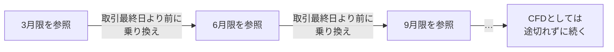
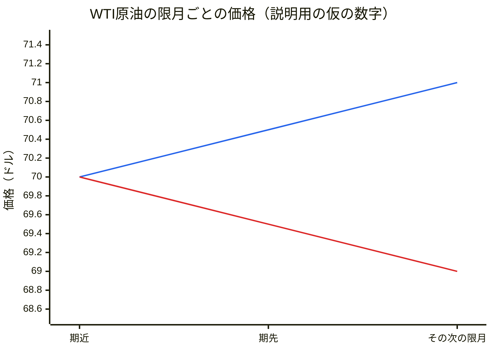
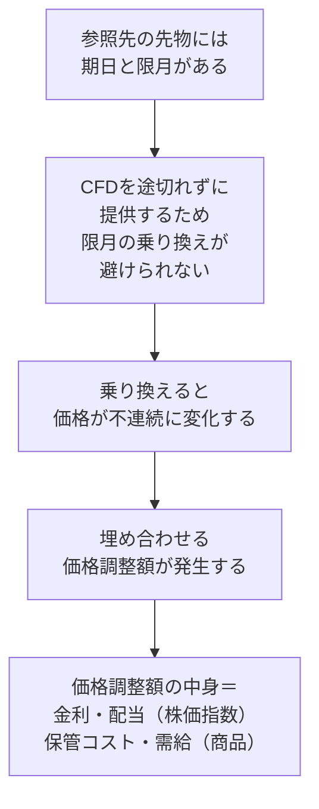
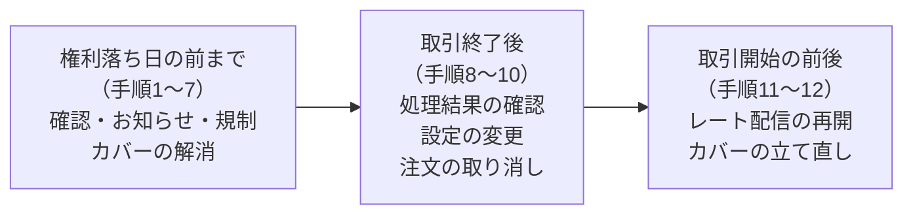
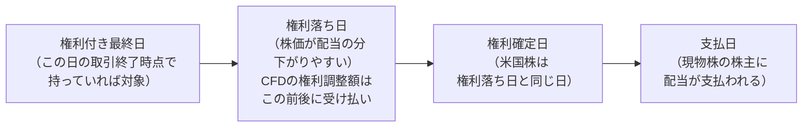

# CFDノート：乗り換えと調整金（乗り換え・スピンオフ等・配当）

🇬🇧 [English version](./cfd-rollover-and-adjustments.en.md)

[← CFDノートの目次に戻る](./cfd.md)

このファイルでは、先物の限月の乗り換えと、コーポレートアクション
（スピンオフ・併合・分割）や配当によって発生する調整金を扱う。

---

## 乗り換え（ロールオーバー）とは

乗り換え（ロールオーバー）とは、CFDの価格のベースにしている先物に期
限（限月／げんげつ）が来たとき、次の限月の先物へと切り替えること。
日本225やWTI原油など、先物を参照している銘柄で発生する。

CFD自体には期限がないが、価格の土台にしている先物には期限があるため、
この乗り換えが必要になる。

**乗り換えの2つの動き**

| 動き | 何をするか |
|---|---|
| ポジションの乗り換え | 参照している先物は、期日が来ると受け渡しや最終決済が発生するため、期近のポジションを一度決済し、期先で建て直す |
| 参照月の載せ替え | 価格のベースを、期近（きぢか＝いちばん近い限月）から期先（きさき＝次の限月）へ移す |

ポジションの乗り換えは、誰のポジションかによって扱いが変わる。

- 業者がカバー先で持っているヘッジのポジション：期近を決済し、期先
  で建て直す。
- 顧客のCFDのポジション：業者によって分かれる。ポジションをそのまま
  持ち越して価格調整額で調整する方式と、いったん決済して期先で建て
  直す方式がある。

**参照するのは「出来高がいちばん多い限月」**

出来高が多い限月は取引が活発で、価格が安定していて信頼できるためで
ある。逆に、出来高の少ない限月を参照すると、次のような問題が起きる。

| 問題 | 何が起きるか |
|---|---|
| レートが止まって見える | 取引がほとんど成立しないため、レートがずっと止まっているように見えてしまう |
| スプレッドが広がる | 出来高の少ない限月は、売値と買値の差（スプレッド）が広い。それを参照すると、顧客に提示するCFDのスプレッドも広くなり、顧客にとって不利な価格になる |
| 価格がゆがみやすい | 少しの注文で価格が大きく動いてしまうため、市場の実勢とずれた価格を参照してしまうおそれがある |
| 市場の代表的な価格とずれる | ニュースや他社が見ている価格は、ふつう出来高の多い限月の価格である。それと違う限月を参照すると、顧客がほかで見る価格とCFDのレートがずれて、混乱を招く |
| カバーができない、またはコストが大きい | 取引が少なければ、顧客の取引で抱えたリスクをその限月でカバーすることができない。カバーできたとしても、少ない注文量の中では不利な価格で約定しやすく、カバーのコストが大きくなる |

出来高の中心は、ふだんは期近にあるが、期日が近づくと期先へ移ってい
く。「出来高がいちばん多い限月を参照する」という原則があるからこそ、
その中心が移るタイミングに合わせて参照する限月を乗り換える、という
考え方になる（乗り換えのタイミングについては、次の「なぜ乗り換えが
起きるのか（限月のしくみ）」を参照）。

---

## なぜ乗り換えが起きるのか（限月のしくみ）

CFDが参照している先物には、「限月（げんげつ）」という期限がある。限
月とは、「将来のいつ（何月）までに、その商品をいくらで受け渡すか」
を決めた期日のこと。たとえば「3月限（さんがつぎり）」なら、3月の決
められた日に受け渡しが行われる。

| | 先物 | CFD |
|---|---|---|
| 期限 | ある（限月） | ない |
| 期日に起きること | 商品の受け渡しや最終決済（株価指数の先物なら、SQ〔特別清算指数〕による現金決済） | 何も起きない（期限なく価格差だけをやり取りする） |

CFDは、期日で受け渡しや最終決済が起きては困る。そのため、参照してい
る先物の期日が来て受け渡しや最終決済が発生する前に、次の限月の先物
へと乗り換える必要がある。CFD自体に期限はなくても、ベースの先物に期
限がある以上、乗り換えを続けることで「期限のない商品」として提供で
きている。

**乗り換えの日（価格調整日）の決まり方**

乗り換えは期日の当日ではなく、その少し手前で行われる。

| 観点 | 内容 |
|---|---|
| 誰が決めるか | 取引所ではなく、CFDを提供する業者がそれぞれ定めている |
| いつか | 参照している先物の取引最終日より前、という点だけが共通している。取引最終日の何営業日前にするかは、業者や商品によって異なる |
| 考え方 | 期近と期先の流動性が逆転しそうな日を基準にする、など、商品によって異なる（詳細は[「商品タイプ別の具体例」](./cfd-product-types.md)を参照） |
| 変更されることがあるか | 参照先の流動性や出来高の状況によって、予定していた日を変更することもある |
| 祝日の影響 | 前倒しになることがある（下記） |
| 顧客への告知 | 顧客が事前にポジションをどうするか判断できるよう、業者のウェブサイトや取引画面で前もって告知される |

祝日で前倒しになるのは、次の理由による。

1. 参照先の先物の取引最終日は、取引所のルールで決まっており、祝日な
   どの休業日に当たるとその前の営業日にずれる（たとえば日経225先物
   の取引最終日は、SQ日〔限月の第2金曜日。休業日なら前の営業日〕の
   前営業日になる）。
2. 価格調整日はその取引最終日より前に置く必要がある。
3. 結果として、価格調整日も前倒しになる。

##### 乗り換えのとき、レートやポジションに何が起きるか

ここでは、ポジションを持ち越して価格調整額で調整する方式を例に説明
する。

CFDを提供する業者は、中心限月（ちゅうしんげんげつ／その時点でいちば
ん出来高が多い限月）が交代するたびに、参照する限月を次の限月へ乗り
換える。これによってCFD商品は取引期限を迎えても消滅せず、顧客は限月
を意識せずに取引を続けられる。

ただし、参照限月が変わる瞬間、商品の価格は乗り換え前後で不連続に変
化する（急変する）。そのままでは、顧客が保有している建玉（たてぎょ
く／保有中のポジション）の評価損益も一瞬で変わってしまう。

この価格差を打ち消すために、「建玉の評価損益の変化額」と逆方向の金
額を顧客に付与している。これを調整金（ちょうせいきん）と呼ぶ。

| 乗り換えでの価格の変化 | ロングの評価損益 | ロングの調整金 | ショートの評価損益 | ショートの調整金 |
|---|---|---|---|---|
| 上がる（乗り換え前＜乗り換え後） | ＋ | －（支払い） | － | ＋（受け取り） |
| 下がる（乗り換え前＞乗り換え後） | － | ＋（受け取り） | ＋ | －（支払い） |

つまり、乗り換えによって得をした分は調整金で相殺され、損をした分は
調整金で補われる。乗り換えそのもので顧客が得も損もしない状態に揃え
る。

**価格差を生んでいる要素**

調整金（価格調整額）の大きさは、期近と期先の価格差で決まる。そして、
その価格差を生んでいる要素は、商品タイプによって異なる。

| 要素 | 内容 | 株価指数の先物 | 商品（原油・穀物など）の先物 |
|---|---|---|---|
| 金利調整額（きんりちょうせいがく） | 決済日までの期間に応じた短期金利相当額。現物取引と先物取引の間に生じる「資金を手元に残しておくことで得られる金利の差」を埋める形で、あらかじめ先物価格に織り込まれる（多くの場合は上乗せされる） | 影響する | 影響する |
| 権利調整額（けんりちょうせいがく） | 将来支払われる予想配当分。配当が支払われると、その分だけ企業の価値（＝株価）が下がるため、先物価格はあらかじめ将来の配当分をマイナスして設定される | 影響する | 関係しない（配当がない） |
| 保管コスト | 現物を先の期日まで持ち続けるための倉庫代や保険料など。その分、期先の価格は高くなりやすい | 関係しない | 影響する |
| 需給 | 目先の供給が不足して「今すぐ欲しい」という需要が強いと、期近の価格が期先より高くなる | ― | 大きく影響する |

金利調整額は、株価指数・為替・貴金属・エネルギー・商品系など、すべ
ての商品タイプに影響する。一方、権利調整額が先物価格の要素になるの
は株価指数だけで、為替や貴金属・エネルギーなど配当のない商品には当
てはまらない。

株価指数の場合、配当の影響が金利より大きいときは、期先（決済日まで
の期間が長い限月）ほど、その間に発生する配当の分を多く差し引いた低
い価格で取引される。期日に近づくにつれて、残りの期間に対応する金利
の分と配当の分はどちらも小さくなっていき、期日には先物価格は現物価
格（日経225先物ならSQ値）と一致する。

商品の先物で、期先が高い状態を「コンタンゴ」、期近が高い状態を「バッ
クワーデーション」と呼ぶ（詳細は後述の「補足：コンタンゴとバックワー
デーション」）。

なお、ここでいう金利調整額・権利調整額・保管コストは、いずれも先物
価格の中に織り込まれている「中身」であり、顧客がそれぞれを別々に受
け払いするわけではない。顧客が実際に受け払いするのは、それらがまと
めて反映された価格調整額である（個別株などで別に受け払いされる金利
調整額・権利調整額との違いは[「商品タイプ別の具体例」](./cfd-product-types.md)を参照）。

**価格調整額の向き**

価格調整額の向き（ロングが受け取るか、支払うか）は、この価格差の中
身と結びついている。

| 商品 | 状況 | 乗り換えで価格は | ロングは |
|---|---|---|---|
| 株価指数 | 配当の影響が金利より大きいとき（日本225など） | 下がる（期先ほど予想配当分が差し引かれて安い） | 受け取りになりやすい |
| 株価指数 | 金利の影響が配当より大きいとき（執筆時点の米国株価指数など） | 上がる（期先ほど高い） | 支払いになる |
| 商品 | コンタンゴ（期先が高い状態） | 上がる | 支払いになる |
| 商品 | バックワーデーション（期近が高い状態） | 下がる | 受け取りになる |

- 株価指数でロングが受け取りになるのは、ロングが配当相当分を受け取っ
  ているのと同じ効果であり、個別株CFDでロングが権利調整額を受け取る
  のと同じ考え方である。
- 商品でどちらになるかは、需給によって入れ替わる（詳細は後述の補足
  を参照）。

**価格調整額の計算式**

> 価格調整額 ＝（期近MID − 期先MID）× 取引単位 × 円転単価

ここではMIDを使った式を示したが、取引所が公表する期近・期先それぞれ
の清算価格を使って計算する業者もある。詳細は[「商品タイプ別の具体例」](./cfd-product-types.md)の
「調整金は、いつ・どの価格で計算されるか」を参照。

**具体例**（数字はいずれも説明用の仮のもの）

| | 日本225（円建て） | WTI原油（米ドル建て） |
|---|---|---|
| 期近のMID（売値と買値の中間の値） | 38,000円 | 70.00ドル |
| 期先のMID | 37,900円 | 70.50ドル |
| 取引単位 | 1枚＝指数×10円 | 1枚＝10バレル |
| 円転単価（ドルを円に換算するレート） | 1（円建てなので） | 150円 |
| 計算 | （38,000 − 37,900）× 10 × 1 ＝ ＋1,000円 | （70.00 − 70.50）× 10 × 150 ＝ －750円 |
| 1枚ロングの顧客 | 1,000円を受け取る | 750円を支払う |
| 1枚ショートの顧客 | 1,000円を支払う | 750円を受け取る |
| 何が起きたか | 乗り換えで価格が100円下がり、ロングの評価損益が1,000円減った分を、調整金で補っている | コンタンゴの状態で、乗り換えによって価格が上がった |

価格調整を実施する日を「価格調整日」と呼び、乗り換えと同じタイミン
グで、その日の取引終了後に実施される。

**補足：コンタンゴとバックワーデーション**

同じ商品の先物でも、限月（期日）ごとに価格は異なる。期近から期先へ
と限月順に価格を並べたときの「並び方」には、大きく2つのパターンがあ
り、それぞれ名前がついている。

| | コンタンゴ | バックワーデーション |
|---|---|---|
| 読み・意味 | 期先の価格が期近より高い状態（順ざや／じゅんざや） | 期近の価格が期先より高い状態（逆ざや／ぎゃくざや） |
| 価格の並び | 期近 ＜ 期先（先に行くほど高い） | 期近 ＞ 期先（先に行くほど安い） |
| 主な理由 | 保管コストや金利など、「先まで持ち続けるための費用」が期先の価格に上乗せされる | 目先の供給不足などで、「今すぐ欲しい」という需要が強く、期近の価格が押し上げられる |
| 乗り換えで価格は | 上がる | 下がる |
| 乗り換え時の価格調整額 | ロングは支払い、ショートは受け取り | ロングは受け取り、ショートは支払い |

具体例（数字は説明用の仮のもの）：WTI原油の期近が70.00ドルのとき、

- 期先が70.50ドル → コンタンゴ。原油を1か月先まで持ち続けるには倉
  庫代や保険料、その間の資金の金利がかかるため、その分だけ期先が高
  くなっている。
- 期先が69.50ドル → バックワーデーション。産油国の減産などで目先の
  原油が足りず、「1か月後の原油より、今の原油のほうが欲しい」という
  人が多いため、期近が高くなっている。

（青い線：期先ほど高いコンタンゴ。赤い線：期先ほど安いバックワーデー
ション）

保管できる商品（原油・穀物・金属など）は、先まで持ち続けるための費
用がかかるため、需給が落ち着いているときはコンタンゴになりやすい。
一方、需給がひっ迫するとバックワーデーションに転じる。つまり、どち
らの状態になるかは固定ではなく、需給によって入れ替わる。

極端な例として、2020年4月には、WTI原油の保管場所が不足し、期近の先
物を持ち続けても受け取った原油の置き場がない、という状況になった。
期近の先物を手放したい人が殺到した結果、期近の価格が期先を大きく下
回り、一時マイナスの価格が付いた。これは極端なコンタンゴの例であり、
このときの価格差は、金利や保管コストといった通常の理屈ではまったく
説明できず、保管場所の不足と需給の問題から生まれたものである。

なお、コンタンゴ・バックワーデーションという言葉は、商品に限らず先
物全般で使われる。株価指数の先物では、配当の影響が金利より大きいと
きは、期先ほど予想配当分が差し引かれて安くなり、バックワーデーショ
ンの形になる（執筆時点で、日本225でロングが価格調整額を受け取りにな
りやすいのはこのためである）。反対に、金利の影響が大きいときはコン
タンゴの形になる。

CFDの顧客にとって大事なのは、次の点である。

- コンタンゴが続く商品をロングで長く持ち続けると、乗り換えのたびに
  価格調整額を支払うことになる。原油の価格そのものが横ばいでも、乗
  り換えを重ねるごとに支払いが積み重なり、損益が少しずつ削られてい
  く。
- 逆に、バックワーデーションが続く商品をショートで持ち続ける場合も、
  乗り換えのたびに支払いが発生する。

##### 自分（オペレーション）は、そのとき何をしているか

価格調整（乗り換え）が発生する日、オペレーション側では大きく4つの業
務を行っている。

| 業務 | 内容 | いつまでに |
|---|---|---|
| 1. 価格調整日の設定 | データベンダーから乗り換えスケジュールを取得し、期日を確認してシステムに登録する。あわせて、顧客向けに価格調整日のスケジュールを案内・掲載する | 事前 |
| 2. 価格参照限月の乗り換え | 期先限月のプライス設定が正しいかを確認し、価格参照限月の切り替えが完了していることを確認する | 価格調整日の当日 |
| 3. 価格調整額の受払 | 調整金の顧客口座への反映自体はシステムが自動で処理する。ただし、金額を誤ると顧客の評価損益に直接影響するため、事前の確認作業が特に重要になる | 価格調整日（事前に確認） |
| 4. カバー建玉の乗り換え | 自社がカバー先で保有しているヘッジのポジション（顧客と同じ方向のポジション）も、決済日を迎える前に一度決済し、期先限月で同量を立て直す | 価格調整日より前 |

2の「価格参照限月の切り替え」は調整日当日に完了しているかを確認する
のに対し、4の「カバー建玉の乗り換え」は調整日より前までに完了してい
る必要がある点が異なる。

##### まとめ

ここまでの話は、実は1本の筋で繋がっている。

参照先である先物には、必ず「期日」と「限月」がある。だからこそ、顧
客に途切れることなくCFDというサービスを提供し続けるには、限月の乗り
換えが避けられない。そして、乗り換えれば必ず価格が不連続に変化する
ので、それを埋め合わせる「価格調整額」が発生する。さらにこの価格調
整額の中身は、金利や、株価指数なら配当、商品なら保管コストや需給と
いった、先物価格の裏側にある要素で決まっている。

つまり「乗り換え」「調整金」「金利・配当・保管コスト」は別々の話で
はなく、"先物に期限があること"から一直線に生まれてくる、ひとつなが
りの仕組みだった。

---

## スピンオフ・併合・分割が起きたとき

外国株CFDは、海外の個別株を原資産（CFDの価格の元になっている銘柄）
としている。そのため、原資産の発行企業がコーポレートアクションを行
うと、CFDもその影響を受ける。

| 影響を受けるCFD | 影響を受けないCFD |
|---|---|
| 外国株のCFD、ETF（株価指数に連動するETFや、レバレッジ型のETFなど）のCFD | 日本225のような株価指数そのもののCFD、WTI原油などの商品のCFD |

##### そもそもコーポレートアクションとは

コーポレートアクションとは、株式を発行している企業が行う、財務に関
する意思決定のことである。配当、株式分割、株式併合、増資、合併、ス
ピンオフなどがある。

株主から見ると、コーポレートアクションは「持っている株に何かが起き
る出来事」である。

| コーポレートアクション | 株主から見て何が起きるか |
|---|---|
| 配当（はいとう） | 企業の利益の一部をお金で受け取る |
| 分割 | 持ち株数が増え、1株あたりの価格が下がる |
| 併合 | 持ち株数が減り、1株あたりの価格が上がる |
| スピンオフ | 切り離された新しい会社の株を受け取る |

ここでは、その中でもポジションや価格の調整が必要になる「分割・併合・
スピンオフ」を扱う。

##### スピンオフ・併合・分割とは何か（一言でいうと）

- **分割（ぶんかつ）**：1株をいくつかに分けて、発行済株式数を増やす
  こと
- **併合（へいごう）**：複数の株を1株にまとめて、発行済株式数を減ら
  すこと
- **スピンオフ**：企業が事業の一部を切り離して、別の会社として独立
  させること

分割と併合は、株の数と1株あたりの価格が逆方向に変わるだけで、理論上、
持っている資産の価値は変わらない。

| | 分割（1株→2株） | 併合（5株→1株） |
|---|---|---|
| 持ち株数 | 2倍になる | 1/5になる |
| 1株あたりの価値 | 1/2になる | 5倍になる |
| 資産価値の合計 | 変わらない | 変わらない |
| 主な目的 | 1株あたりの価格を下げて、買いやすくする | 1株あたりの価格を上げる（上場維持基準を満たす、印象を良くする、管理コストを下げる） |

**注意：データベンダーの配信データでは、分割も併合も「Stock Split」
という同じ種別で届くことがある。**

見分けるには、調整ファクター（Adjustment Factor：分割・併合の比率）
を見る。

- 数量に掛ける比率として配信される場合は、1より大きければ分割、1よ
  り小さければ併合である。
- ただし、ベンダーによっては価格に掛ける係数（1株→2株なら0.5）とし
  て配信される場合もあるため、どちらの定義かを確認する必要がある。

| 内容 | 調整ファクター（数量に掛ける比率の場合） | 判定 |
|---|---|---|
| 1株 → 2株 | 2 | 分割 |
| 1株 → 3株 | 3 | 分割 |
| 5株 → 1株 | 0.2 | 併合 |
| 4株 → 1株 | 0.25 | 併合 |

**補足：理論上は価値が変わらなくても、株価は動く**

- 分割：発表されると、1株あたりの価格が下がって買いやすくなり、買う
  人が増えると予想されるため、買いが集まって株価が上がることが多い。
- 併合：株価が下がってしまった企業が行うことが多いと受け取られるた
  め、発表後に株価が下がることが多い。

##### CFDのポジションにはどう影響するか

CFDは現物株を持っているわけではないが、現物株主と同じ損得になるよう
に設計されている。そのため、原資産に分割・併合・スピンオフが起きた
ら、CFDのポジションや価格も、現物株主と同じ結果になるように調整する。

調整は大きく3種類ある。

| 調整の種類 | 何を調整するか |
|---|---|
| ポジション調整 | 保有しているポジションの数量 |
| プライス調整 | 顧客に見せる価格（現在の価格、過去の価格の履歴、高値・安値、終値） |
| ロスカット調整 | ロスカットになる価格や、顧客が出している指値（さしね）などの注文 |

ロスカット調整が必要なのは、価格が大きく変わるからである。たとえば1
株→2株の分割で価格が半分になったのに、ロスカット価格や指値の価格が
元のままだと、相場は何も動いていないのに、分割のタイミングでロスカッ
トや指値に触れてしまう可能性がある。そのため、次のように扱う。

- ロスカット価格：新しい価格水準に合わせて計算し直す。
- 指値などのまだ約定していない注文：分割・併合の前にすべて取り消し、
  分割・併合の後に顧客に出し直してもらうのが一般的である。

**分割・併合とスピンオフでの調整の違い**

| | 分割・併合 | スピンオフ |
|---|---|---|
| 何が起きるか | 数量と価格が、比率に合わせて逆方向に変わる | 切り離される会社の価値の分だけ、元の会社の株価が下がる |
| CFDでの調整 | ポジションの数量と価格を、分割・併合の比率に合わせて変更する。ポジションの価値の合計は変わらない | 価格はその分を差し引いた水準に調整し、差し引かれた分は権利調整額（けんりちょうせいがく）として受け渡す。配当と同じく、ロングの顧客は受け取り、ショートの顧客は支払う |
| 注意点 | 比率によってはポジションに端数（はすう：1未満の半端な数）が出てしまう。端数のポジションを持てないルールになっている場合は、そのままではポジションを正しく管理できないため、分割・併合の前に強制決済を行う | 業者によっては、現金で調整する代わりに、切り離された会社のCFDのポジションを、スピンオフの比率（例：5株につき1株）に応じて新しく付与するところもある。ただし、その会社のCFDを取り扱っている場合に限られる |

権利調整額は、配当のときにも使われる仕組みである（詳しくは「配当が
出たとき（権利調整額）」で扱う）。

##### 具体例：保有銘柄が分割された場合、ポジションや価格はどう調整されるか

**例1：ネットフリックスの1株→10株の分割（2025年11月）**

| 項目 | 内容 |
|---|---|
| 発表 | 2025年10月30日 |
| 分割の実施 | 11月14日（金）の取引終了後 |
| 分割後の価格で取引開始 | 11月17日（月） |
| 株価 | 分割前は約1,100ドル、分割後は約110ドル |

たとえば、分割前にネットフリックスのCFDを1,050ドルで3CFD買っていた
（ロングしていた）顧客のポジションは、次のように調整される。

| | 分割前 | 分割後 |
|---|---|---|
| 数量 | 3CFD | 30CFD（×10） |
| 約定価格 | 1,050ドル | 105ドル（÷10） |
| 現在の価格 | 約1,100ドル | 約110ドル（÷10） |
| 含み益 | (1,100 − 1,050) × 3 = 150ドル | (110 − 105) × 30 = 150ドル |

数量が10倍、価格が1/10になるだけで、含み益は変わらない。比率が整数
なので端数は出ず、強制決済もない。

なお、ポジションの調整のしかたは業者によって2通りある。どちらの方法
でも、顧客の損益が変わらないようにする点は同じである。

- 数量と価格をそのまま比率に合わせて書き換える方法
- 分割前の価格でいったん決済し、調整後の数量・価格で建て直す方法

**端数の丸めによる差額**

約定価格を比率で割ると、価格の桁が合わなくなることがある。たとえば
約定価格が1,050.33ドルだった場合、÷10をすると105.033ドルになるが、
価格が小数第2位までしか扱えない場合は105.03ドルに丸める。すると、分
割前後で含み損益にわずかな差が出る。

| | 計算 | 含み益 |
|---|---|---|
| 分割前 | (1,100 − 1,050.33) × 3 | 149.01ドル |
| 分割後 | (110 − 105.03) × 30 | 149.10ドル |

この0.09ドルの差は、顧客の口座で入出金して調整し、分割前後で損益が
変わらないようにする。

**例2：端数が出る比率の場合（架空の例）**

B社が1株→1.5株の分割を行うとする。B社のCFDを3CFD持っている顧客は、
分割後に4.5CFDになってしまい、端数が出る。2CFDなら3CFDで端数は出な
いが、強制決済は一人ひとりの保有数ではなく銘柄単位で判断する。比率
が整数にならない銘柄は、分割が発表された時点で新規の注文を止め、分
割前に全員のポジションを強制決済する。

併合も同じ考え方で、比率によって強制決済の有無が決まる。

| 内容 | 調整ファクター | 強制決済 |
|---|---|---|
| 1株 → 3株の分割 | 3 | なし |
| 1株 → 1.5株の分割 | 1.5 | あり（全員） |
| 4株 → 1株の併合 | 0.25 | 端数が出る顧客の端数分のみ |
| 2.5株 → 1株の併合 | 0.4 | あり（全員） |

ただし、併合は比率が整数でも端数が出ることがある。たとえば4株→1株
の併合で、6CFD持っている顧客は1.5CFDになってしまう。この場合、1に満
たない0.5CFD分だけ、その顧客のポジションを強制決済する。分割・併合
での端数の扱いは、業者によってやり方が異なる可能性がある。

##### 自分（オペレーション）は、コーポレートアクション発生時に何を確認・対応しているか

分割・併合・スピンオフでは、オペレーション側の対応はだいたい同じ流
れになる。原資産で起きたことと同じ調整をCFDにも行わないと、顧客のポ
ジションや損益が正しく処理されなくなるため、必ず対応が必要になる。

なお、CFDの分割・併合・スピンオフの処理は、現物株の取引とはスケジュー
ルが異なることがある。現物株では権利確定日（けんりかくていび）を基
準に処理が進むが、米国の大型の分割やスピンオフでは、権利確定日の後
に権利落ち日（分割後・スピンオフ後の価格で取引が始まる日）が来るこ
とがある（例：IBMからKyndrylがスピンオフした事例では、権利確定日が
2021年10月25日、権利落ち日が11月4日）。CFDでは、業者ごとに、強制決
済の期日や、ポジションを調整するタイミングを独自に決めている。

分割・併合の処理の流れは、業者によって細かい部分が異なる。以下は一
例である。

**権利落ち日（分割・スピンオフの効力発生日）の前までに行う作業**

1. コーポレートアクションの確認：対象銘柄の内容（種類・比率・日程）
   を確認する。同じ銘柄で、ほかのコーポレートアクションが重なってい
   ないかも確認する
2. 顧客へのお知らせ：内容と日程を顧客に案内する。スピンオフの場合は、
   権利確定日、権利調整額、権利調整額を付与する予定日を示す
3. 新規取引の規制：強制決済がある場合は、新規の注文を受け付けないよ
   うにする
4. 強制決済の登録：強制決済がある場合は、その内容をシステムに登録す
   る
5. 権利調整額の計算（スピンオフの場合。計算方法は下記）
6. 権利調整額の登録
7. カバー先（CP）のポジションの解消：カバー先に持っているポジション
   を、分割・併合の前にいったん解消する
   - たとえばカバー先で買い10を持っていたら、売り10を出してゼロにす
     る。その間、顧客とのポジションの反対側は自社で一時的に抱えるこ
     とになる。
   - 解消する理由：カバー先でポジションを持ち越すと、カバー先でも分
     割・併合の処理が発生し、自社側の処理と照らし合わせるのが難しく
     なるためである。
   - あわせて、ポジションリミット（保有量がこの値を超えたら自動でカ
     バー取引が行われる上限。[「ポジションリミットとカバー戦略」](./cfd-pricing-and-cover.md)参照）を一時的に広
     げ、この間に新たなカバー取引がカバー先に流れないようにする

**取引終了（クローズ）後に行う作業**

8. 処理結果の確認：分割・併合の比率どおりに、ポジションの数量・価格
   が調整されているかを確認する
9. 価格・ポジションリミットなどの設定の変更
   - 価格に関する設定（異常レート判定の幅、価格の上限・下限など）を、
     新しい株価の水準に合わせて変更する。
   - 数量で決めている上限（ポジションリミットなど）も、分割・併合で
     数量が変わるため、比率に合わせて見直す
10. 取引規制と注文の取り消し：取引を止め、顧客のまだ約定していない
    注文をすべて取り消す

**取引開始（オープン）前後に行う作業**

11. レート配信の再開：コーポレートアクション前のレートが残っていな
    いかを確認してから、顧客向けのレート生成・配信を再開する
12. カバーポジションの立て直し：手順7で解消したカバー先のポジション
    を、調整後の数量で持ち直す

**スピンオフの権利調整額の計算方法**

権利調整額の計算方法は業者によって異なるが、権利落ち前の価格などを
使うことが多い。考え方は主に2つあり、2つの平均をとるやり方もある。

| 方法 | 使う株価 | 計算式 |
|---|---|---|
| 算定値① スピンオフ前後の株価の差を使う | スピンオフ前の株価 x、スピンオフ後の株価 x' | 権利調整額 ＝ x − x' |
| 算定値② 切り離される会社の株価を使う | 切り離される会社Bの株価 y | 権利調整額 ＝ y |
| ①と②の平均 | x、x'、y | 権利調整額 ＝ {(x − x') ＋ y} ÷ 2 |

- 算定値①の x' はスピンオフ後の株価なので、本来は事前に知ることが
  できない。しかし、スピンオフや分割のように権利に関わるコーポレー
  トアクションでは、権利確定日より前から、権利落ち後の株が別の銘柄
  として先に取引されている（when-issued：ウェンイシュード取引）。そ
  のため、権利落ち後の株価を事前に推定できる。取引所やデータベンダー
  では、既存のティッカーの末尾に「WI」などを付けた別銘柄として扱わ
  れる（表記はベンダーによって異なる）。
- 算定値②は、スピンオフでは実行日より前から、切り離される会社の株
  価も参照できるようになることを使う。元の会社Aの株価を x、スピンオ
  フ後のAの株価を x'、切り離される会社Bの株価を y とすると、x' ＝ x
   − y となる。つまり、元の会社Aの株価を原資産とするCFDは、スピンオ
  フによって y の分だけ価値が下がる。そこで、y を権利調整額とする。

**具体例：IBMからKyndryl（キンドリル）がスピンオフした事例（2021年
11月）**

IBMの株主は、権利付き最終日（11月3日）に保有しているIBM株5株につき、
Kyndrylの株1株を受け取った。計算には次の3つの銘柄を使う。

| 銘柄 | 役割 |
|---|---|
| 旧IBM（IBM） | スピンオフ前の株価 x |
| 新IBM（when-issued銘柄） | スピンオフ後の株価 x' |
| Kyndryl（when-issued銘柄） | 切り離される会社の株価 y |

| 方法 | 結果 |
|---|---|
| 算定値① | 権利付き最終日（11月3日）に新IBMの取引が成立せず、値が付かなかった。そのため、127.13 −（値なし）となり、算出できなかった |
| 算定値② | IBM株5株につきKyndryl株1株なので、IBM株1株あたりではKyndryl株1/5株になる。Kyndrylの株価28.50ドルを5で割り、28.50 ÷ 5 ＝ 5.7ドル |
| 採用した値 | ①が算出できないため、平均はとれず、②の5.7ドルを権利調整額とした |

このように、計算に必要な株価に値が付かないといったイレギュラーなケー
スでは、次のような点に注意して計算する。

- 3つの銘柄は、同じ営業日の終値を使う：新IBMは11月2日の終値ならある
  が、11月3日の終値はない。11月2日の新IBMを使うなら、旧IBMとKyndryl
  も11月2日の終値を使う必要がある
- 前の営業日と株価が大きく離れている場合は、最新の株価を使う：旧IBM
  とKyndrylの11月2日と3日の終値を比べると、IBMは上昇、Kyndrylは下落
  と、逆の動きをしていた。11月3日の終値の方が最新の市場の動きを反映
  しているため、11月3日の終値を使って計算する方が、市場の実態に近い
  値になる

##### 3年前の自分がつまずきそうな点

- **分割で株価が大きく下がったのを見て、「暴落した」「損をした」と
  思ってしまう**
  - 実際には数量が同じ比率で増えているため、資産価値は変わらない。
    たとえばネットフリックスの1株→10株の分割では、株価は約1,100ド
    ルから約110ドルになったが、持っているCFDの数量は10倍になってい
    る。
  - また、過去の価格の履歴（チャート）も、新しい水準に合わせて調整
    される。調整しないと、分割・併合の日に見かけ上の暴落や暴騰が起
    きたように見えてしまい、分割・併合の前後で、連続した正確な値動
    きを分析できなくなるためである
- **分割・併合の前に出していた指値などの注文が「消えた」と驚く**
  - 実際には、価格の水準が変わるため、業者側がまだ約定していない注
    文をすべて取り消している。分割・併合の後に、新しい価格の水準に
    合わせて注文を出し直す必要がある
- **スピンオフの権利調整額は、受け取るだけのものだと思い込む**
  - 配当と同じく、ロングの顧客は受け取るが、ショートの顧客は支払う
    側になる。現物株を空売りした場合も、株主が受け取る分を支払う必
    要があるのと同じ考え方である
- **「比率が整数なら強制決済はない」と思い込む**
  - 分割であれば整数の比率で端数は出ないが、併合では比率が整数でも
    端数が出ることがある。たとえば4株→1株の併合で、6CFD持っている
    顧客は1.5CFDになるため、1に満たない0.5CFD分が強制決済される

---

## 配当が出たとき（権利調整額）

##### 配当とは何か、CFDの権利調整額とは何か（一言でいうと）

- **配当（はいとう）**：企業が事業で得た利益の一部を、株主にお金で
  還元すること
- **権利調整額（けんりちょうせいがく）**：CFDの保有者に、配当に相当
  する金額を受け渡す仕組み。「配当相当額」「配当調整金」とも呼ばれ
  る

企業が得た利益は、今後の事業を広げるための資金（内部留保／ないぶりゅ
うほ）として蓄えられるほか、残りが株主に分配される。これが配当であ
る。通常は、持っている株の数に応じて「1株あたり〇ドル」という形で支
払われる。業績によっては、配当が支払われない（無配／むはい）ことも
ある。

CFDの保有者は現物株を持っていないため、株主ではなく、配当そのものは
受け取れない。その代わりに、配当に相当する金額が「権利調整額」とし
て受け渡される。「スピンオフ・併合・分割が起きたとき」で、スピンオ
フで切り離される会社の価値を受け渡すのに使った権利調整額も、これと
同じ仕組みである。

**「権利調整額」という言葉の2つの使われ方**

| | 乗り換えの項目に出てくる権利調整額 | ここで扱う権利調整額 |
|---|---|---|
| 何のことか | 先物価格の中に織り込まれている予想配当分 | 個別株・ETFのCFDで、配当に相当する金額 |
| 顧客の口座での受け払い | しない（価格調整額の中で精算される） | する |

違いの詳細は[「商品タイプ別の具体例」](./cfd-product-types.md)の「同じ『金利調整額』『権利調整額』
でも、役割が違う」を参照。ETFの場合は、配当ではなく分配金（ぶんぱい
きん）と呼ばれるが、扱いは同じである。

**配当に関わる4つの日付**

配当では、似た名前の日付がいくつも出てくる。

| 日付 | 意味 |
|---|---|
| 権利付き最終日（けんりつきさいしゅうび） | この日の取引終了時点で株を持っていれば、配当を受け取る権利が得られる最後の日 |
| 権利落ち日（けんりおちび） | 権利付き最終日の翌営業日。この日に株を買っても、今回の配当は受け取れない |
| 権利確定日（けんりかくていび） | 企業が、配当を受け取る株主を株主名簿で確定させる日 |
| 支払日（しはらいび） | 実際に配当が株主に支払われる日。米国株では権利確定日から数週間後、日本株では数か月後になることが多い |

株の売買は、約定してから実際に株主名簿に反映される（受け渡し）まで
に日数がかかる。そのため、権利確定日に名簿に載るには、その前に株を
買っておく必要がある。この「間に合う最後の日」が権利付き最終日であ
る。受け渡しまでの日数は、市場の制度で決まっている（次の表は執筆時
点のもの）。

| | 米国株 | 日本株 |
|---|---|---|
| 受け渡しまでの日数 | 約定の翌営業日（T+1） | 約定の2営業日後（T+2） |
| 権利付き最終日 | 権利確定日の前営業日 | 権利確定日の2営業日前 |
| 権利落ち日 | 権利確定日と同じ日 | 権利確定日の前営業日 |

権利落ち日には、株価が配当の分だけ下がりやすい。この日からは、株を
買っても配当が受け取れないので、その分だけ株の価値が下がるからであ
る。

**CFDで権利調整額が受け払いされるタイミング**

- CFDでは、権利調整額は支払日ではなく、権利落ち日前後（業者が決めた
  日）に受け払いされる。
- 多くの業者では、権利付き最終日の取引終了時点でポジションを持って
  いた顧客に、権利落ち日の日次処理の中で付与する。ただし、対象とな
  るポジションを決める基準の日や、口座に反映される時刻は、業者によっ
  て異なる。
- 業者によっては、権利落ち日に計上だけ行い、実際の資金の受け渡しは
  支払日に行うところもある。

##### なぜCFDでは、ロングは受け取り、ショートは支払うのか

上で見たとおり、権利落ち日には、株価が配当の分だけ下がりやすい。現
物株の株主であれば、株価が下がっても、その分を配当として受け取るの
で、差し引きで損はしない。

ところが、CFDの保有者は配当そのものを受け取れない。そのため、権利調
整額がなければ、CFDでは次のことが起きてしまう。

| | 権利落ち日の株価の値下がり | 権利調整額がない場合 | 権利調整額がある場合 |
|---|---|---|---|
| ロング | 損をする | 損をしたまま。現物株の株主より不利になる | 値下がり分を受け取るので、差し引きで損をしない |
| ショート | 得をする | 得をしたまま。現物株を空売りした人より有利になる | 値下がり分を支払うので、差し引きで得をしない |

つまり、配当分の値下がりという、相場の動きとは関係のない理由で、ロ
ングは損をし、ショートは得をすることになってしまう。権利調整額は、
この偏りを埋め合わせて、CFDの損益を現物株と同じ結果にそろえるための
仕組みである。

- ショートが支払う理由は、貸株（かしかぶ）のしくみからも説明できる。
  株を借りて売った人は、配当が出るとその分を株の貸し手に支払わなけ
  ればならない。CFDのショートも、これと同じ立場になる（詳細は
  [「商品タイプ別の具体例」](./cfd-product-types.md)の「受け払いの方向」と、[「ロング／ショート」](./cfd-basics.md)
  の貸株の項目を参照）。
- 配当に税金が源泉徴収（げんせんちょうしゅう）される国の株では、ロ
  ングの受取額とショートの支払額が同じにならないことがある（これも
  「受け払いの方向」を参照）。

##### 具体例：個別株CFDで配当が出たとき、いくら受け渡しされるか

**例：コカ・コーラの配当（2026年9月）**

コカ・コーラは、何十年も配当を増やし続けている、配当の代表的な銘柄
である。2026年9月の配当と株価の動きは次のとおりだった。

| 項目 | 内容 |
|---|---|
| 1株あたりの配当額 | 0.53ドル |
| 権利付き最終日 | 9月14日（月）：終値89.35ドル |
| 権利落ち日・権利確定日 | 9月15日（火）：終値88.71ドル ※米国株なので同じ日になる |
| 支払日 | 10月1日（木） |

権利落ち日に0.64ドル下がっている。このうち0.53ドルが配当の分で、残
りの0.11ドルはその日の相場の動きによるものである。

**ロングとショートの受け払い**

権利付き最終日の取引終了時点で、コカ・コーラのCFDを100CFD（100株分）
持っていた顧客の場合を考える。権利調整額は、価格を使わずに次の形で
計算する。

> 権利調整額 ＝ 1株あたりの配当額 × 保有数量 ＝ 0.53ドル × 100 ＝ 53ドル

| | 値下がりによる損益 | 権利調整額 | 差し引き |
|---|---|---|---|
| ロング100CFD | (88.71 − 89.35) × 100 ＝ −64ドル | ＋53ドル | −11ドル |
| ショート100CFD | (89.35 − 88.71) × 100 ＝ ＋64ドル | −53ドル | ＋11ドル |

差し引きで残った11ドルは、配当とは関係のない、その日の相場の動きに
よる損益である。配当の分の値下がり（53ドル）は、権利調整額でちょう
ど打ち消されている。

**円に換算すると**

権利調整額はドルで計算されるが、顧客の口座が円建ての場合は、円に換
算して受け払いする。換算には、付与する日の値洗い時点の円転単価（ド
ルを円に換える際のレート）を使う。仮に1ドル＝150円とすると、

> 53ドル × 150円 ＝ 7,950円

ロングは7,950円を受け取り、ショートは7,950円を支払う。

**源泉徴収がある場合**

配当に税金が源泉徴収される場合、ロングが受け取るのは税引き後の額に
なる。国内のCFD業者では、米国株のCFDについて、米国での源泉徴収税に
相当する額（税率10％）を差し引いて付与する例がある。一方、ショート
の支払額からは源泉徴収税相当額は差し引かれず、税引き前の額をそのま
ま支払う。

| | 計算 | 金額 |
|---|---|---|
| ロングの受取額 | 53ドル × (1 − 0.1) | 47.70ドル |
| ショートの支払額 | 税引き前の額 | 53ドル |

このように、ロングの受取額とショートの支払額は同じにならない。なお、
税率は顧客の居住国や業者によって異なり、海外の業者では30％を差し引
く例もある。

##### 自分（オペレーション）は、配当発表時に何を確認・対応しているか

配当の対応は、スピンオフ・併合・分割と比べると、取引を止めたり強制
決済をしたりする必要がない分、流れは単純である。ただし、毎日のよう
にどこかの銘柄で権利落ち日が来るため、件数が多い。登録を誤ると顧客
の口座に直接影響するため、正確さが特に重要になる。

**配当の発表から付与までの流れ**

1. 発表内容の確認：企業が配当を発表したタイミングで、権利落ち日・支
   払日・1株あたりの配当額を確認する
2. システムへの登録：確認した内容を、権利落ち日までにシステムに登録
   する
3. 変更があれば修正：権利落ち日までに、企業が配当額や日程を変更した
   場合は、その都度登録内容を修正する
4. 対象の顧客の確定：権利付き最終日の取引終了時点でポジションを持っ
   ていた顧客が、その日の清算処理（値洗い）のタイミングで対象として
   確定する
5. 権利調整額の付与：権利落ち日に、対象の顧客の口座に権利調整額が付
   与される（ロングは受け取り、ショートは支払い）

**付与した後の確認**

6. 顧客口座の確認：権利調整額が、顧客の口座に正しく付与されているか
   を確認する
7. カバー先との照合：カバー先（CP）との間でも、配当相当額の受け払い
   が発生する。自社がカバー先で持っているポジションに対して受け払い
   された額と、自社の記録が一致しているかを照合する

源泉徴収の有無の確認、日次処理でまとめて計算する理由、円に換算する
ときのレートは、[「商品タイプ別の具体例」](./cfd-product-types.md)の「調整金は、いつ・どの価格で
計算されるか」と「自分（オペレーション）は、商品タイプによって対応
が変わる場面があるか」を参照。

**通常の配当と扱いが変わるケース**

| ケース | どんなものか | CFDでの扱い |
|---|---|---|
| 特別配当（とくべつはいとう） | 業績が特に良かったときなどに、通常の配当とは別に臨時で出される配当。通常の配当より金額が大きいことが多い | 基本的には通常の配当と同じく、権利調整額として受け払いする。ただし、金額が大きい分、権利落ち日の値下がりも、受け払いする権利調整額も大きくなる |
| 株式配当 | 配当がお金ではなく、株で支払われるもの | 業者によって分かれる。株が増える分だけCFDのポジションを増やす方法と、ポジションは増やさず、受け取るはずの株の価値を現金で受け払いする方法がある |

##### 3年前の自分がつまずきそうな点

- **「権利落ち日なのに、配当の分だけ株価が下がったようには見えない」
  と混乱する**
  - 配当が株価に比べてとても小さい銘柄では、配当分の値下がりが、そ
    の日の普通の値動きに埋もれて見分けられない。
  - たとえばアップルの2026年8月の配当は1株0.27ドルだった。権利落ち
    日（8月10日）の終値は、権利付き最終日（8月7日）の313.33ドルから
    308.26ドルへと5.07ドル下がったが、そのうち配当の分は0.27ドルで、
    全体の約5％にすぎない。残りはその日の相場の動きによるものである。
  - コカ・コーラの例のように、配当が株価に対して大きめの銘柄でなけ
    れば、配当分の値下がりは目で見て分かるものではない
- **「権利付き最終日にロングして、翌日に決済すれば、配当の分だけ得
  をする」と考えてしまう**
  - 実際には、権利落ち日に株価が配当の分だけ下がるので、権利調整額
    を受け取っても、差し引きでは得をしない。源泉徴収がある場合は、
    受け取る額が税引き後になるため、むしろ税金の分だけ不利になる。
  - たとえばコカ・コーラの例で、権利付き最終日に100CFDをロングし、
    権利落ち日に決済した場合、配当の分の値下がりは−53ドル、受け取る
    権利調整額は税引き後の＋47.70ドルなので、配当に関わる部分だけで
    −5.30ドルになる
- **権利調整額は、配当の「支払日」に受け取れると思い込む**
  - 現物株の株主には支払日に配当が支払われるが、CFDでは支払日ではな
    く、権利落ち日前後（業者が決めた日）に付与される。
  - コカ・コーラの例では、支払日は10月1日だが、CFDの権利調整額は権
    利落ち日の9月15日前後に受け払いされる
- **「乗り換え」に出てくる権利調整額と、ここで扱う権利調整額を同じ
  ものだと思ってしまう**
  - 先物を参照する株価指数のCFD（例：日本225）では、予想配当の分は
    はじめから先物価格に織り込まれているため、配当が出ても、権利調
    整額は顧客の口座で受け払いされない（乗り換えのときの価格調整額
    の中で精算される）。
  - 権利調整額を受け払いするのは、個別株・ETFのCFDである
