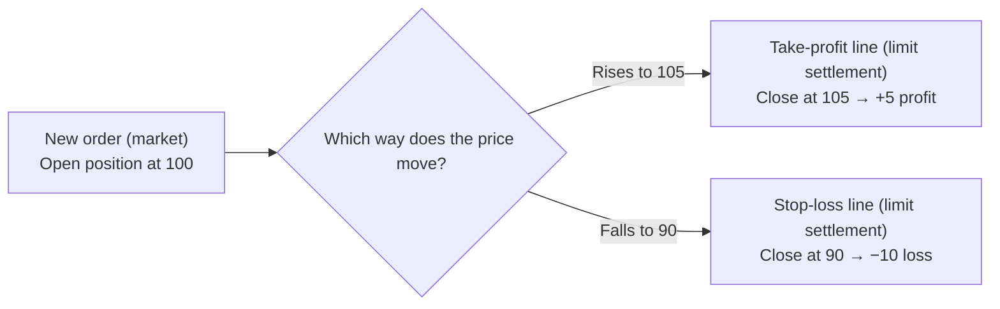

# CFD Notes

🇯🇵 [日本語版](./cfd.md)

### What is a CFD?
A CFD is one type of financial derivative. A derivative is a trade
whose price is derived from (depends on) the price of an underlying
asset. The four main types are:

- Futures: a contract to buy or sell a specific asset at a price
  agreed today, for delivery/settlement on a set future date (e.g.,
  Nikkei 225 futures)
- Options: the right (not the obligation) to buy or sell a specific
  asset at a price agreed today, exercisable on a set future date
- Swaps: an agreement between two parties to exchange different cash
  flows (e.g., interest rates, currencies) over a period
- CFDs (Contracts for Difference): a trade with no physical delivery,
  where only the price difference between entry and exit is settled

So a CFD sits alongside futures, options, and swaps as one of the
four main types of derivatives.

"CFD" stands for "Contract for Difference." In Japanese it's called
差金決済取引 (sakin-kessai torihiki) — literally "difference-
settlement trading."

"Difference settlement" means no physical delivery of the underlying
(a stock, oil, a stock index, etc.) ever happens — only the price
difference from entry to exit changes hands. For example, if you buy
at 100 and sell at 120, you never actually receive 100 worth of the
underlying or hand over 120 worth of it; only the 20 difference is
settled.

FX (foreign exchange trading), something people hear about
constantly, is actually a type of CFD too — you can think of FX as
"a CFD on a currency pair." CFD is the umbrella category, and equity
indices, commodities, and FX all sit inside it.

#### Why can you trade without holding the underlying?
A CFD is built by referencing the price of an underlying asset (a
stock, a commodity, etc.), but it doesn't require the full amount of
capital that buying the underlying outright would. Since a CFD only
settles the price difference, it lets you trade with less capital
(this connects to the idea of leverage, covered in its own section).

Trading the physical underlying also comes with the hassle of
delivery. For something like WTI crude oil, if you keep holding a
futures position past its contract month, physical delivery would
normally be triggered. With a CFD, the broker handles all of that
delivery-related work on the client's behalf, so the client can just
focus on the difference-settlement trade without ever having to
think about the underlying itself.

On top of that, physical trading is only possible while the relevant
exchange is open, whereas CFDs can be traded overnight and on
holidays too.

#### A concrete example: what is a CFD actually referencing?
What a CFD's price actually tracks depends on the product type.

- Japan 225: tracks the price of Nikkei 225 futures as traded on an
  exchange. Which exchange is used as the reference varies by
  broker, but SGX (Singapore Exchange) and CME (Chicago Mercantile
  Exchange) are common examples.
- WTI Crude Oil: similarly, tracks the price of WTI crude oil futures
  traded on an exchange.
- ETF-type CFDs, such as a US semiconductor ETF CFD: tracks the
  price of the ETF itself. A CFD on a US semiconductor ETF, for
  example, tracks the actual price movement of a real ETF like the
  iShares Semiconductor ETF. Note that buying the ETF itself and
  trading a CFD that references it are two different things (see
  Note ① below).
- Products with no exchange involved, like FX or precious metals:
  tracks the spot price, which is set through direct bilateral
  trading between financial institutions rather than on an exchange
  (see Note ② below).

So depending on the product, a CFD is built on top of one of three
types of reference price: futures, an ETF, or a spot rate. The
"difference settlement" mechanism described above is common to all
of them, but what sits behind that mechanism is not uniform — that's
the key point.

---
Note ①: What is an ETF?

An ETF (Exchange Traded Fund) is a financial product designed to
track a stock index or commodity. The fund manager pools investor
capital to buy the underlying constituent stocks, so buying the ETF
gives you the same effect as being diversified across those
constituents (and you can receive distributions in place of
dividends). Buying the ETF itself requires the full purchase amount
and means you actually own (a share of) the underlying asset. A CFD,
by contrast, never involves owning the physical asset, so no
shareholder rights arise — it's purely a trade that settles the
difference between your entry price and your exit price.

Note ②: What is spot trading?

Spot trading is a trade where physical delivery is completed within
a short period after the trade is agreed (normally within two
business days). It doesn't go through an exchange — the price is
based on rates exchanged directly between financial institutions.

#### Where does operations (me) fit into a CFD?
Keeping a CFD product running touches many different areas of
operations work. Here's the overall picture; the details of each
area are covered in their own sections (rollover, leverage and
margin, etc.).

- Market and risk management: monitoring market conditions (circuit
  breakers, stock-lending restrictions, etc.), assessing and
  adjusting client position risk, monitoring risk exposure, watching
  for stop-outs (forced liquidation), and checking quoted rates for
  anomalies
- Product operations: handling corporate actions (new listings,
  spin-offs, stock splits, mergers, etc.), tracking exchange
  schedules, determining and applying price adjustment amounts,
  rolling contract months over, and hedging
- Administration and compliance: reconciliation (matching the books
  against actual balances), verifying segregation of client assets,
  preparing reports for regulators (the FSA, the Financial Futures
  Association, etc.), and handling KYC (know your customer) / AML
  (anti-money laundering)
- System operations: incident response, maintaining fallback
  procedures under the business continuity plan (BCP), and
  pre-release testing (UAT) for new products

In short, keeping a single CFD product running requires several
roles working together: getting the price right, managing risk,
staying compliant, and keeping systems running reliably.

#### Where my three-years-ago self would get stuck
By this point, a lot of terms — CFD, FX, ETF, futures, spot trading
— have come up all at once. Rather than trying to understand
everything together, it helps to pick one product and go deep on
that first.

With WTI crude oil, for example, you can follow one thread: "the
rate is built from a futures price that has a contract month" →
"when the settlement date arrives, a rollover is normally required"
→ "operations handles that hassle on the client's behalf, so the
client can keep trading without doing anything." Once you understand
that chain for one product, it carries over to the others. The thing
underneath it all is that a CFD is always a trade based on a price
difference, with no physical delivery.

A few other misconceptions beginners often run into:

- Assuming "trading with less capital" means "borrowing money": a
  CFD isn't a loan — it lets you trade with less capital precisely
  because it only settles the price difference.
- Assuming a CFD's price exactly matches the futures or ETF price it
  references: a CFD's price includes things like the spread (the gap
  between the bid and ask), so it can differ slightly from the
  reference price (see Note ③ below).
- Assuming that trading a stock or ETF via CFD means you "bought the
  stock": since a CFD never involves owning the physical asset, none
  of the rights that come with being a shareholder (voting rights,
  shareholder perks, etc.) apply.

Note ③: What is the spread (offer / bid)?

A CFD's price is always quoted as two values side by side.

- Offer rate (Ask): the price quoted by whoever wants to sell. If
  you're buying, this is the price you buy at.
- Bid rate (Bid): the price quoted by whoever wants to buy. If you're
  selling, this is the price you sell at.

The offer (the seller's asking price) is normally higher than the
bid (the buyer's asking price). The gap between the two is the
"spread," and it's the CFD's real trading cost.

### Why does a CFD exist as a product? (How it differs from the physical asset)
Trading the physical asset means owning the asset itself — stocks,
bonds, currencies, interest-rate instruments, gold, oil, and so on —
and buying or selling it involves actual delivery of that asset.

A CFD treats that same underlying asset as its "reference" and only
settles the price difference. With a CFD, there's no delivery of the
underlying, and none of the rights that come with it (like
shareholder rights) ever arise.

#### Why trade a CFD instead of buying the physical asset?
Compared with trading the physical asset, a CFD offers several
advantages:

- No trading commission: CFDs are usually commission-free (the
  spread is the real cost instead).
- No physical delivery: since only the price difference changes
  hands, there's no storage, transport, or delivery hassle at all.
- Leverage: a small amount of margin gives you the same effect as
  trading a much larger position.
- Easier to short: you can't sell the physical asset without holding
  it first, but a CFD can be opened with a new short position, so you
  can aim to profit even when prices are falling.
- One account across products and markets: products that would
  normally require separate accounts — Japanese stocks, US stocks,
  oil, FX — can all be traded from a single account.
- No need to open an overseas brokerage account: you can trade CFDs
  on US stocks or overseas commodities from Japan, for example,
  without the hassle of opening an account with a local broker.
- Smaller trade sizes: physical stocks often have to be bought in
  round lots (e.g., 100-share units), whereas CFDs can often be
  traded in smaller units.
- Dividend-equivalent adjustments (for equity index and single-stock
  CFDs): you're not a shareholder, but you still receive an
  adjustment amount equivalent to the dividend when one is paid
  (and pay the equivalent if you're short).
- Trade nearly 24 hours a day, including nights and holidays: not
  limited to exchange hours — many products can be traded overnight,
  including overseas markets.

#### A concrete example: physical WTI crude oil vs. WTI crude oil CFD
To see the difference concretely, compare WTI crude oil futures
(physical) with a WTI crude oil CFD.

| Item | Physical WTI crude oil | WTI crude oil CFD |
|---|---|---|
| Delivery | Physical delivery is triggered when the contract month arrives; avoiding it requires rolling over yourself | No delivery ever happens; the broker handles the rollover on your behalf |
| Capital required | The full trade amount | Margin only (leverage applies) |
| Short selling | Requires borrowing the physical asset first — costly and cumbersome | Can be opened directly as a new short position |
| Trading hours | Limited to the crude oil futures exchange's hours | Often tradable overnight and on holidays |
| Storage / incidental costs | Storage and transport costs can apply | No concept of storage; costs are folded into things like the spread |

So even though the underlying price movement is identical, that one
difference — whether or not you hold the physical asset — cascades
into differences in capital, risk management, and trading
flexibility.

#### Where does operations (me) notice the difference between physical and CFD trading?
Because a CFD never holds the physical asset, it creates operations
work that has no counterpart in physical trading. In practice, this
difference shows up especially in:

- Rollover (rolling the contract month): the rollover process itself
  is unique to CFDs and has no equivalent in physical trading
- Managing the adjustment amount: calculating and applying the
  adjustment that offsets the price discontinuity caused by rollover
- Risk management: because leverage is in play, position risk can
  grow larger than in physical trading, so it needs to be monitored
  and adjusted
- Managing the reference exchange's trading hours: a CFD itself can
  trade overnight and on holidays, but the futures or physical
  exchange it references still has set trading hours, so those hours
  and schedules need to be tracked
- Generating rates from the reference contract month's price: a
  CFD's price isn't set independently — it's generated from the
  price of the contract month it references, so that link has to be
  maintained
- Managing trade units: CFDs are sometimes traded in different units
  from the physical asset, which needs its own setup and management
- Setting and maintaining margin rates / leverage ratios: offering
  leverage means monitoring margin levels and handling cases where
  margin falls short
- Setting and monitoring stop-out levels: managing the forced-
  liquidation mechanism itself, which has no equivalent in physical
  trading
- Setting spreads: instead of a trading commission like physical
  assets have, managing the CFD-specific cost structure (the gap
  between bid and ask)
- Maintaining the contract-month master data: managing the master
  data for which contract month is referenced until when (the
  foundation that rollover depends on)
- Managing the yen-conversion rate: setting the FX conversion rate
  used when offering an overseas product priced in yen

In short, the defining feature of a CFD — not holding the physical
asset — is exactly what adds these extra management items (price,
risk, timing, units) to the operations side.

#### Where my three-years-ago self would get stuck
"The price moves exactly like the physical asset, so why does a
separate product called a CFD even exist?" — that might be your
first reaction. "Why not just trade the physical asset directly?"

But trading the physical asset directly means you'd have to roll
over the position yourself every time the contract month arrives —
which is a hassle, and if you got it wrong, you could actually end
up with the physical asset (crude oil or some other commodity)
delivered to you. A CFD exists precisely because the broker takes on
that hassle and delivery risk on your behalf.

That said, this doesn't mean "a CFD is simply the better deal." A
CFD carries its own cost — the spread (the gap between bid and ask)
— and because leverage is in play, unrealized losses can grow faster
than they would with the physical asset. "No delivery, so it's
convenient" and "lower risk" are two different things, and using a
CFD means understanding its specific costs and risks too.

### Leverage and Margin

#### What is leverage, in a nutshell?
Leverage is a mechanism that lets you trade an amount many times
larger than the margin (the money you deposit as collateral) you put
up. In Japan, you can trade up to 25 times your margin.

For example, if you deposit ¥100,000 as margin, 25x leverage lets
you trade a position worth ¥2,500,000. In other words, even though
the capital you actually put up is ¥100,000, you receive the full
price movement on ¥2,500,000 as your P&L.

#### What is margin, and how does it relate to leverage?
Margin is the money you deposit with the broker as collateral in
order to trade.

Leverage is the mechanism of trading many times the amount of that
margin, so margin and leverage are two sides of the same coin. The
ratio of the margin you actually deposit to the trade amount you
want to trade is called the "margin rate," and leverage is the
inverse of the margin rate (e.g., a 4% margin rate = 25x leverage).

Margin isn't just the "initial margin" needed to open a position —
it also acts as a cushion that absorbs any unrealized loss. The
ratio of your account's remaining equity (effective margin) to the
required margin is called the "margin level" (or maintenance
margin ratio). When this level falls below a certain threshold, the
broker may ask for additional margin (a margin call) or forcibly
close the position (a stop-out).

#### A concrete example: with X margin and Y leverage, how large a trade can you make?
Take a Japan 225 CFD as an example. You deposit ¥100,000 as margin
and trade at 25x leverage.

- Tradable amount: ¥100,000 × 25 = ¥2,500,000
- Margin rate: 1 ÷ 25 = 4%
- Required margin (the margin needed to trade ¥2,500,000 worth): ¥2,500,000 × 4% = ¥100,000

So "trade amount × margin rate" gives you the required margin, and
"margin × leverage" (or "margin ÷ margin rate") gives you the
tradable amount.

#### Where does operations (me) step in when margin runs short (a margin call)?
The margin level is calculated as "account equity (effective margin)
÷ required margin × 100%." What happens next depends on how far the
level has dropped — but the exact thresholds and grace periods vary
by broker. The following is just one illustrative example.

- If the margin level is below 100% and carries over into the next
  business day: there's a grace period. If the client tops up margin
  (a margin call payment) or closes part of the position to bring
  the level back up before a set deadline (e.g., by the end of the
  next business day), forced liquidation of the entire position can
  be avoided. If the deadline passes without resolution, the broker
  closes the entire position.
- If the margin level falls below a certain threshold (e.g., 50%):
  there's no grace period at all. The instant it crosses that line,
  the entire position is forcibly closed (a stop-out). This also
  serves as a safeguard to keep the client's losses from growing any
  further.

Operations continuously monitors margin levels account by account,
sends margin-call notices to accounts that cross the threshold with
a grace period, and confirms that the stop-out process has run
correctly for accounts that cross the no-grace-period threshold.

#### Where my three-years-ago self would get stuck
- Assuming leverage means "trading with borrowed money": leverage
  isn't a loan — it's a mechanism for trading a multiple of your
  margin, which serves as collateral. If an unrealized loss exceeds
  the margin, the position is forcibly closed; the system isn't
  designed around the idea of taking on debt beyond your margin.
- Assuming you should always use the maximum leverage available:
  being able to trade at up to 25x doesn't mean 25x is the normal
  way to trade. The higher the leverage, the faster the margin level
  can drop from even a small price move, so it's common practice to
  keep some buffer rather than using the full amount.
- Treating a 100% margin level as a "safe line": in reality, once the
  level drops below 100% it's already subject to a margin call. To
  keep trading safely, you need to maintain a level comfortably above
  100%.
- Confusing a margin call with a stop-out: a margin call comes with a
  grace period — resolving it in time avoids forced liquidation — but
  a stop-out closes everything instantly, with no grace period. The
  triggering margin level and the room to respond are both different
  between the two.

### What Is Cash Settlement?

> The basic definition of cash settlement ("a trade with no physical
> delivery, where only the price difference between entry and exit
> is settled") was already covered under "What is a CFD?" This
> section builds on that and goes deeper into three angles: when
> P&L is actually locked in, how P&L is calculated across multiple
> trades, and what operations does with settlement itself.

#### When exactly is P&L on a cash-settled trade locked in?
With cash settlement, P&L is locked in at the moment you place an
opposite trade (a closing order) against your open position. While a
position stays open, its unrealized P&L just fluctuates with every
price move — it isn't yet locked in as anything real.

There are two basic ways to place an order:

- Market order: executes immediately at whatever rate is showing
  right now
- Limit order: executes once the rate reaches a rate you specified
  in advance

Either type can be used both to open a position (a new order) and to
close one (a settlement order).

| | New order (opening a position) | Settlement order (closing a position) |
|---|---|---|
| **Market** | Opens a new position immediately at the current rate | Closes the position immediately at the current rate |
| **Limit** | Opens a new position once the specified rate is reached | Closes the position once the specified rate is reached |

A settlement order can either lock in a profit ("take-profit") or
lock in a loss ("stop-loss"), and either can be placed as a market
or a limit order.

For example, say you open a position with a market order at 100. If
you want to lock in a profit once the price reaches 105, you place a
limit settlement order (take-profit) at 105. Conversely, if you want
to cap your loss in case the price falls to 90, you place a limit
settlement order (stop-loss) at 90.

Setting take-profit and stop-loss lines in advance like this lets
you lock in P&L without having to watch the price constantly.

#### A concrete example: how is P&L calculated across multiple trades? (The idea of average execution price)
When you trade the same product multiple times — adding to a
position in stages — P&L is calculated based on the "average
execution price."

**Adding to a long position across multiple trades**

| Trade | Execution rate |
|---|---|
| 1st (opening) | 100 |
| 2nd (add) | 103 |
| 3rd (add) | 105 |
| 4th (add) | 104 |
| **Average execution price** | (100+103+105+104) ÷ 4 = **103** |

Since the average execution price is 103, closing above 103 produces
a profit, and closing below it produces a loss.

**Adding to a short position across multiple trades**

Say you open a short at 100, expecting the price to fall. Instead,
it rises, so you add to the short at 103. It keeps rising to 105 and
you add there too, then it starts to turn, so you add once more at
104.

| Trade | Execution rate |
|---|---|
| 1st (opening) | 100 |
| 2nd (add) | 103 |
| 3rd (add) | 105 |
| 4th (add) | 104 |
| **Average execution price** | (100+103+105+104) ÷ 4 = **103** |

For a short, it works the other way around from a long: closing
below the average execution price produces a profit. Looking only at
the original 100 entry, it might seem like you were sitting on an
unrealized loss once the rate ran up to 105 — but measured against
the average execution price (103), the position turns profitable
again once the rate falls back below 103.

#### Where does operations (me) touch the settlement process itself?
- Managing positions net, not gross: on the broker's side, client
  positions aren't tracked gross (keeping every short and every long
  as separate entries) — they're tracked net (shorts and longs offset
  into a single combined position). This is exactly the "average
  execution price" idea from above playing out in practice: no
  matter how many trades a client makes, they collapse into one net
  position in the end.
- Correcting executions after a rate-feed problem: if the rate feed
  malfunctions, a trade can end up executed at an incorrect rate.
  When that happens, operations manually corrects it to the right
  rate and notifies the affected client.
- Reconciling settlements: checking that a client's settlement result
  matches both the internal system's records and the cover
  counterparty's (LP/PB) records. This is the settlement-side
  counterpart to the position reconciliation described under Long
  and Short.
- Confirming P&L and balance updates: verifying that P&L locked in by
  a settlement is correctly reflected in the client's account
  balance.
- Handling slippage: for a limit settlement order, the actual
  execution rate can differ from the rate the client specified
  (slippage). Operations checks whether that gap exceeds the
  acceptable tolerance and responds if it does.

#### Where my three-years-ago self would get stuck
- Treating unrealized P&L as if it were already locked in: no matter
  how large an unrealized gain or loss looks, it's just a mark-to-
  market number until a settlement order actually executes. P&L is
  only locked in once that happens.
- Assuming multiple trades are tracked separately: in practice, the
  broker tracks positions net rather than gross, so what matters is
  the single "average execution price," not each individual trade's
  rate. It's more useful in practice to watch where the average
  execution price sits than to react to every price swing along the
  way.
- Assuming a limit settlement order guarantees execution at exactly
  that rate: because of slippage and rate-feed conditions, the actual
  execution rate can differ from the rate you specified.

### Long and Short

#### What are long and short, in a nutshell?
Long (buy) and short (sell) describe the "direction" of a trade.

- Holding a long: holding a buy position. You profit if the price
  rises above the price you entered at.
- Holding a short: holding a sell position. You profit if the price
  falls below the price you entered at.

Closing a position (settlement) is done with a trade in the opposite
direction:

- A long is closed by selling (going short)
- A short is closed by buying (going long)

So a long is "enter by buying, finish by selling," and a short is
"enter by selling, finish by buying" — mirror images of each other.

#### Why can a CFD be opened with a sell? (How it differs from the physical asset)
In physical trading, you can't sell something you don't hold. A CFD,
on the other hand, uses "difference settlement," so it's a trade
where only the price difference from entry to exit changes hands.

"Opening with a sell" means you hold the right to receive the
difference between your sell price and the price you later buy back
at, along with the obligation to buy it back. At settlement, you
exercise that right and obligation, which locks in the difference as
your realized P&L.

This is what makes it possible to short-sell without holding the
physical asset. Unlike margin trading in stocks, there's no need to
borrow shares from a broker and pay interest on them.

Here's an analogy: imagine borrowing a game console from a friend
and selling it for ¥1,000, then later buying it back and returning
it to your friend. If the buy-back price has fallen to ¥800 by then,
the ¥200 difference between your ¥1,000 sale and ¥800 buy-back is
your profit. That's the basic mechanics of short-selling. With a
CFD, the broker handles this entire "borrow, sell, buy back, return"
process behind the scenes, so the client only ever has to think
about the exchange of rights and obligations — i.e., holding a short
position.

#### Stock lending and short-selling restrictions
A CFD itself is cash-settled, so looking only at the trade with the
client, there's no need to borrow any physical shares. But the
broker sometimes hedges (covers) the risk from a client's short
position in the actual stock market (more on this under "The idea
behind cover deals"). When that hedge requires the broker — or
whoever the broker covers with — to sell the physical stock, they
need to borrow it from somewhere first, just as in margin trading.
This is called "stock lending."

How stock lending works:

- An investor holding shares lends them to a broker. In return, the
  lender earns interest (often higher than a bank deposit rate).
  While the shares are on loan, the lender can still sell them on
  the market as normal at any time.
- The broker re-lends the shares it collects this way to
  institutional investors or margin traders who want to short-sell,
  earning a fee in the process.

In other words, opening a short in the physical stock market always
requires one extra step: borrowing shares from someone.

When shares can't be borrowed, the broker can no longer hedge in the
physical market. Continuing to accept short positions without being
able to hedge would leave the broker itself carrying directional
risk (a loss if the market moves the wrong way). So for any stock
where shares aren't available to borrow, the broker has no choice
but to restrict new short trades on that product.

This isn't purely up to the broker either — it's tied to exchange-
level rules (short-selling restrictions such as Japan's "Rule 201")
and to any stock-lending restrictions imposed on the broker's own
cover counterparty. When a broker offering CFDs over the counter
sees its cover counterparty hit a stock-lending restriction, it
restricts new client short-selling accordingly.

#### A concrete example: what happens to P&L, long vs. short, when the price rises or falls?
Say you trade one unit of the Japan 225 CFD at 24,000.

| Position | Entry price | Exit price | P&L calculation | Result |
|---|---|---|---|---|
| Long | 24,000 | 24,500 (up) | 24,500 − 24,000 | +500 profit |
| Long | 24,000 | 23,500 (down) | 23,500 − 24,000 | −500 loss |
| Short | 24,000 | 23,500 (down) | 24,000 − 23,500 | +500 profit |
| Short | 24,000 | 24,500 (up) | 24,000 − 24,500 | −500 loss |

So a long's P&L is "exit price − entry price," and a short's P&L is
"entry price − exit price." When the price rises, longs gain and
shorts lose; when it falls, the reverse happens — they're always
mirror images.

#### Where does operations (me) track and manage position direction?
Because a CFD is a bilateral (OTC) contract between the broker and
the client, the starting point is understanding the flip:
"client long → we're short," "client short → we're long." Operations
tracks and manages position direction with that relationship in
mind, in a few specific areas:

- Monitoring net position: each product has a defined risk tolerance
  for its net position. Operations watches the market, client limit
  orders, and technical signals to make fast hedging (cover)
  decisions that keep the net position within that tolerance. If it
  looks like it might be exceeded, more cover is added.
- Reconciling positions with cover counterparties: we check that our
  hedge positions match what our PB (prime broker) or LPs (liquidity
  providers) show on their side — looking for any "stray"
  transactions that exist on our side but not theirs, or vice versa.
  When a discrepancy turns up, we contact the LP to confirm rate
  discrepancies or whether a trade actually executed. This
  reconciliation happens at least once during each of the Tokyo,
  London, and New York sessions — in practice, about twice per
  session. Since positions are monitored continuously, a slipped
  execution usually triggers an alert, and each one leads to
  back-and-forth with the LP.
- Monitoring stop-outs and margin levels: shorts generally tend to
  run lower margin levels than longs, for two main reasons. First,
  the dividend-equivalent adjustment paid whenever a dividend is
  declared goes to longs and comes out of shorts, so a short
  position's equity erodes gradually over time purely from the
  passage of time. Second, equity indices and individual stocks tend
  to rise over the long run, so for the same volatility, shorts are
  statistically more likely to sit in an unrealized loss for
  extended periods. On top of that, when the market moves sharply in
  one direction during high volatility, it can burn through the
  margin of clients holding the opposite-direction position very
  quickly. A wave of client stop-outs can also increase the
  position the firm itself is carrying, with a risk that cover
  orders get rejected — so this needs constant monitoring.
- Short-specific regulatory response: when a stock-lending
  restriction or a short-selling restriction (such as Rule 201)
  comes into effect, new client short trades on that product are
  halted and a notice is posted on the client trading page. When the
  restriction is lifted, the lift date is posted on the client page
  as well.
- Reporting: trading volume, client stop-out activity, and related
  data are subject to reporting obligations, handled on a monthly
  basis.

#### Where my three-years-ago self would get stuck
- Assuming short = doing something bad: the word "short-selling" can
  sound like it's working against the market, but in a CFD, short is
  just one of two equally valid trade directions — no different in
  kind from long.
- Assuming that if the client profits, the firm profits too: because
  a CFD is a bilateral contract, when a client is long and profiting,
  the broker is theoretically sitting on the mirror-image short with
  an unrealized loss (in practice, hedging offsets this through the
  cover relationship, but looking only at the client relationship,
  it's the exact opposite).
- Picturing a CFD short the same way as "borrowing a stock": from
  the client's side, a CFD is cash-settled, so no shares are actually
  borrowed. Stock lending only comes into play when the broker hedges
  in the physical market — that's a separate layer from the client's
  own contract.
- Assuming shorts run lower margin "just because the market is
  going up": there's also a structural factor at play — the dividend
  adjustment paid out by shorts — so margin can erode over time even
  when the price isn't moving at all.

### How Are Rates Generated?
A CFD's rate is generated independently by the broker, based on the
exchange price of whatever it references (a futures contract or the
physical asset). The broker doesn't simply pass that reference price
straight through to clients, though.

A CFD's rate also isn't a single number — it's quoted as two values,
an ask (buy) and a bid (sell). The gap between those two values is
the spread, which is the CFD's real underlying cost.

#### How the referenced futures/physical price relates to the rate
A CFD's rate moves in step with the exchange price of whatever it
references (futures or physical). For products that roll over,
though, "which contract month is currently being referenced" has a
direct effect on the rate, which makes managing the reference month
especially important.

#### A concrete example: where do the rates for Japan 225 or WTI crude oil actually come from?
Raw exchange data is difficult to work with as-is, so it's usually
supplied in a cleaned-up form — as tick data or one-minute bars — by
major data vendors such as Bloomberg or Refinitiv. A broker offering
CFDs receives real-time data from one of these providers, layers on
adjustments like the spread, and generates the rate it quotes to
clients.

It's technically possible to source data directly from an exchange,
but that means setting up a connection and a contract with every
individual exchange, which adds development cost. If a broker offers
20 different products, for example, contracting with a data provider
is far more efficient — both contractually and in terms of system
development — than connecting individually to every exchange
involved (CME, ICE, NYSE, and so on).

Brokers also typically contract with more than one data provider, so
that an outage at one provider doesn't have to interrupt the rates
quoted to clients (more on this below).

#### Where does operations (me) monitor rate generation and distribution?
Operations continuously monitors two things: that rates never stop
flowing, and that they never drift away from where the market
actually is.

- Deciding on failover: if the main data provider has an outage and
  client-facing rates become abnormal (or stop being generated at
  all), the priority is the client — operations switches over to the
  secondary data provider. Before switching, operations checks the
  secondary provider's rate against actual market levels (using yet
  another provider not used for rate generation) to confirm there's
  no significant discrepancy. Investigating the root cause of the
  outage comes later; responding to clients comes first.
- Managing spread width: how wide the spread is set depends on the
  risk and cost profile of each product, and it's the broker that
  sets it.
- Monitoring for abnormal rates ("abort"): this doesn't refer to a
  sudden spike or drop in the market price itself — it refers to a
  mechanism that automatically halts processing before an incorrect
  rate reaches clients or the cover counterparty, when abnormal price
  movement is detected. That movement might reflect a genuine market
  event (a major economic data release, for example) or a data
  problem — the two can't be told apart in the moment. So the
  procedure is to pause distribution, confirm where the market
  actually is, and resume once there's no issue.

  Typical triggers for an abort include:
  - Stale pricing from latency: network delay causes a gap between
    the rate and the firm's own latest internal rate that exceeds a
    pre-set tolerance
  - Sharp volatility: around major economic data releases, for
    example, the market price moves so fast that price reliability
    temporarily can't be guaranteed
  - Detecting an outlier (a spike): the feed itself contains a bug or
    an abnormal value, and the system catches it

  Note that the rate generated for clients and the rate sent to the
  cover counterparty (an LP) are two different things, so a
  rejection on the cover side (so-called "last look") is, strictly
  speaking, a separate issue from rate generation. That said, using a
  cover side that's currently erroring out as a reference input for
  rate generation would be dangerous, so it's still something
  operations keeps in mind when monitoring rate generation (covered
  in more detail under "The idea behind cover deals").

  This term "abort" is internal shorthand — elsewhere in the
  industry it may be called "abnormal rate detection" or "price
  rejection."

- Post-trade monitoring: how often aborts happen, and which triggers
  are most common, is an important thing middle/back office keeps an
  eye on. A sudden spike in the abort rate, or an unnatural
  clustering of them, can be a sign of a system bug or a
  misconfiguration — so this monitoring includes reviewing order
  history and logs to confirm no client was unfairly disadvantaged.

#### Where my three-years-ago self would get stuck
Two points in particular are easy to mix up, so they're worth
spelling out a bit more.

**① Assuming "the rate is the exchange price itself"**

Looking at the rate on a CFD screen, it can look as if the exchange
price is simply flowing straight through. In reality, it goes
through three stages before it ever reaches the client: exchange
price → cleaned up by a data provider → generated into a final price
by the broker, spread and all.

In other words, a CFD's rate isn't "a copy of the exchange price" —
it's "a separate price the broker builds on top of the exchange
price." Not matching the reference price exactly isn't an anomaly;
it's simply how the mechanism works.

**② Treating "rate generation" and "cover (hedging)" as the same thing**

Everything described above under "rate generation" is purely about
what price gets shown to the client. Separately, "cover" — the
broker hedging its own risk externally — is about how the client's
order gets routed to a cover counterparty (an LP). These are two
different pieces of work, two different processes.

They can look connected, but they're not the same thing. For
example, rates can be generated and distributed to clients
completely normally while, separately, an order to the cover
counterparty gets rejected (last look). "Rates are being generated
correctly" doesn't necessarily mean "cover is also going through
correctly" — a distinction that's easy to conflate at first. This
gets covered in more depth under "The idea behind cover deals."

### What is a rollover?
A rollover involves two things happening together:
1. Rollover (contract rollover): When a futures contract reaches its
   contract month, delivery (settlement) becomes due. So the position
   is closed out and re-opened under a new contract month.
2. Reference month shift: The price reference moves from the near
   month to the far month.

A CFD itself has no expiry, but the futures contract it's based on
does — so a rollover is needed to keep the CFD running. The contract
month used as the reference is always the one with the highest
trading volume.

### Why does a rollover happen?
Futures contracts have a "contract month" — a promise for when and
at what price the underlying will be delivered in the future. When
that date arrives, delivery (settlement) is triggered. A CFD,
however, is cash-settled (no physical delivery), so before the
contract month's delivery date arrives, the position rolls over into
the next contract month. This happens shortly before the delivery
date — not on the day itself — and the exact timing varies by
product.

### What happens to the rate and position at rollover?
Whenever the "front month" (the contract month with the highest
trading volume at a given time) changes on the exchange, the
reference contract month rolls over to the next one. This is what
lets a CFD keep running indefinitely without ever expiring.

The moment the reference month changes, though, the price jumps
discontinuously — and so does the unrealized P&L on any open
position. To offset this, an adjustment amount is credited or
debited in the opposite direction of that P&L jump, so the rollover
itself leaves the client neither better nor worse off:

- Price rises at rollover → longs gain, so the adjustment is
  negative; shorts lose, so the adjustment is positive
- Price falls at rollover → longs lose, so the adjustment is
  positive; shorts gain, so the adjustment is negative

This adjustment amount is made up of two components:
1. **Interest adjustment** — a short-term interest equivalent for
   the time remaining to settlement. It reflects the interest-rate
   gap between holding the spot asset and holding a futures
   position, and it's baked into the futures price for every
   product type (indices, FX, metals, energy, commodities, etc.).
2. **Dividend adjustment** — the present value of expected future
   dividends. Since a company's value (and so its share price)
   drops by roughly the dividend amount when it's paid out, futures
   prices are set lower in advance to account for it. This only
   applies to equity indices — not to FX, metals, or energy, which
   pay no dividends.

The further out a contract month is, the more dividend payments
fall within its remaining life, so it trades at a correspondingly
lower price (for indices). As settlement approaches, the interest
component shrinks and the price converges toward the dividend-
adjusted level — ending up close to the spot price.

The adjustment is calculated as:
`(near-month mid − far-month mid) × contract size × FX conversion rate`

It's applied on the same day as the rollover, after that day's
trading closes.

### What does the operations side do at that point?
On a rollover day, operations handles four main tasks:
1. **Scheduling** — pull the rollover schedule from the data
   provider, confirm the dates, register them in the system, and
   publish the schedule to clients.
2. **Rolling the reference contract month** — verify the far
   month's price settings are correct, and confirm the switch to
   the new reference month is complete on the day itself.
3. **Settling the adjustment amount** — the system applies the
   adjustment to client accounts automatically, but since a wrong
   figure directly affects client P&L, checking it beforehand is
   critical.
4. **Rolling the cover position** — the firm's own hedging position
   (the other side of client positions) must also be closed and
   re-opened in the far month before settlement, and this needs to
   be confirmed as done *before* the adjustment day — unlike task 2,
   which is confirmed *on* the day itself.

### Summary
These pieces all trace back to a single thread: because the futures
contract behind a CFD always has an expiry and a contract month, the
CFD has to roll over to keep running without interruption. Rolling
over always creates a price discontinuity, which the adjustment
amount exists to offset — and that adjustment amount is itself built
from interest rates and (for some products) dividends, the very
things that shape the futures price in the first place. Rollover,
the adjustment, and interest/dividends aren't separate topics — they
all fall out of one fact: futures contracts expire.
