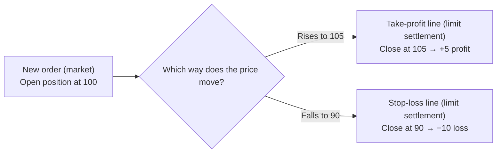

# CFD Notes

🇯🇵 [日本語版](./cfd.md)

### What is a CFD?
A CFD is one type of financial derivative. A derivative is a trade
whose price is derived from (depends on) the price of an underlying
asset. The four main types are:

- Futures: a contract to buy or sell a specific asset at a price
  agreed today, for delivery/settlement on a set future date (e.g.,
  Nikkei 225 futures)
- Options: the right (not the obligation) to buy or sell a specific
  asset at a price agreed today, exercisable on a set future date
- Swaps: an agreement between two parties to exchange different cash
  flows (e.g., interest rates, currencies) over a period
- CFDs (Contracts for Difference): a trade with no physical delivery,
  where only the price difference between entry and exit is settled

So a CFD sits alongside futures, options, and swaps as one of the
four main types of derivatives.

"CFD" stands for "Contract for Difference." In Japanese it's called
差金決済取引 (sakin-kessai torihiki) — literally "difference-
settlement trading."

"Difference settlement" means no physical delivery of the underlying
(a stock, oil, a stock index, etc.) ever happens — only the price
difference from entry to exit changes hands. For example, if you buy
at 100 and sell at 120, you never actually receive 100 worth of the
underlying or hand over 120 worth of it; only the 20 difference is
settled.

FX (foreign exchange trading), something people hear about
constantly, is actually a type of CFD too — you can think of FX as
"a CFD on a currency pair." CFD is the umbrella category, and equity
indices, commodities, and FX all sit inside it.

A CFD is an over-the-counter (OTC) product: the broker (dealer) and
the client enter into a one-to-one contract without going through an
exchange. In Japanese this is also called 相対取引 (aitai torihiki),
literally "face-to-face trading."

In exchange trading (say, exchange-traded equities), many buyers' and
sellers' orders sit together in an "order book," and price is set by
that supply and demand. A CFD doesn't use an order book at all — the
client trades against a price (rate) that the broker itself quotes.
This difference gives rise to a few characteristics:

- Because there's no rigid exchange-style specification (lot sizes,
  expiry dates, and so on), the broker has room to set terms
  flexibly. This flexibility is also why "rollover" exists as a
  concept for CFDs — the broker can roll a position forward on its
  own even though the underlying futures contract it references has
  a fixed contract month (covered in the rollover section).
- The broker quotes a buy price (Ask) and a sell price (Bid), and the
  difference between them — the spread — is effectively the cost of
  the trade.
- Because there's no exchange or clearing house guaranteeing
  settlement, there's a risk that the counterparty (the broker)
  could fail to honor the contract, e.g., through insolvency
  (counterparty risk).

How the spread gets decided, and how the broker deals with the risk
it picks up from trading with clients, are covered later under "How
Are Rates Generated?" and "The Idea Behind Cover Deals."

#### Why can you trade without holding the underlying?
A CFD is built by referencing the price of an underlying asset (a
stock, a commodity, etc.), but it doesn't require the full amount of
capital that buying the underlying outright would. Since a CFD only
settles the price difference, it lets you trade with less capital
(this connects to the idea of leverage, covered in its own section).

Trading the physical underlying also comes with the hassle of
delivery. For something like WTI crude oil, if you keep holding a
futures position past its contract month, physical delivery would
normally be triggered. With a CFD, the broker handles all of that
delivery-related work on the client's behalf, so the client can just
focus on the difference-settlement trade without ever having to
think about the underlying itself.

On top of that, physical trading is only possible while the relevant
exchange is open, whereas CFDs can be traded overnight and on
holidays too.

#### A concrete example: what is a CFD actually referencing?
What a CFD's price actually tracks depends on the product type.

- Japan 225: tracks the price of Nikkei 225 futures as traded on an
  exchange. Which exchange is used as the reference varies by
  broker, but SGX (Singapore Exchange) and CME (Chicago Mercantile
  Exchange) are common examples.
- WTI Crude Oil: similarly, tracks the price of WTI crude oil futures
  traded on an exchange.
- ETF-type CFDs, such as a US semiconductor ETF CFD: tracks the
  price of the ETF itself. A CFD on a US semiconductor ETF, for
  example, tracks the actual price movement of a real ETF like the
  iShares Semiconductor ETF. Note that buying the ETF itself and
  trading a CFD that references it are two different things (see
  Note ① below).
- Products with no exchange involved, like FX or spot gold: tracks
  the spot price, which is set through direct bilateral trading
  between financial institutions rather than on an exchange (see
  Note ② below). Note that some precious-metal CFDs reference
  futures instead (see "Examples by Product Type").

So depending on the product, a CFD is built on top of one of three
types of reference price: futures, an ETF, or a spot rate. The
"difference settlement" mechanism described above is common to all
of them, but what sits behind that mechanism is not uniform — that's
the key point.

---
Note ①: What is an ETF?

An ETF (Exchange Traded Fund) is a financial product designed to
track a stock index or commodity. The fund manager pools investor
capital to buy the underlying constituent stocks, so buying the ETF
gives you the same effect as being diversified across those
constituents (and you can receive distributions in place of
dividends). Buying the ETF itself requires the full purchase amount
and means you actually own (a share of) the underlying asset. A CFD,
by contrast, never involves owning the physical asset, so no
shareholder rights arise — it's purely a trade that settles the
difference between your entry price and your exit price.

Note ②: What is spot trading?

Spot trading is a trade where physical delivery is completed within
a short period after the trade is agreed (normally within two
business days). It doesn't go through an exchange — the price is
based on rates exchanged directly between financial institutions.

#### Where does operations (me) fit into a CFD?
Keeping a CFD product running touches many different areas of
operations work. Here's the overall picture; the details of each
area are covered in their own sections (rollover, leverage and
margin, etc.).

- Market and risk management: monitoring market conditions (circuit
  breakers, stock-lending restrictions, etc.), assessing and
  adjusting client position risk, monitoring risk exposure, watching
  for stop-outs (forced liquidation), and checking quoted rates for
  anomalies
- Product operations: handling corporate actions (new listings,
  spin-offs, stock splits, mergers, etc.), tracking exchange
  schedules, determining and applying price adjustment amounts,
  rolling contract months over, and hedging
- Administration and compliance: reconciliation (matching the books
  against actual balances), verifying segregation of client assets,
  preparing reports for regulators (the FSA, the Financial Futures
  Association, etc.), and handling KYC (know your customer) / AML
  (anti-money laundering)
- System operations: incident response, maintaining fallback
  procedures under the business continuity plan (BCP), and
  pre-release testing (UAT) for new products

In short, keeping a single CFD product running requires several
roles working together: getting the price right, managing risk,
staying compliant, and keeping systems running reliably.

#### Where my three-years-ago self would get stuck
By this point, a lot of terms — CFD, FX, ETF, futures, spot trading
— have come up all at once. Rather than trying to understand
everything together, it helps to pick one product and go deep on
that first.

With WTI crude oil, for example, you can follow one thread: "the
rate is built from a futures price that has a contract month" →
"when the settlement date arrives, a rollover is normally required"
→ "operations handles that hassle on the client's behalf, so the
client can keep trading without doing anything." Once you understand
that chain for one product, it carries over to the others. The thing
underneath it all is that a CFD is always a trade based on a price
difference, with no physical delivery.

A few other misconceptions beginners often run into:

- Assuming "trading with less capital" means "borrowing money": a
  CFD isn't a loan — it lets you trade with less capital precisely
  because it only settles the price difference.
- Assuming a CFD's price exactly matches the futures or ETF price it
  references: a CFD's price includes things like the spread (the gap
  between the bid and ask), so it can differ slightly from the
  reference price (see Note ③ below).
- Assuming that trading a stock or ETF via CFD means you "bought the
  stock": since a CFD never involves owning the physical asset, none
  of the rights that come with being a shareholder (voting rights,
  shareholder perks, etc.) apply.

Note ③: What is the spread (offer / bid)?

A CFD's price is always quoted as two values side by side.

- Offer rate (Ask): the price quoted by whoever wants to sell. If
  you're buying, this is the price you buy at.
- Bid rate (Bid): the price quoted by whoever wants to buy. If you're
  selling, this is the price you sell at.

The offer (the seller's asking price) is normally higher than the
bid (the buyer's asking price). The gap between the two is the
"spread," and it's the CFD's real trading cost.

### Why does a CFD exist as a product? (How it differs from the physical asset)
Trading the physical asset means owning the asset itself — stocks,
bonds, currencies, interest-rate instruments, gold, oil, and so on —
and buying or selling it involves actual delivery of that asset.

A CFD treats that same underlying asset as its "reference" and only
settles the price difference. With a CFD, there's no delivery of the
underlying, and none of the rights that come with it (like
shareholder rights) ever arise.

#### Why trade a CFD instead of buying the physical asset?
Compared with trading the physical asset, a CFD offers several
advantages:

- No trading commission: CFDs are usually commission-free (the
  spread is the real cost instead).
- No physical delivery: since only the price difference changes
  hands, there's no storage, transport, or delivery hassle at all.
- Leverage: a small amount of margin gives you the same effect as
  trading a much larger position.
- Easier to short: you can't sell the physical asset without holding
  it first, but a CFD can be opened with a new short position, so you
  can aim to profit even when prices are falling.
- One account across products and markets: products that would
  normally require separate accounts — Japanese stocks, US stocks,
  oil, FX — can all be traded from a single account.
- No need to open an overseas brokerage account: you can trade CFDs
  on US stocks or overseas commodities from Japan, for example,
  without the hassle of opening an account with a local broker.
- Smaller trade sizes: physical stocks often have to be bought in
  round lots (e.g., 100-share units), whereas CFDs can often be
  traded in smaller units.
- Dividend-equivalent adjustments (for single-stock and ETF CFDs):
  you're not a shareholder, but you still receive an adjustment
  amount equivalent to the dividend when one is paid (and pay the
  equivalent if you're short). For equity index CFDs that reference
  futures, the dividend is already priced into the futures and is
  settled through the price adjustment at rollover instead (see
  "Examples by Product Type").
- Trade nearly 24 hours a day, including nights and holidays: not
  limited to exchange hours — many products can be traded overnight,
  including overseas markets.

#### A concrete example: physical WTI crude oil vs. WTI crude oil CFD
To see the difference concretely, compare WTI crude oil futures
(physical) with a WTI crude oil CFD.

| Item | Physical WTI crude oil | WTI crude oil CFD |
|---|---|---|
| Delivery | Physical delivery is triggered when the contract month arrives; avoiding it requires rolling over yourself | No delivery ever happens; the broker handles the rollover on your behalf |
| Capital required | The full trade amount | Margin only (leverage applies) |
| Short selling | Requires borrowing the physical asset first — costly and cumbersome | Can be opened directly as a new short position |
| Trading hours | Limited to the crude oil futures exchange's hours | Often tradable overnight and on holidays |
| Storage / incidental costs | Storage and transport costs can apply | No concept of storage; costs are folded into things like the spread |

So even though the underlying price movement is identical, that one
difference — whether or not you hold the physical asset — cascades
into differences in capital, risk management, and trading
flexibility.

#### Where does operations (me) notice the difference between physical and CFD trading?
Because a CFD never holds the physical asset, it creates operations
work that has no counterpart in physical trading. In practice, this
difference shows up especially in:

- Rollover (rolling the contract month): the rollover process itself
  is unique to CFDs and has no equivalent in physical trading
- Managing the adjustment amount: calculating and applying the
  adjustment that offsets the price discontinuity caused by rollover
  (for single stocks and spot products, this also includes
  registering and applying dividend and interest adjustments)
- Risk management: because leverage is in play, position risk can
  grow larger than in physical trading, so it needs to be monitored
  and adjusted
- Managing the reference exchange's trading hours: a CFD itself can
  trade overnight and on holidays, but the futures or physical
  exchange it references still has set trading hours, so those hours
  and schedules need to be tracked
- Generating rates from the reference contract month's price: a
  CFD's price isn't set independently — it's generated from the
  price of the contract month it references, so that link has to be
  maintained
- Managing trade units: CFDs are sometimes traded in different units
  from the physical asset, which needs its own setup and management
- Setting and maintaining margin rates / leverage ratios: offering
  leverage means monitoring margin levels and handling cases where
  margin falls short
- Setting and monitoring stop-out levels: managing the forced-
  liquidation mechanism itself, which has no equivalent in physical
  trading
- Setting spreads: instead of a trading commission like physical
  assets have, managing the CFD-specific cost structure (the gap
  between bid and ask)
- Maintaining the contract-month master data: managing the master
  data for which contract month is referenced until when (the
  foundation that rollover depends on)
- Managing the yen-conversion rate: setting the FX conversion rate
  used when offering an overseas product priced in yen

In short, the defining feature of a CFD — not holding the physical
asset — is exactly what adds these extra management items (price,
risk, timing, units) to the operations side.

#### Where my three-years-ago self would get stuck
"The price moves exactly like the physical asset, so why does a
separate product called a CFD even exist?" — that might be your
first reaction. "Why not just trade the physical asset directly?"

But trading the physical asset directly means you'd have to roll
over the position yourself every time the contract month arrives —
which is a hassle, and if you got it wrong, you could actually end
up with the physical asset (crude oil or some other commodity)
delivered to you. A CFD exists precisely because the broker takes on
that hassle and delivery risk on your behalf.

That said, this doesn't mean "a CFD is simply the better deal." A
CFD carries its own cost — the spread (the gap between bid and ask)
— and because leverage is in play, unrealized losses can grow faster
than they would with the physical asset. "No delivery, so it's
convenient" and "lower risk" are two different things, and using a
CFD means understanding its specific costs and risks too.

### Leverage and Margin

#### What is leverage, in a nutshell?
Leverage is a mechanism that lets you trade an amount many times
larger than the margin (the money you deposit as collateral) you put
up. For retail CFDs in Japan, the maximum leverage is set by law for
each product type: as of writing, 10x for equity indices, 20x for
commodities (oil, gold, etc.), and 5x for single stocks and ETFs (FX
is capped at 25x). These caps can change if the rules change. The caps
differ because volatility differs: a single stock can move sharply
on one company's earnings or news, so its cap is kept low.

For example, if you deposit ¥100,000 as margin on an equity index
CFD, 10x leverage lets you trade a position worth ¥1,000,000. In
other words, even though the capital you actually put up is
¥100,000, you receive the full price movement on ¥1,000,000 as your
P&L.

#### What is margin, and how does it relate to leverage?
Margin is the money you deposit with the broker as collateral in
order to trade.

Leverage is the mechanism of trading many times the amount of that
margin, so margin and leverage are two sides of the same coin. The
ratio of the margin you actually deposit to the trade amount you
want to trade is called the "margin rate," and leverage is the
inverse of the margin rate (e.g., a 10% margin rate = 10x leverage).

Margin isn't just the "initial margin" needed to open a position —
it also acts as a cushion that absorbs any unrealized loss. The
ratio of your account's remaining equity (effective margin) to the
required margin is called the "margin level" (or maintenance
margin ratio). When this level falls below a certain threshold, the
broker may ask for additional margin (a margin call) or forcibly
close the position (a stop-out).

#### A concrete example: with X margin and Y leverage, how large a trade can you make?
Take a Japan 225 CFD as an example. You deposit ¥100,000 as margin
and trade at 10x leverage, the cap for equity index CFDs.

- Tradable amount: ¥100,000 × 10 = ¥1,000,000
- Margin rate: 1 ÷ 10 = 10%
- Required margin (the margin needed to trade ¥1,000,000 worth): ¥1,000,000 × 10% = ¥100,000

So "trade amount × margin rate" gives you the required margin, and
"margin × leverage" (or "margin ÷ margin rate") gives you the
tradable amount.

#### Where does operations (me) step in when margin runs short (a margin call)?
The margin level is calculated as "account equity (effective margin)
÷ required margin × 100%." What happens next depends on how far the
level has dropped — but the exact thresholds and grace periods vary
by broker. The following is just one illustrative example.

- If the margin level is below 100% and carries over into the next
  business day: there's a grace period. If the client tops up margin
  (a margin call payment) or closes part of the position to bring
  the level back up before a set deadline (e.g., by the end of the
  next business day), forced liquidation of the entire position can
  be avoided. If the deadline passes without resolution, the broker
  closes the entire position.
- If the margin level falls below a certain threshold (e.g., 50%):
  there's no grace period at all. The instant it crosses that line,
  the entire position is forcibly closed (a stop-out). This also
  serves as a safeguard to keep the client's losses from growing any
  further.

Operations continuously monitors margin levels account by account,
sends margin-call notices to accounts that cross the threshold with
a grace period, and confirms that the stop-out process has run
correctly for accounts that cross the no-grace-period threshold.

#### Where my three-years-ago self would get stuck
- Assuming leverage means "trading with borrowed money": leverage
  isn't a loan — it's a mechanism for trading a multiple of your
  margin, which serves as collateral. If an unrealized loss exceeds
  the margin, the position is forcibly closed; the system isn't
  designed around the idea of taking on debt beyond your margin.
- Assuming you should always use the maximum leverage available:
  being able to trade up to the cap (e.g., 10x for an equity index
  CFD) doesn't mean trading at the full cap is the normal way to
  trade. The higher the leverage, the faster the margin level
  can drop from even a small price move, so it's common practice to
  keep some buffer rather than using the full amount.
- Treating a 100% margin level as a "safe line": in reality, once the
  level drops below 100% it's already subject to a margin call. To
  keep trading safely, you need to maintain a level comfortably above
  100%.
- Confusing a margin call with a stop-out: a margin call comes with a
  grace period — resolving it in time avoids forced liquidation — but
  a stop-out closes everything instantly, with no grace period. The
  triggering margin level and the room to respond are both different
  between the two.

### What Is Cash Settlement?

> The basic definition of cash settlement ("a trade with no physical
> delivery, where only the price difference between entry and exit
> is settled") was already covered under "What is a CFD?" This
> section builds on that and goes deeper into three angles: when
> P&L is actually locked in, how P&L is calculated across multiple
> trades, and what operations does with settlement itself.

#### When exactly is P&L on a cash-settled trade locked in?
With cash settlement, P&L is locked in at the moment you place an
opposite trade (a closing order) against your open position. While a
position stays open, its unrealized P&L just fluctuates with every
price move — it isn't yet locked in as anything real.

There are two basic ways to place an order:

- Market order: executes immediately at whatever rate is showing
  right now
- Limit order: executes once the rate reaches a rate you specified
  in advance

Either type can be used both to open a position (a new order) and to
close one (a settlement order).

| | New order (opening a position) | Settlement order (closing a position) |
|---|---|---|
| **Market** | Opens a new position immediately at the current rate | Closes the position immediately at the current rate |
| **Limit** | Opens a new position once the specified rate is reached | Closes the position once the specified rate is reached |

A settlement order can either lock in a profit ("take-profit") or
lock in a loss ("stop-loss"), and either can be placed as a market
or a limit order.

For example, say you open a position with a market order at 100. If
you want to lock in a profit once the price reaches 105, you place a
limit settlement order (take-profit) at 105. Conversely, if you want
to cap your loss in case the price falls to 90, you place a limit
settlement order (stop-loss) at 90.

```mermaid
graph LR
    A["New order (market)<br/>Open position at 100"] --> B{Which way does the price move?}
    B -->|Rises to 105| C["Take-profit line (limit settlement)<br/>Close at 105 → +5 profit"]
    B -->|Falls to 90| D["Stop-loss line (limit settlement)<br/>Close at 90 → −10 loss"]
```

Setting take-profit and stop-loss lines in advance like this lets
you lock in P&L without having to watch the price constantly.

#### A concrete example: how is P&L calculated across multiple trades? (The idea of average execution price)
When you trade the same product multiple times — adding to a
position in stages — P&L is calculated based on the "average
execution price."

**Adding to a long position across multiple trades**

| Trade | Execution rate |
|---|---|
| 1st (opening) | 100 |
| 2nd (add) | 103 |
| 3rd (add) | 105 |
| 4th (add) | 104 |
| **Average execution price** | (100+103+105+104) ÷ 4 = **103** |

Since the average execution price is 103, closing above 103 produces
a profit, and closing below it produces a loss.

**Adding to a short position across multiple trades**

Say you open a short at 100, expecting the price to fall. Instead,
it rises, so you add to the short at 103. It keeps rising to 105 and
you add there too, then it starts to turn, so you add once more at
104.

| Trade | Execution rate |
|---|---|
| 1st (opening) | 100 |
| 2nd (add) | 103 |
| 3rd (add) | 105 |
| 4th (add) | 104 |
| **Average execution price** | (100+103+105+104) ÷ 4 = **103** |

For a short, it works the other way around from a long: closing
below the average execution price produces a profit. Looking only at
the original 100 entry, it might seem like you were sitting on an
unrealized loss once the rate ran up to 105 — but measured against
the average execution price (103), the position turns profitable
again once the rate falls back below 103.

#### Where does operations (me) touch the settlement process itself?
- Managing positions net, not gross: on the broker's side, client
  positions aren't tracked gross (keeping every short and every long
  as separate entries) — they're tracked net (shorts and longs offset
  into a single combined position). This is exactly the "average
  execution price" idea from above playing out in practice: no
  matter how many trades a client makes, they collapse into one net
  position in the end.
- Correcting executions after a rate-feed problem: if the rate feed
  malfunctions, a trade can end up executed at an incorrect rate.
  When that happens, operations manually corrects it to the right
  rate and notifies the affected client.
- Reconciling settlements: checking that a client's settlement result
  matches both the internal system's records and the cover
  counterparty's (CP) records. This is the settlement-side
  counterpart to the position reconciliation described under Long
  and Short.
- Confirming P&L and balance updates: verifying that P&L locked in by
  a settlement is correctly reflected in the client's account
  balance.
- Handling slippage: for a limit settlement order, the actual
  execution rate can differ from the rate the client specified
  (slippage). Operations checks whether that gap exceeds the
  acceptable tolerance and responds if it does.

#### Where my three-years-ago self would get stuck
- Treating unrealized P&L as if it were already locked in: no matter
  how large an unrealized gain or loss looks, it's just a mark-to-
  market number until a settlement order actually executes. P&L is
  only locked in once that happens.
- Assuming multiple trades are tracked separately: in practice, the
  broker tracks positions net rather than gross, so what matters is
  the single "average execution price," not each individual trade's
  rate. It's more useful in practice to watch where the average
  execution price sits than to react to every price swing along the
  way.
- Assuming a limit settlement order guarantees execution at exactly
  that rate: because of slippage and rate-feed conditions, the actual
  execution rate can differ from the rate you specified.

### Long and Short

#### What are long and short, in a nutshell?
Long (buy) and short (sell) describe the "direction" of a trade.

- Holding a long: holding a buy position. You profit if the price
  rises above the price you entered at.
- Holding a short: holding a sell position. You profit if the price
  falls below the price you entered at.

Closing a position (settlement) is done with a trade in the opposite
direction:

- A long is closed by selling (going short)
- A short is closed by buying (going long)

So a long is "enter by buying, finish by selling," and a short is
"enter by selling, finish by buying" — mirror images of each other.

#### Why can a CFD be opened with a sell? (How it differs from the physical asset)
In physical trading, you can't sell something you don't hold. A CFD,
on the other hand, uses "difference settlement," so it's a trade
where only the price difference from entry to exit changes hands.

"Opening with a sell" means you hold the right to receive the
difference between your sell price and the price you later buy back
at, along with the obligation to buy it back. At settlement, you
exercise that right and obligation, which locks in the difference as
your realized P&L.

This is what makes it possible to short-sell without holding the
physical asset. Unlike margin trading in stocks, there's no need to
borrow shares from a broker and pay interest on them.

Here's an analogy: imagine borrowing a game console from a friend
and selling it for ¥1,000, then later buying it back and returning
it to your friend. If the buy-back price has fallen to ¥800 by then,
the ¥200 difference between your ¥1,000 sale and ¥800 buy-back is
your profit. That's the basic mechanics of short-selling. With a
CFD, the broker handles this entire "borrow, sell, buy back, return"
process behind the scenes, so the client only ever has to think
about the exchange of rights and obligations — i.e., holding a short
position.

#### Stock lending and short-selling restrictions
A CFD itself is cash-settled, so looking only at the trade with the
client, there's no need to borrow any physical shares. But the
broker sometimes hedges (covers) the risk from a client's short
position in the actual stock market (more on this under "The idea
behind cover deals"). When that hedge requires the broker — or
whoever the broker covers with — to sell the physical stock, they
need to borrow it from somewhere first, just as in margin trading.
This is called "stock lending."

How stock lending works:

- An investor holding shares lends them to a broker. In return, the
  lender earns interest (often higher than a bank deposit rate).
  While the shares are on loan, the lender can still sell them on
  the market as normal at any time.
- The broker re-lends the shares it collects this way to
  institutional investors or margin traders who want to short-sell,
  earning a fee in the process.

In other words, opening a short in the physical stock market always
requires one extra step: borrowing shares from someone.

When shares can't be borrowed, the broker can no longer hedge in the
physical market. Continuing to accept short positions without being
able to hedge would leave the broker itself carrying directional
risk (a loss if the market moves the wrong way). So for any stock
where shares aren't available to borrow, the broker has no choice
but to restrict new short trades on that product.

This isn't purely up to the broker either — it's tied to exchange-
level rules (short-selling restrictions such as Japan's "Rule 201")
and to any stock-lending restrictions imposed on the broker's own
cover counterparty. When a broker offering CFDs over the counter
sees its cover counterparty hit a stock-lending restriction, it
restricts new client short-selling accordingly.

#### A concrete example: what happens to P&L, long vs. short, when the price rises or falls?
Say you trade one unit of the Japan 225 CFD at 24,000.

| Position | Entry price | Exit price | P&L calculation | Result |
|---|---|---|---|---|
| Long | 24,000 | 24,500 (up) | 24,500 − 24,000 | +500 profit |
| Long | 24,000 | 23,500 (down) | 23,500 − 24,000 | −500 loss |
| Short | 24,000 | 23,500 (down) | 24,000 − 23,500 | +500 profit |
| Short | 24,000 | 24,500 (up) | 24,000 − 24,500 | −500 loss |

So a long's P&L is "exit price − entry price," and a short's P&L is
"entry price − exit price." When the price rises, longs gain and
shorts lose; when it falls, the reverse happens — they're always
mirror images.

#### Where does operations (me) track and manage position direction?
Because a CFD is a bilateral (OTC) contract between the broker and
the client, the starting point is understanding the flip:
"client long → we're short," "client short → we're long." Operations
tracks and manages position direction with that relationship in
mind, in a few specific areas:

- Monitoring net position: each product has a defined risk tolerance
  for its net position. Operations watches the market, client limit
  orders, and technical signals to make fast hedging (cover)
  decisions that keep the net position within that tolerance. If it
  looks like it might be exceeded, more cover is added.
- Reconciling positions with cover counterparties: we check that our
  hedge positions match what our PB (prime broker) or LPs (liquidity
  providers) show on their side — looking for any "stray"
  transactions that exist on our side but not theirs, or vice versa.
  When a discrepancy turns up, we contact the LP to confirm rate
  discrepancies or whether a trade actually executed. This
  reconciliation happens at least once during each of the Tokyo,
  London, and New York sessions — in practice, about twice per
  session. Since positions are monitored continuously, a slipped
  execution usually triggers an alert, and each one leads to
  back-and-forth with the LP.
- Monitoring stop-outs and margin levels: shorts generally tend to
  run lower margin levels than longs, for two main reasons. First,
  the dividend-equivalent adjustment goes to longs and comes out of
  shorts, so a short position's equity erodes gradually over time
  purely from the passage of time (for single stocks and ETFs, this
  is paid as a dividend adjustment each time a dividend goes ex; for
  equity indices that reference futures, it flows through the price
  adjustment at rollover). Second, equity indices and individual stocks tend
  to rise over the long run, so for the same volatility, shorts are
  statistically more likely to sit in an unrealized loss for
  extended periods. On top of that, when the market moves sharply in
  one direction during high volatility, it can burn through the
  margin of clients holding the opposite-direction position very
  quickly. A wave of client stop-outs can also increase the
  position the firm itself is carrying, with a risk that cover
  orders get rejected — so this needs constant monitoring.
- Short-specific regulatory response: when a stock-lending
  restriction or a short-selling restriction (such as Rule 201)
  comes into effect, new client short trades on that product are
  halted and a notice is posted on the client trading page. When the
  restriction is lifted, the lift date is posted on the client page
  as well.
- Reporting: trading volume, client stop-out activity, and related
  data are subject to reporting obligations, handled on a monthly
  basis.

#### Where my three-years-ago self would get stuck
- Assuming short = doing something bad: the word "short-selling" can
  sound like it's working against the market, but in a CFD, short is
  just one of two equally valid trade directions — no different in
  kind from long.
- Assuming that if the client profits, the firm profits too: because
  a CFD is a bilateral contract, when a client is long and profiting,
  the broker is theoretically sitting on the mirror-image short with
  an unrealized loss (in practice, hedging offsets this through the
  cover relationship, but looking only at the client relationship,
  it's the exact opposite).
- Picturing a CFD short the same way as "borrowing a stock": from
  the client's side, a CFD is cash-settled, so no shares are actually
  borrowed. Stock lending only comes into play when the broker hedges
  in the physical market — that's a separate layer from the client's
  own contract.
- Assuming shorts run lower margin "just because the market is
  going up": there's also a structural factor at play — the
  dividend-equivalent amount paid out by shorts (as a dividend
  adjustment for single stocks and ETFs, or through the price
  adjustment for equity indices that reference futures) — so margin
  can erode over time even when the price isn't moving at all.

### How Are Rates Generated?
A CFD's rate is generated independently by the broker, based on the
exchange price of whatever it references (a futures contract or the
physical asset). The broker doesn't simply pass that reference price
straight through to clients, though.

A CFD's rate also isn't a single number — it's quoted as two values,
an ask (buy) and a bid (sell). The gap between those two values is
the spread, which is the CFD's real underlying cost.

The reason it's quoted as two values instead of one is that a CFD is
an over-the-counter (OTC) product, not an exchange-traded one. There's
no order book publicly showing supply and demand the way there is on
an exchange, so the broker itself quotes a bid and an ask and takes
the difference — the spread — as its effective fee.

#### How the referenced futures/physical price relates to the rate
A CFD's rate moves in step with the exchange price of whatever it
references (futures or physical). For products that roll over,
though, "which contract month is currently being referenced" has a
direct effect on the rate, which makes managing the reference month
especially important.

#### A concrete example: where do the rates for Japan 225 or WTI crude oil actually come from?
Raw exchange data is difficult to work with as-is, so it's usually
supplied in a cleaned-up form — as tick data or one-minute bars — by
major data vendors. A broker offering
CFDs receives real-time data from one of these providers, layers on
adjustments like the spread, and generates the rate it quotes to
clients.

It's technically possible to source data directly from an exchange,
but that means setting up a connection and a contract with every
individual exchange, which adds development cost. If a broker offers
20 different products, for example, contracting with a data provider
is far more efficient — both contractually and in terms of system
development — than connecting individually to every exchange
involved (CME, ICE, NYSE, and so on).

Brokers also typically contract with more than one data provider, so
that an outage at one provider doesn't have to interrupt the rates
quoted to clients (more on this below).

#### Where does operations (me) monitor rate generation and distribution?
Operations continuously monitors two things: that rates never stop
flowing, and that they never drift away from where the market
actually is.

- Deciding on failover: if the main data provider has an outage and
  client-facing rates become abnormal (or stop being generated at
  all), the priority is the client — operations switches over to the
  secondary data provider. Before switching, operations checks the
  secondary provider's rate against actual market levels (using yet
  another provider not used for rate generation) to confirm there's
  no significant discrepancy. Investigating the root cause of the
  outage comes later; responding to clients comes first.
- Managing spread width: how wide the spread is set depends on the
  risk and cost profile of each product, and it's the broker that
  sets it.
- Monitoring for abnormal rates ("abort"): this doesn't refer to a
  sudden spike or drop in the market price itself — it refers to a
  mechanism that automatically halts processing before an incorrect
  rate reaches clients or the cover counterparty, when abnormal price
  movement is detected. That movement might reflect a genuine market
  event (a major economic data release, for example) or a data
  problem — the two can't be told apart in the moment. So the
  procedure is to pause distribution, confirm where the market
  actually is, and resume once there's no issue.

  Typical triggers for an abort include:
  - Stale pricing from latency: network delay causes a gap between
    the rate and the firm's own latest internal rate that exceeds a
    pre-set tolerance
  - Sharp volatility: around major economic data releases, for
    example, the market price moves so fast that price reliability
    temporarily can't be guaranteed
  - Detecting an outlier (a spike): the feed itself contains a bug or
    an abnormal value, and the system catches it

  Note that the rate generated for clients and the rate sent to the
  cover counterparty (a CP) are two different things, so a
  rejection on the cover side (so-called "last look") is, strictly
  speaking, a separate issue from rate generation. That said, using a
  cover side that's currently erroring out as a reference input for
  rate generation would be dangerous, so it's still something
  operations keeps in mind when monitoring rate generation (covered
  in more detail under "The idea behind cover deals").

  This term "abort" is internal shorthand — elsewhere in the
  industry it may be called "abnormal rate detection" or "price
  rejection."

- Post-trade monitoring: how often aborts happen, and which triggers
  are most common, is an important thing middle/back office keeps an
  eye on. A sudden spike in the abort rate, or an unnatural
  clustering of them, can be a sign of a system bug or a
  misconfiguration — so this monitoring includes reviewing order
  history and logs to confirm no client was unfairly disadvantaged.

#### Where my three-years-ago self would get stuck
Two points in particular are easy to mix up, so they're worth
spelling out a bit more.

**① Assuming "the rate is the exchange price itself"**

Looking at the rate on a CFD screen, it can look as if the exchange
price is simply flowing straight through. In reality, it goes
through three stages before it ever reaches the client: exchange
price → cleaned up by a data provider → generated into a final price
by the broker, spread and all.

In other words, a CFD's rate isn't "a copy of the exchange price" —
it's "a separate price the broker builds on top of the exchange
price." Not matching the reference price exactly isn't an anomaly;
it's simply how the mechanism works.

**② Treating "rate generation" and "cover (hedging)" as the same thing**

Everything described above under "rate generation" is purely about
what price gets shown to the client. Separately, "cover" — the
broker hedging its own risk externally — is about how the client's
order gets routed to a cover counterparty (a CP). These are two
different pieces of work, two different processes.

They can look connected, but they're not the same thing. For
example, rates can be generated and distributed to clients
completely normally while, separately, an order to the cover
counterparty gets rejected (last look). "Rates are being generated
correctly" doesn't necessarily mean "cover is also going through
correctly" — a distinction that's easy to conflate at first. This
gets covered in more depth under "The idea behind cover deals."

### The Idea Behind Cover Deals
A cover deal means holding a position outside the firm (with a cover
counterparty / CP) in the opposite direction to the client's order.

In the course of offering CFDs and similar products to clients, the
broker ends up holding the opposite side of the client's order for
itself. For example, if a client goes long (buys), the broker ends
up holding the opposite, a short (sell) position. That's a state of
carrying "market risk" — the risk of a loss from the price of a held
position moving.

If the broker let this market risk build up unchecked, a large market
move could seriously damage its own financial position. So it offloads
the position it's holding to an outside cover counterparty (CP) to
manage the risk down. This whole sequence of trades is called a
"cover trade," or a "cover deal."

A CFD is a bilateral (aitai, 相対) contract between the broker and the
client — a one-to-one agreement with no exchange in between. This
bilateral nature is what produces the following three-layer structure.

Example: a client opens a long "buy" position in a Nikkei 225 CFD

1. Client position: long ("buy") on the underlying (Nikkei 225)
2. Broker's client-facing position (the CFD itself): because it's a
   bilateral trade, the broker automatically ends up holding the
   opposite side — a short ("sell") — as the client's counterparty
3. Broker's hedge position (the cover): to offset the price-move risk
   from the short it's now holding, the broker holds a "buy" in the
   underlying or futures with an outside cover counterparty (CP)

The end result is that the position the broker holds externally for
hedging (a buy) points in the same direction as the client's original
position (also a buy). By running "short against the client" and
"long in the market" side by side, the broker mechanically creates a
state where its own P&L is offset no matter which way the market
moves (delta neutral).

The risk of loss from a held position's value moving as the price of
the underlying moves is called "delta risk." Delta is a sensitivity
measure: how much the value of your position moves when the price of
the underlying moves by 1 unit.

- A long position in the physical asset or futures: delta is +1. If
  the underlying rises 100 yen, the position's value rises by 100
  yen too; if it falls, the value falls.
- A short position in the physical asset or futures: delta is -1. If
  the underlying falls 100 yen, the position's value rises by 100 yen
  (i.e., a rise in price means a loss).

Being "exposed to delta risk" means your total delta across your
positions is tilted positive or negative — you're in a state where
"a move in one particular direction in the market will cost you"
(i.e., you're carrying directional risk).

An example of the delta risk a broker takes on: a client opens a
one-unit long ("buy," +1) position in a Nikkei 225 CFD. The broker,
as the counterparty, automatically ends up holding a one-unit short
("sell," -1) in Nikkei 225. The broker is now carrying "a delta of
-1." If the Nikkei then spikes upward, the loss on the broker's short
position grows without limit. This is the state of "delta risk being
left open (unhedged)."

A financial institution's business model is to earn steadily from
fees and spreads collected from clients, not to gamble on which way
the market will move. So it does the work of eliminating the delta
risk it's picked up — delta hedging. To offset its own "-1" delta,
the broker buys one unit of the Nikkei 225 (the physical index or a
future) with an outside cover counterparty (CP). The buy position at
the cover counterparty produces a "+1" delta, so the short against the
client (-1) plus the buy at the cover counterparty (+1) nets out to a
total delta of 0.

A state where the total delta across all held positions nets out to
zero is called "delta neutral."

Note that, for simplicity, this example treats "one CFD unit" and
"one unit at the cover counterparty" as the same size. In reality,
the two trade units often don't match. WTI crude oil futures, for
example, trade on the exchange at 1,000 barrels per contract, while
a broker may set a much smaller trade unit for the CFD. In that
case, cover trades require converting "how many CFD units equal one
futures contract" before deciding the quantity to trade with the
cover counterparty.

#### A concrete example: when a client opens a long position, what does the firm do?
Say a client opens a new long ("buy") order in a WTI crude oil CFD.
Because a CFD is a bilateral trade between the broker and the client,
the moment the client goes long, the broker automatically ends up
holding the opposite side — a short ("sell") position.

Left as is, the broker is now stuck holding a short position that
loses money if the oil price rises. So the broker places a matching
buy order with a cover counterparty (CP), taking a long position
there. This lets the broker offset (hedge) the risk from the short it
picked up with the client, using the opposite trade at the cover
counterparty.

In other words, the position created by the client trade and the
position created by the cover-counterparty trade point in opposite
directions (client long → broker short against the client → broker
long against the cover counterparty). This whole flow is what a cover
deal actually looks like in practice.

#### Where does operations (me) fit into confirming and executing cover trades?
The work operations does around cover trades breaks down into six
main areas.

**Checking trading-liquidity risk**

Operations regularly checks for "trading-liquidity risk" — the risk
that a cover trade can't be executed smoothly. Concretely, this means
checking the credit rating of cover counterparties (making sure
there's no credit concern), plus logging and analyzing any incident
where a cover trade wasn't executed promptly. The main causes fall
into four patterns:

- A system failure (at the firm itself, the cover counterparty, or
  the exchange) causing the cover to be rejected
- The cover being rejected because the exchange hit limit-down or a
  daily price-move limit
- The cover being rejected because the cover counterparty is short on
  margin, has hit a position limit, or triggers a margin call
- A carry-over caused by a corporate action (a stock split, merger,
  spin-off, etc.)

**Credit management of the cover counterparty (CP)**

The creditworthiness of the cover counterparty itself is also managed
on an ongoing basis. Metrics watched include: ratings from credit
agencies; CDS (Credit Default Swap — insurance-like protection that
pays out if the counterparty defaults; the higher the "premium rate,"
the stronger the signal of credit concern); whether exposure is overly
concentrated in one particular cover counterparty; and whether the
counterparty is a G-SIFI (Global Systemically Important Financial
Institution — a large international institution whose failure could
seriously disrupt the global financial system, and which is therefore
subject to special supervision).

**Timing and automating cover trades**

When covering manually, it's more efficient to do it during a
liquid period — when that instrument is most actively traded. Covering
during a thin-liquidity window tends to have a bigger price impact and
higher cost.

When covering automatically, a "cover limit" (the maximum tolerable
position size) is set in advance, and once that's exceeded, a cover
trade fires automatically. How that limit is set is worked out in
detail per broker and per instrument, and it ties directly into a
management-level judgment call: how much risk (position) the firm is
willing to carry (the relationship between limit size and
profitability is covered under "Position Limits and Cover Strategy").

**Day-to-day confirmation work**

This is an ongoing process: confirming execution details, reconciling
(matching the books against actual balances), checking the firm's own
positions, and confirming that the cover counterparty's margin
maintenance ratio and trading limits haven't been breached.

**Cover rollovers**

For products with a contract month (i.e., not perpetual), it's not
just the CFD itself that needs to roll — the cover counterparty
position also needs to roll from the near month to the next month.
The reference at the cover counterparty needs to be switched over too.

**How halt decisions are made**

When something goes wrong with cover trading or rate distribution,
the response is judged case by case, falling into three patterns:

- Cases where both cover and price should be halted: a delay in the
  rate feed from a cover counterparty, a cover counterparty's system
  failure meaning no rate or a bad rate, an inability to connect to
  a cover counterparty due to a problem on the firm's own side, etc.
- Cases where only cover should be halted: a large volume of
  unmatched trades with a particular cover counterparty, the cover
  counterparty approaching a position limit, etc.
- Cases where only pricing should be halted: cases where only some
  cover counterparties have unstable rates and other counterparties
  can still be used instead

#### Where my three-years-ago self would get stuck
The first time you hear about cover trades, the point of "why bother
doing an offsetting trade at all" can be hard to grasp. The key is
that the broker ends up carrying market risk it never wanted, the
instant it trades with a client. If a client goes long, the firm ends
up short, and that position's value moves with the price. A cover
trade is the act of pushing that "unwanted risk" out to an external
cover counterparty, bringing the firm's own position close to zero.
The thing worth internalizing early is that this is "a trade to avoid
holding risk," not "a trade to make money."

A few more misconceptions worth flagging:

- Treating "cover isn't working" as one single kind of problem: in
  reality there are three different kinds of causes — system/
  connectivity issues (a failure at the firm, the cover counterparty,
  or the exchange), issues in the market itself (price-move limits,
  liquidity drying up), and issues on the cover counterparty's side
  (a margin shortfall, hitting a position limit). Rather than lumping
  it all together as "the cover failed," in practice it matters to
  separate out which kind it is.
- Assuming "a client's loss = the firm's profit": as long as cover
  trades are being done properly, the risk created by a client's
  trade has already been pushed out externally, so a client winning
  or losing doesn't directly translate into the firm's own P&L.
- Assuming "the cover counterparty = the exchange": a cover
  counterparty is simply a financial institution the firm has a
  trading relationship with (a CP) — it isn't directly connected to
  the exchange the CFD references.
- Assuming "every single order gets covered individually": in
  practice, positions are often held in aggregate within the limit
  and covered once certain conditions are met, rather than being
  covered order by order. One likely reason is the difference in
  trade units: futures at the cover counterparty can't be traded in
  fractions of a contract, so it's hard to convert each small CFD
  order into futures one by one — the position is often covered once
  enough has built up to equal one futures contract.
- Conflating "a rejection from the cover counterparty" with "an abort
  on our own side": a rejection from the cover counterparty (so-
  called "last look") is the cover counterparty itself declining the
  trade it was offered. An abort, on the other hand, is the firm's
  own mechanism for temporarily halting the rate it distributes to
  clients and cover counterparties when it detects an abnormal
  value. These happen in different places, for different reasons —
  they're separate issues.

### What is a rollover?
A rollover involves two things happening together:
1. Rollover (contract rollover): When a futures contract reaches its
   contract month, delivery (settlement) becomes due. So the position
   is closed out and re-opened under a new contract month.
2. Reference month shift: The price reference moves from the near
   month to the far month.

A CFD itself has no expiry, but the futures contract it's based on
does — so a rollover is needed to keep the CFD running. The contract
month used as the reference is always the one with the highest
trading volume. A high-volume month trades actively, so its price is
stable and reliable. Referencing a low-volume month, on the other
hand, causes problems like these:

- The rate looks frozen: so few trades go through that the rate
  appears stuck for long stretches.
- The spread widens: low-volume months have a wide gap between bid
  and ask (the spread). Referencing one widens the CFD spread quoted
  to clients too, giving them a worse price.
- The price is easily distorted: small orders can move the price a
  lot, so the reference price may drift away from where the market
  really is.
- It diverges from the market's representative price: the price
  shown in the news or by other firms is normally that of the
  high-volume month. Referencing a different month means the CFD rate
  differs from what clients see elsewhere, which causes confusion.
- Cover is impossible, or expensive: with little trading, the risk
  taken on from client trades can't be covered in that month. Even if
  it can, fills at unfavorable prices are likely with so little size
  available, and cover costs go up.

The center of trading volume normally sits in the near month, but it
shifts to the far month as expiry approaches. Precisely because the
principle is "reference the month with the highest volume," the
reference month is rolled over in step with that shift (for the
timing of rollover, see "Why does a rollover happen?" next).

### Why does a rollover happen?
Futures contracts have a "contract month" — a promise for when and
at what price the underlying will be delivered in the future. When
that date arrives, delivery (settlement) is triggered. A CFD,
however, is cash-settled (no physical delivery), so before the
contract month's delivery date arrives, the position rolls over into
the next contract month. This happens shortly before the delivery
date — not on the day itself — and the exact timing varies by
product. How the timing is chosen (for example, around the day when
liquidity is about to shift from the near month to the far month)
is covered in "Examples by Product Type."

The specific rollover day (the price adjustment day) isn't set by the
exchange — each CFD provider sets its own. The only common rule is
that the rollover happens before the referenced futures contract's
last trading day; how many business days before that varies by
provider and product. A planned day may also be changed depending on
liquidity and volume at the reference.

When there are holidays, the rollover day can be pulled forward. The
referenced futures contract's last trading day is fixed by the
exchange's rules, and if it falls on a holiday or other non-business
day it moves to the previous business day (for example, the last
trading day for Nikkei 225 futures is the business day before the SQ
date — the second Friday of the contract month — and if that's a
non-business day, it moves back another business day). Since the
price adjustment day has to come before that last trading day, it
ends up being pulled forward as a result.

The price adjustment schedule is announced in advance on the
provider's website or trading screen, so clients can decide ahead of
time what to do with their positions.

### What happens to the rate and position at rollover?
Whenever the "front month" (the contract month with the highest
trading volume at a given time) changes on the exchange, the
reference contract month rolls over to the next one. This is what
lets a CFD keep running indefinitely without ever expiring.

The moment the reference month changes, though, the price jumps
discontinuously — and so does the unrealized P&L on any open
position. To offset this, an adjustment amount is credited or
debited in the opposite direction of that P&L jump, so the rollover
itself leaves the client neither better nor worse off:

- Price rises at rollover → longs gain, so the adjustment is
  negative; shorts lose, so the adjustment is positive
- Price falls at rollover → longs lose, so the adjustment is
  positive; shorts gain, so the adjustment is negative

The size of the adjustment (the price adjustment) is set by the
price gap between the near month and the far month — and what
creates that gap differs by product type.

For equity index futures, the gap is mainly made up of two
components:
1. **Interest adjustment** — a short-term interest equivalent for
   the time remaining to settlement. It reflects the interest-rate
   gap between holding the spot asset and holding a futures
   position, and it's baked into the futures price for every
   product type (indices, FX, metals, energy, commodities, etc.).
2. **Dividend adjustment** — the present value of expected future
   dividends. Since a company's value (and so its share price)
   drops by roughly the dividend amount when it's paid out, futures
   prices are set lower in advance to account for it. As a
   component of the futures price, this only applies to equity
   indices — not to FX, metals, or energy, which pay no dividends.

The further out a contract month is, the more dividend payments
fall within its remaining life, so it trades at a correspondingly
lower price (for indices). As settlement approaches, the interest
component shrinks and the price converges toward the dividend-
adjusted level — ending up close to the spot price.

Commodity futures such as oil or grains, on the other hand, pay no
dividends, so the dividend adjustment doesn't apply. Instead, on top
of interest, the following factors have a big effect on the gap:

- Storage costs: holding physical oil or grain until a later date
  costs money — warehousing, insurance, and so on. That cost tends
  to push the far month higher.
- Supply and demand: when near-term supply is short and demand for
  "right now" is strong, the near month trades above the far month.

A state where the far month is higher is called "contango"; one
where the near month is higher is called "backwardation" (see the
note "Contango and backwardation" below).

The interest adjustment, dividend adjustment, and storage costs
described here are all "ingredients" baked into the futures price —
the client never pays or receives them separately. What the client
actually pays or receives is the price adjustment, which reflects
all of them at once. (For how this differs from the interest and
dividend adjustments paid directly on single stocks and similar
products, see "Examples by Product Type.")

The direction of the price adjustment (whether longs receive or
pay) is tied to what's inside that price gap:

- Equity indices: the further out the month, the more expected
  dividends are subtracted, so the price tends to fall at rollover
  and longs tend to receive. This has the same effect as longs
  receiving the dividend-equivalent — the same idea as longs
  receiving the dividend adjustment on a single-stock CFD.
- Commodities: in contango (far month higher), longs pay; in
  backwardation (near month higher), longs receive. Which one
  applies shifts with supply and demand (see the note below).

The adjustment is calculated as:
`(near-month mid − far-month mid) × contract size × FX conversion rate`

(This formula uses the mid price, but some brokers use the
exchange's official settlement prices for the near and far months
instead. See "When and at what price are adjustments calculated?"
under "Examples by Product Type.")

Worked examples (all figures are illustrative):

- Japan 225 (yen-denominated): near-month mid ¥38,000, far-month mid
  ¥37,900, contract size "1 lot = index × ¥10."
  (38,000 − 37,900) × 10 × 1 (yen-denominated, so the FX conversion
  rate is 1) = +¥1,000
  → A client long 1 lot receives ¥1,000; a client short 1 lot pays
  ¥1,000. The price fell ¥100 at rollover, cutting the long's
  unrealized P&L by ¥1,000, and the adjustment makes up for it.
- WTI crude oil (USD-denominated): near-month mid $70.00, far-month
  mid $70.50, contract size "1 lot = 10 barrels," FX conversion rate
  ¥150 per dollar.
  (70.00 − 70.50) × 10 × 150 = −¥750
  → A client long 1 lot pays ¥750; a client short 1 lot receives
  ¥750. This is an example of contango, where the price rises at
  rollover.

It's applied on the same day as the rollover, after that day's
trading closes.

---
Note: Contango and backwardation

Even for the same commodity, futures prices differ by contract month.
When you line up the prices from the near month out to the far
months, the "shape" falls into two broad patterns, each with its own
name.

| | Contango | Backwardation |
|---|---|---|
| Meaning | The far month is priced above the near month | The near month is priced above the far month |
| Price shape | Near < far (higher the further out) | Near > far (lower the further out) |
| Main reason | The cost of "holding until later" — storage, interest — is added to the far month | Near-term supply shortage makes "right now" demand strong, pushing the near month up |
| Price at rollover | Rises | Falls |
| Price adjustment at rollover | Longs pay, shorts receive | Longs receive, shorts pay |

Example (illustrative figures): with WTI crude's near month at $70.00,

- Far month at $70.50 → contango. Holding crude for another month
  costs warehousing, insurance, and interest on the capital tied up,
  so the far month is higher by that much.
- Far month at $69.50 → backwardation. With production cuts or
  similar leaving near-term crude in short supply, more people want
  "crude now" rather than "crude a month from now," so the near month
  is higher.

Storable commodities (oil, grains, metals) cost money to hold, so
when supply and demand are calm they tend toward contango. When
supply gets tight, they flip to backwardation. In other words, the
state isn't fixed — it shifts with supply and demand.

As an extreme example, in April 2020 storage for WTI crude ran out,
leaving no place to put crude that would be delivered to anyone
still holding the near-month contract. A rush to dump the near month
pushed its price far below the far month, and it briefly traded at a
negative price. That was an extreme case of contango, and the gap
couldn't be explained by interest or dividends at all — it came from
storage and supply-and-demand problems.

The terms contango and backwardation apply to futures in general,
not just commodities. For equity index futures, the further out the
month, the more expected dividends are subtracted, so when the
dividend effect outweighs interest the curve takes the shape of
backwardation (which is why longs on Japan 225 tend to receive the
price adjustment).

What matters most for CFD clients: holding a long for a long time on
a product that stays in contango means paying the price adjustment
at every rollover. Even if the price of crude itself goes nowhere,
the payments pile up with each rollover and gradually eat into P&L.
Conversely, holding a short on a product that stays in backwardation
also means paying at every rollover.

### What does the operations side do at that point?
On a rollover day, operations handles four main tasks:
1. **Scheduling** — pull the rollover schedule from the data
   provider, confirm the dates, register them in the system, and
   publish the schedule to clients.
2. **Rolling the reference contract month** — verify the far
   month's price settings are correct, and confirm the switch to
   the new reference month is complete on the day itself.
3. **Settling the adjustment amount** — the system applies the
   adjustment to client accounts automatically, but since a wrong
   figure directly affects client P&L, checking it beforehand is
   critical.
4. **Rolling the cover position** — the firm's own hedging position
   (the other side of client positions) must also be closed and
   re-opened in the far month before settlement, and this needs to
   be confirmed as done *before* the adjustment day — unlike task 2,
   which is confirmed *on* the day itself.

### Summary
These pieces all trace back to a single thread: because the futures
contract behind a CFD always has an expiry and a contract month, the
CFD has to roll over to keep running without interruption. Rolling
over always creates a price discontinuity, which the adjustment
amount exists to offset — and that adjustment amount is itself built
from interest rates plus dividends (for equity indices) or storage
costs and supply and demand (for commodities), the very things that
shape the futures price in the first place. Rollover, the
adjustment, and interest/dividends/storage costs aren't separate
topics — they all fall out of one fact: futures contracts expire.

---

### Examples by Product Type (Indices / Commodities / US Stocks & ETFs)
The sections so far have used Japan 225 and WTI crude oil as examples
to explain the mechanics common to all CFDs. This section changes the
angle and lines product types up side by side to see "what's
different."

#### Index, commodity, and US stock/ETF CFDs — what's the difference, in a nutshell?
The starting point for every difference is "what the CFD's rate
references" (its reference). For the reference itself, see the
concrete example under "What is a CFD?" A different reference
changes whether rollover happens and what you need to watch out for.

| Product type | Reference | Currency examples | Rollover | Key things to watch |
|---|---|---|---|---|
| Index (e.g., Japan 225) | Exchange-traded futures | JPY (Japan 225), EUR (DAX), HKD (Hang Seng) | Yes | Some brokers offer indices with no contract month |
| Commodity (e.g., WTI crude oil) | Exchange-traded futures | USD | Yes | Units |
| Spot precious metals (e.g., spot gold) | USD-denominated spot trading | USD | No contract-month rollover (the value date is rolled forward daily) | Same mechanics as FX |
| US stocks & ETFs | The listed stock or ETF itself | USD | No | Corporate actions, trading hours, short restrictions |

- Index CFDs: they reference exchange-traded futures, so a rollover
  happens whenever the futures contract month (the month in which
  the contract expires) changes. Some brokers, however, offer index
  CFDs that reference the index itself (the cash index) rather than
  futures, with no contract month. In that case there's no rollover;
  instead, the gap to futures is bridged by adjustments for interest
  and dividend-equivalents over the holding period.
  The index itself is only calculated while the reference exchange
  is open, so outside those hours many brokers build the price from
  futures movements and similar inputs.
  <!-- To confirm: how cash-index CFDs without a contract month are priced while the exchange is closed -->
- Commodity CFDs: like indices, they reference exchange-traded
  futures, so a rollover happens. Precious metals, though, differ in
  character depending on the reference even within "commodities."
  Products that reference spot trading, like spot gold, work the
  same way as FX (covered in detail in the next subsection). Precious
  metals that reference futures roll over normally, like any other
  commodity.
  Commodities also call for special attention to units. What the
  price is "per" differs by product: WTI crude is quoted in dollars
  per barrel (about 159 liters), and gold in dollars per troy ounce
  (a unit of weight used for precious metals, about 31.1 grams). Some
  futures, like corn and soybeans, are even quoted in cents rather
  than dollars.
  On top of that, the trade unit (quantity per lot) of the exchange
  futures used for cover and that of the CFD often don't match. WTI
  crude futures, for example, trade on the exchange in large units
  of 1,000 barrels per contract, while a broker may set a much
  smaller CFD trade unit so retail clients can trade more easily. In
  that case, client CFD volume can't be mapped one-to-one onto
  futures contracts, and cover trades require converting "how many
  CFD units equal one futures contract" (for cover trades themselves,
  see "The Idea Behind Cover Deals").
- US stock & ETF CFDs: they reference the listed stock or ETF itself.
  There's no rollover since they aren't futures, but you need to
  watch the following:
  - Corporate actions (CA): events initiated by the company — stock
    splits, reverse splits, spin-offs, dividends — that change the
    share price or share count. When they happen, the CFD side needs
    to respond too (covered in the "When a Spin-off, Reverse Split,
    or Stock Split Happens" section).
  - Trading hours: they follow US exchange hours, which means
    overnight trading in Japan time. Regular trading hours are 23:30
    to 6:00 the next morning Japan time, moving an hour earlier to
    22:30 to 5:00 during US daylight saving time. Depending on the
    broker, you may also be able to trade during extended hours
    before and after the regular session (pre-market and
    after-market).
    Trading hours can also change along with the reference market.
    In the US, for example, 23-hour trading is scheduled to start on
    December 6, 2026 (US Eastern Time), with NASDAQ as the main
    exchange (as of writing), and CFD trading hours may be extended
    along with it.
  - Short restrictions: for single stocks, opening a short can be
    restricted depending on stock-lending conditions (see the
    stock-lending part of "Long and Short").
- ETF CFDs: like single stocks, ETF CFDs reference the listed ETF
  itself, so there's no rollover; instead there are dividend
  adjustments (for ETFs, distribution-equivalents) and interest
  adjustments. The leverage cap is also the same as for single
  stocks. ETFs do have some differences of their own, though.
  Take a US semiconductor ETF (e.g., the iShares Semiconductor ETF).
  It's built to track a stock index of US semiconductor-related
  companies, so it moves as if you held a basket of several
  semiconductor companies' shares.
  - Diversification means one company's news matters less than for a
    single stock: a single earnings release is less likely to make the
    price jump the way it would for an individual stock. That said,
    an ETF focused on one sector, like semiconductors, can still move
    sharply on the earnings of heavily weighted companies or on
    industry-wide news, so it isn't necessarily as calm as a broad
    equity index.
  - Distribution frequency varies by ETF: some pay monthly, some
    quarterly (four times a year), and so on. The timing of dividend
    adjustments therefore needs to be checked per product.
  - ETFs can be terminated: the fund manager can decide to wind an
    ETF down (redemption). When that happens, the reference
    disappears, so CFD positions need to be closed out or otherwise
    handled.
  - Some ETFs hold futures: some ETFs that track oil and similar
    products actually run by holding oil futures. In that case, even
    though the CFD itself has no rollover or price adjustment, the ETF
    rolls futures internally, and contango gradually shows up in the
    ETF's own price. "It references an ETF, so rollover doesn't
    matter" isn't always true.
  - Leveraged ETFs exist too: for example, there are ETFs designed to
    move three times as much as semiconductor stocks. Because they
    reset every day to "three times that day's move," holding one for
    a long time doesn't give you exactly three times the underlying
    index's move — it drifts away from that.

A caution that cuts across product types is currency. Currency
depends not on the product type but on the reference market (a CFD's
currency is basically set by the broker to match the reference
market's currency). Even among indices, Japan 225 is in yen, DAX and
Euro Stoxx 50 in euros, and the Hang Seng in Hong Kong dollars. For
products denominated in a currency other than yen, P&L is first
calculated in that currency and then converted into yen before it
hits the account. So on top of the price movement of the product
itself, you're also exposed to the exchange rate used for conversion
(e.g., USD/JPY or EUR/JPY).

Conversion into yen generally works like this:

- Unrealized P&L on open positions: converted into yen at the
  exchange rate of the moment for display. So even if the product's
  rate doesn't move, yen-based unrealized P&L changes when the
  exchange rate moves.
- P&L on closing a position: converted into yen and locked in at the
  exchange rate at the time of closing.
- Adjustments (price, dividend, and interest adjustments): generally
  calculated at the mark-to-market point after each day's trading,
  converted into yen at the FX conversion rate at that time, and
  applied to the account (see "When and at what price are
  adjustments calculated?" in the next subsection).

The detailed rules for which exchange rate is used and when vary by
broker.

**Other product types**

Beyond the indices, commodities, US stocks, and ETFs covered here,
CFDs come in many other product types. Two representative ones are
bonds and VIX. For both, thinking in terms of the reference leads
straight back to the same framework.

- Bond CFDs: CFDs that reference government bond futures prices
  (e.g., US 10-year Treasury note futures). Bond prices move opposite
  to interest rates — when rates rise, prices fall, and when rates
  fall, prices rise. That's because bonds already issued carry a
  fixed rate, so when market rates rise they become relatively less
  attractive and their price drops. Since they reference futures,
  they roll over and carry price adjustments just like indices and
  commodities. Because their price moves are relatively calm, the
  leverage cap for retail CFDs in Japan is set at 50x (as of writing),
  higher than other product types.
- VIX CFDs: VIX, also called the "fear index," is a number
  expressing how much investors expect the major US stock index
  (the S&P 500) to move over the next 30 days. It spikes when anxiety
  spreads through the market and falls when things calm down. VIX
  itself is a calculated number and can't be traded directly, so the
  CFD references VIX futures. VIX futures have a contract every month
  and in normal times tend to be in steep contango (the further out,
  the more "something might happen" anxiety is priced in). Holding a
  long therefore tends to pile up price-adjustment payments with each
  rollover. And just as with Japan 225, the VIX number you see in the
  news doesn't match the VIX CFD rate.

---
Note: the same "Japan 225" isn't always in the same currency

Nikkei 225 futures are listed on several exchanges, and even though
they track the same index, they aren't necessarily in yen. CME
(Chicago Mercantile Exchange), for example, lists both a yen-
denominated and a dollar-denominated Nikkei 225 futures contract.
Both track the same Nikkei Stock Average and move almost identically,
but P&L is calculated in yen for one and in dollars for the other.

In other words, "same product name" doesn't guarantee "same
currency." A CFD's currency is basically set by the broker to match
the reference market's currency, so it's important to check which
exchange's contract, in which currency, the CFD references.

#### Do rollover and adjustments work differently by product type?
Whether a rollover happens, and which adjustments apply, differ by
product type. As in the previous subsection, those differences also
come from the reference.

| Reference | Product types | Contract-month rollover | Adjustments | When they occur |
|---|---|---|---|---|
| Futures | Indices (e.g., Japan 225), commodities (e.g., WTI crude, precious-metal futures) | Yes | Price adjustment | Price adjustment day (at rollover) |
| Single stock / ETF | US stocks, ETFs | No | Dividend adjustment, interest adjustment | Dividend adjustment: ex-dividend date (the day the right to the dividend drops off) / Interest adjustment: according to the number of days the position is carried |
| Spot | Spot precious metals (e.g., spot gold) | No (but the value date is rolled forward daily) | Interest adjustment | According to the number of days the position is carried |

- Products referencing futures: before the referenced futures
  contract expires, the position rolls to the next contract month.
  A price adjustment is applied to bridge the price gap that appears
  at the moment of rollover (see "What is a rollover?").
- Products referencing single stocks or ETFs: there's no contract
  month, so no rollover. Instead, dividend adjustments (dividend
  equivalents) and interest adjustments apply. ETFs pay
  distributions rather than dividends, but CFDs treat them the same
  as a single stock's dividend — as a dividend adjustment.
- Products referencing spot precious metals (e.g., spot gold): with
  no contract month, there's no futures-style rollover. That doesn't
  mean delivery never comes into play, though. Spot trades settle
  (deliver) two business days after the trade. To avoid delivery,
  the CFD rolls the value date forward every time the position is
  carried to the next day (the same mechanism as FX swap points).
  Interest-equivalent amounts arise from this rolling forward, and
  are paid or received as the interest adjustment.
  Precious metals that reference futures, on the other hand, are
  handled like "products referencing futures" above, with a normal
  rollover and price adjustment. In other words, what decides the
  treatment isn't "is it a precious metal?" but "is the reference
  spot or futures?"

**Direction of payment**

How the direction of payment is decided depends on the type of
adjustment.

- Price adjustment: decided by whether the price rose or fell at
  rollover. That direction is tied to what's inside the price gap
  (interest, dividends, storage costs, supply and demand) — see
  "What is a rollover?"
- Dividend adjustment: longs receive, shorts pay (for the dates involved and
  the full mechanism, see "When a Dividend Is Paid (Dividend Adjustment)").
  A long moves the same way as someone holding the stock, so like a
  shareholder it receives the dividend. A short is in the same
  position as someone who borrowed the stock and sold it; that
  person has to pay the dividend to the lender when one is paid, so
  a CFD short pays the dividend-equivalent too (for how stock lending
  works, see "Long and Short").
  Depending on the tax rules of the country where the stock is
  listed, dividends may or may not be subject to withholding tax
  (tax deducted at the time of payment). Where withholding applies,
  the long receives the after-tax amount, which may not equal what
  the short pays.
- Interest adjustment: depending on conditions, it can be either a
  receipt or a payment. It isn't always "longs pay, shorts receive."
  The reasons:
  - The base interest rate itself can go negative (as in past periods
    of negative rates for the euro and the yen).
  - Some products, like spot gold, are driven by the difference
    between two interest rates (the same idea as FX swap points; see
    the FX notes).
  - The rates applied to longs and shorts include a spread for the
    broker's fee, so in some conditions both longs and shorts end up
    paying.

**When and at what price are adjustments calculated?**

Adjustments aren't calculated trade by trade in real time. They're
generally calculated and applied in bulk during the daily process
after each day's trading ends (mark-to-market and settlement
processing). Mark-to-market means revaluing held positions at that
day's reference price (the settlement price) as a daily process.

There are two reasons to calculate them in bulk in the daily process:

1. To apply the same basis to every client: calculating with the
   same day's prices and exchange rates at the same moment means no
   client is advantaged or disadvantaged.
2. To lock in positions before calculating: calculating after all of
   the day's trading has finished means "who carried how many lots
   into the next day" is settled. Both interest and dividend
   adjustments apply to "whoever held the position at that point,"
   so positions need to be locked in at the day boundary.

The price used in the calculation, and the exchange rate used to
convert into yen, differ by type of adjustment:

| Adjustment | Price used | Exchange rate for yen conversion |
|---|---|---|
| Interest adjustment | Based on position value (settlement price used for mark-to-market × quantity) | FX conversion rate at mark-to-market |
| Dividend adjustment | Dividend per share (the announced, confirmed figure) × number of shares; no price is used | FX conversion rate at mark-to-market on the day it's applied |
| Price adjustment | The near/far month price gap on the price adjustment day | FX conversion rate on the price adjustment day |

Only for the price adjustment does the price used differ by broker:

- Brokers that use the exchange's official settlement prices (for
  the near and far months respectively)
- Brokers that use the mid (halfway between bid and ask) at a set
  time after trading closes

Either way, what matters is comparing the near and far months at
the same moment. If the timing is off, the price movement in between
gets mixed into the gap, and the price discontinuity from rollover
can't be offset correctly.

**Same words — "interest adjustment" and "dividend adjustment" — different roles**

What's easy to get confused about here is that the words "interest
adjustment" and "dividend adjustment" also appeared in the rollover
section. The words are the same, but their role differs between
products that reference futures and products that don't.

The difference comes down to whether the referenced price is "a
future price" or "today's price."

- A futures price is "the price for a future delivery date," so
  interest until that date and the expected dividends in between are
  baked into the price from the start. CFDs referencing futures
  therefore don't need to pay or receive interest and dividends
  separately; they're settled together inside the price gap at
  rollover (the price adjustment).
- The price of a single stock or spot product is "today's price," so
  interest and dividends over the holding period aren't included in
  it. Interest for the holding period, and a dividend-equivalent when
  a dividend is paid, need to be paid or received separately from
  the price.

| | Products referencing futures (indices, commodities) | Single stocks, ETFs, spot precious metals |
|---|---|---|
| What "interest adjustment" and "dividend adjustment" mean | Ingredients baked into the futures price | Adjustments paid or received directly in the client's account |
| What the client actually pays or receives | The price adjustment (all at once, at rollover) | Interest and dividend adjustments (each time they occur) |
| When a dividend is paid | Nothing is paid or received at that moment (expected dividends are already priced into futures) | A dividend adjustment is paid or received on the ex-dividend date |

So the purpose — settling up for interest and dividends — is the
same, but futures do it "inside the price, all at once at rollover,"
while single stocks and spot products do it "separately from the
price, each time."

**How the price adjustment day is chosen also differs by product**

Even among products referencing futures, how the price adjustment
day (the day of rollover) is chosen differs by product. The basic
idea is to use "the day when liquidity in the near month (the
contract closest to expiry) and the far month (the one further out)
is just about to flip" as the benchmark. Rolling over when the
center of trading moves to the far month keeps the reference price
from drifting away from where the real trading is.

| Product | Typical price adjustment day | Why |
|---|---|---|
| Equity indices (e.g., Japan 225) | Just before SQ (the special quotation date / final settlement of the futures) | Just before SQ is standard for equity indices |
| Crude oil (e.g., WTI crude) | Just before the last trading day of the contract month | Near-month liquidity stays ample right up to the last trading day, so the timing looks similar to equity indices |
| Grains such as corn and soybeans | Well before the last trading day | Near-month liquidity drops off well before the last trading day, so the rollover is moved earlier accordingly |

#### A concrete example: Japan 225, WTI crude oil, and US stock CFDs side by side
Here's everything so far, lined up for representative products.

| | Japan 225 | WTI crude oil | Spot gold | US stocks (single stock) |
|---|---|---|---|---|
| Product type | Index | Commodity | Commodity (precious metal) | Equity |
| Reference | Exchange-traded Nikkei 225 futures | Exchange-traded WTI crude futures | USD-denominated spot trading | The single stock listed on a US exchange |
| Currency | JPY | USD | USD | USD |
| Price unit | Index points | USD per barrel | USD per troy ounce | USD per share |
| Trade unit caveat | The futures trade unit and the CFD trade unit may differ | Futures are 1,000 barrels per contract; the CFD may use a smaller unit | ― | ― |
| Trading hours (Japan time) | Nearly 24 hours on weekdays (depends on broker and reference) | Nearly 24 hours on weekdays (depends on broker and reference) | Nearly 24 hours on weekdays (like FX) | Regular hours 23:30–6:00 (22:30–5:00 in daylight saving time); some brokers also offer pre/after-market (*) |
| Contract-month rollover | Yes | Yes | No (value date rolled forward daily) | No |
| Rollover frequency | Four times a year (March/June/September/December contracts) | Every month | ― | ― |
| Adjustments | Price adjustment | Price adjustment | Interest adjustment | Dividend adjustment, interest adjustment |
| When adjustments occur | Price adjustment day | Price adjustment day | According to days carried | Dividend: ex-dividend date / Interest: according to days carried |
| Dividend treatment | Expected dividends priced into futures (settled via the price adjustment) | No dividends | No dividends | Paid or received as a dividend adjustment on the ex-dividend date |
| Long-side adjustment tendency | Tends to receive (dividend effect) | Pays in contango, receives in backwardation | Depends on conditions | Receives the dividend adjustment (after tax where withholding applies); interest adjustment depends on conditions |
| FX exposure | None | Yes (USD/JPY) | Yes (USD/JPY) | Yes (USD/JPY) |
| Key things to watch | Some brokers offer indices with no contract month | Units; longs pay at every rollover while contango persists | Precious metals that reference futures do roll over | Corporate actions, short restrictions, changes to trading hours |

(*) US exchanges are moving to extend trading hours: 23-hour trading
is scheduled to start on December 6, 2026 (US Eastern Time), with
NASDAQ as the main exchange (as of writing). CFD trading hours for
US stocks and related indices may be extended accordingly. Trading
hours aren't fixed — they can change along with the reference market.
<!-- To confirm: after 23-hour trading starts, check the actual start date, covered products, and changes to CFD trading hours, and update -->

**What happens if you hold a long for one month?**

Let's see how the differences in the table actually show up when
you hold a position. Assume the following:

- You hold 1 lot of each of the four products, long, for one month.
- The CFD rate (the price shown on screen) is at the same level at
  the start and end of the month — so P&L from price movement is
  zero.
- The month is a Nikkei 225 futures contract month (March, June,
  September, or December).

With P&L from price movement set to zero, only the differences by
product type (adjustments and FX) remain.

| | Japan 225 | WTI crude oil | Spot gold | US stocks (single stock) |
|---|---|---|---|---|
| What happens during the month | One price adjustment day | One price adjustment day | Interest adjustment every day | Interest adjustment every day; dividend adjustment if there's an ex-dividend date |
| Long-side direction | Tends to receive | Pays in contango | Depends on conditions | Receives the dividend adjustment; interest adjustment depends on conditions |
| FX exposure | None | Yes | Yes | Yes |

- Japan 225: since it's a contract month, the price adjustment day
  falls mid-month. In the same situation as the rollover section's
  worked example (near ¥38,000, far ¥37,900), a client long 1 lot
  receives a +¥1,000 price adjustment.
  At the moment of rollover, the rate drops ¥100 and unrealized P&L
  falls ¥1,000, which the +¥1,000 adjustment makes up, so the net is
  zero. But when the rate returns to the start-of-month level by
  month-end, unrealized P&L recovers and only the +¥1,000 received
  remains. That's what "longs tend to receive" actually looks like.
  In a non-contract month, nothing happens over a month of holding.
  Japan 225 only rolls four times a year, so what happens depends on
  the month.
- WTI crude oil: there's a contract every month, so any month you
  hold it you'll hit one price adjustment day. In the same situation
  as the rollover section's worked example (near $70.00, far $70.50,
  contango), a client long 1 lot pays ¥750. The opposite of Japan
  225: when the rate returns to the start-of-month level by
  month-end, the ¥750 paid remains as a loss. This repeating every
  month is what "holding a long for a long time on a product that
  stays in contango piles up payments" means.
- Spot gold: with no contract month there's no rollover, but the
  interest adjustment moves each time the position is carried
  overnight. Accumulating a little every day over the month — rather
  than moving all at once monthly like Japan 225 and WTI crude — is
  the difference. The interest adjustment is calculated as:
  position value (settlement price used for mark-to-market ×
  quantity) × annual interest rate × days ÷ 365 (or 360)
  When the carry spans a weekend or holiday, those days are counted
  together (e.g., carrying over from Friday counts three days,
  including Saturday and Sunday). Whether it's a receipt or a payment
  depends on interest-rate conditions at the time.
- US stocks: like spot gold, the interest adjustment moves every day
  (same formula). On top of that, if a stock you hold goes
  ex-dividend that month, you receive a dividend adjustment. Many US
  stocks pay dividends four times a year, so an ex-dividend date
  typically comes around once every three months. The dividend
  adjustment is calculated as:
  dividend per share × shares held
  Where withholding tax applies, the long receives the after-tax
  amount.

In addition, the three products other than Japan 225 are
USD-denominated, so if USD/JPY moves during the month, yen-converted
P&L changes too. Even with the rate at the same level as at the
start of the month, a stronger yen shrinks the yen value and a
weaker yen increases it.

This example looked at holding long positions; holding short
positions flips every direction. The Japan 225 price adjustment is
paid by shorts, shorts receive in WTI crude contango, and shorts pay
the US stock dividend adjustment.

To sum up, even in the same situation — "held long for a month, and
the rate didn't change":

- Japan 225 receives in a contract month, and nothing happens
  otherwise
- WTI crude always has a payment or receipt every month, paying in
  contango
- Spot gold and US stocks have small payments or receipts every day,
  with US stocks getting a lump receipt on ex-dividend dates
- The three USD-denominated products are also exposed to FX

What happens in the account is completely different. That's what
"differences by product type," born from differences in reference,
actually look like.

#### Does operations (me) handle things differently depending on product type?
Most operations work is common across product types (for the
overall picture, see "Where does operations (me) notice the
difference between physical and CFD trading?" under "Why does a CFD
exist as a product?"). But as we've seen, a different reference
means different things happen, so there are many situations where
the response changes by product type. Here too, they're organized by
reference.

**Products referencing futures (indices, commodities)**

- Setting the price adjustment day: the benchmark for the price
  adjustment day differs by product (just before SQ for equity
  indices, just before the last trading day for crude oil, well
  before the last trading day for grains, and so on — see the
  previous subsections). When starting to handle a new product, the
  principle for its price adjustment day has to be set by looking at
  when liquidity flips between its near and far months (for the
  overall flow of adding a product, see "Adding a New CFD Product in
  Practice").
- Rolling cover positions, and differences in how the reference
  settles: how futures settle at expiry differs by product. Nikkei
  225 futures are simply cash-settled at expiry (SQ), with no
  physical delivery. WTI crude futures, on the other hand, trigger
  actual delivery of crude oil if held to expiry. So for products
  with physical delivery like WTI crude, reliably finishing the cover
  rollover ahead of expiry matters even more — if it's late, the firm
  takes on the obligation to receive (or deliver) actual crude.
- Converting trade units: commodities in particular can have very
  different trade units between the exchange futures and the CFD
  (e.g., WTI crude futures are 1,000 barrels per contract). When
  deciding cover quantities, you have to convert how many CFD units
  equal one futures contract.

**Products referencing single stocks or ETFs**

- Checking and registering dividend adjustments: check dividend
  announcements (distributions for ETFs) on a data terminal or
  similar, and register them in the system by the ex-dividend date.
  A registration error directly affects client accounts, so checking
  beforehand is especially important. When the start of handling a
  new product coincides with an ex-dividend date, you need to prepare
  in advance so the first dividend adjustment is registered in time.
- Checking withholding tax: whether dividends are subject to
  withholding tax, and at what rate, depends on the country where the
  stock is listed. When starting to handle products from a new
  country, withholding treatment needs to be confirmed with tax
  specialists in advance.
- Registering interest adjustment day counts: the day counts used to
  calculate interest adjustments (the days counted together when a
  carry spans a weekend or holiday) are registered in the system in
  advance.
- Corporate actions: when a split, reverse split, spin-off, or
  similar happens, CFD positions and prices need to be adjusted
  (covered in the "When a Spin-off, Reverse Split, or Stock Split
  Happens" section).
- Checking stock lending and short-selling restrictions: for single
  stocks, stock-lending conditions or short-selling restrictions can
  make it necessary to restrict new shorts (see "Long and Short").
- Monitoring single-stock events: single stocks can move sharply
  outside trading hours, for example on earnings. The next session
  then opens with the price jumping away from the prior close (a
  gap), which tends to knock some clients' margin levels down at
  once. And when trading in a stock is halted or it's delisted, the
  firm also has to decide how to handle CFD positions (halting
  trading, forced liquidation, etc.).

**Products referencing spot (spot gold, etc.) and single stocks/ETFs**

- Checking the direction of interest adjustments: interest
  adjustments can be a receipt or a payment depending on rates. So,
  as a practitioner, I check that the direction hasn't flipped and
  that the configured rates match actual rate conditions.

**Things that change with the reference market (common to all product types)**

- Leverage caps and margin rates: for retail CFDs in Japan, the
  leverage cap differs by product type (as of writing, 10x for equity
  indices, 20x for commodities, 5x for single stocks, etc. — see "Leverage and
  Margin"). Margin-rate settings and margin-level monitoring also
  follow each product type's standards.
- Different market holidays: each reference market has its own
  holidays (Japanese holidays, US holidays, etc.). How to handle CFD
  rate distribution and trading on days the reference is closed, and
  how to count interest adjustment days across holidays, need to be
  checked per product.
- Different price-limit and trading-halt mechanisms: the mechanisms
  that stop trading in a sudden market move differ by reference.
  Futures have exchange-set price limits and circuit breakers
  (rules that temporarily halt trading after moves beyond a set
  size). US stocks have mechanisms that briefly halt trading in a
  single stock when it moves beyond a set band, and market-wide
  circuit breakers that halt all stocks in a sharp market drop.
  Bilateral products like spot gold, by contrast, have no
  exchange-style limits. So the criteria for deciding when to stop
  CFD rate distribution or cover because of something at the
  reference also differ by product type.
- Daylight saving time and trading-hour changes: products that
  reference overseas markets need their trading hours changed when
  daylight saving time switches. And when the reference market
  changes its trading hours altogether, like the US move to 23-hour
  trading, the CFD's trading hours need to be revisited too.
- Managing the FX conversion rate: products in currencies other than
  yen, such as USD, need the exchange rate used to convert P&L into
  yen (the FX conversion rate) to be managed. It isn't needed for the
  yen-denominated Japan 225.
- Calculating market risk: the method for calculating market risk
  under capital adequacy rules also differs by product type (equities
  and equity indices are calculated differently from gold — see
  "Position Limits and Cover Strategy").

#### Where my three-years-ago self would get stuck
Assuming "the Japan 225 rate = the Nikkei Stock Average itself"

The Nikkei Stock Average you see in the news and the Japan 225 CFD
rate are not the same number. That's because what the Japan 225 CFD
references is not the Nikkei Stock Average itself (the index) but the
price of Nikkei 225 futures.

Futures prices have interest and expected dividends until the
delivery date baked in (see "What is a rollover?"). So the futures
price doesn't match the index itself. For Nikkei 225 futures, the
dividend effect outweighs interest, so futures often trade slightly
below the index. The gap narrows as SQ (the final settlement of the
futures) approaches, and widens again when the reference switches to
the far month at rollover.

Also, the Nikkei Stock Average is only calculated while the Tokyo
Stock Exchange is open, but Nikkei 225 futures trade overnight too.
That's why the Japan 225 CFD moves during the Japanese night — the
news Nikkei is frozen in the middle of the night, yet the CFD rate is
moving.

Furthermore, Nikkei 225 futures aren't listed on just one exchange —
they're listed on several, including Osaka Exchange, SGX (Singapore
Exchange), and CME (Chicago Mercantile Exchange), each with different
trading hours. Because a CFD isn't exchange-traded but an OTC product
where the broker chooses the reference to build its rate, it can
switch which exchange it references depending on the time of day.
When one exchange is closed, referencing futures trading on another
lets the CFD offer nearly 24-hour weekday trading without being tied
to any single exchange's hours. This is a characteristic unique to
CFDs — something you don't get when trading futures directly on an
exchange.

That said, being able to trade 24 hours doesn't mean conditions are
the same at all hours. How active trading is at the reference
(liquidity) varies greatly by time of day, and the lower the
liquidity, the wider the spread (the gap between bid and ask) tends
to be. For Japan 225, trading is active during Tokyo hours and during
US hours, but tends to thin out in between.
Liquidity also differs by product type. Generally, major equity
indices like Japan 225 and major commodities like WTI crude are
highly liquid with tight spreads, while single stocks — especially
thinly traded ones — tend to have wider spreads. Pre-market and
after-market hours for US stocks are also thinner than regular hours,
with spreads that tend to widen.

In other words, a CFD rate is built in the order "index → futures →
CFD rate," two steps removed from the index (for the processing from
futures to CFD rate, see item ① under "Where my three-years-ago self
would get stuck" in "How Are Rates Generated?"). As the first
subsection showed, whether the reference is futures changes both
whether there's a rollover and which adjustments apply. Checking
"what does this CFD reference?" first is the starting point for
understanding differences by product type.
(Note that some brokers offer index CFDs that reference the index
itself rather than futures, with no contract month.)

A few other easy misunderstandings, for reference:

- Assuming "Japan 225 has the same terms wherever you trade it": even
  under the same Japan 225 name, terms change depending on which
  exchange's futures — or the index itself — is referenced. CME's
  Nikkei 225 futures, for example, come in both yen and dollar
  versions, so the currency depends on the reference. And referencing
  futures means rollovers and price adjustments, while referencing
  the index itself means no contract month and no rollover. Same
  name or not, you can't know the terms without checking the
  reference.
- Assuming "leverage is the same for every product": for retail CFDs
  in Japan, the leverage cap differs by product type (as of writing,
  10x for equity indices, 20x for commodities, 5x for single stocks
  and ETFs). It's
  easy to mix this up with FX's 25x, but with the same ¥100,000 of
  margin you can trade up to ¥1,000,000 on an equity index CFD but
  only ¥500,000 on a single-stock CFD. The more volatile the product,
  the lower its cap.
- Assuming "if the rate hasn't changed, P&L is zero": holding a long
  on a product that stays in contango means paying the price
  adjustment at every rollover, so P&L gets whittled down even when
  the rate is back where it started (see the one-month holding
  example above and the note in the rollover section).
- Assuming "the VIX number in the news equals the VIX CFD rate": it's
  the same structure as Japan 225. VIX is a calculated number that
  can't be traded directly, so a VIX CFD references VIX futures. In
  normal times VIX futures tend to be in steep contango, so the
  futures price is often above the VIX number. Even when the news
  reports VIX at "15," it's perfectly normal for the CFD rate to be
  above 15. Even if a product is named after an index, if its
  reference is futures, it won't match the index number.

#### Summary
From indices and commodities to US stocks and ETFs, product types
differ in many ways — whether there's a rollover, which adjustments
apply, currency, trading hours, leverage caps, and even how
operations responds. But every one of those differences starts from
the same place: "what does this CFD reference (futures, a single
stock/ETF, or spot)?"

When you come across a new product, check its reference first. Once
you know the reference, this section's framework gives you a pretty
good idea of whether it rolls over, which adjustments apply, and
what to watch out for.

---

### When a Spin-off, Reverse Split, or Stock Split Happens

A foreign stock CFD uses an overseas individual stock as its underlying
(the instrument the CFD's price is based on). So when the company that
issued the underlying carries out a corporate action, the CFD is affected
too.

This applies not only to foreign stocks but also to ETF CFDs (index-tracking
ETFs, leveraged ETFs, and so on). On the other hand, CFDs on a stock index
itself, such as Japan 225, or on commodities such as WTI crude oil, are not
affected by splits or reverse splits.

#### What is a corporate action in the first place?

A corporate action is a financial decision made by a company that issues
shares. Examples include dividends, stock splits, reverse splits (share
consolidations), capital increases, mergers, and spin-offs.

From a shareholder's point of view, a corporate action is "something that
happens to the shares you hold."

| Corporate action | What happens from the shareholder's point of view |
|---|---|
| Dividend | You receive part of the company's profit in cash |
| Stock split | Your share count goes up and the price per share goes down |
| Reverse split | Your share count goes down and the price per share goes up |
| Spin-off | You receive shares in a newly separated company |

This section covers the three that require adjustments to positions and
prices: stock splits, reverse splits, and spin-offs.

#### What are spin-offs, reverse splits, and stock splits, in a nutshell?

- **Stock split**: dividing one share into several, increasing the number
  of shares outstanding
- **Reverse split (share consolidation)**: combining several shares into
  one, decreasing the number of shares outstanding
- **Spin-off**: a company separating part of its business and making it an
  independent company

With splits and reverse splits, the share count and the price per share
simply move in opposite directions, so in theory the value of what you hold
does not change.

| | Stock split (1 share → 2) | Reverse split (5 shares → 1) |
|---|---|---|
| Shares held | Doubles | Becomes 1/5 |
| Value per share | Halves | Becomes 5x |
| Total value | Unchanged | Unchanged |
| Main purpose | Lower the price per share to make it easier to buy | Raise the price per share (to meet listing requirements, improve perception, reduce administrative costs) |

**Note: in English, both splits and reverse splits are often labeled
"Stock Split."**
To tell them apart, look at the adjustment factor (the split or
consolidation ratio). If it is greater than 1, it is a split; if it is less
than 1, it is a reverse split.

| Event | Adjustment factor | Type |
|---|---|---|
| 1 share → 2 | 2 | Split |
| 1 share → 3 | 3 | Split |
| 5 shares → 1 | 0.2 | Reverse split |
| 4 shares → 1 | 0.25 | Reverse split |

**Side note: the value is unchanged in theory, but the share price still
moves**
When a split is announced, the price per share falls and the stock becomes
easier to buy. Because more buyers are expected, buying tends to pick up and
the share price often rises.
A reverse split, by contrast, is often seen as something done by companies
whose share price has fallen, so the share price often falls after the
announcement.

#### How does this affect a CFD position?

A CFD is not the physical stock, but it is designed so that the holder gains
or loses the same as a shareholder would. So when a split, reverse split, or
spin-off happens in the underlying, the CFD's positions and prices are also
adjusted to produce the same result as for a shareholder.

There are broadly three kinds of adjustment.

| Adjustment | What is adjusted |
|---|---|
| Position adjustment | The quantity of the position held |
| Price adjustment | The prices shown to clients (current price, price history, highs/lows, closing prices) |
| Stop-out adjustment | Stop-out levels and clients' pending orders such as limit orders |

The stop-out adjustment is needed because the price changes sharply. For
example, if a 1-for-2 split halves the price but stop-out levels and limit
prices stay where they were, a stop-out or limit order could be triggered at
the moment of the split even though the market has not actually moved.
So stop-out levels are recalculated for the new price level. Pending orders
such as limit orders, on the other hand, are generally all cancelled before
the split or reverse split, and clients place them again afterwards.

**For splits and reverse splits**
The position quantity and price are changed in line with the ratio. When the
quantity goes up, the price goes down, and vice versa, so the total value of
the position does not change.

Depending on the ratio, however, a position can end up with a fraction (an
odd amount less than 1). If the rules do not allow fractional positions, the
position cannot be managed correctly as is, so it is forcibly closed before
the split or reverse split.

**For spin-offs**
The original company's share price falls by the value of the company being
separated. So the price is adjusted to a level that deducts that amount, and
the deducted amount is paid or charged as a rights adjustment amount. As
with dividends, clients holding a long receive it and clients holding a
short pay it.
The rights adjustment amount is the same mechanism used for dividends (covered
in detail in "When a Dividend Is Paid (Dividend Adjustment)").

Some brokers, instead of settling in cash, give clients a new CFD position
in the separated company in line with the spin-off ratio (e.g., 1 share for
every 5 held). This is only possible when they offer a CFD on that company.

#### A concrete example: when a stock you hold is split, how are the position and price adjusted?

**Example 1: Netflix's 10-for-1 split (November 2025)**

On October 30, 2025, Netflix announced it would split each share into 10.
The split took effect after the close on Friday, November 14, and trading at
the post-split price began on Monday, November 17. The share price was about
$1,100 before the split and about $110 after.

Take a client who, before the split, had bought (gone long) 3 Netflix CFDs
at $1,050. Their position is adjusted as follows.

| | Before split | After split |
|---|---|---|
| Quantity | 3 CFDs | 30 CFDs (x10) |
| Execution price | $1,050 | $105 (÷10) |
| Current price | about $1,100 | about $110 (÷10) |
| Unrealized gain | (1,100 − 1,050) × 3 = $150 | (110 − 105) × 30 = $150 |

The quantity goes up 10x and the price drops to 1/10, but the unrealized
gain does not change. Because the ratio is a whole number, no fraction
appears and there is no forced close.

Brokers adjust positions in one of two ways: rewriting the quantity and
price directly in line with the ratio, or closing the position once at the
pre-split price and reopening it at the adjusted quantity and price. Either
way, the point is the same: the client's P&L must not change.

**Differences from rounding**
Dividing the execution price by the ratio can produce a price with too many
decimal places. For example, an execution price of $1,050.33 becomes
$105.033 after dividing by 10, but if prices only go to two decimal places,
it is rounded to $105.03.
This creates a small difference in unrealized P&L before and after the
split.

- Before the split: (1,100 − 1,050.33) × 3 = $149.01
- After the split: (110 − 105.03) × 30 = $149.10

This $0.09 difference is adjusted with a deposit or withdrawal on the
client's account so that P&L is the same before and after the split.

**Example 2: a ratio that produces fractions (hypothetical)**

Suppose Company B does a 1-for-1.5 split. A client holding 3 CFDs in
Company B would end up with 4.5 CFDs after the split — a fraction.
A client holding 2 CFDs would end up with 3, with no fraction, but forced
closes are decided per instrument, not per client holding. For an
instrument whose ratio is not a whole number, new orders are stopped as soon
as the split is announced, and every client's position is forcibly closed
before the split.

Reverse splits follow the same idea: the ratio determines whether there is a
forced close.

| Event | Adjustment factor | Forced close |
|---|---|---|
| 1 share → 3 (split) | 3 | None |
| 1 share → 1.5 (split) | 1.5 | Yes (all clients) |
| 4 shares → 1 (reverse split) | 0.25 | Only the fractional part, for clients who end up with one |
| 2.5 shares → 1 (reverse split) | 0.4 | Yes (all clients) |

With a reverse split, though, fractions can appear even when the ratio is a
whole number. For example, in a 4-to-1 reverse split, a client holding 6 CFDs
would end up with 1.5 CFDs. In that case, only the 0.5 CFD that falls short
of 1 is forcibly closed from that client's position.
How fractions are handled in splits and reverse splits may differ from
broker to broker.

#### What does operations (me) check and handle when a corporate action happens?

For splits, reverse splits, and spin-offs, the operations workflow is
broadly the same. If the CFD is not adjusted in the same way as what
happened in the underlying, client positions and P&L will not be processed
correctly, so action is always required.

The details of the workflow differ from broker to broker. What follows is
one example.

Also note that CFD split/reverse-split processing can run on a different
schedule from trading in the physical stock. For physical stock, processing
centers on the record date, but for CFDs each broker sets its own forced
close deadline and its own timing for adjusting positions.

**Work done before the record date**

1. Confirm the corporate action: check the details for the instrument
   (type, ratio, schedule), and check whether any other corporate action
   overlaps on the same instrument
2. Notify clients: inform them of the details and schedule. For a spin-off,
   show the record date, the rights adjustment amount, and the date it is
   scheduled to be credited/debited
3. Restrict new trading: if there will be a forced close, stop accepting new
   orders
4. Register the forced close: if there will be a forced close, register it
   in the system
5. Calculate the rights adjustment amount (for spin-offs; method below)
6. Register the rights adjustment amount
7. Unwind the position at the cover counterparty (CP): close out the
   position held at the cover counterparty before the split or reverse
   split. For example, if the firm holds a buy of 10 at the CP, it sends a
   sell of 10 to bring it to zero. In the meantime, the firm temporarily
   carries the other side of its client positions itself.
   This is because if the position is carried over at the CP, the split or
   reverse split also gets processed at the CP, making it hard to reconcile
   against the firm's own processing.
   At the same time, the limit (the position size above which a cover trade
   is executed; see "Position Limits and Cover Strategy") is temporarily
   widened so that no new cover trades flow to the CP in the meantime

**Work done after the close**

8. Check the results: confirm that position quantities and prices were
   adjusted according to the ratio
9. Change price and limit settings: change price-related settings
   (abnormal-rate thresholds, upper/lower price bounds, etc.) to match the
   new price level. Quantity-based caps (such as position limits) are also
   reviewed in line with the ratio, since the split or reverse split changes
   quantities
10. Restrict trading and cancel orders: halt trading and cancel all clients'
    pending orders

**Work done around the open**

11. Resume rate distribution: after confirming that no pre-corporate-action
    rates are left over, resume generating and distributing rates to
    clients
12. Rebuild the cover position: re-establish, at the adjusted quantity, the
    position at the CP that was unwound in step 7

**How the rights adjustment amount for a spin-off is calculated**

The calculation method differs from broker to broker, but prices from
before the ex-date are often used. There are two main approaches.

Calculated value 1: using the difference in share price before and after
the spin-off
Think about how much the original company's value per share falls because
of the spin-off. If the share price before the spin-off is x and after is
x',

　Rights adjustment amount = x − x'

But x' is the price after the spin-off, so normally it cannot be known in
advance. However, for corporate actions involving rights such as spin-offs
and splits, the post-ex-date shares start trading as a separate instrument
before the record date (when-issued trading), so the post-ex-date price can
be estimated in advance. On major data vendors' terminals, these appear as a
separate instrument with "-W" added to the end of the existing ticker
(e.g., GE → GE-W).

Calculated value 2: using the share price of the company being separated
With a spin-off, the share price of the company being separated also
becomes available before the effective date. If the original company A's
price is x, A's price after the spin-off is x', and the separated company
B's price is y, then

　x' = x − y

In other words, a CFD with company A's shares as its underlying loses value
by y because of the spin-off. So y is used as the rights adjustment amount.

Another approach is to take the average of the two.

　Rights adjustment amount = {(x − x') + y} ÷ 2

**A concrete example: Kyndryl's spin-off from IBM (November 2021)**

IBM shareholders received 1 Kyndryl share for every 5 IBM shares held on the
last cum-rights date (November 3). Three instruments are used in the
calculation.

| Instrument | Role |
|---|---|
| Old IBM (IBM) | Pre-spin-off price x |
| New IBM (IBM-W) | Post-spin-off price x' |
| Kyndryl (KD-W) | Price of the separated company y |

- Calculated value 1: on the last cum-rights date (November 3), new IBM did
  not trade, so it had no price. The calculation became 127.13 − (no
  price), and could not be computed
- Calculated value 2: since 1 Kyndryl share is given for every 5 IBM shares,
  each IBM share corresponds to 1/5 of a Kyndryl share. Dividing Kyndryl's
  price of $28.50 by 5 gives 28.50 ÷ 5 = $5.70

Because value 1 could not be computed, no average could be taken, and
value 2, $5.70, was used as the rights adjustment amount.

In irregular cases like this, where one of the prices needed for the
calculation has no quote, the following points need attention.

- Use closing prices from the same business day for all three instruments:
  new IBM has a closing price for November 2 but not for November 3. If new
  IBM's November 2 price is used, old IBM and Kyndryl must also use their
  November 2 closing prices
- If prices have moved a lot since the previous business day, use the most
  recent prices: comparing the November 2 and 3 closes for old IBM and
  Kyndryl, IBM rose while Kyndryl fell — they moved in opposite directions.
  The November 3 closes better reflect the latest market movement, so
  calculating with them gives a value closer to the actual market

#### Where my three-years-ago self would get stuck

- Seeing the share price drop sharply after a split and thinking "it
  crashed" or "I lost money": in reality, the quantity has gone up by the
  same ratio, so the value of what you hold is unchanged. For example, in
  Netflix's 10-for-1 split, the price went from about $1,100 to about $110,
  but the number of CFDs held went up 10x.
  Price history (the chart) is also adjusted to the new level. Without that
  adjustment, it would look as if a crash or spike had happened on the day
  of the split or reverse split, and you could no longer analyze continuous,
  accurate price movement across it
- Being surprised that limit orders and other orders placed before a split
  or reverse split "disappeared": in reality, because the price level
  changes, the broker cancels all pending orders. They need to be placed
  again afterwards, at the new price level
- Assuming the rights adjustment amount for a spin-off is something you only
  receive: as with dividends, long holders receive it, but short holders
  pay it. It is the same idea as short-selling a physical stock, where you
  have to pay what the shareholder receives
- Assuming "if the ratio is a whole number, there is no forced close": with
  a split, a whole-number ratio produces no fractions, but with a reverse
  split, fractions can appear even when the ratio is a whole number. For
  example, in a 4-to-1 reverse split, a client holding 6 CFDs ends up with
  1.5 CFDs, so the 0.5 CFD that falls short of 1 is forcibly closed

---

### When a Dividend Is Paid (Dividend Adjustment)

#### What are a dividend and a CFD dividend adjustment, in a nutshell?

- **Dividend**: a company returning part of the profit it earned from its
  business to shareholders in cash
- **Dividend adjustment**: the mechanism for passing an amount equivalent
  to the dividend to CFD holders. Also called a "dividend-equivalent
  amount" (in Japanese, *kenri chōseigaku*, literally a "rights
  adjustment amount")

Part of the profit a company earns is kept as funds to grow the business
(retained earnings), and the rest is distributed to shareholders. That is
a dividend. It is usually paid in proportion to the number of shares held,
as "X dollars per share." Depending on business results, no dividend may
be paid at all (a zero dividend).

A CFD holder does not hold the physical stock, so they are not a
shareholder and cannot receive the dividend itself. Instead, an amount
equivalent to the dividend is passed on as a dividend adjustment.
The rights adjustment amount used in "When a Spin-off, Reverse Split, or
Stock Split Happens" to pass on the value of the company separated in a
spin-off is the same mechanism.

Note that the term "dividend adjustment" also appears in "What is a
rollover?", but there it means the expected dividends baked into the
futures price — not something paid or received directly in the client's
account. What this section covers is the dividend adjustment paid or
received directly in the account for single-stock and ETF CFDs (for the
difference, see "Same words — 'interest adjustment' and 'dividend
adjustment' — different roles" in "Examples by Product Type").
For ETFs, the payout is called a distribution rather than a dividend, but
it is handled the same way.

**Four dates involved in a dividend**

Dividends come with several dates that have similar-sounding names.

| Date | Meaning |
|---|---|
| Last cum-dividend date | The last day on which holding the stock at the close of trading earns you the right to the dividend |
| Ex-dividend date | The business day after the last cum-dividend date. Buying the stock on or after this day does not get you this dividend |
| Record date | The day the company fixes, in its shareholder register, which shareholders will receive the dividend |
| Payment date | The day the dividend is actually paid to shareholders. Often several weeks after the record date |

A stock trade takes some days from execution until it is actually reflected
in the shareholder register (settlement). So to be on the register on the
record date, you have to buy the stock beforehand. The "last day that is
still in time" is the last cum-dividend date.

| | US stocks | Japanese stocks |
|---|---|---|
| Days until settlement | The business day after execution (T+1) | Two business days after execution (T+2) |
| Last cum-dividend date | The business day before the record date | Two business days before the record date |
| Ex-dividend date | Same day as the record date | The business day before the record date |

On the ex-dividend date, the share price tends to fall by the amount of the
dividend. From this day on, buying the stock no longer gets you the
dividend, so the stock is worth that much less.

With CFDs, the dividend adjustment is paid or received not on the payment
date but around the ex-dividend date (on a day set by the broker).
Many brokers credit it, during the daily processing on the ex-dividend
date, to clients who held a position at the close of trading on the last
cum-dividend date. However, the reference day used to determine eligible
positions, and the time it is reflected in the account, differ from broker
to broker.
Some brokers book the adjustment on the ex-dividend date but carry out the
actual movement of funds on the payment date.

#### Why do longs receive and shorts pay with CFDs?

As seen above, on the ex-dividend date the share price tends to fall by the
amount of the dividend. A shareholder in the physical stock loses nothing
overall, because even though the price falls, they receive that amount as
the dividend.

A CFD holder, however, cannot receive the dividend itself. So without a
dividend adjustment, the following would happen with CFDs.

| | Price drop on the ex-dividend date | Without a dividend adjustment | With a dividend adjustment |
|---|---|---|---|
| Long | Loses | Stays at a loss — worse off than a shareholder in the physical stock | Receives the amount of the drop, so loses nothing overall |
| Short | Gains | Keeps the gain — better off than someone who short-sold the physical stock | Pays the amount of the drop, so gains nothing overall |

In other words, for a reason unrelated to market movement — the drop by the
amount of the dividend — longs would lose and shorts would gain. The
dividend adjustment offsets this imbalance so that CFD P&L matches the
result for the physical stock.

Why shorts pay can also be explained through stock lending. Someone who
borrowed a stock and sold it must pay the dividend amount to the lender
when a dividend is paid. A CFD short is in the same position (for details,
see "Direction of payment" in "Examples by Product Type" and the stock
lending part of "Long and Short").

Also, for stocks from countries where tax is withheld at source on
dividends, the amount a long receives and the amount a short pays may not
match (see "Direction of payment" for this as well).

#### A concrete example: how much changes hands when a single-stock CFD pays a dividend?

**Example: Coca-Cola's dividend (September 2026)**

Coca-Cola is a classic dividend stock that has kept raising its dividend
for decades. Its September 2026 dividend was as follows.

| Item | Details |
|---|---|
| Dividend per share | $0.53 |
| Last cum-dividend date | Monday, September 14 |
| Ex-dividend date / record date | Tuesday, September 15 (the same day, since it's a US stock) |
| Payment date | Thursday, October 1 |

The share price moved as follows.

| Date | Close |
|---|---|
| September 14 (last cum-dividend date) | $89.35 |
| September 15 (ex-dividend date) | $88.71 |

The price fell $0.64 on the ex-dividend date. Of this, $0.53 is the
dividend, and the remaining $0.11 is the day's market movement.

**What longs and shorts receive and pay**

Consider a client who held 100 Coca-Cola CFDs (equivalent to 100 shares) at
the close of trading on the last cum-dividend date. The dividend adjustment
is calculated as follows, without using the price.

　Dividend adjustment = dividend per share × quantity held = $0.53 × 100 = $53

| | P&L from the price drop | Dividend adjustment | Net |
|---|---|---|---|
| Long 100 CFDs | (88.71 − 89.35) × 100 = −$64 | +$53 | −$11 |
| Short 100 CFDs | (89.35 − 88.71) × 100 = +$64 | −$53 | +$11 |

The $11 left over is P&L from the day's market movement, unrelated to the
dividend. The drop by the amount of the dividend ($53) is exactly offset by
the dividend adjustment.

**Converted to yen**

The dividend adjustment is calculated in dollars, but if the client's
account is in yen, it is converted to yen before being paid or received.
The conversion uses the yen conversion rate (the rate for exchanging dollars
into yen) at mark-to-market on the day it is applied.
Assuming, for illustration, $1 = 150 yen:

　$53 × 150 yen = 7,950 yen

The long receives 7,950 yen and the short pays 7,950 yen.

**When tax is withheld**

When tax is withheld at source on a dividend, what a long receives is the
after-tax amount. Some domestic (Japanese) CFD brokers deduct an amount
equivalent to US withholding tax (a 10% rate) when crediting dividend
adjustments on US stock CFDs. On the other hand, no withholding-tax
equivalent is deducted from what a short pays — the short pays the pre-tax
amount as is.

　Long receives: $53 × (1 − 0.1) = $47.70
　Short pays: $53 (the pre-tax amount)

So the amount a long receives and the amount a short pays are not the same.
The rate also varies with the client's country of residence and the broker;
some brokers deduct 30%.

#### What does operations (me) check and handle when a dividend is announced?

Compared with spin-offs, reverse splits, and splits, dividends involve a
simpler workflow, since there is no need to halt trading or force-close
positions. However, some stock or other goes ex-dividend almost every day,
so the volume is high. A registration error hits client accounts directly,
which makes accuracy especially important.

**From announcement to crediting**

1. Check the announcement: when the company announces a dividend, check the
   ex-dividend date, payment date, and dividend per share
2. Register in the system: register those details in the system before the
   ex-dividend date
3. Correct if anything changes: if the company changes the dividend amount
   or schedule before the ex-dividend date, correct the registration each
   time
4. Fix the eligible clients: clients holding a position at the close of
   trading on the last cum-dividend date are fixed as eligible at that
   day's clearing (mark-to-market) processing
5. Credit the dividend adjustment: on the ex-dividend date, the dividend
   adjustment is applied to eligible clients' accounts (longs receive,
   shorts pay)

**Checks after crediting**

6. Check client accounts: confirm the dividend adjustment was correctly
   applied to client accounts
7. Reconcile with the cover counterparty: dividend-equivalent amounts are
   also paid or received with the cover counterparty (CP). Reconcile the
   amounts paid or received on the positions the firm holds at the CP
   against the firm's own records

For checking whether tax is withheld, why adjustments are calculated
together in daily processing, and the rate used for yen conversion, see
"When and at what price are adjustments calculated?" and "Does operations
(me) handle things differently depending on product type?" in "Examples by
Product Type."

**Cases handled differently from a regular dividend**

- Special dividend: a one-off dividend paid separately from the regular
  dividend, for example when results have been especially strong. It is
  often larger than the regular dividend. For CFDs, it is basically paid or
  received as a dividend adjustment, the same as a regular dividend.
  Because the amount is larger, though, both the price drop on the
  ex-dividend date and the dividend adjustment paid or received are larger
- Stock dividend: a dividend may be paid in shares rather than cash. How
  CFDs handle this differs by broker: some increase the CFD position by the
  number of additional shares, while others leave the position unchanged
  and pay or receive the value of the shares in cash

#### Where my three-years-ago self would get stuck

- Being confused that "it's the ex-dividend date, but the price doesn't
  look like it fell by the dividend": for stocks whose dividend is very
  small relative to the share price, the drop by the amount of the dividend
  is buried in the day's normal price movement and can't be picked out. For
  example, Apple's August 2026 dividend was $0.27 per share. Its close on
  the ex-dividend date (August 10) fell $5.07, from $313.33 on the last
  cum-dividend date (August 7) to $308.26 — but only $0.27 of that was the
  dividend, about 5% of the total. The rest was the day's market movement.
  Unless the dividend is fairly large relative to the share price, as in
  the Coca-Cola example, the drop by the amount of the dividend is not
  something you can see with your own eyes
- Thinking "if I go long on the last cum-dividend date and close the next
  day, I gain the dividend": in reality, the price falls by the amount of
  the dividend on the ex-dividend date, so even after receiving the
  dividend adjustment you gain nothing overall. Where tax is withheld, what
  you receive is the after-tax amount, so you actually end up worse off by
  the amount of the tax.
  For example, in the Coca-Cola case, going long 100 CFDs on the last
  cum-dividend date and closing on the ex-dividend date: the drop by the
  amount of the dividend is −$53 and the dividend adjustment received is
  +$47.70 after tax, so the dividend-related part alone comes to −$5.30
- Assuming the dividend adjustment arrives on the dividend's "payment
  date": shareholders of the physical stock are paid the dividend on the
  payment date, but with CFDs the adjustment is applied not on the payment
  date but around the ex-dividend date (on a day set by the broker). In the
  Coca-Cola example, the payment date was October 1, but the CFD dividend
  adjustment was paid or received around the ex-dividend date of
  September 15
- Thinking the dividend adjustment that appears in "rollover" is the same
  thing as the one covered here: for stock index CFDs that reference
  futures (e.g., Japan 225), expected dividends are already priced into the
  futures price, so even when dividends are paid, no dividend adjustment is
  paid or received in the client's account (it is settled within the price
  adjustment at rollover). Dividend adjustments are paid or received on
  single-stock and ETF CFDs

---

### Position Limits and Cover Strategy (Capital Adequacy and Market Risk Management)
The capital adequacy ratio is a metric showing how much financial
cushion a financial instruments business operator (a broker or an
FX/CFD firm) has to absorb an unexpected loss or a price swing on its
own. It expresses, as a ratio, how much readily usable capital the
firm has relative to the risk it's carrying.

$$\text{Capital Adequacy Ratio} = \frac{\text{Non-fixed capital}}{\text{Risk-equivalent amount}} \times 100$$

- Non-fixed capital (the numerator): capital minus fixed assets and
  the like — the portion that's readily convertible to cash or
  available to absorb risk
- Risk-equivalent amount (the denominator): the total of the risks
  the business can incur, converted into a monetary figure, made up
  of three components:
  - Market risk: the risk of loss from price moves in held positions
    (equities, commodities, etc.) — FX is covered separately, in
    `notes/fx.en.md`
  - Counterparty risk: the risk of loss from a trading counterparty
    (a cover counterparty or a client) defaulting or going insolvent
  - Operational risk: the risk of loss from system failures,
    processing errors, legal trouble, and the like

Under Japan's Financial Instruments and Exchange Act, a financial
instruments business operator is legally required to maintain a
capital adequacy ratio of at least 120% at all times (Article 46-6,
Paragraph 2). Regulatory measures escalate in stages: dropping below
140% triggers a mandatory filing with the FSA (Financial Services
Agency); dropping below 120% lets the FSA order changes to business
practices or require a deposit of assets, among other supervisory
measures; and dropping below 100% can lead to an order suspending all
or part of the business for up to three months. In practice, brokers
and FX/CFD firms typically manage themselves to a much higher safety
margin — 140–200% or more, day to day — using tools like position
limits and cover-deal operations, to stay ready for sudden market
moves or a spike in client positions.

#### How is market risk calculated?
Market risk is the risk of loss from a revaluation of a held
position. Under the law, when a financial instruments business
operator holds a position, a set proportion of it is calculated as
"market risk," which feeds into the risk-equivalent amount (the
denominator of the capital adequacy ratio). The calculation method
differs between equities and commodities.

**For equities**

- Market risk equals "net amount × 8% (general risk)" plus "gross
  amount × 8% (specific risk)."
- Net amounts can be netted within the same country (e.g., a long in
  the Dow and a short in the S&P 500 can be netted; a long in Nikkei
  225 and a short in the Dow cannot).
- Gross amounts are exempt for "major stock indices of designated
  countries" (Nikkei 225, S&P 500, DAX, FTSE, and so on). Also,
  unlike commodities, this isn't "gross across CP and client
  positions" — it only covers the uncovered (uncleared) portion.
- For foreign-currency-denominated names, an FX risk charge (held
  position × 8%) is booked separately on top of the above.

Concrete example: say a firm holds only a long position worth 10
million yen in a Nikkei 225 CFD. The net amount is 10 million yen, so
the net-side market risk is 10 million × 8% = 800,000 yen. Since
Nikkei 225 qualifies as a "major stock index of a designated
country," the gross-side 8% that would normally also apply is
exempted. So the market risk here comes out to 800,000 yen.

**For commodities**

- Gold: market risk equals "net amount × 8%." Under the law it's
  classified as an FX risk (gold's market risk = the absolute value
  of gold's uncovered position in yen × 8%).
- Everything else: market risk equals "net amount × 15%" plus "the
  sum of each instrument's gross position in yen × 3%." This gross
  position means "all positions across both CP and client sides,"
  and it's the sum of the absolute value of each position,
  regardless of buy/sell direction.
- Net amounts can't be netted across different instruments (e.g., a
  long in crude oil and a short in corn can't offset). Total
  commodity risk = SUM(absolute value of each held position × 15%).
- For foreign-currency-denominated names, an FX risk charge (held
  position × 8%) is booked separately on top of the above.

Concrete example: say a firm holds only a long position worth 5
million yen in WTI crude oil CFDs (a non-gold commodity). The net
amount is 5 million yen and the gross position is also 5 million
yen. The net-side market risk is 5,000,000 × 15% = 750,000 yen, and
the gross-side market risk is 5,000,000 × 3% = 150,000 yen, for a
combined market risk of 900,000 yen.

Note: the market risk calculation for FX is covered separately, in
`notes/fx.en.md`.

#### What is a position limit, and why set one?
A position limit is a cap on the size of the position (long or
short) a firm is allowed to hold. Along with some related terms,
it breaks down as follows:

- **Limit**: once the position size (long or short) exceeds this
  value, a cover trade is triggered.
- **Return level**: a cover trade is executed so that the resulting
  position size lands somewhere between this level and the limit.
- **Cover threshold**: a rough quantity (in units of the underlying)
  used as a guide when covering manually.

A position limit is set by working backward from an acceptable loss
tolerance. As covered above, the capital adequacy ratio is managed
day to day to stay within a 140–200%-plus safety margin. The firm
first decides how much loss it can absorb in a sudden market move —
in other words, how far the capital adequacy ratio can drop before
it breaches that safety margin — and then works backward from that
to arrive at "this is the position size we can hold and still be
fine." That's what a position limit really is.

Setting a limit means deciding on two numbers:

- An overall cap across all instruments combined
- A per-instrument limit quantity

#### How should limit size be weighed against profitability and risk?
The size of the limit is, within the bounds set by working backward
from an acceptable loss tolerance (above), a direct call about how
to balance profitability against risk.

**The relationship between limit size, cover ratio, and cost**

- Limit size and cover ratio tend to run: "limit 0 (i.e., 100% cover
  ratio) > small limit > medium limit > large limit."
- Since executing a cover trade carries some cost, a larger limit
  (by suppressing the cover ratio) reduces overall cover cost.
- That said, a larger limit also means the firm holds a larger
  position of its own, so the impact of market moves on P&L grows
  (and market moves tend to work against profitability more often
  than not).
- So "bigger limit is always better" doesn't hold — striking the
  right balance between profitability and risk is what matters.

**Profitability tendencies by limit size**

- The relationship between limit size and expected return: "limit 0
  < small limit > medium limit << large limit."
- The relationship between limit size and the spread (variance) of
  returns: "limit 0 < small limit < medium limit < large limit."
- A small limit is ideal in the sense of "keeping the spread of
  returns down while still lifting the expected value," but
  depending on market conditions it may not be able to bank that
  expected value at all.
- A large limit has the potential to maximize expected return, but
  the spread is so wide it's hard to use well.

**Profitability tendencies factoring in market conditions**

Here, "trend-following" means trading in the direction the market is
already moving (buying when it's rising, selling when it's falling),
and "contrarian" means the opposite — betting on a reversal (selling
when it's rising, buying when it's falling). Depending on the market
environment (i.e., the pattern of price moves and how clients are
trading), the relationship between limit size and profitability
tends to look like this:

- When client trading is random, or price moves have no clear
  pattern: returns tend to be fairly stable, though there's not much
  room for outsized gains either. The optimal limit tends to scale
  with client trading volume.
- When the market trends in one direction and clients are trading
  contrarian: the larger the limit, the higher the expected return
  tends to be (without much added spread). This is because the
  position clients generate for the firm tends to end up, in a good
  way, trend-following.

  Concrete example: say WTI crude oil rises steadily in one
  direction, from $70 to $80 a barrel. If, through this move, clients
  keep entering short (betting "it should turn down soon" —
  contrarian), the broker ends up building up a long position on the
  other side. With a large limit — and a correspondingly low cover
  ratio — the broker gets to hold onto more of the unrealized gain on
  that long position as oil keeps rising. Cover frequently with a
  small limit instead, and the firm keeps pushing its position out to
  the cover counterparty mid-rally, missing out on the gains from the
  rest of the move.
- When the market trends in one direction and clients are trading
  trend-following: a large limit tends to lower expected return. If
  the market is moving slowly, lowering the limit can recover some of
  that return. If the market is moving fast, lowering the limit
  often doesn't help much either, because the cover counterparty's
  spread tends to widen at the same time.
- When the market moves choppily and clients are trading contrarian:
  regardless of limit size, the firm's own returns tend to be poor.
  The position clients generate for the firm tends to end up looking
  like "selling the bottom, buying the top." Lowering the limit
  doesn't fix this either — the resulting cover trades can make the
  market even choppier, which is usually counterproductive.

#### Where does operations (me) fit into limit management and halt decisions?
The work I (operations) do around limit management and halt
decisions breaks down into two main areas.

**Halt decisions (in detail)**

When something goes wrong with cover trading or rate distribution,
the response is judged case by case, falling into three patterns:

- Cases where both cover and price should be halted: a delay in the
  rate feed from a cover counterparty; a cover counterparty's system
  failure meaning no rate or a bad rate; an inability to connect to a
  cover counterparty due to a problem on the firm's own side; a
  problem on the firm's own systems serious enough that, as part of
  the response, the connection to the cover counterparty needs to be
  cut.
- Cases where only cover should be halted: a large volume of
  unmatched trades with a particular cover counterparty on the
  post-trade processing/matching platform; the cover counterparty (or
  the prime broker tied to it) approaching its net open position
  (NOP — the aggregate exposure per currency or instrument) limit;
  the cover counterparty's price feed is normal, but for some reason
  cover trades aren't executing. (Note: if unmatched trades are
  breaking out simultaneously across many different cover
  counterparties, this pattern doesn't apply — cutting off many cover
  counterparties at once has the side effect of leaving the firm
  unable to cover at all, and the more likely cause in that case is a
  problem on the post-trade platform itself rather than any
  individual counterparty; typically the unmatched trades clear up
  once the platform recovers.)
- Cases where only pricing should be halted: a temporary situation
  where the mid-price at some cover counterparties has converged (if
  this can be handled), such as the spread widening on only one side,
  or a rate at the counterparty where the price converged coming and
  going intermittently.

**Responding when "cover isn't working" or "the rate isn't moving" comes up on the CFD exchange side**

First, check whether there's trouble at the cover counterparty's
exchange. If the cover counterparty's exchange is in a trading halt,
stop distributing the CFD rate. For instruments quoted off multiple
exchanges, it can sometimes be handled by having more than one cover
counterparty (CP) set up as a reference.

The reason for halting is that if the firm allows client trading to
continue while it's unable to cover, it risks accumulating unbounded
market risk. There's also a risk that, if it's unclear whether the
rate coming from the cover counterparty reflects real market levels,
leaving things running could end up distributing a broken rate to
clients.

Concrete situations that call for halting trading include:

- A short-selling restriction on individual-stock CFDs is triggered,
  either by the exchange or the broker (applies to new short sales
  only)
- The cover counterparty's exchange takes a sudden unscheduled
  holiday and there isn't time to adjust trading hours
- A system failure or circuit breaker is triggered at the cover
  counterparty's exchange
- The firm's own systems suffer a serious failure and can't keep
  distributing rates
- A system failure means end-of-day (EOD) processing hasn't finished
  — letting the next day's trading start as-is would compound the
  system failure, so for CFDs, trading has to be halted manually
- An extreme event — a serious natural disaster, terrorism, war, and
  so on — has drained market liquidity

#### Where my three-years-ago self would get stuck
The first time you hear about capital adequacy ratios and limits,
it's easy to fall into a few misconceptions worth flagging.

- Treating "market risk" as the same thing as actual unrealized P&L
  (how much you're up or down right now): in reality, market risk is
  a regulatory calculated figure — an estimate of how much you could
  potentially lose — and it's a different thing from your actual,
  current P&L.
- Assuming "once a position limit is hit, clients' new orders stop
  going through": in reality, as the definition of a position limit
  spells out, what happens once the limit is exceeded is a cover
  trade — it's not a mechanism for halting client trading itself.
- Assuming "a smaller limit is always safer": as covered above,
  depending on market conditions, too small a limit can actually
  cost you trading opportunity or hurt performance. It's tempting to
  equate "smaller" with "safer," but in practice there's a real
  trade-off.

---

### Adding a New CFD Product in Practice (How a New Product Gets Launched)
The sections so far have explained how CFDs work (references,
rollover, adjustments, cover, and so on). Building on that, this
section lays out what gets considered and prepared when a broker
starts offering a new CFD product.

#### What does the overall flow of adding a product look like, in a nutshell?
Adding a product moves through four broad stages: "decide whether to
do it" → "decide how to sell it" → "prepare how it will run" →
"prepare how to announce it."

| Stage | Step | What gets decided or checked |
|---|---|---|
| 1. Decide whether to do it | Assessing the product's appeal | Is it attractive to clients, is there demand, can it be used in marketing (can it be promoted), and can enough trading volume be expected to make it worth offering? |
| | Checking cost-effectiveness | Is it worth costs such as data usage fees (data license fees)? If the product needs recurring work, can enough revenue be expected to justify it? Confirm with data providers whether it can be handled and what it costs |
| 2. Decide how to sell it | Reference exchange and trading hours | Which exchange to reference, and from what time to what time trading will be offered |
| | Spread | Taking risk and revenue into account, how wide the spread (the gap between bid and ask) needs to be |
| | Trading rules | Whether any special trading rules are needed; setting trading limits (per order, per day, open position size) and the like |
| 3. Prepare how it will run | Data integration | Work with data providers to start getting price data flowing into the firm's systems; coordination with engineers is also needed |
| | Market risk weighting | Set the weighting used to calculate the market risk the firm carries for this product (see "Position Limits and Cover Strategy"). Since it's configured in the system, it's also confirmed with the finance team |
| | Pricing parameters and cover settings | Set the pricing parameters (how the spread is determined, the thresholds for flagging abnormal rates, and so on — covered in detail in the trading-rules subsection), and also select the cover counterparty and set the cover limit (the position size above which cover trades run automatically) |
| 4. Prepare how to announce it | Preparing for launch | Writing the client-facing trading rules, compliance review (checking that advertising and explanations meet regulations), announcements, and preparing historical data for charts |

Note that the "prepare how it will run" stage requires preparation
with both the party that sends price data (the data vendor) and the
party that takes the cover trades (the cover counterparty). These are
basically separate parties, and contracts and connections need to be
set up with each (see the external costs and data subsection).

The order exists because what's decided in each step becomes the
premise for the next:

- "Whether to do it" comes first because, without appeal as a product
  and cost-effectiveness, everything after it would be wasted effort.
- Within "how to sell it," the reference exchange and trading hours
  come first. Which exchange and which hours are referenced changes
  the liquidity (how actively it trades), and that in turn is the
  input for setting the spread and trading limits. Reviewing trading
  hours can even change the decision about whether to add the product
  at all.
- "How it will run" can't be decided until the selling terms
  (exchange, hours, spread, trading rules) are set — otherwise it's
  unclear what to configure in the system.
- "How to announce it" comes last, once all the rules are settled,
  and is shaped for clients at the end.

#### How are candidate products narrowed down?
There's no absolute rule that cleanly says "meets this condition, so
it's OK; doesn't, so it's not" when deciding whether to offer a new
product. The rough benchmark is whether you can "tell a story that
makes a reasonable case for adding this product" — that is, whether
you can lay out, in a logical way and from the angle each stakeholder
cares about, why this product should be added.

**What gets checked**

| Angle | What's checked |
|---|---|
| Does it work as a business? | Is it attractive to clients, is there demand, can it be used in marketing (can it be promoted), can enough trading volume be expected, and can the firm secure the minimum revenue it needs? |
| Cost-effectiveness | Can revenue be expected to justify data usage fees (data license fees) and system development costs? If it needs recurring work, is that worth it? |
| Can it be covered? | Is there enough liquidity (trading activity) in the cover counterparty's market? Is it a market the current cover counterparties can route to (unless a new cover counterparty is being added)? |
| Can it be offered under laws and regulations? | See below |
| Can it be offered under contracts? | Do the terms of use of the exchange or data providers restrict how the data can be used (e.g., redistribution to clients)? |

Which exchange and which hours are referenced also changes the
expected liquidity and trading volume. Reviewing trading hours can
change the decision about whether to add the product at all, so when
that's a possibility, trading hours are considered together at this
stage.

**What to check from a legal and regulatory angle**

- Which products the firm is allowed to offer: the governing law
  differs by type of CFD. CFDs on equity indices and single stocks
  fall under the Financial Instruments and Exchange Act. Commodity
  CFDs such as oil and gold can't be offered without a license under
  the Commodity Derivatives Act. The first hurdle is whether the firm
  is qualified to offer that product at all.
- Industry self-regulation: the body that sets the rules differs by
  product. The Japan Securities Dealers Association covers CFDs on
  equity indices and single stocks, the Financial Futures Association
  of Japan covers currency-related products such as FX, and the
  Commodity Futures Association of Japan covers commodity CFDs such as
  oil and gold, each setting its own self-regulatory rules. The
  leverage that can be offered to retail clients is also capped by law
  for each product type. Laws and rules can change, so when adding a
  new product, the rules in force at that time need to be checked.
- How easily it can be explained to clients: when offering a product
  to retail clients, the question is whether its risks can be
  properly explained (the suitability principle — recommending
  products that fit a client's knowledge and experience — and the
  duty to explain). Products with complex mechanics or unusual price
  behavior, like VIX or leveraged ETFs, need more thorough explanatory
  materials and warnings. Advertising content is reviewed as well.
- Products that need extra care: products of countries or companies
  under economic sanctions can't be offered. Some products, such as
  shares of the firm itself or its affiliates, also need care from a
  conflict-of-interest standpoint (where the firm's and clients'
  interests collide).

**Who is the story told to?**

The core audience is internal approval, but the same story ends up
doubling as the explanation for several audiences.

| Audience | What they care about |
|---|---|
| Management / internal approvers | Does it work as a business (demand, trading volume, profitability, cost-effectiveness)? |
| Risk management / finance | Can the firm bear the market risk it takes on and the burden on its capital? Is there enough liquidity to cover? |
| Compliance | Can it be offered under laws and self-regulation? Can it be explained to clients? |
| External parties (cover counterparties, data providers) | Is routing and use/redistribution of data possible under contract? |

**The most common sticking point is cost-effectiveness**

Of all these angles, the one most likely to cause trouble in practice
is cost-effectiveness. Adding even a single product brings a range of
costs and work, while how much revenue it will bring can't really be
known until it's actually offered.

The costs and work involved include:

- Data costs: data usage fees paid to exchanges and data providers.
  Adding a product can create new costs on top of what's already
  being paid. Costs also don't always come per product — they can come
  in a lump. Adding one more product from an exchange already in use
  costs little, but connecting to a new exchange for the first time
  costs a lot. So a single product may not pay for itself, while
  adding several products from the same exchange together does.
- System development costs: development is needed together with
  engineers, such as integrating price data into the firm's systems
  and configuring how rates are generated.
- Recurring work: some products generate periodic work — for example,
  rollovers for products referencing futures (setting price
  adjustment days), dividends on single stocks and ETFs (registering
  dividend adjustments), and handling stock splits and reverse
  splits. Some ETFs split or reverse-split on a regular basis, such as
  once a year, and each time needs handling.
- Explanation and review work: the more complex a product's
  mechanics, the more work goes into client-facing explanatory
  materials and advertising review.
- Competition for people's time: engineering and operations staff
  are limited. Priorities have to be set against other projects, and
  the comparison "could that time make more money if spent elsewhere?"
  (opportunity cost) also comes up.
- The cost of stopping: once a product is offered, it can't easily
  be dropped. Ending it means giving clients a notice period and
  having remaining positions closed. That makes "just try it, and
  drop it if it doesn't work" a hard call, so the review before
  launch tends to be careful.

On the revenue side, meanwhile, there's uncertainty such as:

- Trading volume is hard to predict: how many clients will trade, and
  how much, isn't known until it starts.
- The spread can't necessarily be set wide: most revenue comes from
  the spread, but without spreads as tight as competitors', clients
  won't come. Tightening spreads to win volume cuts the revenue per
  trade.
- Cover costs: if liquidity in the reference or cover market is low,
  the cost of cover trades (such as fills at unfavorable prices)
  grows and squeezes revenue.

In other words, the part of the story that's questioned most is
whether you can explain that the product is still worth adding after
weighing the costs and work that are certain up front against
revenue that isn't known until it starts.

#### How are the trading rules decided?
Trading rules define the terms on which clients trade. Many of them —
trading hours, price increments, trade units — end up on the
client-facing product list. The main items decided are:

| Item | What gets decided |
|---|---|
| Trading hours | Which exchange to reference, and from what time to what time trading is offered |
| Price increment (tick size) | The minimum increment in which the distributed price (the quote) moves (e.g., ¥1 steps, $0.01 steps) |
| Trade unit | Quantity per lot (e.g., index × ¥10, 10 barrels), minimum trade size (the smallest number of lots that can be traded), quantity increments (whole lots or 0.1-lot steps), and maximum quantity per order |
| Trading limits | Limits per order, per day, and on open position size |
| Which adjustments apply | Which of the price, dividend, and interest adjustments apply |
| How the price adjustment day is chosen | For products referencing futures, when to roll over |
| Spread | How wide the gap between the bid and ask shown to clients should be |
| Pricing parameters | The finer points of how the spread is set, and the thresholds that protect clients from abnormal rates |

**Trading hours**

After checking the reference exchange's trading hours and liquidity
by time of day (executed volume and quoted size by hour), the firm
sets its own trading hours. The thinking is:

- Don't extend beyond the reference exchange's hours (matching them
  exactly is fine). Accepting trades while the reference is closed
  would mean there's no underlying price and no way to cover.
- Avoid offering trading during hours when liquidity is extremely
  low.

The liquidity by time of day checked here also feeds into the spread
and trading limits decided next.

**Trading limits**

Limits are set per order, per day, and on open position size. For a
new product, the question is whether to place it into an existing
group (a group of products with similar characteristics) or create a
new group.

**Which adjustments apply, and how the price adjustment day is chosen**

Which adjustments apply is decided by the reference (see the second
subsection of "Examples by Product Type"). For products with dividend
adjustments, whether dividends are subject to withholding tax is
confirmed with tax specialists in advance.
For products referencing futures, how the price adjustment day is
chosen is also decided. The benchmark is "the day when liquidity in
the near and far months is just about to flip," and it differs by
product — just before SQ for equity indices, just before the last
trading day for crude oil, well before the last trading day for
grains, and so on (see the second subsection of "Examples by Product
Type").

**Spread**

The baseline for the spread is to match competitors' spreads. Fewer
firms offer CFDs than FX, so there aren't many reference points for
deciding. Using cues such as the reference exchange's best quotes
(the gap between the best bid and best ask) and the spreads of
competitors that already offer the product, the spread is set by
balancing risk and revenue.

The spread also isn't necessarily the same all the time. It may be
varied by time of day — tighter when liquidity is high, wider when
it's low. It may also be changed around times when the market tends
to move sharply, such as before and after economic data releases.
When liquidity is low or the market moves suddenly, the reference
price itself tends to jump and cover trades tend to get more
expensive.

**Pricing parameters**

Beyond the overall level of the spread, the finer parameters used to
build the rate are set as well. The main ones are:

- How the spread is set: approaches include deciding how much tighter
  than the reference price's spread the client spread should be, or
  normally fixing the spread at a set value, widening it when the
  market gets rough and the spread exceeds a certain range, and then
  stepping it back to the fixed value once things calm down.
- A spread cap: setting a ceiling so the spread never widens beyond a
  certain level, however rough the market gets.
- Liquidity-based spreads: setting the spread to apply according to
  the liquidity (the quoted size) of the prices received from the
  distribution source.
- Thresholds for flagging abnormal rates: thresholds for stopping
  rate distribution or rate generation in cases like these (see the
  abort mechanism in "How Are Rates Generated?"):
  - At the open, the previous close and the day's opening price are
    far apart (a gap)
  - The rate moves more than a set amount from the most recent rate
    (distribution is stopped for a set time)
  - A sudden move occurs (rate generation itself is temporarily
    stopped)
- Monitoring divergence between distribution sources: thresholds for
  raising a warning or error when prices received from multiple
  distribution sources drift apart by more than a set amount.

These parameters aren't set once and forgotten. Market conditions
(the size of price moves, liquidity) and competitors' spreads keep
changing, so the parameters are reviewed and adjusted to match. Since
the right values change with the market, this is one of the most
time-consuming and difficult parts of the trading rules.

#### What gets checked on external costs and data preparation?
Offering a new product requires preparing to receive its price data
and preparing to be able to cover it. Both involve working with
outside companies, and it takes time to go from checking costs and
contracts to actually getting things working (going live).

**Checking filings and reports**

Depending on the type of product, adding it may require filings or
reports to the supervisory authorities or self-regulatory bodies.
Commodity CFDs, for example, require a license under the Commodity
Derivatives Act in the first place, and even for a firm that already
offers them, depending on what's being added, a change notification
to the competent ministries or a report to the Commodity Futures
Association of Japan may be needed. The required procedures vary with
what's being added, and laws and rules can change, so this is checked
with the compliance team in advance.

**Checking data costs**

First, the data fee structure is checked with the exchange and the
data vendor. The key point is "will adding this product increase
costs?" For single stocks, corporate information data is checked in
addition to price data. If a new cost arises, internal approval (a
formal sign-off process) is needed. Separate from fees paid annually,
a partial bill can also arrive midway for just the added product, so
it's important to know which costs arise when.

**Work with data vendors, and going live**

The work required differs by data vendor. The main tasks are:

- Signing a data receipt contract
- Paying data receipt fees
- Reporting to the exchange (e.g., how the data will be used)
- Subscribing to the added product on a data terminal

Depending on the vendor and the product category, the existing
contract may already cover it and no extra work is needed. Once the
procedures are done, price data is made to arrive correctly in the
firm's systems (going live).

**Contracts with cover counterparties, and going live**

Without cover trades, the risk taken on from client trades can't be
passed outside. So contracts and connections are set up so the new
product can be traded with the cover counterparty. Especially for
products covered through bilateral trading with banks and the like,
such as FX and spot precious metals, the trading contract with the
cover counterparty may need to be revised or added to. Bilateral
derivatives trading typically uses contracts such as the ISDA (the
industry-standard master agreement based on the International Swaps
and Derivatives Association's form) and the CSA (the credit support
annex governing the exchange of collateral), and the terms of these
contracts may be revisited when handling a new product. Once the
contracts are in place, things are set up so cover orders can
actually be sent and executions come back (going live).

**Why this needs special care**

Of all this, the work with data vendors and going live, and the
contracts with cover counterparties and going live, take the most
effort and directly affect clients and revenue, so they get special
attention.

- If something goes wrong with the data going live, correct prices
  won't arrive, and wrong rates may be sent to clients.
- If something goes wrong with the cover counterparty going live, the
  risk from client trades can't be passed outside, and the firm is
  left carrying market risk.
- Both involve outside companies, so the firm can't move ahead on its
  own. If preparation slips, the launch date itself slips, and the
  expected revenue is pushed back too.

**Historical data for charts**

Historical price data is prepared for the charts clients see on the
trading screen. Several years of daily bars with open, high, low, and
close (OHLC) are prepared, and weekly and monthly bars are built from
them. Shorter bars such as 1-minute and 30-minute bars are built from
real-time rates, so this is coordinated with the systems side early.
The prepared data is double-checked. The main checks are the date
definition for daily bars (where a week is split), the formulas, and
whether the OHLC for randomly chosen weeks and months match.

#### How does the setup work change by product type?
The setup work when adding a product varies a lot with the reference.
Here, the work needed when adding a product is organized by reference
(for how day-to-day operations differ by product type after launch,
see the fourth subsection of "Examples by Product Type").

**Products referencing futures (indices, commodities)**

- Set the principle for the price adjustment day and add the product
  to price adjustment (rollover) operations: the benchmark is "the day
  when liquidity in the near and far months is just about to flip,"
  and it differs by product — just before SQ for equity indices, just
  before the last trading day for crude oil, well before the last
  trading day for grains such as corn and soybeans (see the second
  subsection of "Examples by Product Type").
- Register contract-month information: register the information on
  which contract month is referenced from when to when (the
  contract-month master data) for the new product too.
- Check how the referenced futures settle: check whether they're
  cash-settled at expiry (like Nikkei 225 futures) or involve physical
  delivery (like WTI crude futures). For products with delivery,
  decide from the start the deadline for finishing the cover-position
  rollover.
- Set up trade unit conversion: for cover trades, set how many CFD
  units equal one futures contract.
- Set up switching of the referenced exchange: for products that
  switch the referenced exchange by time of day, like Japan 225, set
  which exchange is referenced in which hours.

**Products referencing single stocks or ETFs**

- Prepare the first dividend adjustment: for the first dividend
  adjustment after launch, check the dividend announcement in advance
  on a data terminal or similar, and register it once it can be
  registered in the system. If adding the product coincides with a
  dividend adjustment date, confirm in advance so the registration is
  in time (for the dividend adjustment itself, see "When a Dividend Is
  Paid (Dividend Adjustment)").
- Check withholding tax: whether dividends are subject to withholding
  tax, and at what rate, depends on the country where the stock is
  listed, so this is confirmed with tax specialists in advance.
- Register interest adjustment day counts: register in the system the
  day counts used to calculate interest adjustments (the days counted
  together when a carry spans a weekend or holiday).
- Add it to corporate action monitoring: add the new product to
  monitoring so splits, reverse splits, spin-offs, and the like aren't
  missed (see "When a Spin-off, Reverse Split, or Stock Split
  Happens").
- Check how shorts are handled: check stock-lending conditions and
  short-selling restrictions, and decide whether to accept shorts from
  the start.
- Know upcoming events such as earnings: keep track of scheduled
  events likely to move the price sharply, such as earnings release
  dates.
- Check ETF-specific points: check distribution frequency (monthly,
  quarterly, etc.), whether it splits or reverse-splits regularly,
  whether it's an ETF that holds futures, and whether it's leveraged
  (for ETF characteristics, see the first subsection of "Examples by
  Product Type").

**Products referencing spot (spot gold, etc.)**

- Set up the interest adjustment: decide where the interest rate used
  to calculate the interest adjustment comes from and how it's set.
- Check contracts with cover counterparties: for products covered
  through bilateral trading with banks and the like, the trading
  contract with the cover counterparty may need to be revised or added
  to (see the external costs and data subsection).

**Things that change with the reference market (common to all product types)**

- Register market holidays: register the reference market's holidays.
  For a country's market handled for the first time, a new calendar
  for that country is prepared.
- Handle daylight saving time: for markets with daylight saving time,
  set when it switches and the resulting changes to trading hours.
- Handle a new currency: for a product in a currency handled for the
  first time (e.g., the first Hong Kong dollar product), a new exchange
  rate for converting into yen (the FX conversion rate) is prepared.
- Decide the market risk category: decide which category the product
  goes into for market risk calculation (equities/equity indices,
  commodities, etc.) and set the weighting (see the first subsection).
- Check filings and reports: depending on the type of product, filings
  or reports to the supervisory authorities or self-regulatory bodies
  may be needed (see the external costs and data subsection).

Any of these, if missed, directly affects client accounts or the
firm's risk, so they all call for care regardless of product type.

#### Where does operations (me) fit into adding a product?
Which department handles adding a product differs by company. It's
often an operations team member who serves as the lead, in which case
they're involved in all four stages laid out in the first subsection.

**The lead's role: connecting the departments involved and getting to launch**

The lead's role is to take all the considerations and preparation
described so far, sort and confirm them one by one with the
departments involved, and get the product to launch within a few
months. Rather than deciding everything alone, it's closer to
gathering what each department is responsible for and pulling the
whole picture together so nothing falls through the cracks or
conflicts.

| Who to work with | Main things to confirm |
|---|---|
| Marketing | Is the product attractive to clients, can it be promoted? Preparing announcements and product pages |
| Corporate planning | Preparing the press release |
| Engineers (systems) | Data integration, settings for generating rates, preparing chart data |
| Risk management / finance | Market risk weighting, trading limits and cover limits |
| Compliance | Whether it can be offered under laws and self-regulation, whether filings or reports are needed, review of trading rules and advertising |
| Tax specialists | Whether withholding tax applies when there are dividend adjustments |
| Client support (call center) | Sharing the trading rules and points of caution so they can answer questions about the new product |
| Data vendors | Data costs, contracts, subscription procedures, going live |
| Cover counterparties | Trading contracts, whether routing is possible, going live |

**How the client-facing trading rules and product pages are made**

The client-facing trading rules and product introduction pages
directly involve business requirements (trading hours, trade units,
trading limits, etc.), so the lead's side takes the main role in
writing them. The process generally goes in this order:

1. Write the draft
2. Coordinate the content and how it's displayed with marketing and
   systems
3. Request advertising review (compliance checking that the wording
   meets regulations)
4. Request creation of the pages and other content

Only after passing the final compliance check can it be published to
clients.

**What gets checked before and after launch**

Checks happen in two stages: before and after launch.

First, before launch, every expected event is checked in a staging
environment (a test environment set up with the same configuration
as production) — also called UAT (User Acceptance Testing), in the
sense of acceptance testing from the user's standpoint. In addition
to rate generation and distribution, client trading, cover trades,
and reconciliation, events that wouldn't happen in production until
some time has passed — such as price adjustments (rollover) and
dividend adjustments — are deliberately triggered in the test
environment to confirm they work.

Then, after release to production, checks continue in stages. All of
the items below are assumed to have already been checked once in the
test environment before launch. The checks after launch are there to
re-confirm that things work as tested in the real production
environment, with real market data and real client trades.

1. Right after launch
   - Are rates being generated and distributed correctly?
   - Can clients trade?
   - Are market, limit, and stop orders each accepted and executed
     correctly?
   - Are charts, the product list, and other client screens displayed
     correctly?
   - Does what's written in the client-facing trading rules and
     announcements (trading hours, trade units, trading limits, etc.)
     match the actual system settings?
   - Are trading limits and spread settings working as intended?
   - Are the thresholds for flagging abnormal rates neither too
     strict (stopping distribution more than necessary) nor too loose
     (missing abnormal rates)?
   - Is the new product included in monitoring screens and alerts,
     such as abnormal-rate monitoring and position monitoring?
2. Once trading has started
   - Are any problems showing up in reconciliation (matching the books
     against actual balances and positions)?
   - Are cover trades working normally? When the cover limit is
     exceeded, do automatic cover trades trigger as intended?
   - For products that switch the referenced exchange by time of day,
     is the switch happening correctly?
   - Is the required margin rate set correctly and reflected in the
     margin level calculation?
   - Do stop-outs (forced liquidation) work correctly?
   - For products in currencies other than yen, such as USD, is P&L
     converted into yen at the correct exchange rate (FX conversion
     rate)?
   - Do the start and end of trading hours, and the processing that
     spans the day boundary, work correctly?
   - Do daily processes such as mark-to-market and settlement, and
     applying interest adjustments, work correctly?
   - Are positions in the new product correctly reflected in the
     market risk calculation?
   - Does the new product appear correctly in client trade reports
     and in reports to regulators and others?
   - Trading volume and client inquiries over the first few days
3. At the first events
   - At the first price adjustment and the first dividend adjustment,
     are payments to and from clients made correctly (including the
     conversion into yen for products in other currencies)?
   - At the first market holiday and the first daylight saving time
     switch, do trading hours and the like switch correctly?
   Even if confirmed in the test environment, whether things work with
   real market data and real client positions is re-confirmed when
   each event actually arrives.

#### Where my three-years-ago self would get stuck
Assuming "adding a product = just registering one more product in the
system"

From a client's point of view, a new product looks like one more row
suddenly appearing in the product list on the trading screen one day.
So adding a product can seem like a task that's done once the product
is registered in the system.

In reality, adding a product is a project that takes several months.
Behind that one row are the four stages laid out in the first
subsection:

- "Whether to do it": is it attractive to clients, is it worth the
  cost, can it be offered under the law?
- "How to sell it": trading rules such as trading hours, spread, and
  trading limits
- "How it will run": contracts with and going live with data vendors
  and cover counterparties, market risk weighting, pricing parameters
- "How to announce it": writing the trading rules, compliance review,
  announcements

These are worked through one by one with many parties — marketing,
engineers, risk management, compliance, outside companies, and more.
That one row in the product list can only appear once all of that
preparation is in place.

A few other easy misunderstandings, for reference:

- Assuming "a good product should be added": even a product that's
  attractive to clients isn't added on that basis alone. The biggest
  hurdle in practice tends to be cost-effectiveness — especially
  whether revenue can be expected to justify system development costs
  and recurring work such as rollovers, dividends, and splits and
  reverse splits (see the narrowing-down subsection).
- Assuming "as long as the data comes in, prices can be quoted":
  quoting prices and being able to cover are separate matters. The
  data vendor that sends price data and the cover counterparty that
  takes cover trades are basically separate parties, and the product
  can't be offered unless contracts and going live are in place with
  both. If prices can be quoted but cover isn't possible, the risk
  from client trades can't be passed outside and the firm is left
  carrying market risk (see the external costs and data subsection).
- Assuming "once it's launched, the job is done": after launch,
  checks continue each time a first event arrives — the first price
  adjustment and dividend adjustment, the first market holiday, the
  first daylight saving time switch (see the operations subsection).
  The pricing parameters also keep being reviewed afterward in line
  with market conditions and competitors' spreads (see the
  trading-rules subsection).
