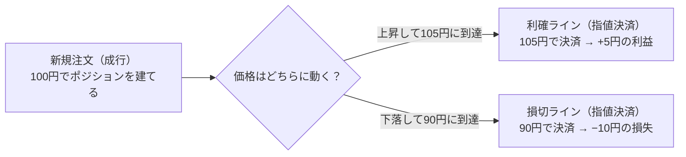

# CFD（差金決済取引）ノート

🇬🇧 [English version](./cfd.en.md)

CFD（Contract for Difference＝差金決済取引）について、
仕組みと実務の観点から整理する。対象例：指数（日本225）、
商品（WTI原油）、米国株、ETF など。

> このノートは「乗り換え（ロールオーバー）」の項目から書き始め、
> 書けた項目を順に足していく。最終的に下記の構成に整える。

## 目次（書けたら順に埋めていく）

- [x] CFDとは何か（一言でいうと）
- [x] なぜCFDという商品が存在するのか（現物との違い）
- [x] レバレッジと証拠金
- [x] 差金決済とは
- [x] ロング／ショート
- [x] レートはどう生成されるか
- [x] カバーディールの考え方
- [x] 乗り換え（ロールオーバー／限月）とは
- [x] なぜ乗り換えが起きるのか（限月のしくみ）
- [ ] スピンオフ・併合・分割が起きたとき
- [ ] 商品タイプ別の具体例（指数／商品／米国株・ETF）
- [x] ポジションリミットとカバー戦略（自己資本規制・市場リスク管理の観点）

---

## CFDとは何か

CFDは、金融派生商品（デリバティブ取引）の一種である。デリバティブ取
引とは、原資産（もととなる資産）の価格に依存して価格が決まる取引の
ことで、代表的なものに次の4つがある。

- 先物取引（Futures）：将来の決められた期日に、特定の商品を現時点で
  決めた価格で売買する契約（例：日経225先物）
- オプション取引（Option）：将来の決められた期日に、特定の商品を現時
  点で決めた価格で「売買できる権利」を取引するもの
- スワップ取引（Swap）：金利や通貨など、異なるキャッシュフロー（資金
  の受け払い）を当事者間で一定期間交換する取引
- 差金決済取引（CFD）：現物の受け渡しを行わず、売買価格の差額のみを
  決済する取引

つまりCFDは、先物・オプション・スワップと並ぶデリバティブ取引の1種
類、という位置づけになる。

CFDとは、「Contract for Difference（コントラクト・フォー・ディファ
レンス）」の略で、日本語では差金決済取引（さきんけっさいとりひき）と
呼ばれる。

「差金決済」とは、実際の商品（株式・原油・株価指数など）の受け渡しを
せず、売買したときの価格差だけをやり取りする取引のことを指す。たとえ
ば100円で買って120円で売った場合、実際に100円分のモノを受け取ること
も、120円分のモノを渡すこともなく、その差額20円だけが手元でやり取り
される。

実は、日常的によく聞く「FX（外国為替取引）」もCFDの一種である。FXは
「為替（通貨のペア）」を対象にしたCFD、と言い換えることができる。CFD
という大きな括りの中に、株価指数・コモディティ・そしてFXが含まれてい
る、という関係になる。

CFDは、証券取引所を介さず、証券会社（ディーラー）と顧客が1対1で契約
を結ぶ、いわゆる店頭取引（OTC取引、Over-The-Counter）である。日本語
では「相対（あいたい）取引」とも呼ばれる。

取引所取引（たとえば現物株式の取引所取引）では、多数の売り手・買い手
の注文が「板（いた）」と呼ばれる一覧に並び、需給によって価格が決ま
る。一方CFDは取引所の板を使わず、証券会社が提示する価格（レート）に
対して顧客が売買する形をとる。この違いから、次のような特徴が生まれ
る。

- 取引所のような厳格な規格（取引単位や満期日など）がないため、証券会
  社が条件を柔軟に決められる。CFDに「乗り換え（ロールオーバー）」と
  いう仕組みがあるのも、もともと取引所の限月という決まった規格を参照
  しつつ、証券会社側で独自にポジションを繋ぎ直せる自由度があるためで
  ある（詳細は「乗り換え」の項目で扱う）。
- 証券会社が買値（Bid）と売値（Ask）を提示し、その差額であるスプレッ
  ドが実質的なコストになる
- 証券会社（カウンターパーティー）が経営破綻するなどした場合、契約が
  履行されなくなるリスク（カウンターパーティーリスク）がある

スプレッドがどう決まるか、証券会社が顧客との取引で抱えたリスクをどう
処理しているかは、それぞれ後述の「レートはどう生成されるか」「カバー
ディールの考え方」で扱う。

##### なぜ「現物を持たない」のに取引ができるのか

CFDは、現物（株式や商品そのもの）の価格を参照して作られた商品であ
る。実際にその現物を売買するには全額の資金が必要だが、CFDは価格差だ
けをやり取りするため、少ない資金で取引ができる（レバレッジという考
え方につながるが、詳細は別項目で扱う）。

また、現物取引には受け渡しという煩雑さも伴う。たとえばWTI原油のよう
な商品を実際に売買した場合、限月を超えて取引を続けようとすると、本来
は現物の受け取りが発生してしまう。CFDでは、こうした受け渡しに関わる
作業を証券会社が代わりに行うことで、顧客は現物を意識せずに差金取引だ
けに集中できる。

さらに、現物取引は本来その商品を取引する取引所が開いている時間しか
取引できないが、CFDであれば夜間や祝日でも取引できるというメリットも
ある。

##### 具体例：CFDは実際に何を売買していることになるのか

CFDが実際に参照している価格は、商品タイプによって異なる。

- 日本225：取引所で取引されている日経225先物の価格を参照している。
  参照先の取引所は証券会社によって異なるが、たとえばSGX（シンガポー
  ル取引所）やCME（シカゴ・マーカンタイル取引所）が代表的である。
- WTI原油：同様に、取引所で取引されているWTI原油先物の価格を参照して
  いる。
- 米国半導体ETFなど、ETF型のCFD：ETF（上場投資信託）そのものの価格を
  参照している。たとえば米国半導体ETFのCFDであれば、iShares
  Semiconductor ETFのような実際のETFの値動きを参照している。なお、
  ETF自体を買うこととETFを参照したCFDを取引することは別物である
  （詳細は補足①）。
- FXや貴金属など、取引所を介さない商品：金融機関同士が直接価格を提示
  し合う相対取引（あいたいとりひき）で決まるスポット取引（直物取引）
  の価格を参照している（詳細は補足②）。

このように、CFDは商品ごとに「先物」「ETF」「スポット取引」のいずれか
を参照価格として作られている。前段で説明した「差金決済」という仕組み
は共通だが、その裏側にある参照先は一様ではない、という点がポイントに
なる。

---
補足①：ETFとは

ETF（Exchange Traded Fund／上場投資信託）とは、株価指数や商品に連動
するように作られた金融商品。運用会社が集めた資金で構成銘柄の株式など
を買い、それを購入した顧客は構成銘柄に分散投資しているのと同じ効果
を得られる（配当の代わりに分配金を受け取ることもできる）。ETF自体を
買う場合は購入金額分の資金が必要で、実際にその資産（の一部）を保有し
ていることになる。一方、CFDは実物の資産を持たないため、株主としての
権利などは発生せず、「買ったときの価格」と「売ったときの価格」の差額
だけを決済する取引になる。

補足②：スポット取引とは

スポット取引（直物取引）とは、取引が成立してから短期間（通常2営業日
以内）で現物の受け渡しが完了する取引のこと。取引所を介さず、金融機関
同士でやり取りされる価格がベースになる。

##### 自分（オペレーション）は、CFDのどこに関わっているか

CFDという商品を提供し続けるために、オペレーションが関わる業務は多岐
にわたる。ここでは全体像として整理し、それぞれの詳細は該当する各項目
（乗り換え、レバレッジと証拠金など）に譲る。

- 相場・リスク管理：マーケットの状況確認（サーキットブレーカー・貸株
  規制など）、顧客ポジションのリスク判断・調整、リスクエクスポージャ
  ーの監視、ロスカット（強制決済）のモニタリング、配信レートの異常値
  チェック
- 商品運用：コーポレートアクション対応（新規上場・分社化・株式分割・
  合併など）、取引所スケジュールの確認、価格調整額の決定と反映、限月
  の乗り換え（ロールオーバー）、ヘッジ取引
- 管理・コンプライアンス：reconciliation（帳簿と実際の残高の突合）、
  顧客資産の分別管理の確認、金融庁・金融先物取引業協会などへの報告書
  作成、KYC（顧客確認）・AML（マネーロンダリング対策）対応
- システム運用：障害対応、事業継続計画（BCP）に基づく代替手順の整
  備、新規商品リリース前の動作確認（UAT）

つまり、CFDという商品を1つ提供し続けるためには、「価格を正しく作
る」「リスクを管理する」「規制を守る」「システムを安定稼働させる」と
いう複数の役割が重なって支えている。

##### 3年前の自分がつまずきそうな点

ここまでCFD・FX・ETF・先物・スポット取引と、いろいろな言葉が一度に出
てきたと思う。全部を一度に理解しようとせず、まず1つの商品に絞って、
知識を深めるのがおすすめ。

例えばWTI原油であれば、「限月のある先物価格を参照してレートが作られ
ている」→「決済日が来ると本来は乗り換えが必要になる」→「その煩雑な
作業をオペレーション側が代わりに行っているから、顧客は何もせず取引を
続けられる」という一連の流れを1つの商品で理解できれば、他の商品にも
応用できる。根っこにあるのは、CFDは常に「価格差を利用した取引であ
り、現物の受け渡しがない」という点である。

また、初心者がよく誤解しやすい点として、次のようなものもある。

- 「少ない資金で取引できる＝お金を借りている」と誤解する：CFDは借金
  ではなく、「価格差だけをやり取りする」仕組みだからこそ、少ない資金
  で取引できる。
- CFDの価格と、参照している先物やETFの価格が完全に一致すると思って
  しまう：CFDの価格にはスプレッド（買値と売値の差）などが含まれるた
  め、参照先の価格とは微妙にずれることがある（詳細は補足③）。
- CFDで株やETFを取引すると、「株を買った」ことになると思ってしまう：
  CFDでは実物の資産を持たないため、株主としての権利（議決権や株主優
  待など）は一切発生しない。

補足③：スプレッド（オファー／ビッド）とは

CFDの価格は、常に2つの値が並んで提示される。

- オファーレート（Ask）：売りたい相手が提示している価格。買う側から
  すると、この価格で買うことになる。
- ビッドレート（Bid）：買いたい相手が提示している価格。売る側から
  すると、この価格で売ることになる。

通常、オファー（売り手の希望価格）はビッド（買い手の希望価格）より
高い。この2つの価格差が「スプレッド」であり、CFDの実質的な取引コス
トになっている。

---

## なぜCFDという商品が存在するのか（現物との違い）

現物取引とは、株式・債券・為替・金利・金や原油といった資産そのものを
所有する取引で、売買にはその現物の受け渡しが発生する。

CFDは、そうした現物取引の対象を「原資産（もととなる資産）」「参照
先」として、その価格差だけをやり取りする取引である。CFDでは現物の受
け取りや、それに付随する株主としての権利なども発生しない。

##### なぜ現物を買わずCFDで取引するメリットがあるのか

現物取引と比べたとき、CFDには次のようなメリットがある。

- 取引手数料が無料：CFDは多くの場合、取引手数料がかからない（スプレ
  ッドが実質的なコストになる）。
- 現物の受け渡しがない：価格差だけのやり取りなので、保管や輸送、受け
  渡しの手間が一切かからない。
- レバレッジが効く：少ない証拠金で、大きな金額を取引したときと同じ効
  果を得られる。
- 空売りがしやすい：現物は保有していないと売れないが、CFDは新規の売
  り（ショート）から取引を始められるため、価格が下がる局面でも利益を
  狙える。
- 銘柄・市場をまたいで一元管理できる：日本株・米国株・原油・為替な
  ど、通常なら別々の口座が必要な商品を、1つの口座でまとめて取引でき
  る。
- 海外の証券口座を開く必要がない：たとえば日本にいながら米国株や海外
  商品のCFDを取引でき、現地の証券会社に口座を開く手間がかからない。
- 少額から取引できる：現物株は「単元株（100株単位など）」で買う必要
  があることが多いが、CFDはより小さい単位から取引できる場合が多い。
- 配当相当額の調整金を受け取れる（株価指数・個別株CFDの場合）：株主
  ではないが、配当が出るタイミングでその分の調整金を受け取れる（売り
  建ての場合は逆に支払う）。
- 夜間や祝日、24時間近く取引できる：取引所が開いている時間に縛られ
  ず、海外市場を含めて夜間でも取引できる商品が多い。

##### 具体例：現物のWTI原油とCFDのWTI原油では何が違うのか

現物との違いを具体的に見るために、WTI原油先物とWTI原油CFDを比べてみ
る。

| 項目 | 現物のWTI原油取引 | WTI原油CFD |
|---|---|---|
| 受け渡し | 限月が来ると現物の受け渡しが発生する。避けるには自分で乗り換えが必要 | 受け渡しは発生しない。乗り換えは証券会社が代行してくれる |
| 必要な資金 | 取引金額の全額が必要 | 証拠金のみで取引可能（レバレッジが効く） |
| 空売り | 現物を借りて売る必要があり、コストも手間もかかる | 新規の売り（ショート）からそのまま入れる |
| 取引時間 | 原油先物取引所の取引時間に限定される | 夜間や祝日でも取引できる場合が多い |
| 保管・付随コスト | 保管・輸送などのコストが発生しうる | 保管の概念自体がなく、コストはスプレッドなどに集約される |

このように、参照している値動きは同じでも、「現物を持つかどうか」とい
う1点の違いから、資金・リスク管理・取引の自由度に至るまで、さまざま
な差が生まれている。

##### 自分（オペレーション）は、現物取引とCFD取引の違いをどこで意識するか

CFDは現物を持たない分、現物取引にはない業務がオペレーション側に発生
する。実務でこの違いを特に意識するのは、次のような場面である。

- ロールオーバー（限月の乗り換え）：現物にはない、CFD特有の乗り換え
  作業そのもの
- 調整金の管理：乗り換えに伴う価格の不連続を埋め合わせる調整金の計
  算・付与
- リスク管理：レバレッジが効く分、現物よりも大きなポジションリスクが
  発生しうるため、その監視・調整が必要になる
- 参照先取引所の取引時間の管理：CFD自体は夜間や祝日も取引できるが、
  参照している先物や現物の取引所には取引時間があるため、その時間帯や
  スケジュールを把握しておく必要がある
- 参照先限月の価格をもとにしたレート生成：CFDの価格は独自に決まるの
  ではなく、参照している限月の価格をベースに生成されるため、その紐付
  けの管理が必要
- 取引単位の管理：現物とは異なる単位でCFDが取引される場合があり、そ
  の設定・管理が必要
- 証拠金率・レバレッジ倍率の設定と維持率管理：レバレッジを提供する以
  上、証拠金が不足した際の対応（維持率の監視）が必要になる
- ロスカット水準の設定・モニタリング：現物にはない、強制決済の仕組み
  そのものの管理
- スプレッドの設定：現物のような取引手数料の代わりに、CFD特有のコス
  ト構造（買値と売値の差）を管理する
- 限月マスタのメンテナンス：どの限月をいつまで参照するかというマスタ
  データ自体の管理（ロールオーバーの前提となる業務）
- 円転単価の管理：海外商品を円建てで提供する場合の為替換算レートの設
  定

つまり、「現物を持たない」というCFDの本質的な特徴が、そのままオペレ
ーション側の管理項目（価格・リスク・時間・単位）を増やしている、とい
う関係になっている。

##### 3年前の自分がつまずきそうな点

「現物取引と全く同じ値動きに見えるのに、なぜCFDという別の商品が存在
するのか」——最初はそう疑問に思うかもしれない。「だったら現物を直接
取引すればいいのでは」と。

しかし、現物を直接取引しようとすると、限月が来るたびに自分で乗り換え
（ロールオーバー）を行う必要があり、手間がかかる上に、間違えれば実際
に現物（原油やコモディティそのもの）が届いてしまうリスクもある。CFD
は、こうした煩雑な作業や受け渡しのリスクを証券会社が代わりに引き受け
ることで成り立っている商品である。

ただし、これは「CFDのほうが一方的にお得」という意味ではない。CFDには
スプレッド（買値と売値の差）というコストがあり、レバレッジが効く分、
含み損が広がるスピードも現物より速い。「受け渡しがなくて便利」なこと
と、「リスクが小さい」ことは別の話であり、CFD特有のコストやリスクも
理解した上で使う必要がある。

---

## レバレッジと証拠金

##### レバレッジとは何か（一言でいうと）

レバレッジとは、少ない証拠金（担保として預けるお金）で、その何倍も
の金額の取引ができる仕組みのことである。日本では、証拠金に対して最
大25倍までの取引を行うことができる。

たとえば、10万円を証拠金として預け入れた場合、レバレッジ25倍であれ
ば、250万円分の取引を行うことができる。つまり、実際に用意する資金
は10万円でも、250万円分の値動きをそのまま損益として受け取ることに
なる。

##### 証拠金とは何か、レバレッジとどう関係するか

証拠金（しょうこきん）とは、取引を行う際に担保として証券会社に預け
入れる資金のことである。

レバレッジは、この証拠金を元手にして、何倍もの金額の取引を行う仕組
みなので、証拠金とレバレッジは表裏一体の関係にある。取引したい金額
（取引金額）に対して、実際に預け入れる証拠金の割合を「証拠金率」と
呼び、レバレッジは証拠金率の逆数にあたる（例：証拠金率4％＝レバレ
ッジ25倍）。

証拠金は、取引を始めるときに必要な「新規建て証拠金」だけでなく、含
み損が出た場合にそれを吸収するクッションの役割も果たす。証拠金に対
して、口座に残っている純資産（有効証拠金）の割合を「証拠金維持率」
と呼び、この維持率が一定水準を下回ると、証券会社から追加の証拠金を
求められたり（追証）、強制的にポジションが決済されたりする（ロスカ
ット）。

##### 具体例：証拠金○○円でレバレッジ○倍だと、いくらの取引ができるか

日経225のCFDを例に考える。証拠金として10万円を預け入れ、レバレッジ
25倍で取引する場合。

- 取引可能金額：10万円 × 25倍 = 250万円
- 証拠金率：1 ÷ 25 = 4％
- 必要証拠金（250万円分の取引をするために必要な証拠金）：250万円 ×
  4％ = 10万円

つまり「取引金額 × 証拠金率」で必要証拠金が求まり、「証拠金 × レバ
レッジ」（または「証拠金 ÷ 証拠金率」）で取引可能金額が求まる、と
いう関係になっている。

##### 自分（オペレーション）は、証拠金不足（追証）が起きたときどう対応しているか

証拠金維持率は、「口座の純資産（有効証拠金）÷ 必要証拠金 × 100％」
で計算される。維持率がどこまで下がったかによって対応が変わるが、具
体的な閾値や猶予時間は証券会社ごとに異なる。以下はあくまで一例であ
る。

- 維持率が100％を切ったまま翌営業日に持ち越された場合：猶予があ
  る。一定の期限（例：翌営業日中）までに、追証（追加の証拠金を入金
  すること）、または自分でポジションの一部を決済して維持率を回復さ
  せることで、全ポジションを強制決済されることを避けられる。期限ま
  でに解消されなければ、証券会社側でポジションが全決済される。
- 維持率が一定の水準（例：50％）を切った場合：猶予はない。切った瞬
  間に、全ポジションが強制的に決済される（ロスカット）。これは、顧
  客の損失がそれ以上膨らまないようにするための救済措置でもある。

オペレーションは、口座ごとの維持率を常時モニタリングし、猶予のある
閾値を切った口座には追証の通知を行い、猶予のない閾値を切った口座に
ついてはロスカット処理が正しく実行されているかを確認する。

##### 3年前の自分がつまずきそうな点

- レバレッジを「借金をして取引している」と誤解する：レバレッジは借
  金ではなく、証拠金という担保を元手に、その何倍かの金額の取引を行
  える仕組みである。含み損が証拠金を上回れば強制的に決済される仕組
  みになっており、証拠金以上の借金を背負うことを前提とした制度では
  ない。
- 使える金額いっぱいまでレバレッジをかけるのが当然だと思ってしま
  う：25倍まで取引できるからといって、常に25倍で取引するのが普通と
  いうわけではない。レバレッジを高くするほど、少しの値動きで証拠金
  維持率が急激に下がりやすくなるため、余力を持たせて取引するのが一
  般的である。
- 証拠金維持率100％を「安全なライン」だと思ってしまう：実際には、
  100％を切った時点で既に追証の対象になる。安全に取引を続けるため
  には、100％よりも十分に高い維持率を保っておく必要がある。
- 追証とロスカットを同じものだと誤解する：追証には猶予があり、期限
  内に対応すれば強制決済を避けられるが、ロスカットは猶予なく即座に
  全決済される。両者はトリガーとなる維持率の水準も、対応できる余地
  も異なる。

---

## 差金決済とは

> 差金決済の基本的な定義（「実際の商品の受け渡しをせず、売買したと
> きの価格差だけをやり取りする取引」）は「CFDとは何か」で既に説明し
> た。ここでは、その基本を踏まえた上で、決済のタイミング・複数回売
> 買した場合の損益計算・オペレーション側の決済処理という3つの切り口
> を掘り下げる。

##### 差金決済の損益は「いつ」確定するのか

差金決済において、損益が確定するタイミングは、顧客が建てたポジショ
ンに対して反対売買（決済注文）を行った瞬間である。ポジションを持っ
ている間は、価格が動くたびに評価上の損益（未実現損益）が変動するだ
けで、まだ手元の資産としては確定していない。

注文の出し方には、大きく分けて2種類ある。

- 成行（なりゆき）注文：現在見えているレートで、その場ですぐに約定
  させる注文
- 指値（さしね）注文：あらかじめ指定した特定のレートに達したとき
  に、約定する注文

これは新規注文（ポジションを建てるとき）にも、決済注文（ポジション
を閉じるとき）にも、どちらにも使える。

| | 新規注文（ポジションを建てる） | 決済注文（ポジションを閉じる） |
|---|---|---|
| **成行** | 現在のレートでその場で新しいポジションを建てる | 現在のレートでその場でポジションを閉じる |
| **指値** | 指定したレートに達した時点で新しいポジションを建てる | 指定したレートに達した時点でポジションを閉じる |

決済注文には、利益を確定させる「利確（りかく）」と、損失を確定させ
る「損切（そんぎり）」の2種類があり、どちらも成行・指値のいずれで
も行うことができる。

たとえば、100円で成行の新規注文をしてポジションを持ったとする。105
円まで上がったら利益を確定したいと考えれば、105円に指値の決済注文
（利確）を入れておく。逆に、90円まで下がった場合に損失がこれ以上膨
らむのを避けたいと考えれば、90円に指値の決済注文（損切）を入れてお
く。

このように、あらかじめ利確ライン・損切ラインを指値で設定しておくこ
とで、値動きを常に見ていなくても損益を確定させることができる。

##### 具体例：複数回売買した場合の損益計算（平均約定単価の考え方）

同じ商品を複数回に分けて売買（買い増し・売り増し）した場合、損益は
「平均約定単価」を基準に計算される。

**買い（ロング）を複数回に分けて積み増した場合**

| 回数 | 約定レート |
|---|---|
| 1回目（新規） | 100円 |
| 2回目（買い増し） | 103円 |
| 3回目（買い増し） | 105円 |
| 4回目（買い増し） | 104円 |
| **平均約定単価** | (100+103+105+104)÷4 = **103円** |

平均約定単価が103円になるので、103円より高いレートで決済すれば利
益、低いレートで決済すれば損失になる。

**売り（ショート）を複数回に分けて積み増した場合**

100円で下がると見込んで売り注文を入れたが、レートが上がってしまっ
たため103円で売り増し。その後105円まで上がったところでも売り増し、
下がり始めたのを見て104円でも売り増した。

| 回数 | 約定レート |
|---|---|
| 1回目（新規） | 100円 |
| 2回目（売り増し） | 103円 |
| 3回目（売り増し） | 105円 |
| 4回目（売り増し） | 104円 |
| **平均約定単価** | (100+103+105+104)÷4 = **103円** |

ショートの場合は買いと逆で、平均約定単価より低いレートで決済すれば
利益になる。最初の売りが100円だった時点だけを見ると、一時105円まで
逆行して含み損を抱えていたことになるが、平均約定単価（103円）を基
準にすれば、その後レートが103円を下回るところまで戻れば全体として
は利益になる、ということが分かる。

##### 自分（オペレーション）は、決済処理のどの部分に関わっているか

- ネットポジションでの管理：証券会社側では、顧客のポジションをグロ
  ス（ショートとロングをそれぞれ別々に保持する）ではなく、ネット
  （ショートとロングを差し引きした状態）で管理する。これは、前段で
  説明した「平均約定単価」の考え方がそのまま反映された形であり、複
  数回の売買があっても、最終的には1つの合算ポジションとして扱われ
  る。
- レート配信異常時の約定修正：レート配信が正常に行われなかった場
  合、誤ったレートで約定してしまった取引が発生することがある。その
  場合、オペレーション側で正しいレートに手動で修正し、対象の顧客に
  通知する対応が必要になる。
- 決済のreconciliation（突合）：顧客の決済結果が、社内システムとカ
  バー先（CP）側の記録の両方で正しく一致しているかを確認する。
  ロング／ショートのセクションで触れた「カバー先とのポジション照
  合」の、決済版にあたる。
- 損益・残高反映の確認：決済によって確定した損益が、顧客の口座残高
  に正しく反映されているかを確認する。
- スリッページ対応：指値決済の際、指定したレートと実際の約定レート
  にズレ（スリッページ）が生じることがある。このズレが許容範囲を超
  えていないかを確認し、超えている場合は対応する。

##### 3年前の自分がつまずきそうな点

- 未実現損益を「もう確定した利益・損失」だと思ってしまう：決済（反
  対売買）するまでは、どれだけ含み益・含み損があっても、それはあく
  まで評価上の数字に過ぎない。決済注文が約定して初めて、損益が確定
  する。
- 複数回売買すると、それぞれの取引が別々に管理されると思ってしま
  う：実際には証券会社側ではグロスではなくネットで管理されるため、
  個々の取引レートよりも「平均約定単価」という1つの基準に集約され
  る。途中の値動きに一喜一憂するより、平均約定単価がどこにあるかを
  意識する方が実務的に重要になる。
- 指値で決済ラインを入れておけば、必ずそのレート通りに決済されると
  思ってしまう：スリッページなど、レート配信や市場の状況によって、
  指定したレートと実際の約定レートにズレが生じることがある。

---

## ロング／ショート

##### ロング・ショートとは何か（一言でいうと）

ロング（買い）・ショート（売り）とは、取引の「方向」を表す言葉であ
る。

- ロングを持つ：買いのポジション（保有している建玉／たてぎょく）を
  持つこと。自分の持ち値より価格が上がれば利益が出る。
- ショートを持つ：売りのポジションを持つこと。自分の持ち値より価格
  が下がれば利益が出る。

決済（ポジションを閉じること）は、逆方向の取引で行う。

- ロング（買い）の決済 → ショート（売り）することで行う
- ショート（売り）の決済 → ロング（買い）することで行う

つまり、「買いから入って、売って終わる」のがロング、「売りから入っ
て、買って終わる」のがショート、という関係になる。

##### なぜCFDでは「売り」から入れるのか（現物との違い）

現物取引では、その商品を保有していなければ売ることができない。一方
CFDは「差金決済」という仕組みを使っているため、売買したときの価格
差だけをやり取りする取引になる。

「売りから入る」とは、売った価格と、後で買い戻した価格との差額を受
け取る権利と、買い戻す義務を持つ、ということを意味する。決済時に
は、この権利と義務を行使することで、差額を損益として確定する。

この仕組みがあるため、現物を保有していなくても空売り（からうり）が
できる。株式の信用取引のように、証券会社から株を借りて金利を支払う
といった手続きは必要ない。

たとえば、友達からゲーム機を借りて1,000円で売り、後で買い戻して友
達に返す、という流れをイメージすると分かりやすい。もし買い戻すとき
の価格が800円まで下がっていれば、売った1,000円と買い戻した800円の
差額200円が自分の利益になる。これが空売りの基本的な仕組みである。
CFDでは、この「借りて売って、買い戻して返す」という一連の流れを、
証券会社が裏側で処理してくれるため、顧客は権利・義務のやり取り
（＝ショートポジションを持つこと）だけを意識すればよい。

##### 貸株（かしかぶ）とショートの規制

CFD自体は差金決済であり、顧客との取引だけを見れば現物の株を借りる
必要はない。しかし証券会社は、顧客から受けたショートポジションのリ
スクを、実際の株式市場でヘッジ（カバー）することがある（詳細は「カ
バーディールの考え方」で扱う）。このヘッジのために証券会社（または
その先のカバー先）が現物株を売る必要が生じた場合、信用取引と同様
に、その株をどこかから借りてくる必要がある。これが「貸株（かしか
ぶ）」である。

貸株の仕組み：

- 株を保有している投資家が、証券会社にその株を貸し出す。貸した投資
  家は、対価として金利を受け取れる（銀行預金より高めの金利であるこ
  とが多い）。貸している間も、いつでも通常通り市場でその株を売却で
  きる。
- 証券会社は、こうして集めた株を、機関投資家や信用取引でショートし
  たい投資家に又貸しして、手数料を得る。

つまり「売りから入る（ショート）」を現物株式市場で行うには、必ず
「誰かから株を借りてくる」という手順が必要になる。

貸株が確保できない場合、証券会社は現物市場でのヘッジができなくな
る。ヘッジできないままショートポジションを受け入れ続けると、証券会
社自身が方向性のリスク（相場が逆に動いたときの損失）を抱えたままに
なってしまう。そのため、貸株が確保できなくなった銘柄については、証
券会社は新規のショート取引そのものを規制せざるを得ない。

これは証券会社が独自に決めるだけの話ではなく、取引所側の規制（空売
り規制、いわゆる201規制など）や、カバー先の証券会社側で貸株規制が
かかった場合にも連動する。店頭でCFDを提供する証券会社も、カバー先
が貸株規制を受ければ、それに合わせて顧客の新規売りを規制することに
なる。

##### 具体例：ロングとショートで、価格が上がった/下がったときの損益はどうなるか

日経225のCFDを1枚、24,000円のときに取引したとする。

| ポジション | エントリー価格 | 決済価格 | 損益の計算 | 結果 |
|---|---|---|---|---|
| ロング（買い） | 24,000円 | 24,500円（上昇） | 24,500 − 24,000 | +500円の利益 |
| ロング（買い） | 24,000円 | 23,500円（下落） | 23,500 − 24,000 | −500円の損失 |
| ショート（売り） | 24,000円 | 23,500円（下落） | 24,000 − 23,500 | +500円の利益 |
| ショート（売り） | 24,000円 | 24,500円（上昇） | 24,000 − 24,500 | −500円の損失 |

つまり、ロングは「決済価格 − エントリー価格」、ショートは「エント
リー価格 − 決済価格」で損益が決まる。価格が上がるとロングが得をし
てショートが損をし、価格が下がるとその逆になる、という表裏の関係に
なっている。

##### 自分（オペレーション）は、ポジション方向（ロング／ショート）をどこで確認・管理しているか

CFDは証券会社と顧客の相対取引（あいたいとりひき）であるため、まず
「顧客がロング→当社はショート」「顧客がショート→当社はロング」と
いう反転の関係を理解しておく必要がある。オペレーションは、この関係
を前提に、いくつかの場面でポジション方向を確認・管理している。

- ネットポジションの監視：商品ごとにポジションリスクの許容量が決め
  られており、マーケットの動き・顧客の指値・テクニカルな状況を見な
  がら、その許容量に収まるようカバー（ヘッジ）の判断を素早く行う。
  許容量を超えそうな場合は、カバーを増やして対応する。
- カバー先とのポジション照合（reconciliation）：当社が保有している
  ヘッジポジションと、PB（プライムブローカー）やLP（流動性提供者）
  側の認識がズレていないかを突き合わせる。「当社にあってPBにない」
  「PBにあって当社にない」といった浮いたトランザクションがないかを
  確認し、見つかった場合はLPに問い合わせて、レートのズレや約定の成
  否を確認する。照合はTokyo・London・NYの各時間帯で少なくとも1回、
  実際には各時間帯2回程度行っている。常時モニタリングしているた
  め、約定が滑った（スリッページが起きた）ときは通知が来ることが多
  く、その都度LPと連絡を取り合っている。
- ロスカット・証拠金維持率のモニタリング：一般に、ショートを抱えて
  いる方が維持率が下がりやすい。理由は主に2つある。1つは、配当が出
  るたびに発生する調整金を、買い建て（ロング）は受け取り、売り建て
  （ショート）は支払う側になるため、時間の経過だけで純資産がじわじ
  わ減っていくこと。もう1つは、株価指数や個別株は長期的には上昇す
  る傾向があるため、同じボラティリティでもショートの方が含み損を抱
  えたまま長引きやすいこと。またボラティリティが高い局面で相場が一
  方向に動くと、反対方向のポジションを抱えている顧客の維持率を一気
  に消費してしまう。顧客のロスカットが発生すると、その分当社側の持
  ちポジションが増える可能性もあり、カバーのリジェクト（約定拒否）
  が起きるリスクもあるため、常時の監視が欠かせない。
- ショート特有の規制対応：貸株規制や空売り規制（201規制など）が発
  生した場合、顧客の新規売り取引を停止し、顧客取引ページにお知らせ
  を掲示する。規制が解除された場合も、解除日を顧客ページに掲示す
  る。
- レポーティング：取引高や顧客のロスカット状況などを含め、規制当局
  等への報告義務があり、基本的には月次で対応している。

##### 3年前の自分がつまずきそうな点

- ショート＝悪いこと、というイメージを持ってしまう：「空売り」とい
  う言葉の響きから、市場に対してネガティブな行為だと感じるかもしれ
  ないが、CFDにおいてショートは単なる「取引の方向」の1つであり、ロ
  ングと対等な選択肢に過ぎない。
- 顧客が儲かれば会社も儲かる、と思い込んでしまう：CFDは相対取引の
  ため、顧客がロングで利益を出しているとき、証券会社は理論上その反
  対のショートで含み損を抱えている（実際はヘッジしているため損益は
  カバー先との関係で相殺されるが、顧客との関係だけを見ると真逆にな
  る）。
- CFDのショートも「株を借りている」感覚で理解してしまう：顧客から
  見れば、CFDは差金決済なので、実際に株を借りているわけではない。
  貸株が必要になるのは、証券会社側がヘッジのために現物市場で売る場
  合の話であり、顧客の契約そのものとは別のレイヤーの話である。
- 維持率がショートで下がりやすいのは「相場が上がっているだけ」と考
  えてしまう：実際には配当調整金の支払いという構造的な要因も重なっ
  ており、価格が動かなくても時間の経過だけで維持率が下がっていくこ
  とがある。

---

## レートはどう生成されるか

CFDのレートは、参照している先物や現物の取引所価格をもとに、証券会社
が独自に生成している。ただし、その参照価格をそのまま顧客に提示してい
るわけではない。

また、CFDのレートは1本の値段ではなく、買い値（Ask）と売り値（Bid）の
2本値で提示される。この2本値の差がスプレッドであり、CFD特有の実質的
なコストになる。

なぜ1本値ではなく2本値（Bid/Ask）で提示されるかというと、CFDが取引所
取引ではなく店頭取引（OTC取引）だからである。取引所取引のように「板」
で需給が公開されているわけではないため、証券会社が自ら買値と売値を提
示し、その差（スプレッド）を実質的な手数料として受け取る形になる。

##### 参照している先物・現物とレートの関係

CFDのレートは、参照先（先物または現物）の取引所価格と連動して動く。
ただし、乗り換え（ロールオーバー）が発生する商品の場合、「今どの限月
を参照しているか」がレートに直接影響するため、参照限月の管理が特に重
要になる。

##### 具体例：日本225やWTI原油のレートは実際どこから来ているか

取引所のデータは、そのままでは扱いにくい生データのため、Bloombergや
Refinitivなど、大手データベンダー各社がティックデータや1分足データに
整理（クレンジング）した形で提供していることが多い。CFDを提供する証
券会社は、このデータプロバイダーからリアルタイムデータを受信し、そこ
にスプレッドなどを加味した加工を行って、顧客向けのレートを生成してい
る。

取引所から直接データを取得することも技術的には可能だが、取引所ごとに
接続・契約を結ぶ必要があり、開発コストがかかる。たとえば全20種類の商
品を取り扱う場合、CME・ICE・NYSEなど個別の取引所すべてと連携するよ
り、データプロバイダーと契約したほうが、契約もシステム開発も効率的に
なる。

また、データプロバイダーを複数契約しているのは、1社に障害が起きても
顧客向けレートを止めずに済むようにするためである（詳細は次項）。

##### 自分（オペレーション）は、レート生成・配信のどこを監視しているか

オペレーションは、レートが「止まらないこと」と「市場実勢からズレてい
ないこと」の両方を常時監視している。

- フェイルオーバーの判断：メインのデータプロバイダーで障害が起き、顧
  客向けレートに異常が出た（または生成されなくなった）場合、まず顧客
  を最優先に考え、サブのデータプロバイダーへの切り替えを行う。切り替
  えの判断時には、自社がレート生成に使っていない別のプロバイダーなど
  を使って市場実勢とサブプロバイダーのレートを比較し、大きな差異がな
  いかを確認したうえで切り替える。障害の原因調査は後回しにし、まず顧
  客対応を優先する。
- スプレッドの厚みの管理：スプレッドの幅は、商品ごとのリスクやコスト
  に応じて証券会社側が設定している。
- レートの異常値監視（アボート）：市場価格が急に跳ね上がる（または落
  ちる）といった値動き自体を指す言葉ではなく、そうした異常な値動きを
  検知した際に、正しくないレートを顧客やカバー先に流してしまう前に、
  システムが自動的に処理を一旦止める仕組みのことを指す。値動きそのも
  のが実際の市場の動き（重要な経済指標の発表など）による場合もあれ
  ば、データの不具合による場合もあり、その場では区別できない。そのた
  め、いったん配信を止めて市場実勢を確認し、問題がなければ配信を再開
  する、という手順になる。

  アボートが発生する典型的な要因には、次のようなものがある：
  - レイテンシ（通信の遅延）による価格の陳腐化：ネットワークの遅延な
    どで、社内の最新レートとの間にズレが生じ、あらかじめ決めた許容範
    囲を超えた場合
  - 急激なボラティリティ：重要な経済指標の発表時など、市場価格が急変
    し、一時的に価格の信頼性が保てなくなる場合
  - 異常値（スパイク）の検知：配信元のデータそのものにバグや異常な値
    が含まれていて、それをシステムが検知した場合

  なお、顧客向けに生成しているレートと、カバー先（CP）に流すレートは
  別物であるため、カバー先側の約定拒否（いわゆる「ラストルック」）
  は、このレート生成の話とは厳密には別の論点になる。とはいえ、カバー
  側でエラーが起きている状況をそのままレート生成の参照元として使って
  しまうと事故につながるため、レート生成の監視においても重要な視点と
  して意識している（詳細は「カバーディールの考え方」の項目で扱う）。

  ※この「アボート」という呼び方は社内的な言い方で、業界一般では「異
  常レート判定」や「約定拒否（プライスリジェクション）」といった呼び
  方をされることもある。

- ポストトレードでの監視：アボートの発生状況（頻度、どの要因が多い
  か）は、ミドル・バックオフィス側の重要な監視対象になっている。発生
  率が急に増えたり、不自然な頻発が見られる場合は、システムの不具合や
  設定ミスのサインになりうるため、注文履歴やログを確認し、顧客に不当
  な不利益が出ていないかを確認する業務がある。

##### 3年前の自分がつまずきそうな点

ここでは特に混同しやすい2点を、少し詳しく補足しておく。

①「レートは取引所の価格そのもの」だと思ってしまう

CFDの画面に表示されているレートを見ると、まるで取引所の価格がそのま
ま流れてきているように見える。しかし実際には、取引所の価格→データプ
ロバイダーがクレンジングした価格→証券会社が独自にスプレッドなどを加
えて生成した価格、という3段階の加工を経て、初めて顧客に提示される。

つまり、CFDのレートは「取引所の値段のコピー」ではなく、「取引所の値
段を土台にして、証券会社が作り上げた別の値段」である。参照先と完全に
一致しないのは異常なことではなく、そもそもの仕組み上、当然のことであ
る。

②「レート生成」と「カバー（ヘッジ）」を同じ話だと思ってしまう

ここまで説明してきた「レート生成」は、あくまで顧客に何の値段を見せる
かという話である。一方で、証券会社が自社のリスクを外部でヘッジする
「カバー」は、顧客の注文をカバー先（CP）にどう流すかという、別の業務
・別のプロセスである。

この2つは連動しているように見えるが、実際は別物である。たとえば、顧
客向けのレート自体は正常に生成・配信できていても、カバー先への発注が
約定拒否（ラストルック）される、という状況は別々に起こりうる。「レー
トが正しく出ている＝カバーも正しく取れている」とは限らない、という点
を最初のうちは混同しやすい。この違いは、次の「カバーディールの考え
方」の項目でさらに詳しく扱う。

---

## カバーディールの考え方

カバーディールとは、顧客の注文と反対方向のポジションを、証券会社の外
部（カバー先／CP）に持つことである。

証券会社は、顧客にCFDなどの取引を提供する過程で、顧客の注文の反対側
のポジションを自社で抱えることになる。たとえば顧客がロング（買い）で
取引すれば、証券会社側はその反対のショート（売り）のポジションを持つ
形になる。これは「市場リスク（保有しているポジションの価格が変動する
ことで損失が出るリスク）」を抱えている状態である。

証券会社がこの市場リスクを過大に抱えたままにしておくと、相場が大きく
動いた際に自社の財務状況を悪化させる恐れがある。そのため、抱えたポジ
ションを外部のカバー先（CP）に流してリスクを整理する。この一連の取引
を「カバー取引」あるいは「カバーディール」と呼ぶ。

CFDは証券会社と顧客の相対取引（あいたいとりひき）＝取引所を介さない
一対一の契約である。この相対取引という性質から、次の3層構造が生ま
れる。

例：顧客がCFDで日経225を「買い」でエントリーした場合

1. 顧客ポジション：対象商品（日経225）を「買い」
2. 証券会社の対顧客ポジション（CFD）：相対取引のため、証券会社は顧客
   の取引相手として、自動的に反対の「売り」ポジションを抱える
3. 証券会社のヘッジポジション（カバー）：証券会社が抱えた「売り」に
   よる価格変動リスクを打ち消すために、外部のカバー先（CP）で原資産
   や先物を「買い」で保有する

結果として、証券会社が外部でヘッジのために持つポジション（買い）は、
顧客が最初に持ったポジション（買い）と同じ方向になる。証券会社は「顧
客に対する売り」と「市場での買い」を両建てにすることで、相場がどう動
いても自社の損益が相殺される状態（デルタニュートラル）を機械的に作り
出している。

保有しているポジションが、原資産の価格変動によって損益が生じるリスク
のことを「デルタリスク」と呼ぶ。デルタとは「原資産価格が1動いたとき
に、自分が持っているポジションの価値がどれだけ動くか」を示す感応度で
ある。

- 現物・先物の買いポジション（ロング）：デルタは+1。原資産が100円上
  がるとポジションの価値も100円増え、下がれば減る。
- 現物・先物の売りポジション（ショート）：デルタは-1。原資産が100円
  下がるとポジションの価値は100円増え（＝下がると損失）。

デルタリスクを抱えている状態とは、保有ポジションの合計デルタがプラス
またはマイナスに傾いており、「相場がどちらか一方に動いたときに損をす
る状態（＝方向性のリスクを負っている状態）」を指す。

証券会社が抱えるデルタリスクの例：顧客が日経225のCFDを一単位「買い
（+1）」でエントリーすると、取引相手となる証券会社は、自動的に日経
225を一単位「売り（-1）」で抱える。証券会社は「マイナス1のデルタ」
を抱え込む。このまま日経平均が暴騰すれば、証券会社が抱える売りポジシ
ョンの損失は青天井で膨らんでいく。これが「デルタリスクがオープン（無
防備）になっている状態」である。

金融機関のビジネスモデルは、顧客から受け取る手数料やスプレッドで手堅
く稼ぐことであり、相場の上下を当てるギャンブルをすることではない。そ
のため、抱え込んだデルタリスクを消し去る作業（デルタヘッジ）を行う。
自社の「マイナス1」のデルタを打ち消すために、証券会社は外部のカバー
先（CP）で日経225の現物や先物を「一単位買い」する。外部のカバー先で
の買いポジションが「プラス」のデルタを生み出し、顧客に対する売り
（-1）＋カバー先での買い（+1）＝合計デルタ0となる。

保有ポジションの合計デルタがゼロになった状態を「デルタ・ニュートラ
ル」と呼ぶ。

##### 具体例：顧客がロングでポジションを持ったとき、会社側は何をしているか

WTI原油CFDで、顧客が新規にロング（買い）注文を入れたとする。CFDは証
券会社と顧客の相対取引（あいたいとりひき）のため、顧客がロングを持つ
と、その反対側で証券会社は自動的にショート（売り）のポジションを持つ
ことになる。

このままでは、証券会社は原油価格が上がれば損失が出るショートポジショ
ンを抱えたままになる。そこで、証券会社はカバー先（CP）に対して同じ商
品の買い注文を入れ、カバー先でロングポジションを持つ。これにより、顧
客との取引で生じたショートのリスクを、カバー先との反対売買によって打
ち消す（ヘッジする）ことができる。

つまり、顧客との取引でできたポジションと、カバー先との取引でできたポ
ジションは、方向が逆になる（顧客がロング→自社は顧客に対してショート
→カバー先に対してロング）。この一連の流れがカバーディールの実態であ
る。

##### 自分（オペレーション）は、カバー取引の確認・実行でどんな作業をしているか

オペレーションがカバー取引で行っている作業は、大きく分けて次の6つに
なる。

**取引流動性リスクの確認**

カバー取引が円滑に行えないリスク（取引流動性リスク）がないか、定期的
に確認する。具体的には、カバー先企業の格付け確認（信用力に問題がない
か）に加え、カバー取引が速やかに行われなかった事態を記録・分析する。
主な原因は次の4パターンである。

- システム障害（自社・カバー先・取引所いずれか）によるカバーの拒否
- 取引所のストップ安（値幅制限の下限に達し取引が成立しなくなる状態）
  や値幅制限によるカバーの拒否
- カバー先の証拠金不足・建玉（たてぎょく、保有しているポジションの数
  量）上限超過・追加証拠金の発生によるカバーの拒否
- コーポレートアクション（株式分割・併合・スピンオフなど）による持ち
  越し

**カバー先（CP）の与信管理（よしんかんり）**

カバー先の信用力そのものも継続的に管理する。見ている指標には、格付け
機関による評価、CDS（クレジット・デフォルト・スワップ／その会社が破
綻した場合に保険金が下りる金融商品の保険料。保険料率が高いほど信用不
安のサインとされる）、建玉が特定のカバー先に集中していないかの確認、
G-SIFIs（Global Systemically Important Financial Institutions／シス
テム上重要なグローバル金融機関。経営危機時に世界の金融システムへの影
響が大きいため特別な監督対象となる金融機関）に該当するかどうか、など
がある。

**カバーのタイミングと自動化**

カバーを手動で行う場合は、流動性が高い（一番取引が活発な）時間帯を狙
って実施するほうが効率がよい。流動性が薄い時間帯にカバーすると、価格
への影響やコストが大きくなりやすいためである。

自動でカバーを行う場合は、あらかじめ「カバーリミット（許容できるポジ
ション量の上限）」を設定し、それを超えたら自動でカバー取引が実行され
る仕組みにする。このリミットの設定方法は証券会社や商品ごとに細かく決
められており、「会社としてどれだけのリスク（ポジション）を抱えられる
か」という経営判断そのものにつながっている（リミットの設定と収益性の
関係は「ポジションリミットとカバー戦略」の項目で扱う）。

**日々の確認業務**

約定内容の確認、リコンサイル（帳簿と実際の残高の突合）、自社ポジショ
ンのチェック、カバー先の証拠金維持率や取引上限を超えていないかの確認
などを常時行う。

**カバー乗り換え**

限月のある商品（無期限ではない商品）は、CFD自体の乗り換えだけでな
く、カバー先のポジションも期近から期先へ乗り換える必要がある。あわせ
て、カバー先の参照そのものも切り替える。

**停止判断の考え方**

カバー取引やレート配信に問題が生じた場合、状況に応じて次の3パターン
に分けて対応を判断する。

- カバー・プライスの両方を止めるべき事例：カバー先からのレート配信に
  遅延がある、カバー先のシステム障害でレートが出ない・正常でない、自
  社システムの要因でカバー先に接続できない、など
- カバーのみ止めるべき事例：特定のカバー先とのアンマッチ（約定内容の
  不一致）が大量に発生している、カバー先の建玉上限に達しそうである、
  など
- プライスのみ止めるべき事例：一部のカバー先のみレートが不安定な場合
  など、他のカバー先を使えば対応できるケース

##### 3年前の自分がつまずきそうな点

カバー取引を最初に聞いたとき、「なぜわざわざ反対売買をするのか」とい
う意図が分かりにくいかもしれない。ポイントは、証券会社は顧客と取引し
た瞬間に、望んでいないのに市場リスクを抱えてしまう、という点である。
顧客がロングを持てば自社はショートを持ち、その価格変動によって損益が
発生する。カバー取引は、この「望んでいないリスク」を外部のカバー先に
流すことで、自社のポジションを実質的にゼロに近づける行為である。「儲
けるための取引」ではなく、「リスクを持たないための取引」だという点を
最初に押さえておくと理解しやすい。

また、次のような誤解もしやすいので、あわせて整理しておく。

- 「カバーがうまくいかない」＝一括りの現象だと思ってしまう：実際に
  は、システムや接続の問題（自社・カバー先・取引所いずれかの障害）、
  市場そのものの問題（値幅制限、流動性の枯渇など）、カバー先側の事情
  （証拠金不足、建玉上限への抵触など）という、性質の異なる3種類の原
  因がある。「カバーが失敗した」で片付けず、どの種類かを切り分けて考
  える習慣が実務では重要になる。
- 「顧客の損失＝会社の利益」だと思ってしまう：カバー取引をきちんと行
  っていれば、顧客との取引で生じたリスクは外部に流されているため、顧
  客の勝ち負けがそのまま自社の損益に直結するわけではない。
- 「カバー先＝取引所」だと思ってしまう：カバー先はあくまでCP（カバー
  取引の相手方として契約している金融機関）であり、CFDが参照している
  取引所そのものと直接つながっているわけではない。
- 「すべての注文を1件ずつ個別にカバーしている」と思ってしまう：実際
  には、リミットの範囲内でポジションをある程度まとめて保有し、条件を
  満たした時点でカバーする、というやり方もある。
- 「カバー先の約定拒否」と「当社側のアボート」を同じものだと思ってし
  まう：カバー先の約定拒否（いわゆる「ラストルック」）は、カバー取引
  を申し込んだ相手（CP）側が拒否する現象である。一方アボートは、自社
  が顧客・カバー先に配信するレートそのものを、異常値を検知した際に一
  時的に止める自社側の仕組みである。両者は発生する場所も目的も異な
  る、別々の話である。

---

## 乗り換え（ロールオーバー）とは

乗り換え（ロールオーバー）とは、CFDの価格のベースにしている先物に
期限（限月／げんげつ）が来たとき、次の限月の先物へと切り替えること。
日本225やWTI原油など、先物を参照している銘柄で発生する。

乗り換えには、2つの動きがある。

1. ロールオーバー：限月が来ると先物は商品の受け渡し（決済）が発生するため、
   いま持っているポジションを一度決済し、新しい限月で建て直す。
2. 参照月の載せ替え：価格のベースを、期近（きぢか＝いちばん近い限月）から
   期先（きさき＝次の限月）へ移す。

CFD自体には期限がないが、価格の土台にしている先物には期限があるため、
この乗り換えが必要になる。

なお、参照するのは「出来高がいちばん多い限月」。

<!--
【次回、職場で確認して追記する①】
出来高がいちばん多い限月を参照する理由（なぜ出来高が多い限月を選ぶのか）。
現時点の仮説：取引が活発で価格が安定して信頼できるから。要確認。
-->

---

## なぜ乗り換えが起きるのか（限月のしくみ）

CFDが参照している先物には、「限月（げんげつ）」という期限がある。
限月とは、「将来のいつ（何月）までに、その商品をいくらで受け渡すか」を
決めた期日のこと。たとえば「3月限（さんがつぎり）」なら、3月の
決められた日に受け渡しが行われる。

先物は、限月（期日）が来ると実際に商品の受け渡し（決済）が発生する取引。
一方でCFDは、現物の受け渡しをせず価格差だけをやり取りする商品なので、
受け渡しが起きては困る。

そのため、参照している先物の期日が来て受け渡しが発生する前に、
次の限月の先物へと乗り換える必要がある。CFD自体に期限はなくても、
ベースの先物に期限がある以上、乗り換えを続けることで
「期限のない商品」として提供できている。

なお、乗り換えは期日の当日ではなく、その少し手前で行われる。

<!--
【次回、職場で確認して追記する②】
乗り換えの正確なタイミング。期日の手前で乗り換える。祝日があれば前倒し。
具体的な基準（何営業日前か等）を確認してから、一般的な表現で追記する。
※社内固有の運用ルールにあたる部分は公開ノートには書かない。
-->

### 乗り換えのとき、レートやポジションに何が起きるか

取引所では、中心限月（ちゅうしんげんげつ／その時点でいちばん出来高が
多い限月）が交代するたびに、参照する限月を次の限月へ乗り換える。これ
によってCFD商品は取引期限を迎えても消滅せず、顧客は限月を意識せずに
取引を続けられる。

ただし、参照限月が変わる瞬間、商品の価格は乗り換え前後で不連続に変化
する（急変する）。そのままでは、顧客が保有している建玉（たてぎょく／
保有中のポジション）の評価損益も一瞬で変わってしまう。

この価格差を打ち消すために、「建玉の評価損益の変化額」と逆方向の金額
を顧客に付与している。これを調整金（ちょうせいきん）と呼ぶ。

- 乗り換え前の価格＜乗り換え後の価格 → ロングは評価損益が＋になるので
  調整金は－、ショートは評価損益が－になるので調整金は＋
- 乗り換え前の価格＞乗り換え後の価格 → ロングは評価損益が－になるので
  調整金は＋、ショートは評価損益が＋になるので調整金は－

（つまり、乗り換えによって得をした分は調整金で相殺され、損をした分は
調整金で補われる。乗り換えそのもので顧客が得も損もしない状態に揃える。）

調整金は、次の2つの要素からできている：

1. 金利調整額（きんりちょうせいがく）：決済日までの期間に応じた短期
   金利相当額。現物取引と先物取引の間に生じる「資金を手元に残して
   おくことで得られる金利の差」を埋める形であらかじめ先物価格に上乗
   せされる。株価指数・為替・貴金属・エネルギー・商品系など、すべて
   の商品タイプに影響する。
2. 権利調整額（けんりちょうせいがく）：将来支払われる予想配当分。配当
   が支払われると、その分だけ企業の価値（＝株価）が下がるため、先物
   価格はあらかじめ将来の配当分をマイナスして設定される。株価指数の
   みに該当し、為替や貴金属・エネルギーなど配当のない商品には当ては
   まらない。

期先（決済日までの期間が長い限月）ほど、その間に発生する配当の回数が
増えるため、予想配当分を多く差し引いた低い価格で取引される（株価指数
の場合）。決済日に近づくにつれて金利調整額の影響は小さくなり、権利調
整額分下がった価格に収束していき、最終的にはほぼ現物価格と同じになる。

価格調整額の計算式：
（期近MID − 期先MID）× 取引単位 × 円転単価

価格調整を実施する日を「価格調整日」と呼び、乗り換えと同じタイミング
で、その日の取引終了後に実施される。

### 自分（オペレーション）は、そのとき何をしているか

価格調整（乗り換え）が発生する日、オペレーション側では大きく4つの業
務を行っている。

1. 価格調整日の設定：データプロバイダーから乗り換えスケジュールを
   取得し、期日を確認してシステムに登録する。あわせて、顧客向けに
   価格調整日のスケジュールを案内・掲載する。
2. 価格参照限月の乗り換え：期先限月のプライス設定が正しいかを確認
   し、価格調整日当日に価格参照限月の切り替えが完了していることを
   確認する。
3. 価格調整額の受払：調整金の顧客口座への反映自体はシステムが自動で
   処理する。ただし、金額を誤ると顧客の評価損益に直接影響するため、
   事前の確認作業が特に重要になる。
4. カバー建玉の乗り換え：自社が保有している建玉（顧客の反対側にあた
   るポジション）も、決済日を迎える前に一度決済し、期先限月で同量を
   立て直す必要がある。この乗り換えが、価格調整日より前までに完了し
   ているかを確認する。

※②「価格参照限月の切り替え」は調整日当日に完了しているかを確認する
のに対し、④「カバー建玉の乗り換え」は調整日より前までに完了している
必要がある点が異なる。

### まとめ

ここまでの話は、実は1本の筋で繋がっている。

参照先である先物には、必ず「期日」と「限月」がある。だからこそ、顧客
に途切れることなくCFDというサービスを提供し続けるには、限月の乗り換
えが避けられない。そして、乗り換えれば必ず価格が不連続に変化するの
で、それを埋め合わせる「価格調整額」が発生する。さらにこの価格調整額
の中身は、金利や（商品によっては）配当といった、先物価格の裏側にある
要素で決まっている。

つまり「乗り換え」「調整金」「金利・配当」は別々の話ではなく、"先物に
期限があること"から一直線に生まれてくる、ひとつながりの仕組みだった。

---

## ポジションリミットとカバー戦略（自己資本規制・市場リスク管理の観点）

自己資本規制比率とは、予期せぬ損失や価格変動が起きた際に、金融商品取
引業者（証券会社やFX/CFD業者）が自力で耐えられる財務上の体力（資金
的ゆとり）を示す指標である。事業者が抱えている潜在的な危険度（リス
ク）に対して、すぐに使える自己資金がどれくらいあるかを割合で表す。

$$\text{自己資本規制比率} = \frac{\text{固定化されていない自己資本}}{\text{リスク相当額}} \times 100$$

- 固定化されていない自己資本（分子）：自己資本から固定資産などを差し
  引いた、すぐに現金化・リスク対応に充てられる手元資金
- リスク相当額（分母）：事業運営で発生し得るリスクを金額に換算した合
  計額で、次の3種類からなる
  - 市場リスク：保有ポジション（株式・コモディティ等）の価格変動に伴
    う損失リスク（FXについては`notes/fx.md`で扱う）
  - 取引先リスク：取引相手（カバー先やCP、顧客）の破綻・デフォルトに
    よる損失リスク
  - 日常業務リスク：システム障害や事務処理エラー、法的トラブル等によ
    る損失リスク

金融商品取引法上、金融商品取引業者は自己資本規制比率を常時120%以上
に維持する法令上の義務がある（同法46条の6第2項）。規制上の措置は段
階的に定められており、140%を下回ると金融庁への届出が必要になる。
120%を下回ると、金融庁が業務の方法の変更や財産の供託などを命じるこ
とができる。100%を下回ると、3ヶ月以内の期間を定めて業務の全部または
一部の停止を命じられることがある。一般的な証券・FX/CFD事業者では、
市場の急変や顧客ポジションの急増に備え、日常的に140〜200%以上の安全
水準（ポジションリミットやカバーディール運用による調整）を維持する
よう管理されている。

##### 市場リスクはどう計算されるか

市場リスクとは、保有ポジションの評価替えにより損をするリスクであ
る。法令上、金融商品取引業者がポジションを保有する場合、その数量の
一定割合が「市場リスク」として算定され、自己資本規制比率の分母（リ
スク相当額）を増やす要因になる。計算方法は、株式とコモディティで異
なる。

**株式の場合**

- 保有ポジションの「ネット金額×8%（一般リスク）」＋「グロス金額×
  8%（個別リスク）」が市場リスクとなる。
- ネット金額は国別にネット可能である（例：米国30の買いと米国S&P500
  の売りはネット可能。日本225の買いと米国30の売りはネット不可）。
- グロス金額については、「指定国の主要な株価指数（日経225・
  S&P500・DAX、FTSEなど）」は免除される。また、コモディティとは異な
  り「対CPと対顧客のグロス」ではなく、あくまで未カバー分のみが対象
  になる点に注意する。
- 外貨建ての銘柄の場合、これとは別に外国為替としてのリスク（保有ポ
  ジション×8%）を計上する。

具体例：日経225を1,000万円分ロングのみ保有している場合、ネット金額
は1,000万円となり、ネット分の市場リスクは1,000万円×8%＝80万円であ
る。日経225は「指定国の主要な株価指数」に該当するため、通常であれば
別途かかるグロス分の8%は免除される。したがって、この場合の市場リス
クは80万円となる。

**コモディティの場合**

- 金：保有ポジションの「ネット金額×8%」が市場リスクとなる。法令上
  は外国為替リスクに分類される（金の市場リスク＝金の未カバーポジシ
  ョンの円貨額の絶対値×8%）。
- 金以外：「保有ポジションのネット金額×15%」＋「各銘柄のグロスポジ
  ション円貨額×3%の合計」が市場リスクとなる。このグロスポジション
  は「対CP＆対顧客のすべてのポジション」を指し、売買の方向に関係な
  く各ポジションの絶対値を合計する。
- ネット金額は、異なる銘柄の場合は相殺できない（例：原油の買いとコ
  ーンの売りは相殺不可）。商品リスク合計＝各銘柄の保有ポジションの
  絶対値×15%の合計。
- 外貨建て銘柄の場合、これとは別に外国為替としてのリスク（保有ポジ
  ション×8%）を計上する。

具体例：WTI原油（金以外のコモディティ）を500万円分ロングのみ保有し
ている場合、ネット金額は500万円、グロスポジションも同じく500万円で
ある。ネット分の市場リスクは500万円×15%＝75万円、グロス分の市場リ
スクは500万円×3%＝15万円で、合計90万円が市場リスクとなる。

なお、FX（為替）の市場リスク計算は`notes/fx.md`側で扱う。

##### ポジションリミットとは何か、なぜ設定するのか

ポジションリミットとは、保有できるポジション量（売買それぞれ）の上
限値のことである。関連する用語も含めて整理すると、次のようになる。

- **リミット**：ポジション量（売・買ポジション）がこの値を上回った
  ら、カバー取引が行われる
- **リターン**：カバー取引は、取引後のポジション量がこの値とリミッ
  トの間になるように行われる
- **カバー目安**：カバー取引を手動で行う際の目安となる数量（原資産
  単位）

ポジションリミットは、想定される損失許容額から逆算して決める。前段
で説明したとおり、自己資本規制比率は140〜200%以上の安全水域を保つ
よう日常的に管理されている。相場が急変した場合にどこまでの損失なら
耐えられるか（＝自己資本規制比率をどこまで下げても安全水域を割らな
いか）を先に決め、そこから「このポジション量までなら抱えても大丈
夫」という上限を逆算する。これがポジションリミットの正体である。

リミットを決める際は、次の2つの数値を定める必要がある。

- 全銘柄合計での上限値
- 銘柄ごとのリミット数量

##### リミットの大小と、収益性・リスクのバランスはどう考えるか

リミットの大きさは、前段で決めた「損失許容額から逆算した上限」の範
囲内で、収益性とリスクのバランスをどう取るかという判断にそのままつ
ながっている。

**リミットとカバー率・コストの関係**

- リミットとカバー率は、「リミット0（＝カバー率100%）＞リミット小
  ＞リミット中＞リミット大」という傾向がある。
- カバー取引を行うには一定のコストが必要なため、リミットを大きくす
  ると（カバー率の抑制により）カバーコストを抑制できる。
- ただし、リミットを大きくすると自社の保有ポジション量が拡大するた
  め、相場変動による収益への影響が大きくなる（相場変動は収益性には
  マイナスに働くことが多い）。
- そのため、「リミットは大きいほどいい」というものではなく、収益性
  とリスクのバランスをとることが重要になる。

**リミットによる収益性の傾向**

- リミットと収益率の期待値の関係：「リミット0＜リミット小＞リミット
  中＜＜リミット大」
- リミットと収益率のブレ幅の関係：「リミット0＜リミット小＜リミット
  中＜リミット大」
- リミット小は、「収益率のブレ幅を抑えながら期待値を高められる」た
  め理想だが、相場状況によってはその期待値が貯められない場合があ
  る。
- リミット大は、収益率の期待値を最大化できる可能性を秘めているが、
  ブレ幅が大きすぎるので使い方が難しい。

**相場状況も踏まえた収益性の傾向**

ここでいう「順張り（じゅんばり）」とは、相場が動いている方向につい
ていく取引（上がっているときに買う、下がっているときに売る）のこと
で、「逆張り（ぎゃくばり）」とは、その逆に相場の反転を見込んで取引
すること（上がっているときに売る、下がっているときに買う）を指す。
相場環境（＝値動きの状況と顧客の取引動向）により、リミットと収益性
には次のような傾向がある。

- 顧客取引がランダムな場合or値動きにパターン性がない場合：収益率は
  割と安定的に推移するが、高望みもしづらい状況。最適なリミット値は
  顧客の取引量に比例して決まる場合が多い。
- 相場が一方向に動く＆顧客取引が逆張りの場合：リミットが大きければ
  大きいほど、収益率の期待値が上がる（＆ブレ幅もさほど出ない）傾向
  が高い。顧客取引によってもたらされるポジションがいい意味で順張り
  になるケースが多い。

  具体例：WTI原油が1バレル70ドルから80ドルまで一方向に上昇し続けて
  いるとする。この間、顧客が「そろそろ下がるはず」とショート（逆張
  り）で入り続けると、証券会社側はその反対のロングを積み増していく
  形になる。リミットを大きく設定してカバー率を抑えておけば、証券会
  社は原油上昇にともなうロングポジションの評価益をそのまま多く抱え
  られる。逆にリミットを小さくしてこまめにカバーしてしまうと、上昇
  の途中で保有ポジションをカバー先に流してしまうため、その後の上昇
  分の利益を取り逃すことになる。
- 相場が一方向に動く＆顧客取引が順張りの場合：リミットが大きいと収
  益の期待値が下がる傾向が高い。相場の値動きのスピードが緩い場合、
  リミットを下げることで収益率をある程度回復できる。相場の値動きの
  スピードが速い場合、（カバー先のスプレッドが広がることで）リミッ
  トを下げても収益率が芳しくないことが多い。
- 相場がギザギザ動く＆顧客取引が逆張りの場合：リミットの大小にかか
  わらず、自社の収益率は芳しくないことが多い。顧客取引によってもた
  らされるポジションが「底値売り、天井買い」となるケースが多い。だ
  からといって、リミットを下げるとカバー取引により「相場が余計にギ
  ザギザしやすくなる」ため、往々にして逆効果となる。

##### 自分（オペレーション）は、リミット運用・停止判断でどんな作業をしているか

自分（オペレーション）がリミット運用・停止判断で行っている作業は、
大きく2つある。

**停止判断（詳細）**

カバー取引やレート配信に問題が生じた場合、次の3パターンに分けて対
応を判断する。

- カバー・プライスとも止めるべき事例：カバー先からのレート配信に遅
  延が発生している／カバー先のシステム障害のため、カバー先からレー
  トが出ない、またはレートが正常ではない／自社システムの何らかの要
  因でカバー先に接続できない／自社システムに何らかの異常が発生して
  おり、対応の一環でカバー先との接続を切る必要がある
- カバーのみ止めるべき事例：特定のカバー先とポストトレード処理・照
  合プラットフォームの間でアンマッチ（約定内容の不一致）が大量に発
  生している／カバー先、またはそのカバー先に紐づいているプライムブ
  ローカーのネットオープンポジション（NOP、通貨や商品ごとの持ち高
  の合計）が上限に達しそうである／カバー先からのプライス配信は正常
  だが、なぜかカバー取引が約定しない（なお、様々なカバー先で同時多
  発的にアンマッチが発生している場合はこのパターンの対象外。個別の
  カバー先の問題というより上記プラットフォーム側で問題が起きている
  可能性が高く、通例はプラットフォームの復旧を待てば解消される）
- プライスのみ止めるべき事例：一時的に一部カバー先のMID（仲値）が寄
  っている場合（対応可能であれば）。スプレッドが片側のみ広がる場
  合、レートの寄ったカバー先のレートが「出たり出なかったり」する場
  合など

**CFD取引所で「カバー取引できない」「レートが動かない」等の問題を確認した際の対応**

まずカバー先取引所でトラブルが発生していないかを確認する。カバー先
取引所が売買停止中であれば、CFDのレート配信を止める。複数の取引所
からレート提供を受けている銘柄については、参照するカバー先（CP）を
複数設定しておくことで対応できる場合もある。

なぜ止めるかというと、カバー取引が不可能な状況で顧客の取引を許容す
ると、自社が無限に市場リスクを抱えてしまう恐れがあるためである。ま
た、カバー先から配信されるレートが市場実勢を反映しているか疑わしい
状況で放置すると、誤ったレートを顧客に配信してしまう恐れもある。

取引を止める具体的な場面には、次のようなものがある。

- 個別株CFDにおいて、取引所または証券会社側の空売り規制が発動した
  場合（新規売りのみ対象）
- カバー先取引所の急な臨時休業で、取引時間の変更が間に合わない場合
- カバー先取引所でシステム障害やサーキットブレーカーが発生している
  場合
- 自社の重篤なシステム障害で、レートを配信し続けられる状況ではない
  場合
- システム障害でEOD（End of Day、日次のクローズ処理）が終了してい
  ない場合（そのまま翌日の取引を開始するとシステム障害が複雑化する
  ため、CFDでは手動で取引を停止する必要がある）
- 重篤な天災・テロ・戦争などの究極的な事態により、市場の流動性が枯
  渇している場合

##### 3年前の自分がつまずきそうな点

自己資本規制比率やリミットの仕組みを最初に聞いたとき、次のような誤
解をしやすいので、あわせて整理しておく。

- 「市場リスク」を、実際の評価損益（今どれだけ儲かっている、または
  損しているか）と同じものだと思ってしまう：実際には、市場リスクは
  規制上の算定額——潜在的にどこまで損する可能性があるかの見積もり
  ——であり、現在の実際の損益とは別物である。
- 「ポジションリミットに達したら、顧客の新規注文自体が止まる」と思
  ってしまう：実際にはポジションリミットの定義の通り、リミットを超
  えた時点で発生するのは「カバー取引」であって、顧客の取引そのもの
  を止める仕組みではない。
- 「リミットは小さいほど常に安全で良い」と思ってしまう：相場状況に
  よっては小さすぎるリミットがむしろ収益機会を逃す、あるいはパフォ
  ーマンスを損なう場合がある。「小さい＝安全」と単純に結びつけがち
  だが、実際はトレードオフがある。
