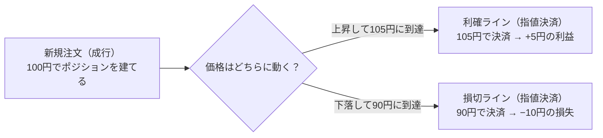

# CFD（差金決済取引）ノート

🇬🇧 [English version](./cfd.en.md)

CFD（Contract for Difference＝差金決済取引）について、
仕組みと実務の観点から整理する。対象例：指数（日本225）、
商品（WTI原油・金）、米国株、ETF など。

> このノートは「乗り換え（ロールオーバー）」の項目から書き始め、
> 書けた項目を順に足していく。最終的に下記の構成に整える。

## 目次（書けたら順に埋めていく）

- [x] CFDとは何か（一言でいうと）
- [x] なぜCFDという商品が存在するのか（現物との違い）
- [x] レバレッジと証拠金
- [x] 差金決済とは
- [x] ロング／ショート
- [x] レートはどう生成されるか
- [x] カバーディールの考え方
- [x] 乗り換え（ロールオーバー／限月）とは
- [x] なぜ乗り換えが起きるのか（限月のしくみ）
- [x] スピンオフ・併合・分割が起きたとき
- [ ] 配当が出たとき（権利調整額）
- [x] 商品タイプ別の具体例（指数／商品／米国株・ETF）
- [x] ポジションリミットとカバー戦略（自己資本規制・市場リスク管理の観点）

---

## CFDとは何か

CFDは、金融派生商品（デリバティブ取引）の一種である。デリバティブ取
引とは、原資産（もととなる資産）の価格に依存して価格が決まる取引の
ことで、代表的なものに次の4つがある。

- 先物取引（Futures）：将来の決められた期日に、特定の商品を現時点で
  決めた価格で売買する契約（例：日経225先物）
- オプション取引（Option）：将来の決められた期日に、特定の商品を現時
  点で決めた価格で「売買できる権利」を取引するもの
- スワップ取引（Swap）：金利や通貨など、異なるキャッシュフロー（資金
  の受け払い）を当事者間で一定期間交換する取引
- 差金決済取引（CFD）：現物の受け渡しを行わず、売買価格の差額のみを
  決済する取引

つまりCFDは、先物・オプション・スワップと並ぶデリバティブ取引の1種
類、という位置づけになる。

CFDとは、「Contract for Difference（コントラクト・フォー・ディファ
レンス）」の略で、日本語では差金決済取引（さきんけっさいとりひき）と
呼ばれる。

「差金決済」とは、実際の商品（株式・原油・株価指数など）の受け渡しを
せず、売買したときの価格差だけをやり取りする取引のことを指す。たとえ
ば100円で買って120円で売った場合、実際に100円分のモノを受け取ること
も、120円分のモノを渡すこともなく、その差額20円だけが手元でやり取り
される。

実は、日常的によく聞く「FX（外国為替取引）」もCFDの一種である。FXは
「為替（通貨のペア）」を対象にしたCFD、と言い換えることができる。CFD
という大きな括りの中に、株価指数・コモディティ・そしてFXが含まれてい
る、という関係になる。

CFDは、証券取引所を介さず、証券会社（ディーラー）と顧客が1対1で契約
を結ぶ、いわゆる店頭取引（OTC取引、Over-The-Counter）である。日本語
では「相対（あいたい）取引」とも呼ばれる。

取引所取引（たとえば現物株式の取引所取引）では、多数の売り手・買い手
の注文が「板（いた）」と呼ばれる一覧に並び、需給によって価格が決ま
る。一方CFDは取引所の板を使わず、証券会社が提示する価格（レート）に
対して顧客が売買する形をとる。この違いから、次のような特徴が生まれ
る。

- 取引所のような厳格な規格（取引単位や満期日など）がないため、証券会
  社が条件を柔軟に決められる。CFDに「乗り換え（ロールオーバー）」と
  いう仕組みがあるのも、もともと取引所の限月という決まった規格を参照
  しつつ、証券会社側で独自にポジションを繋ぎ直せる自由度があるためで
  ある（詳細は「乗り換え」の項目で扱う）。
- 証券会社が買値（Bid）と売値（Ask）を提示し、その差額であるスプレッ
  ドが実質的なコストになる
- 証券会社（カウンターパーティー）が経営破綻するなどした場合、契約が
  履行されなくなるリスク（カウンターパーティーリスク）がある

スプレッドがどう決まるか、証券会社が顧客との取引で抱えたリスクをどう
処理しているかは、それぞれ後述の「レートはどう生成されるか」「カバー
ディールの考え方」で扱う。

##### なぜ「現物を持たない」のに取引ができるのか

CFDは、現物（株式や商品そのもの）の価格を参照して作られた商品であ
る。実際にその現物を売買するには全額の資金が必要だが、CFDは価格差だ
けをやり取りするため、少ない資金で取引ができる（レバレッジという考
え方につながるが、詳細は別項目で扱う）。

また、現物取引には受け渡しという煩雑さも伴う。たとえばWTI原油のよう
な商品を実際に売買した場合、限月を超えて取引を続けようとすると、本来
は現物の受け取りが発生してしまう。CFDでは、こうした受け渡しに関わる
作業を証券会社が代わりに行うことで、顧客は現物を意識せずに差金取引だ
けに集中できる。

さらに、現物取引は本来その商品を取引する取引所が開いている時間しか
取引できないが、CFDであれば夜間や祝日でも取引できるというメリットも
ある。

##### 具体例：CFDは実際に何を売買していることになるのか

CFDが実際に参照している価格は、商品タイプによって異なる。

- 日本225：取引所で取引されている日経225先物の価格を参照している。
  参照先の取引所は証券会社によって異なるが、たとえばSGX（シンガポー
  ル取引所）やCME（シカゴ・マーカンタイル取引所）が代表的である。
- WTI原油：同様に、取引所で取引されているWTI原油先物の価格を参照して
  いる。
- 米国半導体ETFなど、ETF型のCFD：ETF（上場投資信託）そのものの価格を
  参照している。たとえば米国半導体ETFのCFDであれば、iShares
  Semiconductor ETFのような実際のETFの値動きを参照している。なお、
  ETF自体を買うこととETFを参照したCFDを取引することは別物である
  （詳細は補足①）。
- FXや金スポットなど、取引所を介さない商品：金融機関同士が直接価格を
  提示し合う相対取引（あいたいとりひき）で決まるスポット取引（直物取
  引）の価格を参照している（詳細は補足②）。なお、同じ貴金属でも、先
  物を参照する銘柄もある（詳細は「商品タイプ別の具体例」を参照）。

このように、CFDは商品ごとに「先物」「ETF」「スポット取引」のいずれか
を参照価格として作られている。前段で説明した「差金決済」という仕組み
は共通だが、その裏側にある参照先は一様ではない、という点がポイントに
なる。

---
補足①：ETFとは

ETF（Exchange Traded Fund／上場投資信託）とは、株価指数や商品に連動
するように作られた金融商品。運用会社が集めた資金で構成銘柄の株式など
を買い、それを購入した顧客は構成銘柄に分散投資しているのと同じ効果
を得られる（配当の代わりに分配金を受け取ることもできる）。ETF自体を
買う場合は購入金額分の資金が必要で、実際にその資産（の一部）を保有し
ていることになる。一方、CFDは実物の資産を持たないため、株主としての
権利などは発生せず、「買ったときの価格」と「売ったときの価格」の差額
だけを決済する取引になる。

補足②：スポット取引とは

スポット取引（直物取引）とは、取引が成立してから短期間（通常2営業日
以内）で現物の受け渡しが完了する取引のこと。取引所を介さず、金融機関
同士でやり取りされる価格がベースになる。

##### 自分（オペレーション）は、CFDのどこに関わっているか

CFDという商品を提供し続けるために、オペレーションが関わる業務は多岐
にわたる。ここでは全体像として整理し、それぞれの詳細は該当する各項目
（乗り換え、レバレッジと証拠金など）に譲る。

- 相場・リスク管理：マーケットの状況確認（サーキットブレーカー・貸株
  規制など）、顧客ポジションのリスク判断・調整、リスクエクスポージャ
  ーの監視、ロスカット（強制決済）のモニタリング、配信レートの異常値
  チェック
- 商品運用：コーポレートアクション対応（新規上場・分社化・株式分割・
  合併など）、取引所スケジュールの確認、価格調整額の決定と反映、限月
  の乗り換え（ロールオーバー）、ヘッジ取引
- 管理・コンプライアンス：reconciliation（帳簿と実際の残高の突合）、
  顧客資産の分別管理の確認、金融庁・金融先物取引業協会などへの報告書
  作成、KYC（顧客確認）・AML（マネーロンダリング対策）対応
- システム運用：障害対応、事業継続計画（BCP）に基づく代替手順の整
  備、新規商品リリース前の動作確認（UAT）

つまり、CFDという商品を1つ提供し続けるためには、「価格を正しく作
る」「リスクを管理する」「規制を守る」「システムを安定稼働させる」と
いう複数の役割が重なって支えている。

##### 3年前の自分がつまずきそうな点

ここまでCFD・FX・ETF・先物・スポット取引と、いろいろな言葉が一度に出
てきたと思う。全部を一度に理解しようとせず、まず1つの商品に絞って、
知識を深めるのがおすすめ。

例えばWTI原油であれば、「限月のある先物価格を参照してレートが作られ
ている」→「決済日が来ると本来は乗り換えが必要になる」→「その煩雑な
作業をオペレーション側が代わりに行っているから、顧客は何もせず取引を
続けられる」という一連の流れを1つの商品で理解できれば、他の商品にも
応用できる。根っこにあるのは、CFDは常に「価格差を利用した取引であ
り、現物の受け渡しがない」という点である。

また、初心者がよく誤解しやすい点として、次のようなものもある。

- 「少ない資金で取引できる＝お金を借りている」と誤解する：CFDは借金
  ではなく、「価格差だけをやり取りする」仕組みだからこそ、少ない資金
  で取引できる。
- CFDの価格と、参照している先物やETFの価格が完全に一致すると思って
  しまう：CFDの価格にはスプレッド（買値と売値の差）などが含まれるた
  め、参照先の価格とは微妙にずれることがある（詳細は補足③）。
- CFDで株やETFを取引すると、「株を買った」ことになると思ってしまう：
  CFDでは実物の資産を持たないため、株主としての権利（議決権や株主優
  待など）は一切発生しない。

補足③：スプレッド（オファー／ビッド）とは

CFDの価格は、常に2つの値が並んで提示される。

- オファーレート（Ask）：売りたい相手が提示している価格。買う側から
  すると、この価格で買うことになる。
- ビッドレート（Bid）：買いたい相手が提示している価格。売る側から
  すると、この価格で売ることになる。

通常、オファー（売り手の希望価格）はビッド（買い手の希望価格）より
高い。この2つの価格差が「スプレッド」であり、CFDの実質的な取引コス
トになっている。

---

## なぜCFDという商品が存在するのか（現物との違い）

現物取引とは、株式・債券・為替・金利・金や原油といった資産そのものを
所有する取引で、売買にはその現物の受け渡しが発生する。

CFDは、そうした現物取引の対象を「原資産（もととなる資産）」「参照
先」として、その価格差だけをやり取りする取引である。CFDでは現物の受
け取りや、それに付随する株主としての権利なども発生しない。

##### なぜ現物を買わずCFDで取引するメリットがあるのか

現物取引と比べたとき、CFDには次のようなメリットがある。

- 取引手数料が無料：CFDは多くの場合、取引手数料がかからない（スプレ
  ッドが実質的なコストになる）。
- 現物の受け渡しがない：価格差だけのやり取りなので、保管や輸送、受け
  渡しの手間が一切かからない。
- レバレッジが効く：少ない証拠金で、大きな金額を取引したときと同じ効
  果を得られる。
- 空売りがしやすい：現物は保有していないと売れないが、CFDは新規の売
  り（ショート）から取引を始められるため、価格が下がる局面でも利益を
  狙える。
- 銘柄・市場をまたいで一元管理できる：日本株・米国株・原油・為替な
  ど、通常なら別々の口座が必要な商品を、1つの口座でまとめて取引でき
  る。
- 海外の証券口座を開く必要がない：たとえば日本にいながら米国株や海外
  商品のCFDを取引でき、現地の証券会社に口座を開く手間がかからない。
- 少額から取引できる：現物株は「単元株（100株単位など）」で買う必要
  があることが多いが、CFDはより小さい単位から取引できる場合が多い。
- 配当相当額の調整金を受け取れる（個別株・ETF CFDの場合）：株主では
  ないが、配当が出るタイミングでその分の調整金を受け取れる（売り建て
  の場合は逆に支払う）。なお、先物を参照する株価指数CFDでは、配当分は
  先物価格に織り込まれており、乗り換えのときの価格調整額の中で精算さ
  れる（詳細は「商品タイプ別の具体例」を参照）。
- 夜間や祝日、24時間近く取引できる：取引所が開いている時間に縛られ
  ず、海外市場を含めて夜間でも取引できる商品が多い。

##### 具体例：現物のWTI原油とCFDのWTI原油では何が違うのか

現物との違いを具体的に見るために、WTI原油先物とWTI原油CFDを比べてみ
る。

| 項目 | 現物のWTI原油取引 | WTI原油CFD |
|---|---|---|
| 受け渡し | 限月が来ると現物の受け渡しが発生する。避けるには自分で乗り換えが必要 | 受け渡しは発生しない。乗り換えは証券会社が代行してくれる |
| 必要な資金 | 取引金額の全額が必要 | 証拠金のみで取引可能（レバレッジが効く） |
| 空売り | 現物を借りて売る必要があり、コストも手間もかかる | 新規の売り（ショート）からそのまま入れる |
| 取引時間 | 原油先物取引所の取引時間に限定される | 夜間や祝日でも取引できる場合が多い |
| 保管・付随コスト | 保管・輸送などのコストが発生しうる | 保管の概念自体がなく、コストはスプレッドなどに集約される |

このように、参照している値動きは同じでも、「現物を持つかどうか」とい
う1点の違いから、資金・リスク管理・取引の自由度に至るまで、さまざま
な差が生まれている。

##### 自分（オペレーション）は、現物取引とCFD取引の違いをどこで意識するか

CFDは現物を持たない分、現物取引にはない業務がオペレーション側に発生
する。実務でこの違いを特に意識するのは、次のような場面である。

- ロールオーバー（限月の乗り換え）：現物にはない、CFD特有の乗り換え
  作業そのもの
- 調整金の管理：乗り換えに伴う価格の不連続を埋め合わせる調整金の計
  算・付与（個別株・スポットでは、権利調整額や金利調整額の登録・付与
  も含む）
- リスク管理：レバレッジが効く分、現物よりも大きなポジションリスクが
  発生しうるため、その監視・調整が必要になる
- 参照先取引所の取引時間の管理：CFD自体は夜間や祝日も取引できるが、
  参照している先物や現物の取引所には取引時間があるため、その時間帯や
  スケジュールを把握しておく必要がある
- 参照先限月の価格をもとにしたレート生成：CFDの価格は独自に決まるの
  ではなく、参照している限月の価格をベースに生成されるため、その紐付
  けの管理が必要
- 取引単位の管理：現物とは異なる単位でCFDが取引される場合があり、そ
  の設定・管理が必要
- 証拠金率・レバレッジ倍率の設定と維持率管理：レバレッジを提供する以
  上、証拠金が不足した際の対応（維持率の監視）が必要になる
- ロスカット水準の設定・モニタリング：現物にはない、強制決済の仕組み
  そのものの管理
- スプレッドの設定：現物のような取引手数料の代わりに、CFD特有のコス
  ト構造（買値と売値の差）を管理する
- 限月マスタのメンテナンス：どの限月をいつまで参照するかというマスタ
  データ自体の管理（ロールオーバーの前提となる業務）
- 円転単価の管理：海外商品を円建てで提供する場合の為替換算レートの設
  定

つまり、「現物を持たない」というCFDの本質的な特徴が、そのままオペレ
ーション側の管理項目（価格・リスク・時間・単位）を増やしている、とい
う関係になっている。

##### 3年前の自分がつまずきそうな点

「現物取引と全く同じ値動きに見えるのに、なぜCFDという別の商品が存在
するのか」——最初はそう疑問に思うかもしれない。「だったら現物を直接
取引すればいいのでは」と。

しかし、現物を直接取引しようとすると、限月が来るたびに自分で乗り換え
（ロールオーバー）を行う必要があり、手間がかかる上に、間違えれば実際
に現物（原油やコモディティそのもの）が届いてしまうリスクもある。CFD
は、こうした煩雑な作業や受け渡しのリスクを証券会社が代わりに引き受け
ることで成り立っている商品である。

ただし、これは「CFDのほうが一方的にお得」という意味ではない。CFDには
スプレッド（買値と売値の差）というコストがあり、レバレッジが効く分、
含み損が広がるスピードも現物より速い。「受け渡しがなくて便利」なこと
と、「リスクが小さい」ことは別の話であり、CFD特有のコストやリスクも
理解した上で使う必要がある。

---

## レバレッジと証拠金

##### レバレッジとは何か（一言でいうと）

レバレッジとは、少ない証拠金（担保として預けるお金）で、その何倍も
の金額の取引ができる仕組みのことである。日本の個人向けCFDでは、
レバレッジの上限が商品タイプによって決められており、株価指数は10倍、
商品（原油・金など）は20倍、個別株・ETFは5倍までとなっている（FXは
25倍まで）。商品タイプによって上限が異なるのは、値動きの激しさが
異なるためである。個別株は1つの企業の業績や出来事で大きく動きやすい
ため、上限が低く抑えられている。

たとえば、株価指数CFDで10万円を証拠金として預け入れた場合、レバレ
ッジ10倍であれば、100万円分の取引を行うことができる。つまり、実際に
用意する資金は10万円でも、100万円分の値動きをそのまま損益として受け
取ることになる。

##### 証拠金とは何か、レバレッジとどう関係するか

証拠金（しょうこきん）とは、取引を行う際に担保として証券会社に預け
入れる資金のことである。

レバレッジは、この証拠金を元手にして、何倍もの金額の取引を行う仕組
みなので、証拠金とレバレッジは表裏一体の関係にある。取引したい金額
（取引金額）に対して、実際に預け入れる証拠金の割合を「証拠金率」と
呼び、レバレッジは証拠金率の逆数にあたる（例：証拠金率10％＝レバ
レッジ10倍）。

証拠金は、取引を始めるときに必要な「新規建て証拠金」だけでなく、含
み損が出た場合にそれを吸収するクッションの役割も果たす。証拠金に対
して、口座に残っている純資産（有効証拠金）の割合を「証拠金維持率」
と呼び、この維持率が一定水準を下回ると、証券会社から追加の証拠金を
求められたり（追証）、強制的にポジションが決済されたりする（ロスカ
ット）。

##### 具体例：証拠金○○円でレバレッジ○倍だと、いくらの取引ができるか

日経225のCFDを例に考える。証拠金として10万円を預け入れ、株価指数
CFDの上限であるレバレッジ10倍で取引する場合。

- 取引可能金額：10万円 × 10倍 = 100万円
- 証拠金率：1 ÷ 10 = 10％
- 必要証拠金（100万円分の取引をするために必要な証拠金）：100万円 ×
  10％ = 10万円

つまり「取引金額 × 証拠金率」で必要証拠金が求まり、「証拠金 × レバ
レッジ」（または「証拠金 ÷ 証拠金率」）で取引可能金額が求まる、と
いう関係になっている。

##### 自分（オペレーション）は、証拠金不足（追証）が起きたときどう対応しているか

証拠金維持率は、「口座の純資産（有効証拠金）÷ 必要証拠金 × 100％」
で計算される。維持率がどこまで下がったかによって対応が変わるが、具
体的な閾値や猶予時間は証券会社ごとに異なる。以下はあくまで一例であ
る。

- 維持率が100％を切ったまま翌営業日に持ち越された場合：猶予があ
  る。一定の期限（例：翌営業日中）までに、追証（追加の証拠金を入金
  すること）、または自分でポジションの一部を決済して維持率を回復さ
  せることで、全ポジションを強制決済されることを避けられる。期限ま
  でに解消されなければ、証券会社側でポジションが全決済される。
- 維持率が一定の水準（例：50％）を切った場合：猶予はない。切った瞬
  間に、全ポジションが強制的に決済される（ロスカット）。これは、顧
  客の損失がそれ以上膨らまないようにするための救済措置でもある。

オペレーションは、口座ごとの維持率を常時モニタリングし、猶予のある
閾値を切った口座には追証の通知を行い、猶予のない閾値を切った口座に
ついてはロスカット処理が正しく実行されているかを確認する。

##### 3年前の自分がつまずきそうな点

- レバレッジを「借金をして取引している」と誤解する：レバレッジは借
  金ではなく、証拠金という担保を元手に、その何倍かの金額の取引を行
  える仕組みである。含み損が証拠金を上回れば強制的に決済される仕組
  みになっており、証拠金以上の借金を背負うことを前提とした制度では
  ない。
- 使える金額いっぱいまでレバレッジをかけるのが当然だと思ってしま
  う：上限（たとえば株価指数CFDなら10倍）まで取引できるからといっ
  て、常に上限いっぱいで取引するのが普通というわけではない。レバレッジを高くするほど、少しの値動きで証拠金
  維持率が急激に下がりやすくなるため、余力を持たせて取引するのが一
  般的である。
- 証拠金維持率100％を「安全なライン」だと思ってしまう：実際には、
  100％を切った時点で既に追証の対象になる。安全に取引を続けるため
  には、100％よりも十分に高い維持率を保っておく必要がある。
- 追証とロスカットを同じものだと誤解する：追証には猶予があり、期限
  内に対応すれば強制決済を避けられるが、ロスカットは猶予なく即座に
  全決済される。両者はトリガーとなる維持率の水準も、対応できる余地
  も異なる。

---

## 差金決済とは

> 差金決済の基本的な定義（「実際の商品の受け渡しをせず、売買したと
> きの価格差だけをやり取りする取引」）は「CFDとは何か」で既に説明し
> た。ここでは、その基本を踏まえた上で、決済のタイミング・複数回売
> 買した場合の損益計算・オペレーション側の決済処理という3つの切り口
> を掘り下げる。

##### 差金決済の損益は「いつ」確定するのか

差金決済において、損益が確定するタイミングは、顧客が建てたポジショ
ンに対して反対売買（決済注文）を行った瞬間である。ポジションを持っ
ている間は、価格が動くたびに評価上の損益（未実現損益）が変動するだ
けで、まだ手元の資産としては確定していない。

注文の出し方には、大きく分けて2種類ある。

- 成行（なりゆき）注文：現在見えているレートで、その場ですぐに約定
  させる注文
- 指値（さしね）注文：あらかじめ指定した特定のレートに達したとき
  に、約定する注文

これは新規注文（ポジションを建てるとき）にも、決済注文（ポジション
を閉じるとき）にも、どちらにも使える。

| | 新規注文（ポジションを建てる） | 決済注文（ポジションを閉じる） |
|---|---|---|
| **成行** | 現在のレートでその場で新しいポジションを建てる | 現在のレートでその場でポジションを閉じる |
| **指値** | 指定したレートに達した時点で新しいポジションを建てる | 指定したレートに達した時点でポジションを閉じる |

決済注文には、利益を確定させる「利確（りかく）」と、損失を確定させ
る「損切（そんぎり）」の2種類があり、どちらも成行・指値のいずれで
も行うことができる。

たとえば、100円で成行の新規注文をしてポジションを持ったとする。105
円まで上がったら利益を確定したいと考えれば、105円に指値の決済注文
（利確）を入れておく。逆に、90円まで下がった場合に損失がこれ以上膨
らむのを避けたいと考えれば、90円に指値の決済注文（損切）を入れてお
く。

```mermaid
graph LR
    A["新規注文（成行）<br/>100円でポジションを建てる"] --> B{価格はどちらに動く？}
    B -->|上昇して105円に到達| C["利確ライン（指値決済）<br/>105円で決済 → +5円の利益"]
    B -->|下落して90円に到達| D["損切ライン（指値決済）<br/>90円で決済 → −10円の損失"]
```

このように、あらかじめ利確ライン・損切ラインを指値で設定しておくこ
とで、値動きを常に見ていなくても損益を確定させることができる。

##### 具体例：複数回売買した場合の損益計算（平均約定単価の考え方）

同じ商品を複数回に分けて売買（買い増し・売り増し）した場合、損益は
「平均約定単価」を基準に計算される。

**買い（ロング）を複数回に分けて積み増した場合**

| 回数 | 約定レート |
|---|---|
| 1回目（新規） | 100円 |
| 2回目（買い増し） | 103円 |
| 3回目（買い増し） | 105円 |
| 4回目（買い増し） | 104円 |
| **平均約定単価** | (100+103+105+104)÷4 = **103円** |

平均約定単価が103円になるので、103円より高いレートで決済すれば利
益、低いレートで決済すれば損失になる。

**売り（ショート）を複数回に分けて積み増した場合**

100円で下がると見込んで売り注文を入れたが、レートが上がってしまっ
たため103円で売り増し。その後105円まで上がったところでも売り増し、
下がり始めたのを見て104円でも売り増した。

| 回数 | 約定レート |
|---|---|
| 1回目（新規） | 100円 |
| 2回目（売り増し） | 103円 |
| 3回目（売り増し） | 105円 |
| 4回目（売り増し） | 104円 |
| **平均約定単価** | (100+103+105+104)÷4 = **103円** |

ショートの場合は買いと逆で、平均約定単価より低いレートで決済すれば
利益になる。最初の売りが100円だった時点だけを見ると、一時105円まで
逆行して含み損を抱えていたことになるが、平均約定単価（103円）を基
準にすれば、その後レートが103円を下回るところまで戻れば全体として
は利益になる、ということが分かる。

##### 自分（オペレーション）は、決済処理のどの部分に関わっているか

- ネットポジションでの管理：証券会社側では、顧客のポジションをグロ
  ス（ショートとロングをそれぞれ別々に保持する）ではなく、ネット
  （ショートとロングを差し引きした状態）で管理する。これは、前段で
  説明した「平均約定単価」の考え方がそのまま反映された形であり、複
  数回の売買があっても、最終的には1つの合算ポジションとして扱われ
  る。
- レート配信異常時の約定修正：レート配信が正常に行われなかった場
  合、誤ったレートで約定してしまった取引が発生することがある。その
  場合、オペレーション側で正しいレートに手動で修正し、対象の顧客に
  通知する対応が必要になる。
- 決済のreconciliation（突合）：顧客の決済結果が、社内システムとカ
  バー先（CP）側の記録の両方で正しく一致しているかを確認する。
  ロング／ショートのセクションで触れた「カバー先とのポジション照
  合」の、決済版にあたる。
- 損益・残高反映の確認：決済によって確定した損益が、顧客の口座残高
  に正しく反映されているかを確認する。
- スリッページ対応：指値決済の際、指定したレートと実際の約定レート
  にズレ（スリッページ）が生じることがある。このズレが許容範囲を超
  えていないかを確認し、超えている場合は対応する。

##### 3年前の自分がつまずきそうな点

- 未実現損益を「もう確定した利益・損失」だと思ってしまう：決済（反
  対売買）するまでは、どれだけ含み益・含み損があっても、それはあく
  まで評価上の数字に過ぎない。決済注文が約定して初めて、損益が確定
  する。
- 複数回売買すると、それぞれの取引が別々に管理されると思ってしま
  う：実際には証券会社側ではグロスではなくネットで管理されるため、
  個々の取引レートよりも「平均約定単価」という1つの基準に集約され
  る。途中の値動きに一喜一憂するより、平均約定単価がどこにあるかを
  意識する方が実務的に重要になる。
- 指値で決済ラインを入れておけば、必ずそのレート通りに決済されると
  思ってしまう：スリッページなど、レート配信や市場の状況によって、
  指定したレートと実際の約定レートにズレが生じることがある。

---

## ロング／ショート

##### ロング・ショートとは何か（一言でいうと）

ロング（買い）・ショート（売り）とは、取引の「方向」を表す言葉であ
る。

- ロングを持つ：買いのポジション（保有している建玉／たてぎょく）を
  持つこと。自分の持ち値より価格が上がれば利益が出る。
- ショートを持つ：売りのポジションを持つこと。自分の持ち値より価格
  が下がれば利益が出る。

決済（ポジションを閉じること）は、逆方向の取引で行う。

- ロング（買い）の決済 → ショート（売り）することで行う
- ショート（売り）の決済 → ロング（買い）することで行う

つまり、「買いから入って、売って終わる」のがロング、「売りから入っ
て、買って終わる」のがショート、という関係になる。

##### なぜCFDでは「売り」から入れるのか（現物との違い）

現物取引では、その商品を保有していなければ売ることができない。一方
CFDは「差金決済」という仕組みを使っているため、売買したときの価格
差だけをやり取りする取引になる。

「売りから入る」とは、売った価格と、後で買い戻した価格との差額を受
け取る権利と、買い戻す義務を持つ、ということを意味する。決済時に
は、この権利と義務を行使することで、差額を損益として確定する。

この仕組みがあるため、現物を保有していなくても空売り（からうり）が
できる。株式の信用取引のように、証券会社から株を借りて金利を支払う
といった手続きは必要ない。

たとえば、友達からゲーム機を借りて1,000円で売り、後で買い戻して友
達に返す、という流れをイメージすると分かりやすい。もし買い戻すとき
の価格が800円まで下がっていれば、売った1,000円と買い戻した800円の
差額200円が自分の利益になる。これが空売りの基本的な仕組みである。
CFDでは、この「借りて売って、買い戻して返す」という一連の流れを、
証券会社が裏側で処理してくれるため、顧客は権利・義務のやり取り
（＝ショートポジションを持つこと）だけを意識すればよい。

##### 貸株（かしかぶ）とショートの規制

CFD自体は差金決済であり、顧客との取引だけを見れば現物の株を借りる
必要はない。しかし証券会社は、顧客から受けたショートポジションのリ
スクを、実際の株式市場でヘッジ（カバー）することがある（詳細は「カ
バーディールの考え方」で扱う）。このヘッジのために証券会社（または
その先のカバー先）が現物株を売る必要が生じた場合、信用取引と同様
に、その株をどこかから借りてくる必要がある。これが「貸株（かしか
ぶ）」である。

貸株の仕組み：

- 株を保有している投資家が、証券会社にその株を貸し出す。貸した投資
  家は、対価として金利を受け取れる（銀行預金より高めの金利であるこ
  とが多い）。貸している間も、いつでも通常通り市場でその株を売却で
  きる。
- 証券会社は、こうして集めた株を、機関投資家や信用取引でショートし
  たい投資家に又貸しして、手数料を得る。

つまり「売りから入る（ショート）」を現物株式市場で行うには、必ず
「誰かから株を借りてくる」という手順が必要になる。

貸株が確保できない場合、証券会社は現物市場でのヘッジができなくな
る。ヘッジできないままショートポジションを受け入れ続けると、証券会
社自身が方向性のリスク（相場が逆に動いたときの損失）を抱えたままに
なってしまう。そのため、貸株が確保できなくなった銘柄については、証
券会社は新規のショート取引そのものを規制せざるを得ない。

これは証券会社が独自に決めるだけの話ではなく、取引所側の規制（空売
り規制、いわゆる201規制など）や、カバー先の証券会社側で貸株規制が
かかった場合にも連動する。店頭でCFDを提供する証券会社も、カバー先
が貸株規制を受ければ、それに合わせて顧客の新規売りを規制することに
なる。

##### 具体例：ロングとショートで、価格が上がった/下がったときの損益はどうなるか

日経225のCFDを1枚、24,000円のときに取引したとする。

| ポジション | エントリー価格 | 決済価格 | 損益の計算 | 結果 |
|---|---|---|---|---|
| ロング（買い） | 24,000円 | 24,500円（上昇） | 24,500 − 24,000 | +500円の利益 |
| ロング（買い） | 24,000円 | 23,500円（下落） | 23,500 − 24,000 | −500円の損失 |
| ショート（売り） | 24,000円 | 23,500円（下落） | 24,000 − 23,500 | +500円の利益 |
| ショート（売り） | 24,000円 | 24,500円（上昇） | 24,000 − 24,500 | −500円の損失 |

つまり、ロングは「決済価格 − エントリー価格」、ショートは「エント
リー価格 − 決済価格」で損益が決まる。価格が上がるとロングが得をし
てショートが損をし、価格が下がるとその逆になる、という表裏の関係に
なっている。

##### 自分（オペレーション）は、ポジション方向（ロング／ショート）をどこで確認・管理しているか

CFDは証券会社と顧客の相対取引（あいたいとりひき）であるため、まず
「顧客がロング→当社はショート」「顧客がショート→当社はロング」と
いう反転の関係を理解しておく必要がある。オペレーションは、この関係
を前提に、いくつかの場面でポジション方向を確認・管理している。

- ネットポジションの監視：商品ごとにポジションリスクの許容量が決め
  られており、マーケットの動き・顧客の指値・テクニカルな状況を見な
  がら、その許容量に収まるようカバー（ヘッジ）の判断を素早く行う。
  許容量を超えそうな場合は、カバーを増やして対応する。
- カバー先とのポジション照合（reconciliation）：当社が保有している
  ヘッジポジションと、PB（プライムブローカー）やLP（流動性提供者）
  側の認識がズレていないかを突き合わせる。「当社にあってPBにない」
  「PBにあって当社にない」といった浮いたトランザクションがないかを
  確認し、見つかった場合はLPに問い合わせて、レートのズレや約定の成
  否を確認する。照合はTokyo・London・NYの各時間帯で少なくとも1回、
  実際には各時間帯2回程度行っている。常時モニタリングしているた
  め、約定が滑った（スリッページが起きた）ときは通知が来ることが多
  く、その都度LPと連絡を取り合っている。
- ロスカット・証拠金維持率のモニタリング：一般に、ショートを抱えて
  いる方が維持率が下がりやすい。理由は主に2つある。1つは、配当相当
  額の調整金を、買い建て（ロング）は受け取り、売り建て（ショート）は
  支払う側になるため、時間の経過だけで純資産がじわじわ減っていくこと
  （個別株・ETFでは配当が出るたびに権利調整額として、先物を参照する株
  価指数では乗り換えのときの価格調整額の中で、この受け払いが発生す
  る）。もう1つは、株価指数や個別株は長期的には上昇す
  る傾向があるため、同じボラティリティでもショートの方が含み損を抱
  えたまま長引きやすいこと。またボラティリティが高い局面で相場が一
  方向に動くと、反対方向のポジションを抱えている顧客の維持率を一気
  に消費してしまう。顧客のロスカットが発生すると、その分当社側の持
  ちポジションが増える可能性もあり、カバーのリジェクト（約定拒否）
  が起きるリスクもあるため、常時の監視が欠かせない。
- ショート特有の規制対応：貸株規制や空売り規制（201規制など）が発
  生した場合、顧客の新規売り取引を停止し、顧客取引ページにお知らせ
  を掲示する。規制が解除された場合も、解除日を顧客ページに掲示す
  る。
- レポーティング：取引高や顧客のロスカット状況などを含め、規制当局
  等への報告義務があり、基本的には月次で対応している。

##### 3年前の自分がつまずきそうな点

- ショート＝悪いこと、というイメージを持ってしまう：「空売り」とい
  う言葉の響きから、市場に対してネガティブな行為だと感じるかもしれ
  ないが、CFDにおいてショートは単なる「取引の方向」の1つであり、ロ
  ングと対等な選択肢に過ぎない。
- 顧客が儲かれば会社も儲かる、と思い込んでしまう：CFDは相対取引の
  ため、顧客がロングで利益を出しているとき、証券会社は理論上その反
  対のショートで含み損を抱えている（実際はヘッジしているため損益は
  カバー先との関係で相殺されるが、顧客との関係だけを見ると真逆にな
  る）。
- CFDのショートも「株を借りている」感覚で理解してしまう：顧客から
  見れば、CFDは差金決済なので、実際に株を借りているわけではない。
  貸株が必要になるのは、証券会社側がヘッジのために現物市場で売る場
  合の話であり、顧客の契約そのものとは別のレイヤーの話である。
- 維持率がショートで下がりやすいのは「相場が上がっているだけ」と考
  えてしまう：実際には配当相当額の支払い（個別株・ETFでは権利調整
  額、先物を参照する株価指数では価格調整額を通じて）という構造的な
  要因も重なっており、価格が動かなくても時間の経過だけで維持率が下
  がっていくことがある。

---

## レートはどう生成されるか

CFDのレートは、参照している先物や現物の取引所価格をもとに、証券会社
が独自に生成している。ただし、その参照価格をそのまま顧客に提示してい
るわけではない。

また、CFDのレートは1本の値段ではなく、買い値（Ask）と売り値（Bid）の
2本値で提示される。この2本値の差がスプレッドであり、CFD特有の実質的
なコストになる。

なぜ1本値ではなく2本値（Bid/Ask）で提示されるかというと、CFDが取引所
取引ではなく店頭取引（OTC取引）だからである。取引所取引のように「板」
で需給が公開されているわけではないため、証券会社が自ら買値と売値を提
示し、その差（スプレッド）を実質的な手数料として受け取る形になる。

##### 参照している先物・現物とレートの関係

CFDのレートは、参照先（先物または現物）の取引所価格と連動して動く。
ただし、乗り換え（ロールオーバー）が発生する商品の場合、「今どの限月
を参照しているか」がレートに直接影響するため、参照限月の管理が特に重
要になる。

##### 具体例：日本225やWTI原油のレートは実際どこから来ているか

取引所のデータは、そのままでは扱いにくい生データのため、大手データ
ベンダー各社がティックデータや1分足データに
整理（クレンジング）した形で提供していることが多い。CFDを提供する証
券会社は、このデータプロバイダーからリアルタイムデータを受信し、そこ
にスプレッドなどを加味した加工を行って、顧客向けのレートを生成してい
る。

取引所から直接データを取得することも技術的には可能だが、取引所ごとに
接続・契約を結ぶ必要があり、開発コストがかかる。たとえば全20種類の商
品を取り扱う場合、CME・ICE・NYSEなど個別の取引所すべてと連携するよ
り、データプロバイダーと契約したほうが、契約もシステム開発も効率的に
なる。

また、データプロバイダーを複数契約しているのは、1社に障害が起きても
顧客向けレートを止めずに済むようにするためである（詳細は次項）。

##### 自分（オペレーション）は、レート生成・配信のどこを監視しているか

オペレーションは、レートが「止まらないこと」と「市場実勢からズレてい
ないこと」の両方を常時監視している。

- フェイルオーバーの判断：メインのデータプロバイダーで障害が起き、顧
  客向けレートに異常が出た（または生成されなくなった）場合、まず顧客
  を最優先に考え、サブのデータプロバイダーへの切り替えを行う。切り替
  えの判断時には、自社がレート生成に使っていない別のプロバイダーなど
  を使って市場実勢とサブプロバイダーのレートを比較し、大きな差異がな
  いかを確認したうえで切り替える。障害の原因調査は後回しにし、まず顧
  客対応を優先する。
- スプレッドの厚みの管理：スプレッドの幅は、商品ごとのリスクやコスト
  に応じて証券会社側が設定している。
- レートの異常値監視（アボート）：市場価格が急に跳ね上がる（または落
  ちる）といった値動き自体を指す言葉ではなく、そうした異常な値動きを
  検知した際に、正しくないレートを顧客やカバー先に流してしまう前に、
  システムが自動的に処理を一旦止める仕組みのことを指す。値動きそのも
  のが実際の市場の動き（重要な経済指標の発表など）による場合もあれ
  ば、データの不具合による場合もあり、その場では区別できない。そのた
  め、いったん配信を止めて市場実勢を確認し、問題がなければ配信を再開
  する、という手順になる。

  アボートが発生する典型的な要因には、次のようなものがある：
  - レイテンシ（通信の遅延）による価格の陳腐化：ネットワークの遅延な
    どで、社内の最新レートとの間にズレが生じ、あらかじめ決めた許容範
    囲を超えた場合
  - 急激なボラティリティ：重要な経済指標の発表時など、市場価格が急変
    し、一時的に価格の信頼性が保てなくなる場合
  - 異常値（スパイク）の検知：配信元のデータそのものにバグや異常な値
    が含まれていて、それをシステムが検知した場合

  なお、顧客向けに生成しているレートと、カバー先（CP）に流すレートは
  別物であるため、カバー先側の約定拒否（いわゆる「ラストルック」）
  は、このレート生成の話とは厳密には別の論点になる。とはいえ、カバー
  側でエラーが起きている状況をそのままレート生成の参照元として使って
  しまうと事故につながるため、レート生成の監視においても重要な視点と
  して意識している（詳細は「カバーディールの考え方」の項目で扱う）。

  ※この「アボート」という呼び方は社内的な言い方で、業界一般では「異
  常レート判定」や「約定拒否（プライスリジェクション）」といった呼び
  方をされることもある。

- ポストトレードでの監視：アボートの発生状況（頻度、どの要因が多い
  か）は、ミドル・バックオフィス側の重要な監視対象になっている。発生
  率が急に増えたり、不自然な頻発が見られる場合は、システムの不具合や
  設定ミスのサインになりうるため、注文履歴やログを確認し、顧客に不当
  な不利益が出ていないかを確認する業務がある。

##### 3年前の自分がつまずきそうな点

ここでは特に混同しやすい2点を、少し詳しく補足しておく。

①「レートは取引所の価格そのもの」だと思ってしまう

CFDの画面に表示されているレートを見ると、まるで取引所の価格がそのま
ま流れてきているように見える。しかし実際には、取引所の価格→データプ
ロバイダーがクレンジングした価格→証券会社が独自にスプレッドなどを加
えて生成した価格、という3段階の加工を経て、初めて顧客に提示される。

つまり、CFDのレートは「取引所の値段のコピー」ではなく、「取引所の値
段を土台にして、証券会社が作り上げた別の値段」である。参照先と完全に
一致しないのは異常なことではなく、そもそもの仕組み上、当然のことであ
る。

②「レート生成」と「カバー（ヘッジ）」を同じ話だと思ってしまう

ここまで説明してきた「レート生成」は、あくまで顧客に何の値段を見せる
かという話である。一方で、証券会社が自社のリスクを外部でヘッジする
「カバー」は、顧客の注文をカバー先（CP）にどう流すかという、別の業務
・別のプロセスである。

この2つは連動しているように見えるが、実際は別物である。たとえば、顧
客向けのレート自体は正常に生成・配信できていても、カバー先への発注が
約定拒否（ラストルック）される、という状況は別々に起こりうる。「レー
トが正しく出ている＝カバーも正しく取れている」とは限らない、という点
を最初のうちは混同しやすい。この違いは、次の「カバーディールの考え
方」の項目でさらに詳しく扱う。

---

## カバーディールの考え方

カバーディールとは、顧客の注文と反対方向のポジションを、証券会社の外
部（カバー先／CP）に持つことである。

証券会社は、顧客にCFDなどの取引を提供する過程で、顧客の注文の反対側
のポジションを自社で抱えることになる。たとえば顧客がロング（買い）で
取引すれば、証券会社側はその反対のショート（売り）のポジションを持つ
形になる。これは「市場リスク（保有しているポジションの価格が変動する
ことで損失が出るリスク）」を抱えている状態である。

証券会社がこの市場リスクを過大に抱えたままにしておくと、相場が大きく
動いた際に自社の財務状況を悪化させる恐れがある。そのため、抱えたポジ
ションを外部のカバー先（CP）に流してリスクを整理する。この一連の取引
を「カバー取引」あるいは「カバーディール」と呼ぶ。

CFDは証券会社と顧客の相対取引（あいたいとりひき）＝取引所を介さない
一対一の契約である。この相対取引という性質から、次の3層構造が生ま
れる。

例：顧客がCFDで日経225を「買い」でエントリーした場合

1. 顧客ポジション：対象商品（日経225）を「買い」
2. 証券会社の対顧客ポジション（CFD）：相対取引のため、証券会社は顧客
   の取引相手として、自動的に反対の「売り」ポジションを抱える
3. 証券会社のヘッジポジション（カバー）：証券会社が抱えた「売り」に
   よる価格変動リスクを打ち消すために、外部のカバー先（CP）で原資産
   や先物を「買い」で保有する

結果として、証券会社が外部でヘッジのために持つポジション（買い）は、
顧客が最初に持ったポジション（買い）と同じ方向になる。証券会社は「顧
客に対する売り」と「市場での買い」を両建てにすることで、相場がどう動
いても自社の損益が相殺される状態（デルタニュートラル）を機械的に作り
出している。

保有しているポジションが、原資産の価格変動によって損益が生じるリスク
のことを「デルタリスク」と呼ぶ。デルタとは「原資産価格が1動いたとき
に、自分が持っているポジションの価値がどれだけ動くか」を示す感応度で
ある。

- 現物・先物の買いポジション（ロング）：デルタは+1。原資産が100円上
  がるとポジションの価値も100円増え、下がれば減る。
- 現物・先物の売りポジション（ショート）：デルタは-1。原資産が100円
  下がるとポジションの価値は100円増え（＝下がると損失）。

デルタリスクを抱えている状態とは、保有ポジションの合計デルタがプラス
またはマイナスに傾いており、「相場がどちらか一方に動いたときに損をす
る状態（＝方向性のリスクを負っている状態）」を指す。

証券会社が抱えるデルタリスクの例：顧客が日経225のCFDを一単位「買い
（+1）」でエントリーすると、取引相手となる証券会社は、自動的に日経
225を一単位「売り（-1）」で抱える。証券会社は「マイナス1のデルタ」
を抱え込む。このまま日経平均が暴騰すれば、証券会社が抱える売りポジシ
ョンの損失は青天井で膨らんでいく。これが「デルタリスクがオープン（無
防備）になっている状態」である。

金融機関のビジネスモデルは、顧客から受け取る手数料やスプレッドで手堅
く稼ぐことであり、相場の上下を当てるギャンブルをすることではない。そ
のため、抱え込んだデルタリスクを消し去る作業（デルタヘッジ）を行う。
自社の「マイナス1」のデルタを打ち消すために、証券会社は外部のカバー
先（CP）で日経225の現物や先物を「一単位買い」する。外部のカバー先で
の買いポジションが「プラス」のデルタを生み出し、顧客に対する売り
（-1）＋カバー先での買い（+1）＝合計デルタ0となる。

保有ポジションの合計デルタがゼロになった状態を「デルタ・ニュートラ
ル」と呼ぶ。

なお、ここでは分かりやすさのために「CFD一単位」と「カバー先での一
単位」を同じ大きさとして説明したが、実際には両者の取引単位は一致し
ないことが多い。たとえばWTI原油先物は取引所では1枚＝1,000バレルで
取引されるが、CFDでは業者がそれより小さな取引単位を設定していること
がある。その場合、カバー取引の際には「CFD何枚分で先物1枚に相当する
か」を換算したうえで、カバー先での数量を決める必要がある。

##### 具体例：顧客がロングでポジションを持ったとき、会社側は何をしているか

WTI原油CFDで、顧客が新規にロング（買い）注文を入れたとする。CFDは証
券会社と顧客の相対取引（あいたいとりひき）のため、顧客がロングを持つ
と、その反対側で証券会社は自動的にショート（売り）のポジションを持つ
ことになる。

このままでは、証券会社は原油価格が上がれば損失が出るショートポジショ
ンを抱えたままになる。そこで、証券会社はカバー先（CP）に対して同じ商
品の買い注文を入れ、カバー先でロングポジションを持つ。これにより、顧
客との取引で生じたショートのリスクを、カバー先との反対売買によって打
ち消す（ヘッジする）ことができる。

つまり、顧客との取引でできたポジションと、カバー先との取引でできたポ
ジションは、方向が逆になる（顧客がロング→自社は顧客に対してショート
→カバー先に対してロング）。この一連の流れがカバーディールの実態であ
る。

##### 自分（オペレーション）は、カバー取引の確認・実行でどんな作業をしているか

オペレーションがカバー取引で行っている作業は、大きく分けて次の6つに
なる。

**取引流動性リスクの確認**

カバー取引が円滑に行えないリスク（取引流動性リスク）がないか、定期的
に確認する。具体的には、カバー先企業の格付け確認（信用力に問題がない
か）に加え、カバー取引が速やかに行われなかった事態を記録・分析する。
主な原因は次の4パターンである。

- システム障害（自社・カバー先・取引所いずれか）によるカバーの拒否
- 取引所のストップ安（値幅制限の下限に達し取引が成立しなくなる状態）
  や値幅制限によるカバーの拒否
- カバー先の証拠金不足・建玉（たてぎょく、保有しているポジションの数
  量）上限超過・追加証拠金の発生によるカバーの拒否
- コーポレートアクション（株式分割・併合・スピンオフなど）による持ち
  越し

**カバー先（CP）の与信管理（よしんかんり）**

カバー先の信用力そのものも継続的に管理する。見ている指標には、格付け
機関による評価、CDS（クレジット・デフォルト・スワップ／その会社が破
綻した場合に保険金が下りる金融商品の保険料。保険料率が高いほど信用不
安のサインとされる）、建玉が特定のカバー先に集中していないかの確認、
G-SIFIs（Global Systemically Important Financial Institutions／シス
テム上重要なグローバル金融機関。経営危機時に世界の金融システムへの影
響が大きいため特別な監督対象となる金融機関）に該当するかどうか、など
がある。

**カバーのタイミングと自動化**

カバーを手動で行う場合は、流動性が高い（一番取引が活発な）時間帯を狙
って実施するほうが効率がよい。流動性が薄い時間帯にカバーすると、価格
への影響やコストが大きくなりやすいためである。

自動でカバーを行う場合は、あらかじめ「カバーリミット（許容できるポジ
ション量の上限）」を設定し、それを超えたら自動でカバー取引が実行され
る仕組みにする。このリミットの設定方法は証券会社や商品ごとに細かく決
められており、「会社としてどれだけのリスク（ポジション）を抱えられる
か」という経営判断そのものにつながっている（リミットの設定と収益性の
関係は「ポジションリミットとカバー戦略」の項目で扱う）。

**日々の確認業務**

約定内容の確認、リコンサイル（帳簿と実際の残高の突合）、自社ポジショ
ンのチェック、カバー先の証拠金維持率や取引上限を超えていないかの確認
などを常時行う。

**カバー乗り換え**

限月のある商品（無期限ではない商品）は、CFD自体の乗り換えだけでな
く、カバー先のポジションも期近から期先へ乗り換える必要がある。あわせ
て、カバー先の参照そのものも切り替える。

**停止判断の考え方**

カバー取引やレート配信に問題が生じた場合、状況に応じて次の3パターン
に分けて対応を判断する。

- カバー・プライスの両方を止めるべき事例：カバー先からのレート配信に
  遅延がある、カバー先のシステム障害でレートが出ない・正常でない、自
  社システムの要因でカバー先に接続できない、など
- カバーのみ止めるべき事例：特定のカバー先とのアンマッチ（約定内容の
  不一致）が大量に発生している、カバー先の建玉上限に達しそうである、
  など
- プライスのみ止めるべき事例：一部のカバー先のみレートが不安定な場合
  など、他のカバー先を使えば対応できるケース

##### 3年前の自分がつまずきそうな点

カバー取引を最初に聞いたとき、「なぜわざわざ反対売買をするのか」とい
う意図が分かりにくいかもしれない。ポイントは、証券会社は顧客と取引し
た瞬間に、望んでいないのに市場リスクを抱えてしまう、という点である。
顧客がロングを持てば自社はショートを持ち、その価格変動によって損益が
発生する。カバー取引は、この「望んでいないリスク」を外部のカバー先に
流すことで、自社のポジションを実質的にゼロに近づける行為である。「儲
けるための取引」ではなく、「リスクを持たないための取引」だという点を
最初に押さえておくと理解しやすい。

また、次のような誤解もしやすいので、あわせて整理しておく。

- 「カバーがうまくいかない」＝一括りの現象だと思ってしまう：実際に
  は、システムや接続の問題（自社・カバー先・取引所いずれかの障害）、
  市場そのものの問題（値幅制限、流動性の枯渇など）、カバー先側の事情
  （証拠金不足、建玉上限への抵触など）という、性質の異なる3種類の原
  因がある。「カバーが失敗した」で片付けず、どの種類かを切り分けて考
  える習慣が実務では重要になる。
- 「顧客の損失＝会社の利益」だと思ってしまう：カバー取引をきちんと行
  っていれば、顧客との取引で生じたリスクは外部に流されているため、顧
  客の勝ち負けがそのまま自社の損益に直結するわけではない。
- 「カバー先＝取引所」だと思ってしまう：カバー先はあくまでCP（カバー
  取引の相手方として契約している金融機関）であり、CFDが参照している
  取引所そのものと直接つながっているわけではない。
- 「すべての注文を1件ずつ個別にカバーしている」と思ってしまう：実際
  には、リミットの範囲内でポジションをある程度まとめて保有し、条件を
  満たした時点でカバーする、というやり方もある。その理由の1つとして
  考えられるのが、取引単位の違いである。カバー先の先物は1枚未満では
  取引できないため、CFDの小さな取引単位での注文を1件ずつ先物に置き
  換えることは難しく、先物1枚分に相当する量がたまってからカバーする
  ことが多い。
- 「カバー先の約定拒否」と「当社側のアボート」を同じものだと思ってし
  まう：カバー先の約定拒否（いわゆる「ラストルック」）は、カバー取引
  を申し込んだ相手（CP）側が拒否する現象である。一方アボートは、自社
  が顧客・カバー先に配信するレートそのものを、異常値を検知した際に一
  時的に止める自社側の仕組みである。両者は発生する場所も目的も異な
  る、別々の話である。

---

## 乗り換え（ロールオーバー）とは

乗り換え（ロールオーバー）とは、CFDの価格のベースにしている先物に
期限（限月／げんげつ）が来たとき、次の限月の先物へと切り替えること。
日本225やWTI原油など、先物を参照している銘柄で発生する。

乗り換えには、2つの動きがある。

1. ロールオーバー：限月が来ると先物は商品の受け渡し（決済）が発生するため、
   いま持っているポジションを一度決済し、新しい限月で建て直す。
2. 参照月の載せ替え：価格のベースを、期近（きぢか＝いちばん近い限月）から
   期先（きさき＝次の限月）へ移す。

CFD自体には期限がないが、価格の土台にしている先物には期限があるため、
この乗り換えが必要になる。

なお、参照するのは「出来高がいちばん多い限月」。

<!--
【次回、職場で確認して追記する①】
出来高がいちばん多い限月を参照する理由（なぜ出来高が多い限月を選ぶのか）。
現時点の仮説：取引が活発で価格が安定して信頼できるから。要確認。
-->

---

## なぜ乗り換えが起きるのか（限月のしくみ）

CFDが参照している先物には、「限月（げんげつ）」という期限がある。
限月とは、「将来のいつ（何月）までに、その商品をいくらで受け渡すか」を
決めた期日のこと。たとえば「3月限（さんがつぎり）」なら、3月の
決められた日に受け渡しが行われる。

先物は、限月（期日）が来ると実際に商品の受け渡し（決済）が発生する取引。
一方でCFDは、現物の受け渡しをせず価格差だけをやり取りする商品なので、
受け渡しが起きては困る。

そのため、参照している先物の期日が来て受け渡しが発生する前に、
次の限月の先物へと乗り換える必要がある。CFD自体に期限はなくても、
ベースの先物に期限がある以上、乗り換えを続けることで
「期限のない商品」として提供できている。

なお、乗り換えは期日の当日ではなく、その少し手前で行われる。どのタ
イミングで乗り換えるかの考え方（期近と期先の流動性が逆転しそうな日を
基準にする、など）は、商品によって異なる（詳細は「商品タイプ別の具体
例」を参照）。

<!--
【次回、職場で確認して追記する②】
乗り換えの正確なタイミングのうち、考え方（流動性の逆転を基準にする、
株価指数はSQ直前・原油は納会直前・穀物は早め）は「商品タイプ別の具体例」
に記載済み。残りは、祝日があれば前倒しにすることなど、具体的な基準
（何営業日前か等）を確認してから、一般的な表現で追記する。
※社内固有の運用ルールにあたる部分は公開ノートには書かない。
-->

### 乗り換えのとき、レートやポジションに何が起きるか

取引所では、中心限月（ちゅうしんげんげつ／その時点でいちばん出来高が
多い限月）が交代するたびに、参照する限月を次の限月へ乗り換える。これ
によってCFD商品は取引期限を迎えても消滅せず、顧客は限月を意識せずに
取引を続けられる。

ただし、参照限月が変わる瞬間、商品の価格は乗り換え前後で不連続に変化
する（急変する）。そのままでは、顧客が保有している建玉（たてぎょく／
保有中のポジション）の評価損益も一瞬で変わってしまう。

この価格差を打ち消すために、「建玉の評価損益の変化額」と逆方向の金額
を顧客に付与している。これを調整金（ちょうせいきん）と呼ぶ。

- 乗り換え前の価格＜乗り換え後の価格 → ロングは評価損益が＋になるので
  調整金は－、ショートは評価損益が－になるので調整金は＋
- 乗り換え前の価格＞乗り換え後の価格 → ロングは評価損益が－になるので
  調整金は＋、ショートは評価損益が＋になるので調整金は－

（つまり、乗り換えによって得をした分は調整金で相殺され、損をした分は
調整金で補われる。乗り換えそのもので顧客が得も損もしない状態に揃える。）

調整金（価格調整額）の大きさは、期近と期先の価格差で決まる。そして、
その価格差を生んでいる要素は、商品タイプによって異なる。

株価指数の先物の場合、価格差は主に次の2つの要素からできている：

1. 金利調整額（きんりちょうせいがく）：決済日までの期間に応じた短期
   金利相当額。現物取引と先物取引の間に生じる「資金を手元に残して
   おくことで得られる金利の差」を埋める形であらかじめ先物価格に上乗
   せされる。株価指数・為替・貴金属・エネルギー・商品系など、すべて
   の商品タイプに影響する。
2. 権利調整額（けんりちょうせいがく）：将来支払われる予想配当分。配当
   が支払われると、その分だけ企業の価値（＝株価）が下がるため、先物
   価格はあらかじめ将来の配当分をマイナスして設定される。先物価格の
   要素としては株価指数のみに該当し、為替や貴金属・エネルギーなど
   配当のない商品には当てはまらない。

期先（決済日までの期間が長い限月）ほど、その間に発生する配当の回数が
増えるため、予想配当分を多く差し引いた低い価格で取引される（株価指数
の場合）。決済日に近づくにつれて金利調整額の影響は小さくなり、権利調
整額分下がった価格に収束していき、最終的にはほぼ現物価格と同じになる。

一方、原油や穀物などの商品の先物では、配当がないため権利調整額は関係
しない。その代わり、金利に加えて次の要素が価格差に大きく影響する。

- 保管コスト：原油や穀物のような現物を先の期日まで持ち続けるには、
  倉庫代や保険料などの費用がかかる。その分、期先の価格は高くなり
  やすい。
- 需給：目先の供給が不足して「今すぐ欲しい」という需要が強いと、
  期近の価格が期先より高くなる。

期先が高い状態を「コンタンゴ」、期近が高い状態を「バックワーデーショ
ン」と呼ぶ（詳細は後述の「補足：コンタンゴとバックワーデーション」）。

なお、ここでいう金利調整額・権利調整額・保管コストは、いずれも先物
価格の中に織り込まれている「中身」であり、顧客がそれぞれを別々に受け
払いするわけではない。顧客が実際に受け払いするのは、それらがまとめて
反映された価格調整額である（個別株などで別に受け払いされる金利調整額・
権利調整額との違いは「商品タイプ別の具体例」を参照）。

価格調整額の向き（ロングが受け取るか、支払うか）は、この価格差の中身
と結びついている。

- 株価指数：期先ほど予想配当分が差し引かれて安くなるため、乗り換え
  で価格が下がり、ロングは受け取りになりやすい。これは、ロングが配当
  相当分を受け取っているのと同じ効果であり、個別株CFDでロングが権利
  調整額を受け取るのと同じ考え方である。
- 商品：コンタンゴ（期先が高い状態）ならロングは支払い、バックワー
  デーション（期近が高い状態）ならロングは受け取りになる。どちらにな
  るかは需給によって入れ替わる（詳細は後述の補足を参照）。

価格調整額の計算式：
（期近MID − 期先MID）× 取引単位 × 円転単価

（ここではMIDを使った式を示したが、取引所が公表する期近・期先それぞれ
の清算価格を使って計算する業者もある。詳細は「商品タイプ別の具体例」
の「調整金は、いつ・どの価格で計算されるか」を参照。）

具体例（数字はいずれも説明用の仮のもの）：

- 日本225（円建て）：期近のMID（売値と買値の中間の値）が38,000円、
  期先のMIDが37,900円、取引単位を「1枚＝指数×10円」とする。
  （38,000 − 37,900）× 10 × 1（円建てなので円転単価は1）＝ ＋1,000円
  → 1枚ロングの顧客は1,000円を受け取り、1枚ショートの顧客は1,000円
  を支払う。乗り換えで価格が100円下がり、ロングの評価損益が1,000円
  減った分を、調整金で補っている。
- WTI原油（米ドル建て）：期近のMIDが70.00ドル、期先のMIDが70.50ドル、
  取引単位を「1枚＝10バレル」、円転単価（ドルを円に換算するレート）を
  150円とする。
  （70.00 − 70.50）× 10 × 150 ＝ －750円
  → 1枚ロングの顧客は750円を支払い、1枚ショートの顧客は750円を受け
  取る。コンタンゴの状態で、乗り換えによって価格が上がった例である。

価格調整を実施する日を「価格調整日」と呼び、乗り換えと同じタイミング
で、その日の取引終了後に実施される。

---
補足：コンタンゴとバックワーデーション

同じ商品の先物でも、限月（期日）ごとに価格は異なる。期近から期先へ
と限月順に価格を並べたときの「並び方」には、大きく2つのパターンが
あり、それぞれ名前がついている。

| | コンタンゴ | バックワーデーション |
|---|---|---|
| 読み・意味 | 期先の価格が期近より高い状態（順ざや／じゅんざや） | 期近の価格が期先より高い状態（逆ざや／ぎゃくざや） |
| 価格の並び | 期近 ＜ 期先（先に行くほど高い） | 期近 ＞ 期先（先に行くほど安い） |
| 主な理由 | 保管コストや金利など、「先まで持ち続けるための費用」が期先の価格に上乗せされる | 目先の供給不足などで、「今すぐ欲しい」という需要が強く、期近の価格が押し上げられる |
| 乗り換えで価格は | 上がる | 下がる |
| 乗り換え時の価格調整額 | ロングは支払い、ショートは受け取り | ロングは受け取り、ショートは支払い |

具体例（数字は説明用の仮のもの）：WTI原油の期近が70.00ドルのとき、

- 期先が70.50ドル → コンタンゴ。原油を1か月先まで持ち続けるには
  倉庫代や保険料、その間の資金の金利がかかるため、その分だけ期先が
  高くなっている。
- 期先が69.50ドル → バックワーデーション。産油国の減産などで目先の
  原油が足りず、「1か月後の原油より、今の原油のほうが欲しい」という
  人が多いため、期近が高くなっている。

保管できる商品（原油・穀物・金属など）は、先まで持ち続けるための
費用がかかるため、需給が落ち着いているときはコンタンゴになりやすい。
一方、需給がひっ迫するとバックワーデーションに転じる。つまり、どち
らの状態になるかは固定ではなく、需給によって入れ替わる。

極端な例として、2020年4月には、WTI原油の保管場所が不足し、期近の
先物を持ち続けても受け取った原油の置き場がない、という状況になった。
期近の先物を手放したい人が殺到した結果、期近の価格が期先を大きく
下回り、一時マイナスの価格が付いた。これは極端なコンタンゴの例で
あり、このときの価格差は金利や配当ではまったく説明できず、保管と
需給の問題から生まれたものである。

なお、コンタンゴ・バックワーデーションという言葉は、商品に限らず
先物全般で使われる。株価指数の先物では、期先ほど予想配当分が差し
引かれて安くなるため、配当の影響が金利より大きいときはバックワー
デーションの形になる（日本225でロングが価格調整額を受け取りになり
やすいのはこのためである）。

CFDの顧客にとって大事なのは、コンタンゴが続く商品をロングで長く
持ち続けると、乗り換えのたびに価格調整額を支払うことになる、という
点である。原油の価格そのものが横ばいでも、乗り換えを重ねるごとに
支払いが積み重なり、損益が少しずつ削られていく。逆に、バックワー
デーションが続く商品をショートで持ち続ける場合も、乗り換えのたびに
支払いが発生する。

### 自分（オペレーション）は、そのとき何をしているか

価格調整（乗り換え）が発生する日、オペレーション側では大きく4つの業
務を行っている。

1. 価格調整日の設定：データプロバイダーから乗り換えスケジュールを
   取得し、期日を確認してシステムに登録する。あわせて、顧客向けに
   価格調整日のスケジュールを案内・掲載する。
2. 価格参照限月の乗り換え：期先限月のプライス設定が正しいかを確認
   し、価格調整日当日に価格参照限月の切り替えが完了していることを
   確認する。
3. 価格調整額の受払：調整金の顧客口座への反映自体はシステムが自動で
   処理する。ただし、金額を誤ると顧客の評価損益に直接影響するため、
   事前の確認作業が特に重要になる。
4. カバー建玉の乗り換え：自社が保有している建玉（顧客の反対側にあた
   るポジション）も、決済日を迎える前に一度決済し、期先限月で同量を
   立て直す必要がある。この乗り換えが、価格調整日より前までに完了し
   ているかを確認する。

※②「価格参照限月の切り替え」は調整日当日に完了しているかを確認する
のに対し、④「カバー建玉の乗り換え」は調整日より前までに完了している
必要がある点が異なる。

### まとめ

ここまでの話は、実は1本の筋で繋がっている。

参照先である先物には、必ず「期日」と「限月」がある。だからこそ、顧客
に途切れることなくCFDというサービスを提供し続けるには、限月の乗り換
えが避けられない。そして、乗り換えれば必ず価格が不連続に変化するの
で、それを埋め合わせる「価格調整額」が発生する。さらにこの価格調整額
の中身は、金利や、株価指数なら配当、商品なら保管コストや需給といった、
先物価格の裏側にある要素で決まっている。

つまり「乗り換え」「調整金」「金利・配当・保管コスト」は別々の話では
なく、"先物に期限があること"から一直線に生まれてくる、ひとつながりの
仕組みだった。

---

## 商品タイプ別の具体例（指数／商品／米国株・ETF）

ここまでの項目では、日本225やWTI原油を例にしながら、CFDに共通する
仕組みを説明してきた。この項目では視点を変えて、商品タイプごとに
「何が違うのか」を並べて整理する。

##### 指数CFD・商品CFD・米国株/ETF CFDの違いを一言でいうと？

違いの出発点は、「CFDのレートが何を参照しているか（参照先）」にある
（参照先そのものの説明は「CFDとは何か」の具体例を参照）。参照先が
違うことで、乗り換えの有無や、注意すべき点が変わってくる。

| 商品タイプ | 参照先 | 通貨の例 | 乗り換え | 特に注意する点 |
|---|---|---|---|---|
| 指数（例：日本225） | 取引所の先物 | 円（日本225）、ユーロ（DAX）、香港ドル（ハンセン） | 発生する | 業者によっては限月のない指数もある |
| 商品（例：WTI原油） | 取引所の先物 | 米ドル | 発生する | 単位 |
| 商品のうち貴金属スポット（例：金スポット） | 米ドル建てのスポット取引（直物取引） | 米ドル | 限月の乗り換えはない（受渡日を毎日繰り延べる） | FXと同じしくみ |
| 米国株・ETF | 取引所に上場している個別株・ETFそのもの | 米ドル | 発生しない | コーポレートアクション、取引時間、ショートの制限 |

- 指数CFD：取引所の先物を参照しているため、先物の限月（げんげつ：
  取引の期限となる月）の切り替わりに合わせて乗り換えが発生する。
  ただし業者によっては、先物ではなく指数そのもの（現物指数）を参照
  した、限月のない指数CFDを提供している場合もある。その場合は乗り
  換えが起きない代わりに、保有期間に応じた金利や配当相当額の調整で
  先物との差を埋めている。
  なお、指数そのものは参照先の取引所が開いている時間しか計算されない
  ため、取引所が閉まっている時間帯は、先物の値動きなどをもとに価格を
  作っている業者が多い。
  <!-- 要確認：限月のない指数CFDの、取引所が閉まっている時間帯の価格の作り方 -->
- 商品CFD：指数と同じく取引所の先物を参照しているため、乗り換えが
  発生する。ただし貴金属は、同じ「商品」の中でも参照先によって性質
  が異なる。金スポットのようにスポット取引を参照する銘柄は、FXと
  同じしくみで動く（②で詳しく扱う）。一方、貴金属でも先物を参照
  する銘柄であれば、他の商品と同じく通常の乗り換えが発生する。
  また商品は、特に単位に注意が必要である。商品ごとに「何あたりの
  価格か」が異なり、たとえばWTI原油は1バレル（約159リットル）あたり、
  金は1トロイオンス（貴金属に使う重さの単位で、約31.1グラム）あたり
  の米ドル価格で表される。さらに、コーンや大豆のように、ドルではなく
  セント単位で価格が表示される先物もある。
  また、カバー先である取引所の先物と、CFDとでは、取引単位（1枚あたり
  の数量）が一致しないことが多い。たとえばWTI原油先物は、取引所では
  1枚＝1,000バレルと大きな単位で取引されている。一方、CFDでは個人
  顧客でも取引しやすいように、業者がそれより小さな取引単位を設定して
  いることがある。その場合、顧客のCFDの取引量をそのまま先物の枚数に
  置き換えることはできず、カバー取引の際には「CFD何枚分で先物1枚に
  相当するか」という換算が必要になる（カバー取引そのものについては
  「カバーディールの考え方」を参照）。
- 米国株・ETF CFD：取引所に上場している個別株やETFそのものを参照
  している。先物ではないため乗り換えはないが、次の点に注意が必要に
  なる。
  - コーポレートアクション（CA）：株式分割・併合・スピンオフ・配当
    など、企業側の行動によって株価や株数が変わる出来事。発生すると
    CFD側でも対応が必要になる（詳細は「スピンオフ・併合・分割が
    起きたとき」の項目で扱う）。
  - 取引時間：米国の取引所の時間に合わせるため、日本時間では夜間の
    取引になる。通常取引の時間帯は日本時間で23:30〜翌6:00で、米国の
    夏時間（サマータイム）の期間中は1時間早まり22:30〜翌5:00となる。
    さらに業者によっては、通常取引の前後に行われる時間外取引（プレ
    マーケット：取引開始前／アフターマーケット：取引終了後）の時間帯
    も取引できる場合がある。
    なお、取引時間は参照先の市場の変更に合わせて変わりうる。たとえば
    米国では、2026年12月6日（米国東部時間）からNASDAQを主要な取引所
    として1日23時間の取引が始まる予定であり（執筆時点）、それに伴って
    CFDの取引時間も延長される可能性がある。
  - ショートの制限：個別株は、貸株の状況によって売り建て（ショート）
    が制限されることがある（詳細は「ロング／ショート」の貸株の項目
    を参照）。
- ETF CFD：ETFも個別株と同じく、取引所に上場しているETFそのものを
  参照しているため、乗り換えはなく、権利調整額（ETFの場合は分配金
  相当額）と金利調整額が発生する。レバレッジの上限も個別株と同じ
  扱いである。一方で、ETFならではの違いもある。
  たとえば米国の半導体ETF（例：iShares Semiconductor ETF）は、
  米国の半導体関連企業の株価指数に連動するように作られたETFで、
  複数の半導体企業の株をまとめて持っているのと同じ値動きをする。
  - 分散されている分、1社の出来事の影響は個別株より小さい：個別株の
    ように、1社の決算発表だけで価格が大きく飛ぶことは起きにくい。
    ただし、半導体ETFのように特定の業種に絞ったETFでは、大きな比重
    を占める企業の決算や業界全体のニュースで大きく動くことがあり、
    株価指数ほど値動きが穏やかとは限らない。
  - 分配金の頻度はETFごとに違う：毎月出すもの、四半期ごと（年4回）に
    出すものなど、ETFによって異なる。そのため、権利調整額が発生する
    タイミングも銘柄ごとに確認が必要になる。
  - 償還（しょうかん）がある：ETFは運用会社の判断で運用を終えること
    （償還）がある。その場合、参照先がなくなるため、CFDのポジション
    も決済などの対応が必要になる。
  - 中身が先物のETFもある：原油などに連動するETFの中には、実際には
    原油の先物を持って運用しているものがある。その場合、CFD側には
    乗り換えや価格調整額がなくても、ETFの運用の中で先物の乗り換えが
    行われており、コンタンゴの影響がETFの価格そのものにじわじわと
    表れる。「ETFを参照しているから乗り換えとは無関係」とは限らない。
  - レバレッジ型のETFもある：たとえば、半導体株の値動きの3倍に連動
    するように作られたETFもある。こうしたETFは毎日「その日の値動きの
    3倍」になるよう調整されるため、長く持つと、元の指数の値動きの
    ちょうど3倍にはならず、ずれていく。

商品タイプをまたいで共通する注意点として、通貨がある。通貨は商品
タイプではなく、参照先の市場によって変わる（CFDの通貨は、基本的には
参照先の市場の通貨に合わせて業者が設定している）。同じ指数でも、
日本225は円、DAXやユーロ・ストックス50はユーロ、ハンセン指数は香港
ドルである。円以外の通貨建ての商品は、損益がまずその通貨で計算され、
それを円に換算して口座に反映される。そのため、参照している商品の
値動きに加えて、円に換算する際の為替レート（たとえばドル円やユーロ
円）の影響も受ける。

円への換算は、一般に次のように行われる。

- 保有中の評価損益（含み損益）：その時々の為替レートで円に換算して
  表示される。そのため、商品のレートが動いていなくても、為替レートが
  動けば、円での評価損益は変わる。
- 決済したときの損益：決済した時点の為替レートで円に換算され、確定
  する。
- 調整金（価格調整額・権利調整額・金利調整額）：1日の取引が終わった
  あとの値洗いのタイミングで計算され、そのときの為替レート（円転単価）
  で円に換算されて口座に反映されるのが一般的である（詳細は②の「調整
  金は、いつ・どの価格で計算されるか」を参照）。

換算に使う為替レートやそのタイミングの細かなルールは、業者によって
異なる。

**その他の商品タイプ**

ここまで扱った指数・商品・米国株・ETFのほかにも、CFDにはさまざまな
商品タイプがある。代表的なものとして、債券とVIXを挙げておく。どちら
も、参照先から考えると、ここまでの整理がそのまま当てはまる。

- 債券CFD：国債の先物価格を参照するCFD（例：米国10年国債先物）。
  債券は、金利が上がると価格が下がり、金利が下がると価格が上がると
  いう、金利と逆の動きをする。すでに発行されている国債は金利が固定
  されているため、世の中の金利が上がると相対的に魅力が下がり、価格
  が下がるためである。先物を参照しているため、指数・商品と同じく乗り
  換えと価格調整額がある。値動きが比較的穏やかなため、日本の個人向け
  CFDではレバレッジの上限が50倍と、他の商品タイプより高く設定されて
  いる。
- VIX CFD：VIXは「恐怖指数」とも呼ばれ、米国の代表的な株価指数
  （S&P500）が今後30日間にどれくらい大きく動くと投資家が予想して
  いるかを数値にしたものである。市場に不安が広がると急上昇し、落ち
  着くと下がる。VIXそのものは計算された数値で直接売買できないため、
  CFDはVIXの先物を参照している。VIX先物には毎月限月があり、平常時は
  強いコンタンゴになりやすい（先の期間ほど「何か起きるかもしれない」
  という不安が価格に上乗せされるため）。そのため、ロングで持ち続け
  ると、乗り換えのたびに価格調整額の支払いが積み重なりやすい。また、
  日本225と同じく、ニュースで見るVIXの数値と、VIX CFDのレートは一致
  しない。

---
補足：同じ「日本225」でも通貨が違うことがある

日経225先物は複数の取引所に上場しており、同じ指数を対象にしていても、
円建てとは限らない。たとえばCME（シカゴ・マーカンタイル取引所）には、
円建ての日経225先物と、米ドル建ての日経225先物の両方が上場している。
どちらも同じ日経平均株価を対象にしており、値動きもほぼ同じだが、
損益が円で計算されるか、米ドルで計算されるかが異なる。

つまり、「商品名が同じだから通貨も同じ」とは限らない。CFDの通貨は、
基本的には参照先の市場の通貨に合わせて業者が設定しているため、どの
取引所の、どの通貨建ての先物を参照しているかを確認することが大切で
ある。

##### それぞれの商品タイプで、乗り換えや調整金の扱いに違いはあるか

商品タイプによって、乗り換えの有無と、発生する調整金の種類が異なる。
①で見たとおり、その違いも参照先から生まれている。

| 参照先 | 該当する商品タイプ | 限月の乗り換え | 発生する調整金 | 発生するタイミング |
|---|---|---|---|---|
| 先物 | 指数（例：日本225）、商品（例：WTI原油、貴金属の先物） | あり | 価格調整額 | 価格調整日（乗り換えのとき） |
| 個別株・ETF | 米国株・ETF | なし | 権利調整額、金利調整額 | 権利調整額：権利落ち日（配当を受け取る権利がなくなる日）／金利調整額：ポジションを持ち越した日数に応じて |
| スポット取引 | 貴金属スポット（例：金スポット） | なし（ただし受渡日を毎日繰り延べている） | 金利調整額 | ポジションを持ち越した日数に応じて |

- 先物を参照する商品：参照している先物の限月が来る前に、次の限月へ
  乗り換える。乗り換えの瞬間に生じる価格の差を埋めるため、価格調整
  額が発生する（詳細は「乗り換え（ロールオーバー）とは」を参照）。
- 個別株・ETFを参照する商品：限月がないため乗り換えは発生しない。
  代わりに、権利調整額（配当相当額）と金利調整額が発生する。ETFの
  場合は配当ではなく分配金が支払われるが、CFDでは個別株の配当と同じ
  く権利調整額として扱う。
- 貴金属スポットを参照する商品（例：金スポット）：限月がないため、
  先物のような乗り換えは発生しない。ただし、受け渡しが発生しないわけ
  ではない。スポット取引では、取引が成立してから2営業日後に受け渡し
  が行われる。CFDでは受け渡しを避けるため、ポジションを翌日に持ち越
  すたびに受渡日を先へ繰り延べている（FXのスワップポイントと同じしく
  み）。この繰り延べに伴って金利相当分が発生し、それを金利調整額とし
  て受け払いする。
  なお、同じ貴金属でも先物を参照する銘柄であれば、上の「先物を参照
  する商品」と同じく、通常の乗り換えと価格調整額の扱いになる。
  つまり、扱いを決めるのは「貴金属かどうか」ではなく「参照先がスポッ
  トか先物か」である。

**受け払いの方向**

受け払いの方向は、調整金の種類によって決まり方が異なる。

- 価格調整額：乗り換えで価格が上がったか下がったかによって決まる。
  その向きは価格差の中身（金利・配当・保管コスト・需給）と結びついて
  いる（詳細は「乗り換え（ロールオーバー）とは」を参照）。
- 権利調整額：ロングが受け取り、ショートが支払う。
  ロングは、株を持っている人と同じ値動きをするポジションなので、配当
  も株主と同じく受け取る側になる。一方ショートは、株を借りて売った人
  と同じ立場になる。株を借りて売った人は、配当が出るとその分を株の
  貸し手に支払わなければならないため、CFDのショートも配当相当額を支払
  う側になる（貸株のしくみは「ロング／ショート」の項目を参照）。
  また、配当には、その株が上場している国の税制によって税金が源泉徴収
  （げんせんちょうしゅう：支払いの時点であらかじめ税金を差し引くこと）
  される場合と、されない場合がある。源泉徴収がある場合は、ロングの
  受取額が税引き後の額になり、ショートの支払額と同額にならないことが
  ある。
- 金利調整額：その時々の状況によって、受け取りにも支払いにもなり
  うる。「ロングなら必ず払う」「ショートなら必ず受け取る」とは限らな
  い。理由は次のとおり。
  - 基準となる金利そのものがマイナスになる局面がある（かつてのユーロ
    や円のマイナス金利の時期など）。
  - 金スポットのように、2つの金利の差で決まる商品がある（FXノートの
    スワップポイントと同じ考え方）。
  - ロングとショートに適用する金利には、業者の手数料分の差がつけら
    れているため、状況によってはロング・ショートの両方が支払いになる
    こともある。

**調整金は、いつ・どの価格で計算されるか**

調整金は、取引中に1件ずつリアルタイムで計算されるのではない。1日の
取引が終わったあとの日次の処理（値洗い・清算処理）の中で、まとめて
計算・付与されるのが一般的である。値洗い（ねあらい）とは、保有して
いるポジションを、その日の基準となる価格（清算価格）で評価し直す
日次の処理のことである。

日次の処理でまとめて計算する理由は、次の2つである。

1. 全顧客に同じ基準を当てるため：同じ日の同じ時点の価格と為替レート
   で計算すれば、顧客によって有利・不利が出ない。
2. ポジションを確定させてから計算するため：その日の取引がすべて終わ
   ってから計算すれば、「誰が何枚持って日をまたいだか」が確定して
   いる。金利調整額も権利調整額も、「その時点でポジションを持っていた
   人」が対象なので、日の区切りで確定させる必要がある。

計算に使う価格と、円に換算するときの為替レートは、調整金の種類に
よって次のように異なる。

| 調整金 | 計算に使う価格 | 円換算のレート |
|---|---|---|
| 金利調整額 | 建玉金額（値洗いに使う清算価格 × 数量）をもとに計算する | 値洗い時点の円転単価 |
| 権利調整額 | 1株あたりの配当額（発表された確定値）× 株数。価格は使わない | 付与する日の値洗い時点の円転単価 |
| 価格調整額 | 価格調整日の、期近と期先の価格差 | 価格調整日の円転単価 |

価格調整額だけは、業者によって使う価格が分かれる。

- 取引所が公表する清算価格（期近と期先それぞれ）を使う業者
- 取引終了後の決まった時点のMID（売値と買値の中間）を使う業者

どちらの方法でも大事なのは、期近と期先を同じ時点の価格で比べること
である。時点がずれると、その間の値動きが価格差に混ざってしまい、
乗り換えによる価格の不連続を正しく埋め合わせられなくなる。

**同じ「金利調整額」「権利調整額」でも、役割が違う**

ここで混乱しやすいのが、「乗り換え」の項目にも「金利調整額」「権利
調整額」という言葉が出てきたことである。言葉は同じだが、先物を参照
する商品と、そうでない商品とでは役割が違う。

違いを生んでいるのは、参照している価格が「将来の価格」か「今の価格」
かという点である。

- 先物の価格は「将来の受け渡し日の価格」なので、受け渡し日までの
  金利や、その間に出る予想配当の分が、はじめから価格の中に織り込まれ
  ている。そのため、先物を参照するCFDでは、金利・配当の分を顧客と
  別に受け払いする必要はない。乗り換えのときの価格の差（価格調整額）
  の中で、まとめて精算されることになる。
- 個別株やスポットの価格は「今の価格」なので、ポジションを保有して
  いる間の金利や配当は、価格に含まれていない。そのため、保有期間に
  応じた金利や、配当が出たときの配当相当額を、価格とは別に受け払い
  する必要がある。

| | 先物を参照する商品（指数・商品） | 個別株・ETF・貴金属スポット |
|---|---|---|
| 金利調整額・権利調整額とは | 先物価格の中に織り込まれている「中身」 | 顧客の口座で直接受け払いされる調整金そのもの |
| 顧客が実際に受け払いするもの | 価格調整額（乗り換えのときにまとめて） | 金利調整額・権利調整額（それぞれ発生のたびに） |
| 配当が出たとき | 配当のタイミングでは受け払いしない（予想配当分は先物価格に織り込み済み） | 権利落ち日に権利調整額を受け払いする |

つまり、「金利や配当の分を精算する」という目的は同じだが、先物では
「価格の中に含めて、乗り換えのときにまとめて」、個別株・スポットでは
「価格とは別に、その都度」精算している、という違いである。

**価格調整日の決め方も、商品によって異なる**

先物を参照する商品の中でも、価格調整日（乗り換えを行う日）の決め方
は商品によって異なる。基本的な考え方は、「期近（きぢか：期日が近い
限月）と期先（きさき：期日が遠い限月）の流動性がちょうど逆転しそう
な日」を基準にすることである。取引の中心が期先に移るタイミングで乗
り換えれば、参照する価格が実際の取引の実態から離れずにすむためで
ある。

| 商品 | 価格調整日の目安 | 理由 |
|---|---|---|
| 株価指数（例：日本225） | SQ（特別清算指数の算出日／先物の最終的な清算日）の直前 | 株価指数系ではSQ直前が一般的 |
| 原油（例：WTI原油） | 納会（のうかい：その限月の取引最終日）の直前 | 納会直前まで期近の流動性が潤沢で、株価指数系とよく似た日取りになる |
| コーン・大豆などの穀物 | 納会よりかなり前 | 納会のかなり前から期近の流動性が落ちるため、その分早めに乗り換える |

##### 具体例：日本225・WTI原油・米国株CFDを並べて、何がどう違うか

ここまでの内容を、代表的な商品で並べて整理する。

| | 日本225 | WTI原油 | 金スポット | 米国株（個別株） |
|---|---|---|---|---|
| 商品タイプ | 指数 | 商品 | 商品（貴金属） | 株式 |
| 参照先 | 取引所の日経225先物 | 取引所のWTI原油先物 | 米ドル建てのスポット取引 | 米国の取引所に上場している個別株そのもの |
| 通貨 | 円 | 米ドル | 米ドル | 米ドル |
| 価格の単位 | 指数の値（ポイント） | 1バレルあたりの米ドル価格 | 1トロイオンスあたりの米ドル価格 | 1株あたりの米ドル価格 |
| 取引単位の注意 | 先物の取引単位とCFDの取引単位は一致しないことがある | 先物は1枚＝1,000バレル。CFDではより小さな単位を設定していることがある | ― | ― |
| 取引時間（日本時間） | 平日ほぼ24時間（業者・参照先による） | 平日ほぼ24時間（業者・参照先による） | 平日ほぼ24時間（FXと同様） | 通常取引は23:30〜翌6:00（夏時間は22:30〜翌5:00）。業者によってはプレ・アフターマーケットも（※） |
| 限月の乗り換え | あり | あり | なし（受渡日を毎日繰り延べる） | なし |
| 乗り換えの頻度 | 年4回（3・6・9・12月の限月） | 毎月 | ― | ― |
| 発生する調整金 | 価格調整額 | 価格調整額 | 金利調整額 | 権利調整額、金利調整額 |
| 調整金が動くタイミング | 価格調整日 | 価格調整日 | ポジションを持ち越した日数に応じて | 権利調整額：権利落ち日／金利調整額：ポジションを持ち越した日数に応じて |
| 配当の扱い | 予想配当分は先物価格に織り込み済み（価格調整額の中で精算） | 配当なし | 配当なし | 権利落ち日に権利調整額として受け払い |
| ロングの調整金の傾向 | 受け取りになりやすい（配当の影響） | コンタンゴなら支払い、バックワーデーションなら受け取り | 状況による | 権利調整額は受け取り（源泉徴収がある場合は税引き後）、金利調整額は状況による |
| 為替の影響 | なし | あり（ドル円） | あり（ドル円） | あり（ドル円） |
| 特に注意する点 | 業者によっては限月のない指数もある | 単位、コンタンゴが続くとロングは乗り換えのたびに支払い | 貴金属でも先物を参照する銘柄なら乗り換えあり | コーポレートアクション、ショートの制限、取引時間の変更 |

※米国の取引所では取引時間を延長する動きがあり、2026年12月6日（米国
東部時間）から、NASDAQを主要な取引所として1日23時間の取引が開始され
る予定である（執筆時点）。これに合わせて、米国株や、それに関連する
指数のCFDの取引時間も延長される可能性がある。取引時間は固定ではなく、
参照先の市場の変更に合わせて変わりうる点に注意が必要である。
<!-- 要確認：23時間取引の開始後、実際の開始日・対象銘柄・CFD側の取引時間の変更内容を確認して修正する -->

**1か月ロングで保有したら、何が起きるか**

表で並べた違いが、実際にポジションを持っているとどう表れるかを見て
みる。ここでは次のように仮定する。

- 4つの商品を、それぞれ1枚ずつ、1か月間ロングで保有する。
- 月の初めと月の終わりで、CFDのレート（画面に表示される価格）は同じ
  水準だったとする。つまり、値動きによる損益はゼロとする。
- 対象の月は、日経225先物の限月にあたる月（3・6・9・12月のいずれか）
  とする。

値動きによる損益をゼロにしておくと、商品タイプによる違い（調整金と
為替）だけが残る。

| | 日本225 | WTI原油 | 金スポット | 米国株（個別株） |
|---|---|---|---|---|
| 1か月の間に起きること | 価格調整日が1回 | 価格調整日が1回 | 毎日、金利調整額が動く | 毎日、金利調整額が動く。権利落ち日があれば権利調整額も動く |
| ロングの受け払いの向き | 受け取りになりやすい | コンタンゴなら支払い | 状況による | 権利調整額は受け取り、金利調整額は状況による |
| 為替の影響 | なし | あり | あり | あり |

- 日本225：限月の月なので、月の途中で価格調整日を迎える。乗り換えの
  項目の計算例（期近38,000円、期先37,900円）と同じ状況なら、1枚ロン
  グの顧客は＋1,000円の価格調整額を受け取る。
  乗り換えの瞬間は、レートが100円下がって評価損益が1,000円減り、それ
  を調整金の＋1,000円が補うので、差し引きはゼロである。ところが、月末
  にレートが月初と同じ水準まで戻ると、評価損益は元に戻り、受け取った
  ＋1,000円だけが手元に残る。これが「ロングは受け取りになりやすい」
  の実際の姿である。
  なお、限月の月でなければ、1か月保有しても何も起きない。日本225の
  乗り換えは年4回だけなので、月によって起きることが違う。
- WTI原油：限月が毎月あるため、どの月に保有しても価格調整日を1回
  迎える。乗り換えの項目の計算例（期近70.00ドル、期先70.50ドル、
  コンタンゴ）と同じ状況なら、1枚ロングの顧客は750円を支払う。日本
  225とは逆に、月末にレートが月初と同じ水準に戻ると、支払った750円
  がそのまま損失として残る。これが毎月続くのが、「コンタンゴが続く
  商品をロングで長く持つと、支払いが積み重なる」ということである。
- 金スポット：限月がないので乗り換えは起きないが、ポジションを持ち
  越すたびに金利調整額が動く。1か月の間、少しずつ毎日積み重なって
  いく点が、月に1回まとめて動く日本225・WTI原油との違いである。
  金利調整額は、次の形で計算される。
  建玉金額（値洗いに使う清算価格 × 数量）× 年率の金利 × 日数 ÷ 365
  （または360）
  週末や祝日をまたぐときは、その分の日数をまとめて計算する（たとえば
  金曜日に持ち越すと、土日を含めた3日分）。受け取りになるか支払いに
  なるかは、その時々の金利の状況による。
- 米国株：金スポットと同じく、毎日金利調整額が動く（計算の形も同じ）。
  それに加えて、その月に保有している銘柄の権利落ち日があれば、権利
  調整額を受け取る。米国株は年4回配当を出す銘柄が多いため、3か月に
  1回程度、権利落ち日を迎えることが多い。権利調整額は、次の形で計算
  される。
  1株あたりの配当額 × 保有株数
  源泉徴収がある場合、ロングが受け取るのは税引き後の額になる。

さらに、日本225以外の3つは米ドル建てなので、1か月の間にドル円が
動けば、円に換算した損益も変わる。レートが月初と同じでも、円高に
なれば円での評価額は目減りし、円安になれば増える。

なお、ここではロングで保有した場合を見たが、ショートで保有した場合
は、受け払いの向きがすべて逆になる。日本225の価格調整額はショートが
支払い、WTI原油のコンタンゴではショートが受け取り、米国株の権利調整
額はショートが支払う側になる。

まとめると、同じ「1か月ロングで保有して、レートは変わらなかった」と
いう状況でも、

- 日本225は、限月の月なら受け取り、そうでなければ何も起きない
- WTI原油は、毎月必ず受け払いがあり、コンタンゴなら支払い
- 金スポット・米国株は、毎日少しずつ受け払いがあり、米国株は権利
  落ち日にまとまった受け取りがある
- 米ドル建ての3つは、為替の影響も受ける

というように、口座の中で起きることがまったく異なる。これが、参照先
の違いから生まれる「商品タイプ別の違い」の実際の姿である。

##### 自分（オペレーション）は、商品タイプによって対応が変わる場面があるか

オペレーションの業務の多くは、商品タイプを問わず共通している（全体像
は「なぜCFDという商品が存在するのか」の「自分（オペレーション）は、
現物取引とCFD取引の違いをどこで意識するか」を参照）。ただし、ここま
で見てきたとおり、参照先が違えば起きることも違うため、商品タイプに
よって対応が変わる場面も多い。ここでも参照先ごとに整理する。

**先物を参照する商品（指数・商品）**

- 価格調整日の設定：商品ごとに、価格調整日の基準が異なる（株価指数
  はSQの直前、原油は納会の直前、穀物は納会よりかなり前、など。詳細
  は②を参照）。新しい銘柄を扱い始めるときは、その商品の期近と期先の
  流動性がいつ逆転するかを見て、価格調整日の原則を決める必要がある。
- カバー建玉の乗り換えと、参照先の決済方法の違い：先物の期日にどう
  決済されるかは、商品によって異なる。日経225先物は、期日（SQ）に
  差金で清算されるだけで、現物の受け渡しはない。一方、WTI原油先物は、
  期日まで持ち続けると実際に原油の受け渡しが発生する。そのためWTI
  原油のような現物の受け渡しがある商品では、カバー建玉の乗り換えを
  期日の手前で確実に終えることが、より重要になる。乗り換えが間に
  合わなければ、原油そのものを受け取る（または引き渡す）義務を負って
  しまうためである。
- 取引単位の換算：特に商品は、取引所の先物の取引単位と、CFDの取引
  単位が大きく異なることがある（例：WTI原油先物は1枚＝1,000バレル）。
  カバー取引の数量を決める際は、CFD何枚分が先物1枚に相当するかを
  換算する必要がある。

**個別株・ETFを参照する商品**

- 権利調整額の確認と登録：配当（ETFの場合は分配金）の発表内容を、
  データ端末などで確認し、権利落ち日までにシステムに登録する。登録
  を誤ると顧客の口座に直接影響するため、事前の確認が特に重要になる。
  新しい銘柄を扱い始めるタイミングと権利落ち日が重なる場合は、初回
  の権利調整額の登録が間に合うよう、前もって準備しておく必要がある。
- 源泉徴収の確認：配当に税金が源泉徴収されるかどうかや、その税率は、
  株が上場している国によって異なる。新しい国の銘柄を扱い始める際に
  は、源泉徴収の有無を税務の専門家に事前に確認しておく必要がある。
- 金利調整日数の登録：金利調整額を計算するための日数（週末や祝日を
  またぐ場合にまとめて計算する日数）を、あらかじめシステムに登録して
  おく。
- コーポレートアクション対応：株式分割・併合・スピンオフなどが発生
  した場合、CFDのポジションや価格を調整する必要がある（詳細は「スピン
  オフ・併合・分割が起きたとき」の項目で扱う）。
- 貸株・空売り規制の確認：個別株は、貸株の状況や空売り規制によって、
  ショートの新規建てを制限する必要が出ることがある（詳細は「ロング／
  ショート」の項目を参照）。
- 個別株特有のイベントの監視：個別株は、決算発表などをきっかけに、
  取引時間外に株価が大きく動くことがある。その場合、次の取引開始時に
  価格が前の終値から大きく飛んで始まる（窓開け）ため、証拠金維持率が
  一気に下がる顧客が出やすい。また、銘柄の売買停止や上場廃止が起き
  た場合は、CFDのポジションをどう扱うか（取引停止や強制決済など）の
  対応も必要になる。

**スポット取引を参照する商品（金スポットなど）と、個別株・ETF**

- 金利調整額の向きの確認：金利調整額は、金利の状況によって受け取り
  にも支払いにもなりうる。そのため、向きが変わっていないか、設定され
  た金利が実際の金利の状況と合っているかを、実務者として確認している。

**参照先の市場によって変わるもの（商品タイプ共通）**

- レバレッジ上限・証拠金率：日本の個人向けCFDでは、レバレッジの上限
  が商品タイプによって異なる（株価指数は10倍、商品は20倍、個別株は5倍
  など。詳細は「レバレッジと証拠金」を参照）。証拠金率の設定や、証拠
  金維持率の監視も、商品タイプごとの基準に沿って行う。
- 休場日・祝日の違い：参照先の市場ごとに休場日が異なる（日本の祝日、
  米国の祝日など）。参照先が休みの日にCFDのレート配信や取引をどう
  扱うか、祝日をまたぐ場合に金利調整日数をどう数えるかは、商品ごとに
  確認が必要になる。
- 値幅制限・取引停止のしくみの違い：相場が急変したときに取引を止める
  しくみは、参照先によって異なる。先物には、取引所が定める値幅制限や
  サーキットブレーカー（一定以上の値動きで取引を一時停止する制度）が
  ある。米国株には、個別銘柄の値動きが一定の幅を超えると一時的に売買
  が止まるしくみや、市場全体の急落時に全銘柄の取引を止めるサーキット
  ブレーカーがある。一方、金スポットのような相対取引には、取引所のよ
  うな制限がない。そのため、参照先で何が起きたらCFDのレート配信や
  カバーを止めるかの判断材料も、商品タイプによって異なる。
- 夏時間・取引時間の変更：海外の市場を参照する商品は、夏時間（サマー
  タイム）の切り替えに合わせて、取引時間を変更する必要がある。また、
  米国の23時間取引のように、参照先の市場が取引時間そのものを変える
  場合も、CFD側の取引時間の見直しが必要になる。
- 円転単価の管理：米ドル建てなど円以外の通貨の商品では、損益を円に
  換算するための為替レート（円転単価）の管理が必要になる。円建ての
  日本225では不要である。
- 市場リスクの計算：自己資本規制上の市場リスクの計算方法も、商品
  タイプによって異なる（株式・株価指数と金で計算方法が違う。詳細は
  「ポジションリミットとカバー戦略」を参照）。

##### 3年前の自分がつまずきそうな点

「日本225のレート＝日経平均株価そのもの」だと思ってしまう

ニュースで流れる日経平均株価と、日本225のCFDのレートは、同じ数字で
はない。日本225のCFDが参照しているのは、日経平均株価そのもの（指数）
ではなく、日経225先物の価格だからである。

先物の価格には、受け渡し日までの金利や予想配当が織り込まれている
（「乗り換え（ロールオーバー）とは」を参照）。そのため、先物の価格は
指数そのものとは一致しない。日経225先物の場合、配当の影響が金利より
大きいため、先物は指数より少し安くなっていることが多い。このずれは
SQ（先物の最終清算日）に近づくほど小さくなり、乗り換えで期先に切り
替わると再び広がる。

また、日経平均株価は東京証券取引所が開いている時間しか計算されない
が、日経225先物は夜間も取引されている。そのため、日本225のCFDは日本
の夜間にも動く。夜中にニュースの日経平均株価は止まっているのに、CFD
のレートが動いているのはこのためである。

さらに、日経225先物は1つの取引所だけでなく、大阪取引所・SGX（シンガ
ポール取引所）・CME（シカゴ・マーカンタイル取引所）など、複数の取引所
に上場しており、それぞれ取引時間が異なる。CFDは取引所取引ではなく、
証券会社が参照先を選んでレートを作る店頭取引なので、時間帯に応じて
参照する取引所を切り替えることができる。ある取引所が閉まっている時間
は、別の取引所で取引されている先物を参照することで、1つの取引所の取引
時間に縛られず、平日ほぼ24時間の取引を実現できる。これは、取引所で
先物を直接取引する場合にはない、CFDならではの特性である。

ただし、24時間取引できるからといって、いつでも同じ条件で取引できる
わけではない。参照先の取引の活発さ（流動性）は時間帯によって大きく
異なり、流動性が低い時間帯ほど、スプレッド（買値と売値の差）が広がり
やすい。日本225であれば、東京の取引時間中や、米国の取引時間中は取引
が活発だが、その間の時間帯は取引が薄くなりやすい。
また、流動性は商品タイプによっても異なる。一般に、日本225のような
主要な株価指数や、WTI原油のような主要な商品は流動性が高く、スプレッ
ドも狭い傾向がある。一方、個別株、特に取引量の少ない銘柄は、スプレッ
ドが広くなりやすい。米国株のプレマーケット・アフターマーケットの時間
帯も、通常取引の時間帯に比べて取引が薄く、スプレッドが広がりやすい。

つまり、CFDのレートは「指数 → 先物 → CFDのレート」という順番で作ら
れており、指数からは2段階離れている（先物からCFDのレートができるまで
の加工は、「レートはどう生成されるか」のつまずき①を参照）。①で見た
とおり、参照先が先物かどうかによって、乗り換えの有無も調整金の種類も
変わる。「このCFDは何を参照しているのか」をまず確認することが、商品
タイプの違いを理解する出発点になる。
（なお、業者によっては先物ではなく指数そのものを参照し、限月のない
指数CFDを提供している場合もある。）

また、次のような誤解もしやすいので、あわせて整理しておく。

- 「同じ日本225なら、どこで取引しても条件は同じ」と思ってしまう：
  同じ日本225という名前でも、参照先がどの取引所の先物か、あるいは
  指数そのものかによって、条件が変わる。たとえばCMEの日経225先物に
  は円建てと米ドル建ての両方があり、参照先によって通貨が違う。また、
  先物を参照していれば乗り換えと価格調整額があるが、指数そのものを
  参照していれば限月がなく、乗り換えも起きない。名前が同じでも、
  参照先を確かめないと条件は分からない。
- 「レバレッジはどの商品でも同じ」と思ってしまう：日本の個人向け
  CFDでは、レバレッジの上限が商品タイプによって異なる（株価指数は
  10倍、商品は20倍、個別株・ETFは5倍）。FXの25倍と混同しやすいが、
  同じ10万円の証拠金でも、株価指数CFDなら100万円分、個別株CFDなら
  50万円分までしか取引できない。値動きの激しい商品ほど、上限が低く
  抑えられている。
- 「レートが変わっていなければ損益もゼロ」と思ってしまう：コンタンゴ
  が続く商品をロングで持ち続けると、乗り換えのたびに価格調整額を支払
  うため、レートが元の水準でも損益は削られていく（③の1か月保有の例、
  「乗り換え」の項目の補足を参照）。
- 「ニュースで見るVIXの数値と、VIX CFDのレートは同じ」と思って
  しまう：日本225と同じ構図である。VIXは計算された数値で直接売買で
  きないため、VIX CFDはVIXの先物を参照している。平常時のVIX先物は
  強いコンタンゴになりやすく、先物の価格はVIXの数値より高いことが
  多い。そのため、ニュースでVIXが「15」と報じられていても、CFDの
  レートは15より高い、ということが普通に起こる。商品名が指数の名前
  でも、参照先が先物なら、指数の数値とは一致しない。

##### まとめ

指数・商品・米国株・ETFと、商品タイプによって、乗り換えの有無、調整
金の種類、通貨、取引時間、レバレッジの上限、オペレーションの対応まで、
さまざまな違いがあった。しかし、その違いの出発点はすべて同じで、
「そのCFDが何を参照しているか（先物か、個別株・ETFか、スポットか）」
にある。

新しい商品に出会ったときは、まず参照先を確認する。参照先が分かれば、
乗り換えがあるか、どの調整金がかかるか、何に注意すべきかは、この項目
の整理からおおよそ見当がつく。

---

## スピンオフ・併合・分割が起きたとき

外国株CFDは、海外の個別株を原資産（CFDの価格の元になっている銘柄）
としている。そのため、原資産の発行企業がコーポレートアクションを行うと、
CFDもその影響を受ける。

外国株だけでなく、ETF（株価指数に連動するETFや、レバレッジ型のETFなど）のCFDも
同じく対象になる。一方、日本225のような株価指数そのものや、WTI原油などの商品の
CFDは、分割・併合の影響を受けない。

##### そもそもコーポレートアクションとは

コーポレートアクションとは、株式を発行している企業が行う、財務に関する意思決定の
ことである。配当、株式分割、株式併合、増資、合併、スピンオフなどがある。

株主から見ると、コーポレートアクションは「持っている株に何かが起きる出来事」である。

| コーポレートアクション | 株主から見て何が起きるか |
|---|---|
| 配当（はいとう） | 企業の利益の一部をお金で受け取る |
| 分割 | 持ち株数が増え、1株あたりの価格が下がる |
| 併合 | 持ち株数が減り、1株あたりの価格が上がる |
| スピンオフ | 切り離された新しい会社の株を受け取る |

ここでは、その中でもポジションや価格の調整が必要になる「分割・併合・スピンオフ」を扱う。

##### スピンオフ・併合・分割とは何か（一言でいうと）

- **分割（ぶんかつ）**：1株をいくつかに分けて、発行済株式数を増やすこと
- **併合（へいごう）**：複数の株を1株にまとめて、発行済株式数を減らすこと
- **スピンオフ**：企業が事業の一部を切り離して、別の会社として独立させること

分割と併合は、株の数と1株あたりの価格が逆方向に変わるだけで、
理論上、持っている資産の価値は変わらない。

| | 分割（1株→2株） | 併合（5株→1株） |
|---|---|---|
| 持ち株数 | 2倍になる | 1/5になる |
| 1株あたりの価値 | 1/2になる | 5倍になる |
| 資産価値の合計 | 変わらない | 変わらない |
| 主な目的 | 1株あたりの価格を下げて、買いやすくする | 1株あたりの価格を上げる（上場維持基準を満たす、印象を良くする、管理コストを下げる） |

**注意：分割も併合も、英語ではどちらも「Stock Split」と表記される。**
見分けるには、調整ファクター（Adjustment Factor：分割・併合の比率）を見る。
1より大きければ分割、1より小さければ併合である。

| 内容 | 調整ファクター | 判定 |
|---|---|---|
| 1株 → 2株 | 2 | 分割 |
| 1株 → 3株 | 3 | 分割 |
| 5株 → 1株 | 0.2 | 併合 |
| 4株 → 1株 | 0.25 | 併合 |

**補足：理論上は価値が変わらなくても、株価は動く**
分割が発表されると、1株あたりの価格が下がって買いやすくなり、買う人が増えると
予想されるため、買いが集まって株価が上がることが多い。
反対に併合は、株価が下がってしまった企業が行うことが多いと受け取られるため、
発表後に株価が下がることが多い。

##### CFDのポジションにはどう影響するか

CFDは現物株を持っているわけではないが、現物株主と同じ損得になるように
設計されている。そのため、原資産に分割・併合・スピンオフが起きたら、
CFDのポジションや価格も、現物株主と同じ結果になるように調整する。

調整は大きく3種類ある。

| 調整の種類 | 何を調整するか |
|---|---|
| ポジション調整 | 保有しているポジションの数量 |
| プライス調整 | 顧客に見せる価格（現在の価格、過去の価格の履歴、高値・安値、終値） |
| ロスカット調整 | ロスカットになる価格や、顧客が出している指値（さしね）などの注文 |

ロスカット調整が必要なのは、価格が大きく変わるからである。たとえば1株→2株の
分割で価格が半分になったのに、ロスカット価格や指値の価格が元のままだと、
相場は何も動いていないのに、分割のタイミングでロスカットや指値に触れて
しまう可能性がある。
そのため、ロスカット価格は新しい価格水準に合わせて計算し直す。一方、指値などの
まだ約定していない注文は、分割・併合の前にすべて取り消し、分割・併合の後に
顧客に出し直してもらうのが一般的である。

**分割・併合のとき**
ポジションの数量と価格を、分割・併合の比率に合わせて変更する。
数量が増えれば価格は下がり、数量が減れば価格は上がるので、ポジションの
価値の合計は変わらない。

ただし、比率によってはポジションに端数（はすう：1未満の半端な数）が出てしまう。
端数のポジションを持てないルールになっている場合は、そのままでは
ポジションを正しく管理できないため、分割・併合の前に強制決済を行う。

**スピンオフのとき**
切り離される会社の価値の分だけ、元の会社の株価は下がる。そこで、価格は
その分を差し引いた水準に調整し、差し引かれた分は権利調整額（けんりちょうせいがく）
として受け渡す。配当と同じく、ロングの顧客は受け取り、ショートの顧客は支払う。
権利調整額は、配当のときにも使われる仕組みである（詳しくは「配当が出たとき」で扱う）。
<!-- 「配当が出たとき」セクションは未作成。別issueで追加予定 -->

なお、業者によっては、現金で調整する代わりに、切り離された会社のCFDの
ポジションを、スピンオフの比率（例：5株につき1株）に応じて新しく付与する
ところもある。ただし、その会社のCFDを取り扱っている場合に限られる。

##### 具体例：保有銘柄が分割された場合、ポジションや価格はどう調整されるか

**例1：ネットフリックスの1株→10株の分割（2025年11月）**

ネットフリックスは2025年10月30日に、1株を10株に分割すると発表した。
11月14日（金）の取引終了後に分割され、11月17日（月）から分割後の価格で
取引が始まった。分割前の株価は約1,100ドル、分割後は約110ドルである。

たとえば、分割前にネットフリックスのCFDを1,050ドルで3CFD買っていた
（ロングしていた）顧客のポジションは、次のように調整される。

| | 分割前 | 分割後 |
|---|---|---|
| 数量 | 3CFD | 30CFD（×10） |
| 約定価格 | 1,050ドル | 105ドル（÷10） |
| 現在の価格 | 約1,100ドル | 約110ドル（÷10） |
| 含み益 | (1,100 − 1,050) × 3 = 150ドル | (110 − 105) × 30 = 150ドル |

数量が10倍、価格が1/10になるだけで、含み益は変わらない。
比率が整数なので端数は出ず、強制決済もない。

なお、ポジションの調整のしかたは業者によって2通りある。数量と価格をそのまま
比率に合わせて書き換える方法と、分割前の価格でいったん決済し、調整後の数量・
価格で建て直す方法である。どちらの方法でも、顧客の損益が変わらないようにする
点は同じである。

**端数の丸めによる差額**
約定価格を比率で割ると、価格の桁が合わなくなることがある。たとえば約定価格が
1,050.33ドルだった場合、÷10をすると105.033ドルになるが、価格が小数第2位までしか
扱えない場合は105.03ドルに丸める。
すると、分割前後で含み損益にわずかな差が出る。

- 分割前：(1,100 − 1,050.33) × 3 = 149.01ドル
- 分割後：(110 − 105.03) × 30 = 149.10ドル

この0.09ドルの差は、顧客の口座で入出金して調整し、分割前後で損益が変わらないようにする。

**例2：端数が出る比率の場合（架空の例）**

B社が1株→1.5株の分割を行うとする。B社のCFDを3CFD持っている顧客は、
分割後に4.5CFDになってしまい、端数が出る。
2CFDなら3CFDで端数は出ないが、強制決済は一人ひとりの保有数ではなく
銘柄単位で判断する。比率が整数にならない銘柄は、分割が発表された時点で
新規の注文を止め、分割前に全員のポジションを強制決済する。

併合も同じ考え方で、比率によって強制決済の有無が決まる。

| 内容 | 調整ファクター | 強制決済 |
|---|---|---|
| 1株 → 3株の分割 | 3 | なし |
| 1株 → 1.5株の分割 | 1.5 | あり（全員） |
| 4株 → 1株の併合 | 0.25 | 端数が出る顧客の端数分のみ |
| 2.5株 → 1株の併合 | 0.4 | あり（全員） |

ただし、併合は比率が整数でも端数が出ることがある。たとえば4株→1株の併合で、
6CFD持っている顧客は1.5CFDになってしまう。この場合、1に満たない0.5CFD分だけ、
その顧客のポジションを強制決済する。
分割・併合での端数の扱いは、業者によってやり方が異なる可能性がある。

##### 自分（オペレーション）は、コーポレートアクション発生時に何を確認・対応しているか

分割・併合・スピンオフでは、オペレーション側の対応はだいたい同じ流れになる。
原資産で起きたことと同じ調整をCFDにも行わないと、顧客のポジションや損益が
正しく処理されなくなるため、必ず対応が必要になる。

分割・併合の処理の流れは、業者によって細かい部分が異なる。以下は一例である。

なお、CFDの分割・併合の処理は、現物株の取引とはスケジュールが異なることがある。
たとえば現物株では権利確定日（けんりかくていび）を基準に処理が進むが、CFDでは
業者ごとに、強制決済の期日や、ポジションを調整するタイミングを独自に決めている。

**権利確定日の前までに行う作業**

1. コーポレートアクションの確認：対象銘柄の内容（種類・比率・日程）を確認する。
   同じ銘柄で、ほかのコーポレートアクションが重なっていないかも確認する
2. 顧客へのお知らせ：内容と日程を顧客に案内する。スピンオフの場合は、権利確定日、
   権利調整額、権利調整額を付与する予定日を示す
3. 新規取引の規制：強制決済がある場合は、新規の注文を受け付けないようにする
4. 強制決済の登録：強制決済がある場合は、その内容をシステムに登録する
5. 権利調整額の計算（スピンオフの場合。計算方法は下記）
6. 権利調整額の登録
7. カバー先（CP）のポジションの解消：カバー先に持っているポジションを、
   分割・併合の前にいったん解消する。たとえばカバー先で買い10を持っていたら、
   売り10を出してゼロにする。その間、顧客とのポジションの反対側は自社で一時的に
   抱えることになる。
   カバー先でポジションを持ち越すと、カバー先でも分割・併合の処理が発生し、
   自社側の処理と照らし合わせるのが難しくなるためである。
   あわせて、リミット（ポジション量がこの値を超えたらカバー取引が行われる上限。
   「ポジションリミットとカバー戦略」参照）を一時的に広げ、この間に新たなカバー取引が
   カバー先に流れないようにする

**取引終了（クローズ）後に行う作業**

8. 処理結果の確認：分割・併合の比率どおりに、ポジションの数量・価格が調整されて
   いるかを確認する
9. 価格・リミット設定の変更：新しい株価の水準に合わせて、価格に関する設定
   （異常レート判定の幅、価格の上限・下限など）を変更する。
   また、数量で決めている上限（ポジションリミットなど）も、分割・併合で数量が
   変わるため、比率に合わせて見直す
10. 取引規制と注文の取り消し：取引を止め、顧客のまだ約定していない注文をすべて取り消す

**取引開始（オープン）前後に行う作業**

11. レート配信の再開：コーポレートアクション前のレートが残っていないかを確認して
    から、顧客向けのレート生成・配信を再開する
12. カバーポジションの立て直し：手順7で解消したカバー先のポジションを、
    調整後の数量で持ち直す

**スピンオフの権利調整額の計算方法**

権利調整額の計算方法は業者によって異なるが、権利落ち前の価格などを使うことが多い。
考え方は主に2つある。

算定値① スピンオフ前後の株価の差を使う方法
スピンオフによって、元の会社の1株あたりの価値がどれだけ減るかを考える。
スピンオフ前の株価を x、スピンオフ後の株価を x' とすると、

　権利調整額 ＝ x − x'

ただし、x' はスピンオフ後の株価なので、本来は事前に知ることができない。
しかし、スピンオフや分割のように権利に関わるコーポレートアクションでは、
権利確定日より前から、権利落ち後の株が別の銘柄として先に取引されている
（when-issued：ウェンイシュード取引）。そのため、権利落ち後の株価を事前に推定できる。
大手データベンダーの端末では、既存のティッカーの末尾に「-W」を付けた別銘柄として
表示される（例：GE → GE-W）。

算定値② 切り離される会社の株価を使う方法
スピンオフでは、実行日より前から、切り離される会社の株価も参照できるようになる。
元の会社Aの株価を x、スピンオフ後のAの株価を x'、切り離される会社Bの株価を y とすると、

　x' ＝ x − y

つまり、元の会社Aの株価を原資産とするCFDは、スピンオフによって y の分だけ価値が
下がる。そこで、y を権利調整額とする。

2つの平均をとる、といったやり方もある。

　権利調整額 ＝ {(x − x') ＋ y} ÷ 2

**具体例：IBMからKyndryl（キンドリル）がスピンオフした事例（2021年11月）**

IBMの株主は、権利付き最終日（11月3日）に保有しているIBM株5株につき、
Kyndrylの株1株を受け取った。計算には次の3つの銘柄を使う。

| 銘柄 | 役割 |
|---|---|
| 旧IBM（IBM） | スピンオフ前の株価 x |
| 新IBM（IBM-W） | スピンオフ後の株価 x' |
| Kyndryl（KD-W） | 切り離される会社の株価 y |

- 算定値①：権利付き最終日（11月3日）に新IBMの取引が成立せず、値が付かなかった。
  そのため、127.13 −（値なし）となり、算出できなかった
- 算定値②：IBM株5株につきKyndryl株1株なので、IBM株1株あたりではKyndryl株1/5株になる。
  Kyndrylの株価28.50ドルを5で割り、28.50 ÷ 5 ＝ 5.7ドル

①が算出できないため、平均はとれず、②の5.7ドルを権利調整額とした。

このように、計算に必要な株価に値が付かないといったイレギュラーなケースでは、
次のような点に注意して計算する。

- 3つの銘柄は、同じ営業日の終値を使う：新IBMは11月2日の終値ならあるが、
  11月3日の終値はない。11月2日の新IBMを使うなら、旧IBMとKyndrylも11月2日の
  終値を使う必要がある
- 前の営業日と株価が大きく離れている場合は、最新の株価を使う：旧IBMとKyndrylの
  11月2日と3日の終値を比べると、IBMは上昇、Kyndrylは下落と、逆の動きをしていた。
  11月3日の終値の方が最新の市場の動きを反映しているため、11月3日の終値を使って
  計算する方が、市場の実態に近い値になる

##### 3年前の自分がつまずきそうな点

- 分割で株価が大きく下がったのを見て、「暴落した」「損をした」と思ってしまう：
  実際には数量が同じ比率で増えているため、資産価値は変わらない。たとえば
  ネットフリックスの1株→10株の分割では、株価は約1,100ドルから約110ドルになったが、
  持っているCFDの数量は10倍になっている。
  また、過去の価格の履歴（チャート）も、新しい水準に合わせて調整される。
  調整しないと、分割・併合の日に見かけ上の暴落や暴騰が起きたように見えてしまい、
  分割・併合の前後で、連続した正確な値動きを分析できなくなるためである
- 分割・併合の前に出していた指値などの注文が「消えた」と驚く：実際には、
  価格の水準が変わるため、業者側がまだ約定していない注文をすべて取り消している。
  分割・併合の後に、新しい価格の水準に合わせて注文を出し直す必要がある
- スピンオフの権利調整額は、受け取るだけのものだと思い込む：配当と同じく、
  ロングの顧客は受け取るが、ショートの顧客は支払う側になる。現物株を空売りした
  場合も、株主が受け取る分を支払う必要があるのと同じ考え方である
- 「比率が整数なら強制決済はない」と思い込む：分割であれば整数の比率で端数は
  出ないが、併合では比率が整数でも端数が出ることがある。たとえば4株→1株の併合で、
  6CFD持っている顧客は1.5CFDになるため、1に満たない0.5CFD分が強制決済される

---

## ポジションリミットとカバー戦略（自己資本規制・市場リスク管理の観点）

自己資本規制比率とは、予期せぬ損失や価格変動が起きた際に、金融商品取
引業者（証券会社やFX/CFD業者）が自力で耐えられる財務上の体力（資金
的ゆとり）を示す指標である。事業者が抱えている潜在的な危険度（リス
ク）に対して、すぐに使える自己資金がどれくらいあるかを割合で表す。

$$\text{自己資本規制比率} = \frac{\text{固定化されていない自己資本}}{\text{リスク相当額}} \times 100$$

- 固定化されていない自己資本（分子）：自己資本から固定資産などを差し
  引いた、すぐに現金化・リスク対応に充てられる手元資金
- リスク相当額（分母）：事業運営で発生し得るリスクを金額に換算した合
  計額で、次の3種類からなる
  - 市場リスク：保有ポジション（株式・コモディティ等）の価格変動に伴
    う損失リスク（FXについては`notes/fx.md`で扱う）
  - 取引先リスク：取引相手（カバー先やCP、顧客）の破綻・デフォルトに
    よる損失リスク
  - 日常業務リスク：システム障害や事務処理エラー、法的トラブル等によ
    る損失リスク

金融商品取引法上、金融商品取引業者は自己資本規制比率を常時120%以上
に維持する法令上の義務がある（同法46条の6第2項）。規制上の措置は段
階的に定められており、140%を下回ると金融庁への届出が必要になる。
120%を下回ると、金融庁が業務の方法の変更や財産の供託などを命じるこ
とができる。100%を下回ると、3ヶ月以内の期間を定めて業務の全部または
一部の停止を命じられることがある。一般的な証券・FX/CFD事業者では、
市場の急変や顧客ポジションの急増に備え、日常的に140〜200%以上の安全
水準（ポジションリミットやカバーディール運用による調整）を維持する
よう管理されている。

##### 市場リスクはどう計算されるか

市場リスクとは、保有ポジションの評価替えにより損をするリスクであ
る。法令上、金融商品取引業者がポジションを保有する場合、その数量の
一定割合が「市場リスク」として算定され、自己資本規制比率の分母（リ
スク相当額）を増やす要因になる。計算方法は、株式とコモディティで異
なる。

**株式の場合**

- 保有ポジションの「ネット金額×8%（一般リスク）」＋「グロス金額×
  8%（個別リスク）」が市場リスクとなる。
- ネット金額は国別にネット可能である（例：米国30の買いと米国S&P500
  の売りはネット可能。日本225の買いと米国30の売りはネット不可）。
- グロス金額については、「指定国の主要な株価指数（日経225・
  S&P500・DAX、FTSEなど）」は免除される。また、コモディティとは異な
  り「対CPと対顧客のグロス」ではなく、あくまで未カバー分のみが対象
  になる点に注意する。
- 外貨建ての銘柄の場合、これとは別に外国為替としてのリスク（保有ポ
  ジション×8%）を計上する。

具体例：日経225を1,000万円分ロングのみ保有している場合、ネット金額
は1,000万円となり、ネット分の市場リスクは1,000万円×8%＝80万円であ
る。日経225は「指定国の主要な株価指数」に該当するため、通常であれば
別途かかるグロス分の8%は免除される。したがって、この場合の市場リス
クは80万円となる。

**コモディティの場合**

- 金：保有ポジションの「ネット金額×8%」が市場リスクとなる。法令上
  は外国為替リスクに分類される（金の市場リスク＝金の未カバーポジシ
  ョンの円貨額の絶対値×8%）。
- 金以外：「保有ポジションのネット金額×15%」＋「各銘柄のグロスポジ
  ション円貨額×3%の合計」が市場リスクとなる。このグロスポジション
  は「対CP＆対顧客のすべてのポジション」を指し、売買の方向に関係な
  く各ポジションの絶対値を合計する。
- ネット金額は、異なる銘柄の場合は相殺できない（例：原油の買いとコ
  ーンの売りは相殺不可）。商品リスク合計＝各銘柄の保有ポジションの
  絶対値×15%の合計。
- 外貨建て銘柄の場合、これとは別に外国為替としてのリスク（保有ポジ
  ション×8%）を計上する。

具体例：WTI原油（金以外のコモディティ）を500万円分ロングのみ保有し
ている場合、ネット金額は500万円、グロスポジションも同じく500万円で
ある。ネット分の市場リスクは500万円×15%＝75万円、グロス分の市場リ
スクは500万円×3%＝15万円で、合計90万円が市場リスクとなる。

なお、FX（為替）の市場リスク計算は`notes/fx.md`側で扱う。

##### ポジションリミットとは何か、なぜ設定するのか

ポジションリミットとは、保有できるポジション量（売買それぞれ）の上
限値のことである。関連する用語も含めて整理すると、次のようになる。

- **リミット**：ポジション量（売・買ポジション）がこの値を上回った
  ら、カバー取引が行われる
- **リターン**：カバー取引は、取引後のポジション量がこの値とリミッ
  トの間になるように行われる
- **カバー目安**：カバー取引を手動で行う際の目安となる数量（原資産
  単位）

ポジションリミットは、想定される損失許容額から逆算して決める。前段
で説明したとおり、自己資本規制比率は140〜200%以上の安全水域を保つ
よう日常的に管理されている。相場が急変した場合にどこまでの損失なら
耐えられるか（＝自己資本規制比率をどこまで下げても安全水域を割らな
いか）を先に決め、そこから「このポジション量までなら抱えても大丈
夫」という上限を逆算する。これがポジションリミットの正体である。

リミットを決める際は、次の2つの数値を定める必要がある。

- 全銘柄合計での上限値
- 銘柄ごとのリミット数量

##### リミットの大小と、収益性・リスクのバランスはどう考えるか

リミットの大きさは、前段で決めた「損失許容額から逆算した上限」の範
囲内で、収益性とリスクのバランスをどう取るかという判断にそのままつ
ながっている。

**リミットとカバー率・コストの関係**

- リミットとカバー率は、「リミット0（＝カバー率100%）＞リミット小
  ＞リミット中＞リミット大」という傾向がある。
- カバー取引を行うには一定のコストが必要なため、リミットを大きくす
  ると（カバー率の抑制により）カバーコストを抑制できる。
- ただし、リミットを大きくすると自社の保有ポジション量が拡大するた
  め、相場変動による収益への影響が大きくなる（相場変動は収益性には
  マイナスに働くことが多い）。
- そのため、「リミットは大きいほどいい」というものではなく、収益性
  とリスクのバランスをとることが重要になる。

**リミットによる収益性の傾向**

- リミットと収益率の期待値の関係：「リミット0＜リミット小＞リミット
  中＜＜リミット大」
- リミットと収益率のブレ幅の関係：「リミット0＜リミット小＜リミット
  中＜リミット大」
- リミット小は、「収益率のブレ幅を抑えながら期待値を高められる」た
  め理想だが、相場状況によってはその期待値が貯められない場合があ
  る。
- リミット大は、収益率の期待値を最大化できる可能性を秘めているが、
  ブレ幅が大きすぎるので使い方が難しい。

**相場状況も踏まえた収益性の傾向**

ここでいう「順張り（じゅんばり）」とは、相場が動いている方向につい
ていく取引（上がっているときに買う、下がっているときに売る）のこと
で、「逆張り（ぎゃくばり）」とは、その逆に相場の反転を見込んで取引
すること（上がっているときに売る、下がっているときに買う）を指す。
相場環境（＝値動きの状況と顧客の取引動向）により、リミットと収益性
には次のような傾向がある。

- 顧客取引がランダムな場合or値動きにパターン性がない場合：収益率は
  割と安定的に推移するが、高望みもしづらい状況。最適なリミット値は
  顧客の取引量に比例して決まる場合が多い。
- 相場が一方向に動く＆顧客取引が逆張りの場合：リミットが大きければ
  大きいほど、収益率の期待値が上がる（＆ブレ幅もさほど出ない）傾向
  が高い。顧客取引によってもたらされるポジションがいい意味で順張り
  になるケースが多い。

  具体例：WTI原油が1バレル70ドルから80ドルまで一方向に上昇し続けて
  いるとする。この間、顧客が「そろそろ下がるはず」とショート（逆張
  り）で入り続けると、証券会社側はその反対のロングを積み増していく
  形になる。リミットを大きく設定してカバー率を抑えておけば、証券会
  社は原油上昇にともなうロングポジションの評価益をそのまま多く抱え
  られる。逆にリミットを小さくしてこまめにカバーしてしまうと、上昇
  の途中で保有ポジションをカバー先に流してしまうため、その後の上昇
  分の利益を取り逃すことになる。
- 相場が一方向に動く＆顧客取引が順張りの場合：リミットが大きいと収
  益の期待値が下がる傾向が高い。相場の値動きのスピードが緩い場合、
  リミットを下げることで収益率をある程度回復できる。相場の値動きの
  スピードが速い場合、（カバー先のスプレッドが広がることで）リミッ
  トを下げても収益率が芳しくないことが多い。
- 相場がギザギザ動く＆顧客取引が逆張りの場合：リミットの大小にかか
  わらず、自社の収益率は芳しくないことが多い。顧客取引によってもた
  らされるポジションが「底値売り、天井買い」となるケースが多い。だ
  からといって、リミットを下げるとカバー取引により「相場が余計にギ
  ザギザしやすくなる」ため、往々にして逆効果となる。

##### 自分（オペレーション）は、リミット運用・停止判断でどんな作業をしているか

自分（オペレーション）がリミット運用・停止判断で行っている作業は、
大きく2つある。

**停止判断（詳細）**

カバー取引やレート配信に問題が生じた場合、次の3パターンに分けて対
応を判断する。

- カバー・プライスとも止めるべき事例：カバー先からのレート配信に遅
  延が発生している／カバー先のシステム障害のため、カバー先からレー
  トが出ない、またはレートが正常ではない／自社システムの何らかの要
  因でカバー先に接続できない／自社システムに何らかの異常が発生して
  おり、対応の一環でカバー先との接続を切る必要がある
- カバーのみ止めるべき事例：特定のカバー先とポストトレード処理・照
  合プラットフォームの間でアンマッチ（約定内容の不一致）が大量に発
  生している／カバー先、またはそのカバー先に紐づいているプライムブ
  ローカーのネットオープンポジション（NOP、通貨や商品ごとの持ち高
  の合計）が上限に達しそうである／カバー先からのプライス配信は正常
  だが、なぜかカバー取引が約定しない（なお、様々なカバー先で同時多
  発的にアンマッチが発生している場合はこのパターンの対象外。個別の
  カバー先の問題というより上記プラットフォーム側で問題が起きている
  可能性が高く、通例はプラットフォームの復旧を待てば解消される）
- プライスのみ止めるべき事例：一時的に一部カバー先のMID（仲値）が寄
  っている場合（対応可能であれば）。スプレッドが片側のみ広がる場
  合、レートの寄ったカバー先のレートが「出たり出なかったり」する場
  合など

**CFD取引所で「カバー取引できない」「レートが動かない」等の問題を確認した際の対応**

まずカバー先取引所でトラブルが発生していないかを確認する。カバー先
取引所が売買停止中であれば、CFDのレート配信を止める。複数の取引所
からレート提供を受けている銘柄については、参照するカバー先（CP）を
複数設定しておくことで対応できる場合もある。

なぜ止めるかというと、カバー取引が不可能な状況で顧客の取引を許容す
ると、自社が無限に市場リスクを抱えてしまう恐れがあるためである。ま
た、カバー先から配信されるレートが市場実勢を反映しているか疑わしい
状況で放置すると、誤ったレートを顧客に配信してしまう恐れもある。

取引を止める具体的な場面には、次のようなものがある。

- 個別株CFDにおいて、取引所または証券会社側の空売り規制が発動した
  場合（新規売りのみ対象）
- カバー先取引所の急な臨時休業で、取引時間の変更が間に合わない場合
- カバー先取引所でシステム障害やサーキットブレーカーが発生している
  場合
- 自社の重篤なシステム障害で、レートを配信し続けられる状況ではない
  場合
- システム障害でEOD（End of Day、日次のクローズ処理）が終了してい
  ない場合（そのまま翌日の取引を開始するとシステム障害が複雑化する
  ため、CFDでは手動で取引を停止する必要がある）
- 重篤な天災・テロ・戦争などの究極的な事態により、市場の流動性が枯
  渇している場合

##### 3年前の自分がつまずきそうな点

自己資本規制比率やリミットの仕組みを最初に聞いたとき、次のような誤
解をしやすいので、あわせて整理しておく。

- 「市場リスク」を、実際の評価損益（今どれだけ儲かっている、または
  損しているか）と同じものだと思ってしまう：実際には、市場リスクは
  規制上の算定額——潜在的にどこまで損する可能性があるかの見積もり
  ——であり、現在の実際の損益とは別物である。
- 「ポジションリミットに達したら、顧客の新規注文自体が止まる」と思
  ってしまう：実際にはポジションリミットの定義の通り、リミットを超
  えた時点で発生するのは「カバー取引」であって、顧客の取引そのもの
  を止める仕組みではない。
- 「リミットは小さいほど常に安全で良い」と思ってしまう：相場状況に
  よっては小さすぎるリミットがむしろ収益機会を逃す、あるいはパフォ
  ーマンスを損なう場合がある。「小さい＝安全」と単純に結びつけがち
  だが、実際はトレードオフがある。
